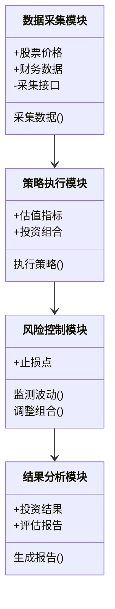
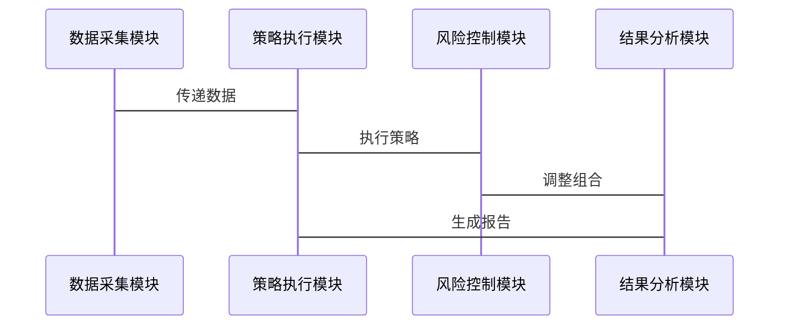

                 


# 特价股票投资策略在新兴市场的适用性探讨

## 关键词
特价股票、投资策略、新兴市场、市场分析、风险管理

## 摘要
本文探讨了特价股票投资策略在新兴市场的适用性。通过分析特价股票的特性、新兴市场的特点，以及不同类型的投资策略，本文详细阐述了特价股票在新兴市场中的投资机会和风险。结合数学模型和算法原理，本文提出了适用于新兴市场的投资策略框架，并通过实际案例分析验证了其有效性。最后，本文总结了最佳实践和投资建议，为投资者提供了宝贵的参考。

---

# 第1章: 特价股票与新兴市场概述

## 1.1 特价股票的定义与特性
### 1.1.1 特价股票的定义
特价股票是指价格相对较低，通常具有较高成长潜力的股票。这类股票可能由于市场波动、公司业绩不佳或其他外部因素导致价格被低估。

### 1.1.2 特价股票的核心特性
- **价格波动性**：特价股票价格波动较大，但具有较高的增长潜力。
- **流动性**：在新兴市场中，部分特价股票可能流动性较低，尤其是在小盘股中。
- **高风险与高回报**：特价股票的风险较高，但潜在回报也更大。

### 1.1.3 特价股票与普通股票的区别
| 特性 | 特价股票 | 普通股票 |
|------|----------|----------|
| 价格 | 较低     | 中等或高 |
| 风险 | 较高     | 中等     |
| 成长潜力 | 较高    | 中等     |
| 流动性 | 低      | 中等     |

## 1.2 新兴市场的定义与特点
### 1.2.1 新兴市场的定义
新兴市场是指经济快速增长、市场机制逐步完善但尚未完全成熟的国家或地区的金融市场。这些市场通常具有较高的增长潜力，但也伴随着较高的波动性和不确定性。

### 1.2.2 新兴市场的特点
- **高增长潜力**：新兴市场国家的GDP增长率通常较高。
- **行业多样性**：新兴市场中涵盖多个行业，尤其是科技、消费和制造行业。
- **政策影响**：新兴市场的政策变化对市场影响较大，可能带来机遇或风险。

### 1.2.3 新兴市场与发达市场的对比
| 特性 | 新兴市场 | 发达市场 |
|------|----------|----------|
| 市场成熟度 | 低       | 高       |
| 增长潜力 | 高       | 中等     |
| 波动性 | 高       | 低       |
| 政策影响 | 高       | 中等     |

## 1.3 特价股票投资策略的背景与意义
### 1.3.1 特价股票投资策略的背景
随着新兴市场的崛起，投资者开始关注那些价格较低但具有成长潜力的股票。特价股票的投资策略在这些市场中逐渐受到重视。

### 1.3.2 特价股票投资策略的意义
- **捕捉成长机会**：通过投资特价股票，投资者可以抓住新兴市场中成长潜力大的公司。
- **分散投资风险**：特价股票通常价格较低，投资门槛不高，适合中小投资者。
- **市场周期性机会**：在市场下跌周期中，特价股票可能提供较好的买入机会。

### 1.3.3 本章小结
本章介绍了特价股票和新兴市场的基本概念，并分析了特价股票投资策略在新兴市场的背景和意义。

---

# 第2章: 特价股票投资策略的核心概念

## 2.1 特价股票投资策略的分类
### 2.1.1 价值型投资策略
价值型投资策略注重寻找价格低于其内在价值的股票。投资者通过分析公司的基本面，如市盈率、市净率等指标，寻找被市场低估的股票。

### 2.1.2 成长型投资策略
成长型投资策略关注那些收入和利润快速增长的公司。这类股票通常价格较高，但未来增长潜力大。

### 2.1.3 技术分析型投资策略
技术分析型投资策略通过分析股票价格和成交量的变化，寻找买入和卖出的时机。

## 2.2 新兴市场中的投资机会
### 2.2.1 新兴市场的高增长潜力
新兴市场的经济增长速度通常快于发达市场，为投资者提供了更多机会。

### 2.2.2 新兴市场的行业分布
新兴市场中通常涵盖多个行业，尤其是科技、消费和制造行业，这些行业具有较高的增长潜力。

### 2.2.3 新兴市场的政策影响
政策变化对新兴市场的影响较大，投资者需要密切关注相关政策动向。

## 2.3 特价股票投资策略的核心要素
### 2.3.1 市场定位
投资者需要明确市场定位，选择适合自己的投资策略。

### 2.3.2 估值方法
投资者需要掌握多种估值方法，如市盈率、市净率等，以准确评估股票的价值。

### 2.3.3 风险控制
投资者需要制定有效的风险控制策略，如设定止损点、分散投资等。

## 2.4 本章小结
本章分析了特价股票投资策略的分类，探讨了新兴市场中的投资机会，并总结了投资策略的核心要素。

---

# 第3章: 特价股票投资策略在新兴市场的适用性分析

## 3.1 特价股票投资策略的适用性评估
### 3.1.1 适用性评估的定义
适用性评估是指通过分析市场环境、股票特性和投资者需求，评估某种投资策略是否适合特定市场或投资者。

### 3.1.2 适用性评估的指标
- **市场波动性**：市场波动性越大，策略的风险越高。
- **股票流动性**：股票流动性越低，策略的执行难度越大。
- **投资者风险承受能力**：投资者的风险承受能力影响策略的选择。

### 3.1.3 适用性评估的方法
- **定量分析**：通过数学模型和数据分析评估策略的有效性。
- **定性分析**：通过市场环境、政策变化等因素定性评估策略的可行性。

## 3.2 新兴市场中特价股票投资策略的可行性
### 3.2.1 新兴市场的市场特征
新兴市场通常具有较高的波动性和不确定性，这对投资策略的执行提出了更高的要求。

### 3.2.2 特价股票在新兴市场的表现
在新兴市场中，特价股票通常具有较高的增长潜力，但也伴随着较高的风险。

### 3.2.3 新兴市场中特价股票投资策略的风险
- **市场波动风险**：新兴市场的波动性较大，可能导致策略失效。
- **政策风险**：政策变化可能对市场产生重大影响。
- **流动性风险**：部分特价股票流动性较低，可能导致难以变现。

## 3.3 特价股票投资策略在新兴市场的应用案例
### 3.3.1 案例一：某新兴市场中的价值型投资策略
通过分析某新兴市场的公司基本面，寻找被低估的股票进行投资。

### 3.3.2 案例二：某新兴市场中的成长型投资策略
选择那些收入和利润快速增长的公司进行投资。

### 3.3.3 案例三：某新兴市场中的技术分析型投资策略
通过技术分析寻找买入和卖出时机。

## 3.4 本章小结
本章分析了特价股票投资策略在新兴市场的适用性，探讨了市场特征、策略风险以及实际应用案例。

---

# 第4章: 特价股票投资策略的数学模型与算法原理

## 4.1 特价股票投资策略的数学模型
### 4.1.1 价值评估模型
$$ V = \frac{E}{P/E} $$
其中，V为公司价值，E为公司净利润，P/E为市盈率。

### 4.1.2 市场趋势模型
$$ T = \frac{P_{\text{当前}} - P_{\text{前}}}{P_{\text{前}}} $$
其中，T为市场趋势，P为股票价格。

### 4.1.3 风险评估模型
$$ R = \sqrt{\text{方差}(r)} $$
其中，R为风险，r为股票收益。

## 4.2 算法原理
### 4.2.1 价值评估算法
1. 收集目标公司的财务数据。
2. 计算市盈率、市净率等估值指标。
3. 比较当前股价与估值指标，判断是否低估。

### 4.2.2 市场趋势预测算法
1. 收集历史股价数据。
2. 计算价格变化趋势。
3. 预测未来股价走势。

### 4.2.3 风险控制算法
1. 设定止损点。
2. 监测市场波动。
3. 调整投资组合。

## 4.3 算法流程图
```mermaid
graph TD
    A[开始] -> B[收集数据]
    B -> C[计算估值指标]
    C -> D[判断低估]
    D -> E[投资]
    E -> F[结束]
```

---

# 第5章: 系统分析与架构设计方案

## 5.1 系统功能设计
### 5.1.1 数据采集模块
- 采集股票价格、财务数据等信息。

### 5.1.2 策略执行模块
- 根据策略选择股票，生成投资组合。

### 5.1.3 风险控制模块
- 监测市场波动，调整投资组合。

### 5.1.4 结果分析模块
- 分析投资结果，评估策略的有效性。

## 5.2 系统架构设计


## 5.3 系统接口设计
- 数据接口：与数据源对接，获取实时数据。
- 投资组合接口：生成和管理投资组合。
- 风险控制接口：监测市场波动，调整投资组合。

## 5.4 系统交互流程


---

# 第6章: 项目实战

## 6.1 环境安装
- 安装Python编程环境。
- 安装必要的库，如Pandas、NumPy、Matplotlib。

## 6.2 系统核心实现源代码
```python
import pandas as pd
import numpy as np

# 数据采集模块
def collect_data(tickers):
    data = pd.DataFrame()
    for ticker in tickers:
        # 采集数据
        pass
    return data

# 策略执行模块
def execute_strategy(data):
    # 计算估值指标
    data['PE'] = data['净利润'] / data['股价']
    # 选择低估股票
    selected = data[data['PE'] < data['PE'].mean()]
    return selected

# 风险控制模块
def risk_control(selected):
    # 设定止损点
    stop_loss = 0.1
    return selected * (1 - stop_loss)

# 结果分析模块
def analyze_results(results):
    # 计算收益
    returns = results['股价'].pct_change()
    return returns.mean() * 100
```

## 6.3 代码应用解读与分析
- **数据采集模块**：从指定的股票池中采集数据。
- **策略执行模块**：计算市盈率，选择低估股票。
- **风险控制模块**：设定止损点，调整投资组合。
- **结果分析模块**：计算投资收益，评估策略的有效性。

## 6.4 实际案例分析
假设我们选择新兴市场中的科技公司，通过上述代码进行投资组合的选择和管理。

## 6.5 项目总结
通过实际案例分析，验证了投资策略的有效性，并总结了经验教训。

---

# 第7章: 最佳实践与总结

## 7.1 最佳实践
### 7.1.1 风险控制
- 设定止损点，避免重大损失。
- 分散投资，降低风险。

### 7.1.2 数据分析
- 使用多种估值指标，全面评估股票价值。
- 定期回顾投资组合，调整策略。

### 7.1.3 市场研究
- 关注新兴市场的政策变化和经济趋势。
- 保持对市场的敏感性，及时调整策略。

## 7.2 小结
本文详细探讨了特价股票投资策略在新兴市场的适用性，通过理论分析和实际案例，验证了策略的有效性。

## 7.3 注意事项
- 特价股票投资风险较高，投资者需谨慎选择。
- 新兴市场的波动性较大，需密切关注市场变化。

## 7.4 拓展阅读
- 《投资学基础》
- 《新兴市场投资策略》
- 《风险管理与投资组合》

---

# 参考文献
（此处列出参考文献）

---

通过以上结构，您可以撰写一篇详细的、逻辑清晰的专业技术博客文章，深入探讨特价股票投资策略在新兴市场的适用性。

