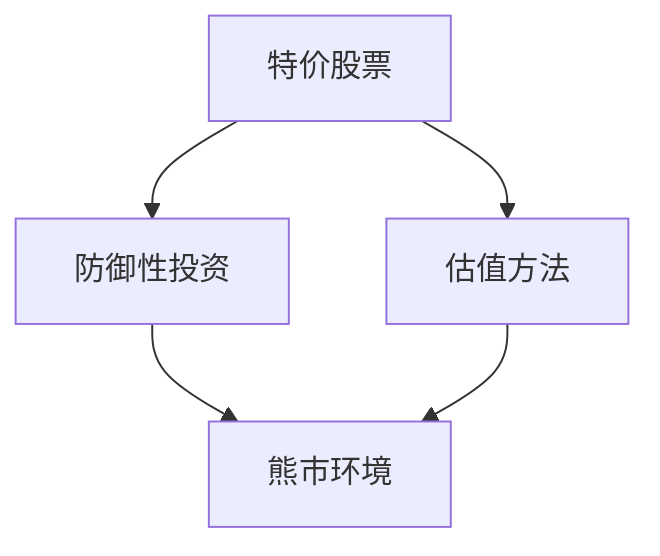
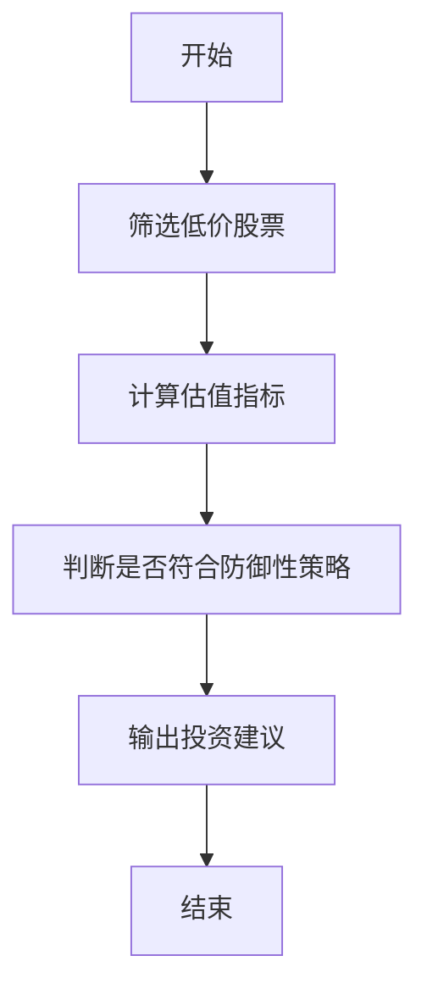
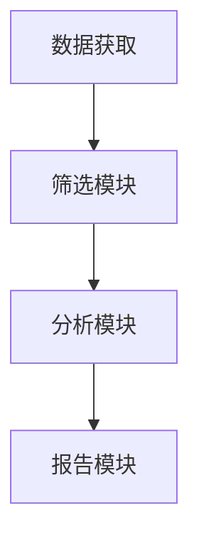

                 


# 特价股票投资策略在熊市中的防御性

> 关键词：特价股票，熊市，防御性投资，价值投资，股票估值

> 摘要：在熊市环境下，特价股票因其低估值特性，成为防御性投资的重要工具。本文详细分析了特价股票的定义、特点及其在熊市中的防御性作用，并探讨了相关的投资策略，包括估值方法、算法流程、系统架构设计和项目实战。通过理论与实践相结合的方式，为投资者提供了在熊市中利用特价股票进行防御性投资的全面指导。

---

# 第一部分: 特价股票投资策略概述

## 第1章: 特价股票与熊市防御性投资概述

### 1.1 特价股票的定义与特点

#### 1.1.1 特价股票的定义
特价股票通常指价格低于其内在价值的股票，这类股票往往被市场低估，具有较高的安全边际。其核心特征包括低市盈率（P/E）、低市净率（P/B）和高股息率。投资者通过识别这些指标，可以筛选出具有长期增值潜力的股票。

#### 1.1.2 特价股票的核心特征
| 特性 | 定义 | 重要性 |
|------|------|--------|
| 低市盈率 | 股价/每股收益较低 | 反映公司盈利能力被市场低估 |
| 低市净率 | 股价/每股净资产较低 | 表明资产价值未被充分反映 |
| 高股息率 | 每股股息/股价较高 | 提供稳定的现金流 |

#### 1.1.3 特价股票与普通股票的对比分析
- **普通股票**：价格反映市场情绪，波动性大，风险较高。
- **特价股票**：价格低于内在价值，具备长期增值潜力，风险相对较低。

### 1.2 熊市的特点与防御性投资的重要性

#### 1.2.1 熊市的定义与表现
熊市是股市整体下跌的阶段，通常由经济衰退、市场恐慌等因素引发。其主要表现包括股票价格持续下跌、投资者信心下降和成交量减少。

#### 1.2.2 熊市中投资的风险与挑战
- 市场波动剧烈，投资者面临资产贬值风险。
- 投资者情绪恶化，容易做出非理性决策。
- 缺乏投资机会，优质资产价格被过度打压。

#### 1.2.3 防御性投资的必要性与目标
防御性投资旨在通过降低风险来保护资本，其目标是在熊市中减少损失，甚至实现资本增值。这种方法通过投资低估值股票、分散投资和风险控制来实现。

### 1.3 特价股票在熊市中的防御性作用

#### 1.3.1 特价股票作为防御性资产的优势
- **估值优势**：价格低于内在价值，具备反弹潜力。
- **风险分散**：投资特价股票可以降低组合的整体风险。
- **稳定收益**：高股息率股票提供稳定的现金流。

#### 1.3.2 熊市中特价股票的投资机会
- 市场恐慌导致优质股票价格被低估，为投资者提供了低位买入的机会。
- 特价股票通常具有较高的安全边际，能够在市场复苏时带来超额收益。

#### 1.3.3 特价股票在资产配置中的地位
在熊市中，特价股票可以作为资产配置的重要组成部分，与其他资产（如债券、黄金）共同构建防御性投资组合。

---

## 第2章: 特价股票投资策略的核心概念与联系

### 2.1 防御性投资的原理

#### 2.1.1 防御性投资的基本原则
防御性投资强调安全性和稳定性，注重基本面分析和估值指标。其核心原则包括：
- 选择低估值股票，避免追高。
- 分散投资，降低特定风险。
- 长期持有，耐心等待市场复苏。

#### 2.1.2 防御性投资的策略框架
防御性投资策略框架包括以下几个步骤：
1. 确定投资目标和风险承受能力。
2. 进行基本面分析，筛选低估值股票。
3. 分散投资，构建投资组合。
4. 定期审视和调整投资组合。

#### 2.1.3 防御性投资与进攻性投资的对比
| 特性 | 防御性投资 | 进攻性投资 |
|------|------------|------------|
| 目标 | 保护资本 | 追求高收益 |
| 风险 | 低 | 高 |
| 时间 | 长期 | 短期 |

### 2.2 特价股票的估值方法

#### 2.2.1 市盈率（P/E）分析
市盈率是衡量股票估值的重要指标，计算公式为：
$$ P/E = \frac{股价}{每股收益} $$
低市盈率（通常低于15）表明股票价格被低估。

#### 2.2.2 市净率（P/B）分析
市净率是股价与每股净资产的比率，计算公式为：
$$ P/B = \frac{股价}{每股净资产} $$
低市净率（通常低于2）表明股票价格低于其账面价值。

#### 2.2.3 股息率分析
股息率是每股股息与股价的比率，计算公式为：
$$ 股息率 = \frac{每股股息}{股价} $$
高股息率（通常高于5%）表明股票具有较高的分红能力。

### 2.3 特价股票与熊市防御性策略的实体关系图



---

## 第3章: 特价股票投资策略的算法原理

### 3.1 算法流程图



### 3.2 算法实现代码

```python
def calculate_valuation(stock_price, eps, bvps):
    pe = stock_price / eps
    pb = stock_price / bvps
    return pe, pb

# 示例代码
stock_data = {
    '股票代码': ['A', 'B', 'C'],
    '股价': [10, 15, 20],
    '每股收益': [5, 3, 4],
    '每股净资产': [2, 3, 5]
}

for stock in stock_data['股票代码']:
    pe = stock_data['股价'][stock] / stock_data['每股收益'][stock]
    pb = stock_data['股价'][stock] / stock_data['每股净资产'][stock]
    if pe < 15 and pb < 2:
        print(f"{stock} 符合防御性投资条件，P/E={pe}, P/B={pb}")
    else:
        print(f"{stock} 不符合防御性投资条件")
```

### 3.3 数学模型与公式

#### 3.3.1 市盈率模型
$$ P/E = \frac{股价}{每股收益} $$

#### 3.3.2 市净率模型
$$ P/B = \frac{股价}{每股净资产} $$

#### 3.3.3 股息率模型
$$ 股息率 = \frac{每股股息}{股价} $$

---

## 第4章: 系统分析与架构设计方案

### 4.1 系统功能设计

#### 4.1.1 数据获取模块
从数据源获取股票信息，包括股价、每股收益、每股净资产等。

#### 4.1.2 筛选模块
基于估值指标筛选出符合条件的特价股票。

#### 4.1.3 分析模块
对筛选出的股票进行深度分析，生成投资建议。

#### 4.1.4 报告模块
生成投资报告，提供可视化分析结果。

### 4.2 系统架构设计



---

## 第5章: 项目实战

### 5.1 环境配置

```python
import pandas as pd
import numpy as np
```

### 5.2 核心实现代码

```python
def find_special_offers(stocks, eps_threshold=15, pb_threshold=2):
    special_offers = []
    for stock in stocks:
        pe = stock['股价'] / stock['每股收益']
        pb = stock['股价'] / stock['每股净资产']
        if pe < eps_threshold and pb < pb_threshold:
            special_offers.append(stock)
    return special_offers

# 示例数据
stocks = pd.DataFrame({
    '股票代码': ['A', 'B', 'C'],
    '股价': [10, 15, 20],
    '每股收益': [5, 3, 4],
    '每股净资产': [2, 3, 5]
})

result = find_special_offers(stocks)
print("符合特价股票条件的股票：", result)
```

### 5.3 案例分析

假设市场中有以下三只股票：

| 股票代码 | 股价 | 每股收益 | 每股净资产 |
|----------|------|----------|------------|
| A        | 10   | 5        | 2          |
| B        | 15   | 3        | 3          |
| C        | 20   | 4        | 5          |

计算市盈率和市净率：

- 股票A：P/E = 10/5 = 2，P/B = 10/2 = 5
- 股票B：P/E = 15/3 = 5，P/B = 15/3 = 5
- 股票C：P/E = 20/4 = 5，P/B = 20/5 = 4

根据筛选条件（P/E < 15，P/B < 2），只有股票C符合防御性投资条件。

### 5.4 项目小结

通过上述分析和实战，我们可以看到，特价股票在熊市中的防御性投资策略能够有效降低风险，抓住市场低估的机会。投资者可以通过基本面分析和估值指标筛选出具备长期增值潜力的股票，构建稳健的投资组合。

---

## 第6章: 最佳实践与总结

### 6.1 最佳实践

- **持续学习**：关注市场动态，学习最新的投资策略。
- **分散投资**：避免过度集中，降低特定风险。
- **长期持有**：耐心持有优质资产，等待市场复苏。

### 6.2 小结

特价股票在熊市中的防御性投资策略是一种有效降低风险、抓住投资机会的方法。通过基本面分析、估值指标和系统化的方法，投资者可以在复杂多变的市场中实现稳健的投资回报。

### 6.3 注意事项

- **风险控制**：避免过度杠杆，合理分配资产。
- **市场时机**：熊市中情绪化决策容易导致损失。
- **持续监控**：定期审视投资组合，及时调整。

### 6.4 拓展阅读

- 《价值投资实战策略》
- 《股票估值与分析》
- 《防御性投资的奥秘》

---

通过本文的系统分析和实战指导，投资者可以更好地理解特价股票在熊市中的防御性作用，并将其应用于实际投资中，实现稳健的财富增长。

