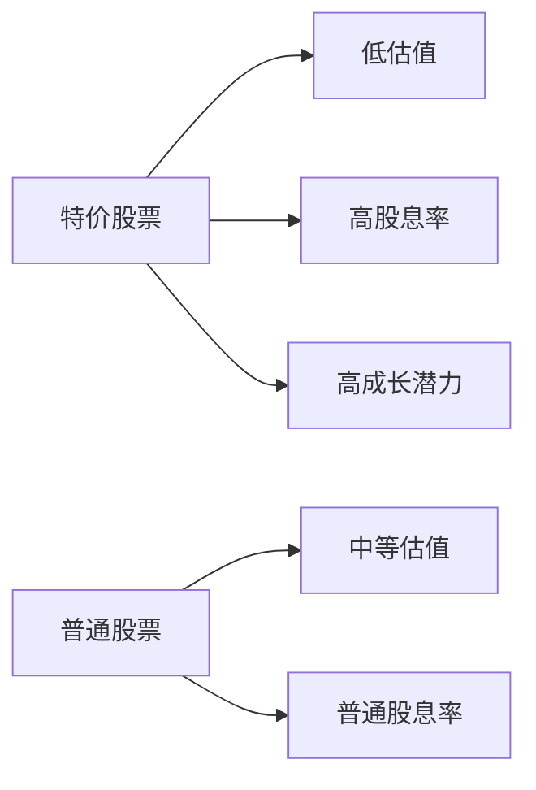
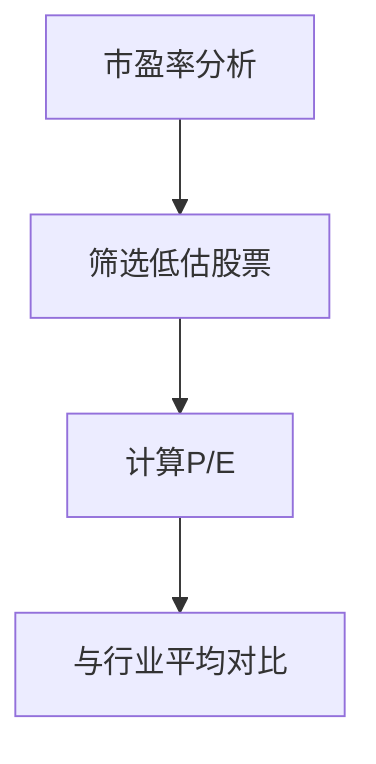

                 


# 特价股票投资组合的年度更新策略

## 关键词：
特价股票、投资组合、年度更新、风险管理、数学模型、Python代码

## 摘要：
本文详细探讨了如何构建和管理特价股票投资组合，并提出了一套基于市场环境和财务目标的年度更新策略。通过分析特价股票的筛选标准、投资组合构建方法以及风险管理措施，本文为投资者提供了一个系统化的框架，帮助他们在复杂多变的市场中优化投资组合，实现长期稳健收益。

---

## 第1章: 特价股票与投资组合概述

### 1.1 特价股票的定义与特点
#### 1.1.1 特价股票的定义
特价股票通常指那些价格被低估、具有较大上涨潜力的股票。这些股票可能因市场波动、公司基本面改善或其他因素而被忽视，但具有长期投资价值。

#### 1.1.2 特价股票的核心特点
| 特点 | 描述 |
|------|------|
| 低估值 | 市盈率（P/E）或市净率（P/B）低于行业平均水平。 |
| 高股息率 | 相对于股票价格，股息收入较高。 |
| 弱势行业 | 来自表现不佳的行业，但具有复苏潜力。 |
| 高成长潜力 | 公司基本面良好，未来增长可期。 |

#### 1.1.3 特价股票与普通股票的对比


### 1.2 投资组合的基本概念
#### 1.2.1 投资组合的定义
投资组合是将资金分配到多种资产（股票、债券、现金等）以分散风险、优化收益的过程。

#### 1.2.2 投资组合的类型
| 类型 | 描述 |
|------|------|
| 股票型 | 以股票为主要投资标的。 |
| 债券型 | 以债券为主要投资标的。 |
| 混合型 | 组合股票和债券，平衡风险与收益。 |

#### 1.2.3 投资组合的目标与风险
| 目标 | 风险 |
|------|------|
| 资本增值 | 市场波动风险 |
| 现金流稳定 | 利率风险 |
| 资产保值 | 通货膨胀风险 |

### 1.3 年度更新策略的重要性
#### 1.3.1 市场环境的变化
经济周期、政策调整和行业趋势都会影响股票价值。

#### 1.3.2 投资目标的调整
个人财务状况变化可能需要调整投资目标。

#### 1.3.3 投资组合的再平衡
定期调整持仓比例，保持风险与收益的平衡。

### 1.4 本章小结
本章介绍了特价股票的特点和投资组合的基本概念，强调了年度更新策略的重要性。

---

## 第2章: 特价股票的筛选与分析

### 2.1 特价股票的筛选标准
#### 2.1.1 市盈率（P/E）分析
市盈率 = 股价 / 每股净利润（EPS）



#### 2.1.2 市净率（P/B）分析
市净率 = 股价 / 每股净资产（BPS）

#### 2.1.3 股息率分析
股息率 = 每股股息（DIV） / 股价

### 2.2 特价股票的行业分析
#### 2.2.1 行业选择的基本原则
选择具有复苏潜力的行业，如周期性行业。

#### 2.2.2 公司基本面分析
| 指标 | 重要性 |
|------|------|
| 净利润增长率 | 高 |
| 资产负债率 | 低 |
| 营业利润率 | 高 |

### 2.3 特价股票的量化筛选模型
#### 2.3.1 筛选步骤


#### 2.3.2 数学模型
$$
\text{综合得分} = 0.4 \times P/E + 0.3 \times P/B + 0.3 \times \text{股息率}
$$

### 2.4 本章小结
本章通过多种指标筛选特价股票，为后续投资组合构建奠定基础。

---

## 第3章: 投资组合的构建方法

### 3.1 投资组合的目标设定
#### 3.1.1 投资目标
| 目标 | 描述 |
|------|------|
| 资本增值 | 长期收益最大化。 |
| 现金流稳定 | 持续分红收入。 |
| 风险控制 | 降低波动性。 |

### 3.2 资产分配策略
#### 3.2.1 现代投资组合理论
使用均值-方差模型优化资产配置。

#### 3.2.2 数学模型
$$
\text{Minimize } \sigma^2 \text{ subject to } \mu \geq \text{目标收益}
$$

#### 3.2.3 Python实现
```python
import numpy as np
import pandas as pd
from sklearn.covariance import EmpiricalCovariance

# 示例数据
returns = pd.DataFrame({
    '股票A': [0.1, 0.2, 0.15],
    '股票B': [0.05, 0.1, 0.12]
})

# 计算协方差矩阵
cov = EmpiricalCovariance().fit(returns)
```

### 3.3 投资组合的动态调整
#### 3.3.1 定期再平衡
每年调整持仓比例，保持目标配置。

#### 3.3.2 股票权重计算
使用优化模型计算各股票的权重。

### 3.4 本章小结
本章介绍了投资组合的构建方法，强调了资产分配和动态调整的重要性。

---

## 第4章: 特价股票投资组合的年度更新策略

### 4.1 年度更新的步骤
#### 4.1.1 市场环境分析
关注宏观经济指标和行业趋势。

#### 4.1.2 投资组合评估
检查持仓表现和偏离情况。

#### 4.1.3 调整优化
根据评估结果调整持仓。

### 4.2 投资组合的再平衡策略
#### 4.2.1 再平衡的必要性
保持目标配置，降低风险。

#### 4.2.2 再平衡的实现
根据偏离情况调整持仓比例。

### 4.3 风险管理策略
#### 4.3.1 风险指标
| 指标 | 描述 |
|------|------|
| VaR | 在一定置信水平下的最大损失。 |
| 夏普比率 | 收益与风险的比值。 |

#### 4.3.2 风险控制
设置止损点和止盈点，分散投资。

### 4.4 本章小结
本章详细介绍了年度更新策略，强调了再平衡和风险管理的重要性。

---

## 第5章: 投资组合风险管理与优化

### 5.1 风险管理的重要性
#### 5.1.1 风险的来源
市场风险、流动性风险、信用风险。

#### 5.1.2 风险的量化
使用VaR、夏普比率等指标。

### 5.2 风险优化策略
#### 5.2.1 投资组合优化
调整持仓以降低整体风险。

#### 5.2.2 风险分散
投资不同行业和资产类别。

### 5.3 系统性风险管理
#### 5.3.1 系统性风险
宏观经济波动、政策变化等。

#### 5.3.2 非系统性风险
公司特定风险。

### 5.4 本章小结
本章强调了风险管理的重要性，并提供了优化策略。

---

## 结论
本文系统介绍了特价股票投资组合的年度更新策略，从股票筛选、组合构建到风险管理，提供了全面的解决方案。投资者通过定期优化投资组合，可以在复杂市场中实现稳健收益。

---

## 参考文献
1. Markowitz, H. (1952). Portfolio Selection. Journal of Finance.
2. Sharpe, W. F. (1964). The Sharpe Ratio.

