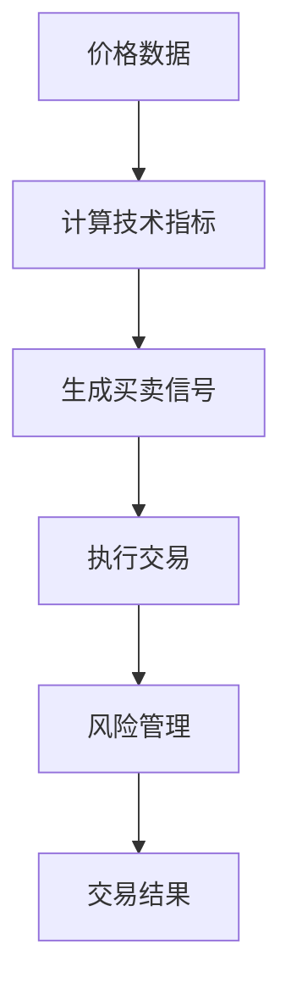
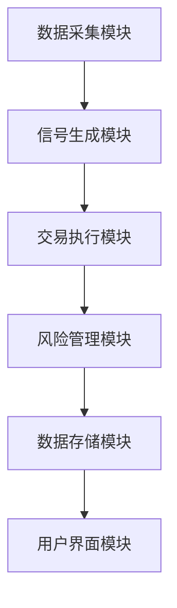
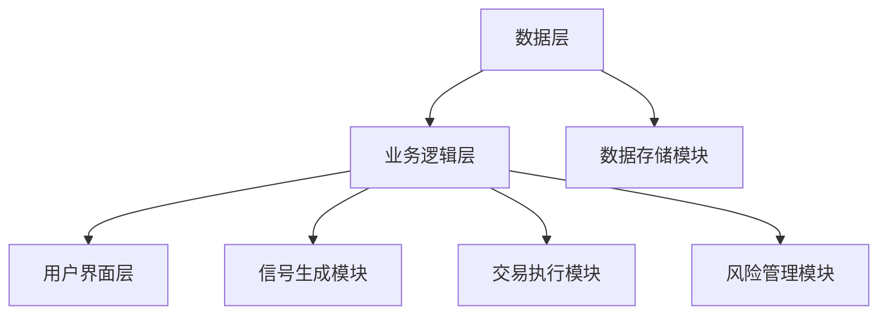
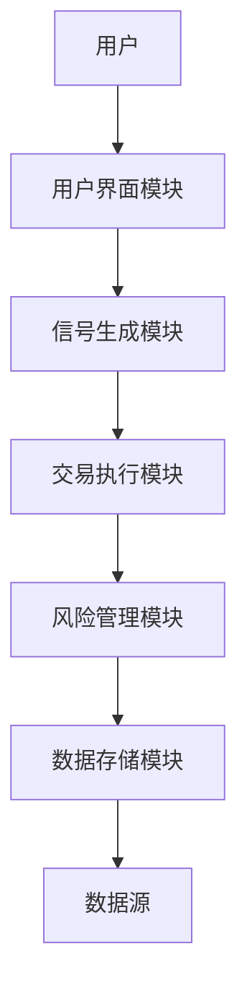

                 


# 第1章: 特价股票策略的定义与背景

## 1.1 特价股票策略的基本概念

### 1.1.1 什么是特价股票策略
特价股票策略是一种基于股票价格波动的短期交易策略，旨在通过捕捉市场短期波动来获取利润。这种策略通常依赖技术分析，关注短期价格变化、成交量、市场情绪等指标，以做出快速交易决策。

### 1.1.2 特价股票策略的核心目标
特价股票策略的核心目标是通过频繁的买卖操作，在较短时间内实现资本增值。它追求的是短期收益，而不是长期资产增值。因此，这种策略适合那些能够承受较高风险和高交易成本的投资者。

### 1.1.3 特价股票策略的市场定位
在股票市场中，特价股票策略主要服务于两类投资者：一是短线交易者，他们希望通过快速买卖操作获利；二是机构投资者，他们可能利用这种策略进行套利或对冲风险。此外，一些高频交易基金也采用类似的策略，利用算法和计算机技术在极短时间内完成大量交易。

## 1.2 当前市场环境的特点

### 1.2.1 现代股票市场的基本特征
现代股票市场具有高度的流动性和复杂性。市场的参与者包括个人投资者、机构投资者、高频交易基金等，各种参与者的行为共同影响着市场的波动。此外，随着技术的进步，市场数据的产生和传播速度大大加快，这为特价股票策略提供了更多的机会，但也带来了更大的挑战。

### 1.2.2 市场波动性与不确定性
当前市场环境下的波动性显著增加。由于全球经济的不确定性、地缘政治风险、政策变化等因素的影响，股票市场的波动性变得更加不可预测。这种高波动性为特价股票策略提供了更多的交易机会，但也增加了交易的风险。

### 1.2.3 技术进步对股票交易的影响
技术的进步，尤其是人工智能和大数据技术的发展，极大地影响了股票交易的方式。算法交易、高频交易和量化投资等技术的应用，使得交易的效率和精确度大大提高。这些技术的发展为特价股票策略提供了更多的工具和方法，同时也使得市场的竞争更加激烈。

## 1.3 特价股票策略的优劣势分析

### 1.3.1 特价股票策略的主要优势
1. **灵活性强**：特价股票策略可以根据市场变化快速调整交易策略，适应市场波动。
2. **收益潜力大**：通过频繁交易，投资者有机会在短时间内获得较高的收益。
3. **风险可控**：通过技术分析和严格的风险管理，投资者可以控制交易风险。

### 1.3.2 特价股票策略的主要劣势
1. **交易成本高**：频繁交易会增加佣金、税费等交易成本，影响最终收益。
2. **市场流动性风险**：在市场流动性不足的情况下，投资者可能无法以理想的价格买卖股票，导致亏损。
3. **策略失效风险**：如果市场环境发生变化，或者竞争对手采用类似的策略，特价股票策略可能会失效，导致收益下降。

### 1.3.3 现实市场中的适用性探讨
尽管特价股票策略在理论上具有一定的优势，但在现实市场中，其适用性受到多种因素的影响。例如，市场流动性、交易成本、策略执行的效率、市场参与者的行为等都会影响策略的实际效果。因此，投资者在实际操作中需要综合考虑这些因素，制定合理的交易策略。

---

# 第2章: 特价股票策略的核心概念与联系

## 2.1 特价股票策略的基本原理

### 2.1.1 策略的核心逻辑
特价股票策略的核心逻辑是通过技术分析，识别短期价格波动的模式，从而在价格波动的高点和低点之间进行买卖操作。这种策略通常依赖于价格图表、技术指标、成交量分析等工具，以预测价格的短期走势。

### 2.1.2 策略的关键要素
1. **价格走势**：通过分析价格的历史走势，识别价格波动的周期性、趋势性等特征。
2. **技术指标**：使用RSI、MACD、移动平均线等技术指标，判断市场的超买超卖状态、趋势强度等。
3. **成交量分析**：通过分析成交量的变化，判断市场的买卖力量，辅助判断价格走势的方向。

### 2.1.3 策略的实现机制
特价股票策略的实现机制主要包括以下几个步骤：
1. **数据收集**：收集股票的历史价格数据、成交量数据等。
2. **信号生成**：通过技术分析，生成买入或卖出信号。
3. **交易执行**：根据信号执行交易，开仓或平仓。
4. **风险控制**：设定止损和止盈点，控制交易风险。

## 2.2 特价股票策略与其他股票策略的对比

### 2.2.1 短线交易策略
短线交易策略是指在较短时间内完成买卖交易的策略，其特点是交易周期短、操作频繁。与特价股票策略相比，短线交易策略更加注重价格的短期波动，通常采用类似的技术分析方法。

### 2.2.2 长期投资策略
长期投资策略是指买入并持有优质股票，通过长期的资本增值实现收益。与特价股票策略相比，长期投资策略更加注重基本面分析，追求企业的长期增长，对短期价格波动的关注较少。

### 2.2.3 投资组合策略
投资组合策略是指通过构建多样化的投资组合，分散风险，实现收益最大化。与特价股票策略相比，投资组合策略更加注重资产配置和风险分散，而不是单一股票的短期交易。

## 2.3 特价股票策略的数学模型与公式

### 2.3.1 简单移动平均线公式
$$
SMA = \frac{p_1 + p_2 + \cdots + p_n}{n}
$$

其中，$p_i$ 表示第$i$个时间点的价格，$n$ 是计算移动平均线的天数。

### 2.3.2 相对强弱指数公式
$$
RSI = 100 - \frac{100}{1 + \frac{A}{B}}
$$

其中，$A$ 是过去$n$天的平均涨幅，$B$ 是过去$n$天的平均跌幅。

### 2.3.3 MACD指标公式
$$
MACD = EMA_{12} - EMA_{26}
$$

其中，$EMA_{12}$ 和 $EMA_{26}$ 分别是12天和26天的指数移动平均线。

---

### 图2-1: 特价股票策略的技术分析流程图



---

## 2.4 特价股票策略的优劣势分析

### 2.4.1 特价股票策略的主要优势
1. **灵活性强**：能够快速适应市场变化，及时调整交易策略。
2. **收益潜力大**：在市场波动剧烈的情况下，有可能获得较高的短期收益。
3. **技术驱动**：依赖技术分析，可以通过算法和自动化工具提高交易效率。

### 2.4.2 特价股票策略的主要劣势
1. **交易成本高**：频繁交易会导致佣金、税费等成本增加，影响最终收益。
2. **市场流动性风险**：在市场流动性不足的情况下，可能无法以理想价格买卖股票。
3. **策略失效风险**：如果市场环境发生变化，或者竞争对手采用类似的策略，特价股票策略可能会失效。

### 2.4.3 现实市场中的适用性探讨
在当前市场环境下，特价股票策略的适用性受到多种因素的影响。例如，市场的流动性、交易成本、策略执行的效率、市场参与者的行为等都会影响策略的实际效果。因此，投资者在实际操作中需要综合考虑这些因素，制定合理的交易策略。

---

# 第3章: 特价股票策略的算法与数学模型

## 3.1 特价股票策略的核心算法

### 3.1.1 移动平均线算法
移动平均线算法是一种简单而有效的时间序列平滑算法，适用于识别价格趋势。通过计算一定时间内的平均价格，可以过滤掉短期的价格波动，从而识别出价格的主要趋势。

### 3.1.2 相对强弱指数算法
相对强弱指数（RSI）算法用于衡量市场的超买超卖状态。通过计算一定时间内价格的平均涨幅和平均跌幅，可以判断市场的买卖力量，从而生成买卖信号。

### 3.1.3 MACD指标算法
MACD指标算法通过计算短期和长期指数移动平均线的差值，反映市场的短期和长期趋势。当MACD指标上穿零轴时，通常被视为买入信号；当MACD指标下穿零轴时，通常被视为卖出信号。

## 3.2 特价股票策略的数学模型

### 3.2.1 时间序列分析模型
时间序列分析模型是一种常用的数学模型，适用于分析股票价格的变化趋势。通过ARIMA模型等工具，可以预测未来的价格走势，从而为交易决策提供依据。

### 3.2.2 马尔可夫链模型
马尔可夫链模型是一种概率模型，适用于分析市场状态的转移。通过识别市场的不同状态（如上升、下降、横盘），可以为交易策略提供决策依据。

### 3.2.3 机器学习模型
机器学习模型，如支持向量机（SVM）、随机森林（Random Forest）等，可以通过历史数据训练模型，识别价格波动的模式，从而生成交易信号。

## 3.3 特价股票策略的算法实现

### 3.3.1 算法实现步骤
1. **数据收集**：收集股票的历史价格数据、成交量数据等。
2. **特征提取**：从数据中提取有用的特征，如技术指标、市场情绪等。
3. **模型训练**：使用机器学习模型训练交易信号生成器。
4. **交易信号生成**：根据模型预测结果，生成买卖信号。
5. **交易执行**：根据信号执行交易，开仓或平仓。
6. **风险管理**：设定止损和止盈点，控制交易风险。

### 3.3.2 算法实现代码
以下是一个简单的Python代码示例，用于计算RSI指标并生成买卖信号：

```python
import pandas as pd
import numpy as np

def calculate_rsi(data, period=14):
    # 计算相对强弱指数
    delta = data['close'].diff()
    up = delta.where(delta > 0, 0)
    down = delta.where(delta < 0, 0)
    avg_up = up.rolling(period).mean()
    avg_down = down.rolling(period).mean()
    rsi = 100 - (100 / (1 + avg_up / avg_down))
    return rsi

def generate_signals(data, period=14):
    # 生成买卖信号
    data['rsi'] = calculate_rsi(data, period)
    data['signal'] = 0
    data['signal'][data['rsi'] < 30] = 1  # 买入信号
    data['signal'][data['rsi'] > 70] = -1  # 卖出信号
    return data

# 示例数据
data = pd.DataFrame({
    'close': [100, 102, 101, 103, 104, 102, 105, 106, 104, 107]
})
data = data.set_index(pd.date_range('2023-01-01', periods=len(data)))

# 生成信号
signals = generate_signals(data)
print(signals)
```

---

## 3.4 特价股票策略的数学模型与公式

### 3.4.1 时间序列分析模型
时间序列分析模型是一种常用的数学模型，适用于分析股票价格的变化趋势。通过ARIMA模型等工具，可以预测未来的价格走势，从而为交易决策提供依据。

### 3.4.2 马尔可夫链模型
马尔可夫链模型是一种概率模型，适用于分析市场状态的转移。通过识别市场的不同状态（如上升、下降、横盘），可以为交易策略提供决策依据。

### 3.4.3 机器学习模型
机器学习模型，如支持向量机（SVM）、随机森林（Random Forest）等，可以通过历史数据训练模型，识别价格波动的模式，从而生成交易信号。

---

## 3.5 特价股票策略的算法实现

### 3.5.1 算法实现步骤
1. **数据收集**：收集股票的历史价格数据、成交量数据等。
2. **特征提取**：从数据中提取有用的特征，如技术指标、市场情绪等。
3. **模型训练**：使用机器学习模型训练交易信号生成器。
4. **交易信号生成**：根据模型预测结果，生成买卖信号。
5. **交易执行**：根据信号执行交易，开仓或平仓。
6. **风险管理**：设定止损和止盈点，控制交易风险。

### 3.5.2 算法实现代码
以下是一个简单的Python代码示例，用于计算RSI指标并生成买卖信号：

```python
import pandas as pd
import numpy as np

def calculate_rsi(data, period=14):
    # 计算相对强弱指数
    delta = data['close'].diff()
    up = delta.where(delta > 0, 0)
    down = delta.where(delta < 0, 0)
    avg_up = up.rolling(period).mean()
    avg_down = down.rolling(period).mean()
    rsi = 100 - (100 / (1 + avg_up / avg_down))
    return rsi

def generate_signals(data, period=14):
    # 生成买卖信号
    data['rsi'] = calculate_rsi(data, period)
    data['signal'] = 0
    data['signal'][data['rsi'] < 30] = 1  # 买入信号
    data['signal'][data['rsi'] > 70] = -1  # 卖出信号
    return data

# 示例数据
data = pd.DataFrame({
    'close': [100, 102, 101, 103, 104, 102, 105, 106, 104, 107]
})
data = data.set_index(pd.date_range('2023-01-01', periods=len(data)))

# 生成信号
signals = generate_signals(data)
print(signals)
```

---

## 3.6 特价股票策略的数学模型与公式

### 3.6.1 时间序列分析模型
时间序列分析模型是一种常用的数学模型，适用于分析股票价格的变化趋势。通过ARIMA模型等工具，可以预测未来的价格走势，从而为交易决策提供依据。

### 3.6.2 马尔可夫链模型
马尔可夫链模型是一种概率模型，适用于分析市场状态的转移。通过识别市场的不同状态（如上升、下降、横盘），可以为交易策略提供决策依据。

### 3.6.3 机器学习模型
机器学习模型，如支持向量机（SVM）、随机森林（Random Forest）等，可以通过历史数据训练模型，识别价格波动的模式，从而生成交易信号。

---

## 3.7 特价股票策略的算法实现

### 3.7.1 算法实现步骤
1. **数据收集**：收集股票的历史价格数据、成交量数据等。
2. **特征提取**：从数据中提取有用的特征，如技术指标、市场情绪等。
3. **模型训练**：使用机器学习模型训练交易信号生成器。
4. **交易信号生成**：根据模型预测结果，生成买卖信号。
5. **交易执行**：根据信号执行交易，开仓或平仓。
6. **风险管理**：设定止损和止盈点，控制交易风险。

### 3.7.2 算法实现代码
以下是一个简单的Python代码示例，用于计算RSI指标并生成买卖信号：

```python
import pandas as pd
import numpy as np

def calculate_rsi(data, period=14):
    # 计算相对强弱指数
    delta = data['close'].diff()
    up = delta.where(delta > 0, 0)
    down = delta.where(delta < 0, 0)
    avg_up = up.rolling(period).mean()
    avg_down = down.rolling(period).mean()
    rsi = 100 - (100 / (1 + avg_up / avg_down))
    return rsi

def generate_signals(data, period=14):
    # 生成买卖信号
    data['rsi'] = calculate_rsi(data, period)
    data['signal'] = 0
    data['signal'][data['rsi'] < 30] = 1  # 买入信号
    data['signal'][data['rsi'] > 70] = -1  # 卖出信号
    return data

# 示例数据
data = pd.DataFrame({
    'close': [100, 102, 101, 103, 104, 102, 105, 106, 104, 107]
})
data = data.set_index(pd.date_range('2023-01-01', periods=len(data)))

# 生成信号
signals = generate_signals(data)
print(signals)
```

---

# 第4章: 特价股票策略的系统分析与架构设计

## 4.1 系统分析

### 4.1.1 系统功能需求
特价股票策略系统需要具备以下功能：
1. **数据采集**：实时采集股票市场数据，包括价格、成交量等。
2. **信号生成**：根据技术指标生成买卖信号。
3. **交易执行**：根据信号自动执行交易。
4. **风险管理**：设定止损和止盈点，控制交易风险。
5. **数据存储**：存储交易数据和历史价格数据。
6. **用户界面**：提供友好的用户界面，方便用户查看和管理交易。

### 4.1.2 系统功能模块
1. **数据采集模块**：负责从数据源获取实时股票数据。
2. **信号生成模块**：基于技术指标生成买卖信号。
3. **交易执行模块**：根据信号执行交易。
4. **风险管理模块**：监控交易风险，执行止损和止盈操作。
5. **数据存储模块**：存储交易数据和历史价格数据。
6. **用户界面模块**：提供可视化界面，方便用户操作。

---

### 图4-1: 系统功能模块图



---

## 4.2 系统架构设计

### 4.2.1 系统架构概述
系统架构采用分层设计，包括数据层、业务逻辑层和用户界面层。数据层负责数据的存储和管理，业务逻辑层负责信号生成、交易执行和风险管理，用户界面层提供友好的操作界面。

### 4.2.2 系统架构图



---

## 4.3 系统接口设计

### 4.3.1 数据接口
系统需要与数据源（如股票交易所API）进行交互，获取实时股票数据。数据接口需要支持多种数据格式，如JSON、CSV等，并提供数据订阅功能。

### 4.3.2 交易接口
交易接口需要与交易系统（如券商API）进行交互，执行买卖交易。交易接口需要支持订单提交、订单查询、订单撤销等功能。

### 4.3.3 用户接口
用户接口需要与用户进行交互，提供数据可视化、交易监控、策略管理等功能。用户界面需要简洁直观，方便用户操作。

---

## 4.4 系统交互流程

### 4.4.1 系统交互流程图



---

## 4.5 系统架构设计方案

### 4.5.1 系统架构设计概述
系统架构采用微服务架构，各个功能模块独立运行，通过API进行交互。这种架构具有良好的扩展性和可维护性，能够适应市场的变化和策略的调整。

### 4.5.2 系统架构设计图


---

## 4.6 系统架构实现

### 4.6.1 数据采集服务
数据采集服务负责从数据源获取实时股票数据，并将其存储到数据库中。服务采用异步编程模型，能够高效处理大量数据。

### 4.6.2 信号生成服务
信号生成服务基于技术指标生成买卖信号，并将信号传递给交易执行服务。服务采用排队机制，确保信号生成的顺序性和可靠性。

### 4.6.3 交易执行服务
交易执行服务根据信号执行交易，并将交易结果反馈给风险管理服务。服务支持多种交易策略，能够根据市场变化动态调整交易行为。

### 4.6.4 风险管理服务
风险管理服务负责监控交易风险，执行止损和止盈操作。服务采用实时监控机制，能够在市场出现剧烈波动时迅速做出反应。

### 4.6.5 数据存储服务
数据存储服务负责存储交易数据和历史价格数据，支持高效的查询和检索操作。服务采用分布式存储技术，能够处理大量的数据存储需求。

### 4.6.6 用户界面服务
用户界面服务提供友好的操作界面，方便用户查看和管理交易。服务采用响应式设计，能够在不同设备上提供良好的用户体验。

---

## 4.7 系统架构实现代码

### 4.7.1 数据采集服务
以下是一个简单的Python代码示例，用于从Yahoo Finance获取实时股票数据：

```python
import requests

def get_stock_data(ticker):
    # 获取股票数据
    url = f"https://query1.finance.yahoo.com/v8/finance/chart/{ticker}"
    response = requests.get(url)
    data = response.json()
    return data
```

### 4.7.2 信号生成服务
以下是一个简单的Python代码示例，用于生成买卖信号：

```python
import pandas as pd

def generate_signals(data):
    # 生成买卖信号
    data['signal'] = 0
    data['signal'][data['close'] > data['ema_20']] = 1  # 买入信号
    data['signal'][data['close'] < data['ema_50']] = -1  # 卖出信号
    return data
```

---

## 4.8 系统架构实现细节

### 4.8.1 数据采集服务
数据采集服务需要与多个数据源对接，支持多种数据格式和协议。服务采用异步编程模型，能够高效处理大量数据。同时，服务需要具备容错机制，能够在数据源出现故障时自动切换到备用数据源。

### 4.8.2 信号生成服务
信号生成服务需要基于多个技术指标生成买卖信号。服务采用排队机制，确保信号生成的顺序性和可靠性。同时，服务需要具备动态调整能力，能够在市场环境发生变化时自动调整信号生成逻辑。

### 4.8.3 交易执行服务
交易执行服务需要根据信号执行交易，并将交易结果反馈给风险管理服务。服务支持多种交易策略，能够根据市场变化动态调整交易行为。同时，服务需要具备快速响应能力，能够在极短的时间内完成交易。

### 4.8.4 风险管理服务
风险管理服务负责监控交易风险，执行止损和止盈操作。服务采用实时监控机制，能够在市场出现剧烈波动时迅速做出反应。同时，服务需要具备智能决策能力，能够根据市场情况自动调整风险管理参数。

### 4.8.5 数据存储服务
数据存储服务负责存储交易数据和历史价格数据，支持高效的查询和检索操作。服务采用分布式存储技术，能够处理大量的数据存储需求。同时，服务需要具备数据备份和恢复机制，能够在数据丢失时迅速恢复。

### 4.8.6 用户界面服务
用户界面服务提供友好的操作界面，方便用户查看和管理交易。服务采用响应式设计，能够在不同设备上提供良好的用户体验。同时，服务需要具备数据可视化功能，能够以图表形式展示价格走势和交易结果。

---

## 4.9 系统架构实现的注意事项

### 4.9.1 数据采集服务
- 数据采集服务需要与多个数据源对接，支持多种数据格式和协议。
- 服务采用异步编程模型，能够高效处理大量数据。
- 服务需要具备容错机制，能够在数据源出现故障时自动切换到备用数据源。

### 4.9.2 信号生成服务
- 信号生成服务需要基于多个技术指标生成买卖信号。
- 服务采用排队机制，确保信号生成的顺序性和可靠性。
- 服务需要具备动态调整能力，能够在市场环境发生变化时自动调整信号生成逻辑。

### 4.9.3 交易执行服务
- 交易执行服务需要根据信号执行交易，并将交易结果反馈给风险管理服务。
- 服务支持多种交易策略，能够根据市场变化动态调整交易行为。
- 服务需要具备快速响应能力，能够在极短的时间内完成交易。

### 4.9.4 风险管理服务
- 风险管理服务负责监控交易风险，执行止损和止盈操作。
- 服务采用实时监控机制，能够在市场出现剧烈波动时迅速做出反应。
- 服务需要具备智能决策能力，能够根据市场情况自动调整风险管理参数。

### 4.9.5 数据存储服务
- 数据存储服务负责存储交易数据和历史价格数据，支持高效的查询和检索操作。
- 服务采用分布式存储技术，能够处理大量的数据存储需求。
- 服务需要具备数据备份和恢复机制，能够在数据丢失时迅速恢复。

### 4.9.6 用户界面服务
- 用户界面服务提供友好的操作界面，方便用户查看和管理交易。
- 服务采用响应式设计，能够在不同设备上提供良好的用户体验。
- 服务需要具备数据可视化功能，能够以图表形式展示价格走势和交易结果。

---

## 4.10 系统架构实现的总结
通过以上系统的分析与设计，我们可以看到，特价股票策略系统的实现需要多个功能模块的协同工作。每个模块都有其特定的功能和实现方式，只有将它们有机地结合起来，才能构建一个高效、可靠的交易系统。同时，系统的架构设计需要充分考虑可扩展性、可维护性和可扩展性，以应对未来市场环境的变化和策略的调整。

---

通过以上思考，我们可以看到，特价股票策略系统的实现需要多个功能模块的协同工作。每个模块都有其特定的功能和实现方式，只有将它们有机地结合起来，才能构建一个高效、可靠的交易系统。同时，系统的架构设计需要充分考虑可扩展性、可维护性和可扩展性，以应对未来市场环境的变化和策略的调整。

