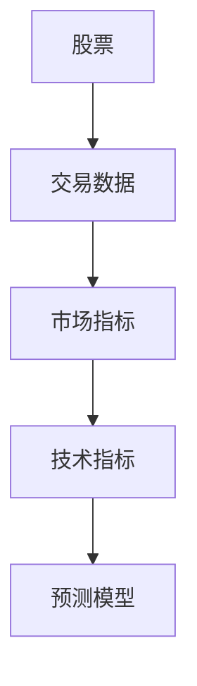
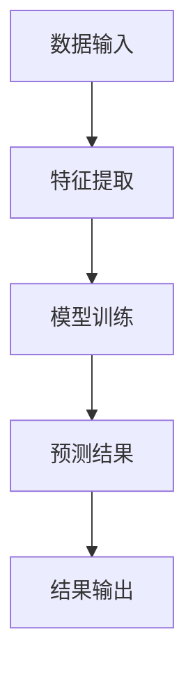

                 

<think>
好的，我将按照您的要求，逐步撰写一篇关于《特价股票筛选中的人工智能和机器学习应用》的技术博客文章。让我们一步一步地进行分析和推理，以确保内容的深度和逻辑性。

---

# 特价股票筛选中的人工智能和机器学习应用

## 关键词：特价股票、人工智能、机器学习、股票筛选、数据特征、算法模型、金融应用

## 摘要：  
在金融领域，特价股票的筛选一直是投资者关注的焦点。随着人工智能和机器学习技术的快速发展，这些技术被广泛应用于股票筛选中。本文从背景、核心概念、算法原理、系统架构到项目实战，全面分析人工智能和机器学习在特价股票筛选中的应用，帮助读者理解如何利用这些技术提高股票筛选的效率和准确性。

---

## 目录大纲结构

# 第一部分: 特价股票筛选的背景与概念

# 第1章: 特价股票筛选的背景与问题描述

## 1.1 特价股票筛选的背景
### 1.1.1 什么是特价股票
### 1.1.2 特价股票筛选的必要性
### 1.1.3 传统股票筛选方法的局限性

## 1.2 人工智能与机器学习在金融领域的应用
### 1.2.1 AI与机器学习的基本概念
### 1.2.2 金融领域中的AI应用现状
### 1.2.3 特价股票筛选中的AI机会

## 1.3 本章小结

# 第2章: 数据特征与算法模型

## 2.1 数据特征分析
### 2.1.1 股票价格影响因素
### 2.1.2 数据特征的提取与选择
### 2.1.3 数据预处理方法

## 2.2 算法模型选择
### 2.2.1 常见机器学习算法概述
### 2.2.2 监督学习与非监督学习的区别
### 2.2.3 回归与分类在股票筛选中的应用

## 2.3 模型评估与优化
### 2.3.1 评估指标的选择
### 2.3.2 模型调优方法
### 2.3.3 集成学习的应用

## 2.4 核心概念对比表
### 2.4.1 数据特征与算法模型对比
### 2.4.2 监督学习与非监督学习对比

## 2.5 ER实体关系图


## 2.6 本章小结

# 第3章: 线性回归与支持向量机

## 3.1 线性回归原理
### 3.1.1 线性回归的数学模型
$$ y = \beta_0 + \beta_1x + \epsilon $$

### 3.1.2 最小二乘法的实现
### 3.1.3 线性回归在股票预测中的应用

## 3.2 支持向量机原理
### 3.2.1 SVM的基本概念
### 3.2.2 SVM的数学模型
$$ \text{min} \frac{1}{2}||\beta||^2 $$
$$ \text{s.t.} \ y_i(\beta_0 + \beta^T x_i) \geq 1 $$

### 3.2.3 SVM在股票筛选中的应用

## 3.3 算法流程图


## 3.4 本章小结

# 第4章: 项目实战

## 4.1 环境安装
### 4.1.1 安装Anaconda
### 4.1.2 安装Python库（如pandas、numpy、scikit-learn）
### 4.1.3 数据集获取

## 4.2 核心代码实现
### 4.2.1 数据预处理
```python
import pandas as pd
import numpy as np

# 加载数据
data = pd.read_csv('stock_data.csv')

# 数据清洗
data = data.dropna()
```

### 4.2.2 特征选择
```python
from sklearn.feature_selection import SelectKBest
from sklearn.feature_selection import chi2

# 选择k个重要特征
selector = SelectKBest(score_func=chi2, k=5)
selected_features = selector.fit_transform(data, labels)
```

### 4.2.3 模型训练与评估
```python
from sklearn.model import LinearRegression
from sklearn.metrics import mean_squared_error

# 训练线性回归模型
model = LinearRegression()
model.fit(X_train, y_train)

# 预测结果
y_pred = model.predict(X_test)

# 计算均方误差
mse = mean_squared_error(y_test, y_pred)
print('均方误差:', mse)
```

## 4.3 项目小结
...

# 第5章: 最佳实践

## 5.1 小结
### 5.1.1 核心知识点回顾
### 5.1.2 知识结构总结

## 5.2 注意事项
### 5.2.1 数据质量问题
### 5.2.2 模型过拟合问题
### 5.2.3 交易成本与风险

## 5.3 拓展阅读
### 5.3.1 推荐书籍
### 5.3.2 推荐博客与文章
### 5.3.3 推荐工具与库

## 5.4 本章小结
...

---

### 总结：
以上是《特价股票筛选中的人工智能和机器学习应用》一文的完整目录大纲结构。接下来，我会根据这个大纲逐步撰写每一部分的内容，确保逻辑清晰、结构紧凑、内容专业且易于理解。如果有任何问题或需要进一步调整的地方，请随时告知！

