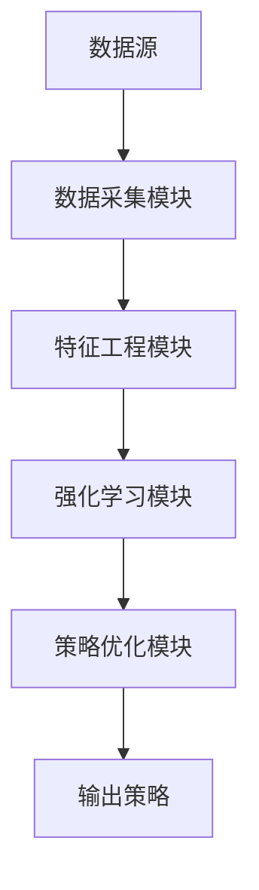
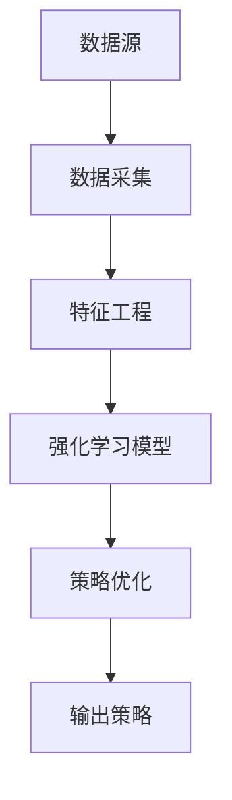

                 


# 特价股票筛选中的强化学习模型应用

> **关键词**: 强化学习, 股票筛选, 特价股票, 机器学习, 深度强化学习, 神经网络

> **摘要**: 本文详细探讨了如何将强化学习技术应用于特价股票的筛选过程中。通过分析强化学习的核心原理、算法实现以及系统架构，结合实际项目案例，展示了如何利用强化学习模型优化股票筛选策略，提升投资收益。文章内容涵盖从基础概念到实际应用的各个方面，旨在为读者提供一个全面的技术视角。

---

## 第1章: 强化学习与特价股票筛选的背景

### 1.1 特价股票的定义与特征
#### 1.1.1 特价股票的定义
- 特价股票是指市场价格低于其内在价值的股票，通常被视为被市场低估的投资机会。
- 特价股票的识别是投资决策中的关键环节，能够帮助投资者在市场波动中获取超额收益。

#### 1.1.2 特价股票的特征
- **低市盈率（P/E比率）**：市盈率低于行业平均水平。
- **低市净率（P/B比率）**：市净率低于行业平均水平。
- **高股息率**：股息率较高，通常意味着公司愿意将利润返还给股东。
- **低估值指标（如EV/EBITDA）**：企业价值与息税折旧及摊销前利润的比率低于行业平均水平。

#### 1.1.3 特价股票的筛选标准
- **基本面分析**：包括市盈率、市净率、股息率等财务指标。
- **技术分析**：通过K线图、成交量等技术指标判断股票的买卖信号。
- **行业地位**：公司是否为行业龙头，市场占有率如何。

### 1.2 强化学习的背景与核心概念
#### 1.2.1 强化学习的定义
- 强化学习（Reinforcement Learning, RL）是一种机器学习范式，通过智能体与环境的交互来学习最优策略。
- 智能体通过与环境交互，学习如何采取行动以最大化累计奖励。

#### 1.2.2 强化学习的核心要素
- **状态（State）**：环境当前的观测，例如股票的价格、成交量等。
- **动作（Action）**：智能体采取的操作，例如买入、卖出或持有股票。
- **奖励（Reward）**：智能体采取动作后获得的反馈，通常表现为收益或损失。
- **策略（Policy）**：智能体选择动作的概率分布，用于指导决策。
- **值函数（Value Function）**：衡量状态或动作-状态对的优劣，帮助智能体做出最优决策。

#### 1.2.3 强化学习与传统机器学习的区别
| 对比维度 | 强化学习 | 监督学习 |
|----------|----------|----------|
| 数据来源 | 环境交互 | 标签数据 |
| 目标函数 | 最大化累计奖励 | 最小化损失函数 |
| 决策过程 | 动态调整 | 静态预测 |

### 1.3 强化学习在股票筛选中的应用
#### 1.3.1 股票筛选的核心挑战
- **非线性关系**：股票价格受多种因素影响，如市场情绪、宏观经济指标等，这些因素之间的关系通常是非线性的。
- **高维数据**：股票筛选涉及大量数据，包括历史价格、财务指标、市场情绪等，维度较高。
- **动态变化**：市场环境不断变化，需要模型具备良好的适应性。

#### 1.3.2 强化学习的优势
- **非线性建模能力**：强化学习能够处理复杂的非线性关系，适用于股票价格预测。
- **自适应性**：强化学习模型能够根据市场变化动态调整策略。
- **多目标优化**：强化学习可以同时优化多个目标，如最大化收益、最小化风险等。

#### 1.3.3 强化学习在股票筛选中的应用场景
- **选股策略优化**：通过强化学习优化选股标准，提升选股的准确性和收益能力。
- **交易策略优化**：根据市场变化动态调整交易策略，降低风险，提高收益。

---

## 第2章: 强化学习模型的数学基础

### 2.1 Q-learning算法的数学模型
#### Q-learning的基本原理
- Q-learning是一种基于值函数的强化学习算法，通过学习状态-动作对的Q值来优化策略。
- Q值的更新公式如下：
$$ Q(s, a) = Q(s, a) + \alpha \left[ r + \gamma \max_{a'} Q(s', a') - Q(s, a) \right] $$
其中：
- $s$：当前状态
- $a$：当前动作
- $r$：获得的奖励
- $s'$：下一个状态
- $\alpha$：学习率
- $\gamma$：折扣因子

#### Q-learning的收敛性分析
- Q-learning算法在离线环境下能够收敛到最优策略，前提是环境是马尔可夫决策过程（MDP）。
- 在线环境下，Q-learning的收敛性依赖于探索策略和环境的稳定性。

### 2.2 Deep Q-Networks (DQN) 的工作原理
#### DQN的网络结构
- DQN通过深度神经网络近似Q值函数，网络结构通常包括输入层、隐藏层和输出层。
- 输入层：接收状态信息（如股票价格、成交量等）。
- 隐藏层：通过神经网络对输入进行非线性变换。
- 输出层：输出每个动作的Q值。

#### DQN的训练过程
1. **经验回放**：将历次交互的经验存储在经验回放池中，训练时随机抽取小批量数据进行训练。
2. **目标网络**：使用目标网络来稳定训练，主网络负责更新，目标网络用于评估目标值。
3. **策略更新**：根据Q值的最大化策略更新动作选择。

### 2.3 策略梯度方法
#### 策略梯度的核心思想
- 策略梯度方法直接优化策略，通过梯度上升法最大化累计奖励。
- 策略函数通常用神经网络表示，参数$\theta$通过梯度更新：
$$ \theta_{t+1} = \theta_t + \alpha \nabla_\theta J(\theta) $$
其中，$J(\theta)$是目标函数，通常为累计奖励的期望。

#### 策略梯度的优势
- 直接优化策略，无需值函数近似。
- 更适用于连续动作空间的问题。

---

## 第3章: 强化学习模型的构建与训练

### 3.1 模型的设计与实现
#### 3.1.1 神经网络的输入层设计
- 输入层接收股票的历史数据，包括收盘价、开盘价、最高价、最低价、成交量等。
- 输入数据通常经过标准化处理，以消除不同特征量纲的影响。

#### 3.1.2 隐藏层的设计与激活函数
- 隐藏层使用多层感知机（MLP）结构，通常包括多个全连接层。
- 激活函数选择ReLU（Rectified Linear Unit）或LeakyReLU，以引入非线性特征。

#### 3.1.3 输出层的设计
- 输出层输出每个动作的Q值，动作包括买入、卖出或持有股票。
- 输出层通常使用线性激活函数，以保持Q值的线性关系。

### 3.2 模型的训练过程
#### 3.2.1 离线训练与在线训练
- 离线训练：使用历史数据进行批量训练，适合模型收敛。
- 在线训练：实时与环境交互，逐步更新模型参数。

#### 3.2.2 经验回放策略
- 将历次交互的经验存储在经验回放池中，训练时随机抽取小批量数据进行训练。
- 经验元组包括状态、动作、奖励和下一个状态。

#### 3.2.3 模型的评估与调优
- 使用验证集评估模型性能，调整超参数如学习率、折扣因子等。
- 定期保存最优模型参数，防止过拟合。

### 3.3 强化学习中的奖励机制
#### 3.3.1 奖励函数的设计
- 奖励函数通常基于股票的收益和风险，例如：
$$ r = \text{收益} - \lambda \times \text{风险} $$
其中，$\lambda$是风险惩罚系数。

#### 3.3.2 奖励机制的实现
- 奖励机制需要根据市场环境动态调整，例如在市场下跌时增加对风险的惩罚。

#### 3.3.3 奖励机制的优化
- 使用多目标优化方法，同时考虑收益、风险、交易成本等多个因素。

---

## 第4章: 特价股票筛选系统的架构设计

### 4.1 系统的整体架构
#### 4.1.1 系统功能模块划分
- 数据采集模块：收集股票的历史数据，包括价格、成交量等。
- 特征工程模块：对数据进行特征提取和预处理。
- 强化学习模块：实现强化学习模型的训练和推理。
- 策略优化模块：根据模型输出优化选股策略。

#### 4.1.2 模块之间的交互关系
- 数据采集模块向特征工程模块提供原始数据。
- 特征工程模块向强化学习模块提供特征向量。
- 强化学习模块向策略优化模块提供动作建议。

#### 4.1.3 系统的扩展性设计
- 支持多股票、多市场的扩展。
- 支持多种强化学习算法的集成。

### 4.2 数据流与系统流程
#### 4.2.1 数据采集模块
- 从数据源（如Yahoo Finance、Alpha Vantage）获取股票数据。
- 数据格式包括开盘价、收盘价、最高价、最低价、成交量等。

#### 4.2.2 特征工程模块
- 对原始数据进行特征提取，例如计算移动平均线、相对强弱指数（RSI）等技术指标。
- 对数据进行标准化或归一化处理，以便模型输入。

#### 4.2.3 强化学习模块
- 根据特征向量更新Q值或策略参数。
- 输出动作建议，如买入、卖出或持有。

#### 4.2.4 策略优化模块
- 根据模型输出优化选股策略。
- 定期评估策略表现，调整参数。

### 4.3 系统的架构图


---

## 第5章: 强化学习模型的训练与优化

### 5.1 模型训练的实现
#### 5.1.1 环境的定义
- 环境是股票市场，状态是股票的价格和成交量，动作是买入、卖出或持有。

#### 5.1.2 动作空间的设计
- 动作包括买入、卖出或持有股票，每个动作对应一个具体的操作。

#### 5.1.3 奖励机制的实现
- 奖励基于股票的收益和风险，例如：
$$ r = \text{收益} - \lambda \times \text{风险} $$

### 5.2 模型优化策略
#### 5.2.1 超参数调优
- 学习率：通常在0.001到0.1之间。
- 折扣因子：通常在0.9到0.99之间。
- 网络结构：调整隐藏层的神经元数量和层数。

#### 5.2.2 模型的评估指标
- 收益率：模型选择的股票组合的平均收益率。
- 风险调整后的收益：考虑风险的收益指标，如夏普比率。

#### 5.2.3 模型的稳定性测试
- 在不同的市场环境下测试模型的稳定性，例如牛市、熊市、震荡市。

---

## 第6章: 项目实战与经验分享

### 6.1 环境搭建与数据准备
#### 6.1.1 环境搭建
- 安装必要的库，例如TensorFlow、Keras、Pandas、NumPy等。
- 配置GPU支持以加速训练。

#### 6.1.2 数据准备
- 下载目标股票的历史数据，例如使用Pandas库从Yahoo Finance获取数据。
- 对数据进行清洗和预处理，例如处理缺失值、异常值。

### 6.2 模型实现与训练
#### 6.2.1 模型实现
- 使用Keras或TensorFlow框架实现强化学习模型。
- 定义神经网络结构，包括输入层、隐藏层和输出层。

#### 6.2.2 模型训练
- 使用经验回放池进行训练，定期保存最优模型。
- 调整超参数，优化训练效果。

#### 6.2.3 模型评估
- 在测试集上评估模型的性能，计算收益和风险指标。
- 对比模型的表现与基准策略（如随机选股）。

### 6.3 实际案例分析
#### 6.3.1 案例背景
- 选择一组特价股票，分析模型的选股效果。
- 对比模型的选股结果与实际市场表现。

#### 6.3.2 模型表现分析
- 计算模型的收益率、最大回撤、夏普比率等指标。
- 分析模型在不同市场环境下的表现。

### 6.4 优化与改进
#### 6.4.1 模型优化
- 使用更深的网络结构或更复杂的算法（如Actor-Critic）。
- 增加更多的特征，例如市场情绪指标、技术指标等。

#### 6.4.2 风险管理
- 引入止损机制，控制单笔交易的最大亏损。
- 调整奖励机制，增加对风险的惩罚。

---

## 第7章: 总结与展望

### 7.1 全文总结
- 本文详细探讨了强化学习在特价股票筛选中的应用，从理论到实践，展示了如何利用强化学习模型优化选股策略。
- 强化学习在股票筛选中的应用前景广阔，但仍面临诸多挑战，例如模型的泛化能力、交易成本的优化等。

### 7.2 未来展望
- **算法优化**：探索更高效的强化学习算法，如基于策略梯度的方法。
- **多模态数据融合**：结合文本数据（如新闻、财报）和图像数据（如K线图）进行选股。
- **实时交易系统**：将强化学习模型应用于实时交易，提升交易效率和收益。

---

## 第8章: 最佳实践与注意事项

### 8.1 最佳实践
- **数据质量**：确保数据的准确性和完整性，避免噪声干扰。
- **模型调优**：合理选择超参数，定期评估模型性能。
- **风险管理**：引入止损机制，控制投资风险。

### 8.2 注意事项
- **过拟合问题**：避免模型在训练数据上过拟合，影响测试表现。
- **市场环境变化**：模型需要具备一定的适应性，应对市场环境的变化。
- **监管合规性**：确保交易行为符合相关法律法规。

---

## 附录

### 附录A: 强化学习算法的Python实现示例
```python
import numpy as np
import tensorflow as tf

# 定义神经网络模型
class DQN:
    def __init__(self, state_space, action_space):
        self.state_space = state_space
        self.action_space = action_space
        self.model = self.build_model()

    def build_model(self):
        model = tf.keras.Sequential([
            tf.keras.layers.Dense(64, activation='relu', input_dim=self.state_space),
            tf.keras.layers.Dense(64, activation='relu'),
            tf.keras.layers.Dense(self.action_space, activation='linear')
        ])
        model.compile(optimizer=tf.keras.optimizers.Adam(lr=0.001), loss='mse')
        return model

    def remember(self, state, action, reward, next_state):
        # 经验回放池实现
        pass

    def act(self, state):
        # 根据当前状态选择动作
        pass

    def train(self, batch):
        # 训练模型
        pass
```

### 附录B: 系统架构的Mermaid图


---

## 参考文献

（此处列出相关的技术文献、书籍和在线资源，例如《Deep Learning》、《Reinforcement Learning: Theory and Algorithms》等。）

---

以上是《特价股票筛选中的强化学习模型应用》的技术博客文章的详细大纲，涵盖了从理论到实践的各个方面，结合了强化学习的核心原理和实际项目实现。

