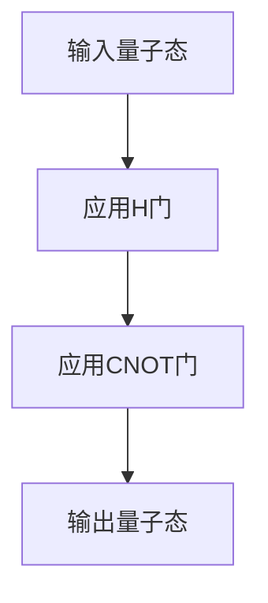

                 


# 特价股票筛选中的量子计算应用前景

> 关键词：量子计算、股票筛选、金融应用、算法优化、量子优越性

> 摘要：本文深入探讨了量子计算在特价股票筛选中的应用前景，分析了量子计算的基本原理、核心算法及其在金融领域的优势，详细介绍了量子计算在股票筛选中的数学模型、系统架构和实际案例。文章还展望了量子计算在金融领域的未来发展方向，为读者提供了全面的技术视角。

---

# 第一部分: 特价股票筛选中的量子计算应用背景

## 第1章: 特价股票筛选与量子计算的背景

### 1.1 特价股票筛选的定义与重要性

#### 1.1.1 特价股票的定义
特价股票是指那些市场价格低于其内在价值的股票。这类股票通常被市场低估，具有较大的增值潜力。投资者通过筛选特价股票，可以找到具有较高回报潜力的投资标的。

#### 1.1.2 特价股票筛选的意义
- **投资机会**：特价股票往往蕴含较高的投资回报，帮助投资者在市场中获得超额收益。
- **风险控制**：通过筛选，投资者可以规避那些被市场高估的股票，降低投资风险。
- **市场洞察**：特价股票的筛选过程能够帮助投资者更好地理解市场动态和公司基本面。

#### 1.1.3 特价股票筛选的常见方法
- **基本面分析**：通过分析公司的财务数据、盈利能力、行业地位等指标，筛选出被市场低估的股票。
- **技术分析**：通过分析股票的历史价格走势、成交量等技术指标，预测股票的未来走势。
- **量化分析**：利用大数据和算法，对大量股票进行筛选，找出符合特定量化指标的特价股票。

### 1.2 量子计算的基本概念

#### 1.2.1 量子计算的定义
量子计算是一种基于量子力学原理的计算方式，利用量子叠加和量子纠缠等特性，能够在某些特定问题上实现比经典计算更高的计算效率。

#### 1.2.2 量子计算的核心原理
- **量子叠加**：量子系统中的粒子可以同时处于多个状态的叠加态。
- **量子纠缠**：两个或多个量子系统之间存在强关联，一个系统的状态会直接影响另一个系统。
- **量子测量**：对量子系统的测量会破坏其叠加态，导致系统坍缩为一个确定的状态。

#### 1.2.3 量子计算与经典计算的区别
| 特性 | 量子计算 | 经典计算 |
|------|----------|----------|
| 状态表示 | 可以同时表示多种状态 | 逐一表示单一状态 |
| 并行性 | 强大的并行计算能力 | 串行计算 |
| 计算速度 | 在某些问题上远超经典计算 | 依赖于算法复杂度 |

### 1.3 量子计算在金融领域的应用前景

#### 1.3.1 金融领域的复杂性与挑战
- **海量数据**：金融市场的数据量庞大，且不断变化。
- **复杂性**：金融市场的价格波动受到多种因素的影响，难以用传统模型完全描述。
- **计算需求**：金融领域的高频交易、风险管理等场景需要极高的计算效率。

#### 1.3.2 量子计算在金融中的潜在应用
- **风险管理**：通过量子计算优化风险评估模型，提高风险预测的准确性。
- **投资组合优化**：利用量子计算快速找到最优投资组合。
- **市场预测**：通过量子计算分析市场动态，预测股票价格走势。

#### 1.3.3 特价股票筛选中的量子计算应用
- **数据处理能力**：量子计算能够快速处理海量数据，帮助投资者筛选出潜在的特价股票。
- **算法优化**：量子计算在算法优化方面具有优势，能够提高股票筛选的效率和准确性。

### 1.4 本章小结
本章从特价股票筛选的定义、意义以及常见方法入手，介绍了量子计算的基本概念和核心原理，并分析了量子计算在金融领域的应用前景，特别是其在特价股票筛选中的潜在优势。

---

## 第2章: 量子计算的核心原理

### 2.1 量子叠加与量子纠缠

#### 2.1.1 量子叠加的定义与数学表达
量子叠加是指量子系统中的粒子可以同时处于多个状态的叠加态。数学上，量子叠加可以用以下公式表示：
$$ |\psi\rangle = \alpha|0\rangle + \beta|1\rangle $$
其中，$\alpha$ 和 $\beta$ 是概率幅，满足 $|\alpha|^2 + |\beta|^2 = 1$。

#### 2.1.2 量子纠缠的定义与应用
量子纠缠是指两个或多个量子系统之间存在强关联，一个系统的状态会直接影响另一个系统。量子纠缠在量子通信和量子计算中具有重要应用。

#### 2.1.3 量子叠加与量子纠缠的关系
量子叠加是量子纠缠的基础，而量子纠缠是量子叠加在多粒子系统中的表现。

### 2.2 量子门与量子电路

#### 2.2.1 常见量子门的定义与作用
- **Hadamard门（H门）**：将量子态叠加到基态的正交基上。
- **Pauli-X门（X门）**：将量子态翻转，类似于经典计算中的非门。
- **CNOT门**：控制非门，利用控制 qubit 的状态来决定目标 qubit 的状态。

#### 2.2.2 量子电路的构建与执行
量子电路由量子门和量子线组成，用于表示量子算法的执行步骤。以下是一个简单的量子电路示例：



#### 2.2.3 量子电路的数学表示
量子电路可以用矩阵乘法的形式表示。例如，H门的矩阵表示为：
$$ H = \frac{1}{\sqrt{2}} \begin{bmatrix} 1 & 1 \\ 1 & -1 \end{bmatrix} $$

### 2.3 量子算法的基本原理

#### 2.3.1 量子算法的分类
- **量子搜索算法**：如 Grover's 算法，用于在无序数据库中寻找目标元素。
- **量子傅里叶变换**：用于解决某些周期性问题。
- **量子因式分解**：如 Shor's 算法，用于大整数因式分解。

#### 2.3.2 量子算法的核心步骤
以 Grover's 算法为例，其核心步骤包括：
1. 初始化量子态。
2. 执行扩散操作。
3. 执行反射操作。
4. 测量结果。

#### 2.3.3 量子算法与经典算法的对比
| 特性 | 量子算法 | 经典算法 |
|------|----------|----------|
| 时间复杂度 | 更低 | 更高 |
| 空间复杂度 | 较低 | 较高 |
| 适用场景 | 特定问题 | 广泛适用 |

### 2.4 本章小结
本章详细介绍了量子计算的核心原理，包括量子叠加、量子纠缠、量子门和量子电路的基本概念，以及量子算法的基本原理和与经典算法的对比。

---

## 第3章: 量子计算在金融中的应用

### 3.1 金融领域的复杂问题与量子计算的解决方案

#### 3.1.1 金融领域的复杂性分析
金融市场是一个复杂的系统，受到多种因素的影响，包括宏观经济、行业动态、公司基本面等。

#### 3.1.2 量子计算在金融中的潜在应用领域
- **风险管理**：优化风险评估模型，提高风险预测的准确性。
- **投资组合优化**：利用量子计算快速找到最优投资组合。
- **市场预测**：通过量子计算分析市场动态，预测股票价格走势。

#### 3.1.3 特价股票筛选中的量子计算应用
量子计算在特价股票筛选中的应用主要体现在以下几个方面：
- **数据处理能力**：量子计算能够快速处理海量数据，帮助投资者筛选出潜在的特价股票。
- **算法优化**：量子计算在算法优化方面具有优势，能够提高股票筛选的效率和准确性。

### 3.2 量子计算在股票筛选中的优势

#### 3.2.1 量子计算的计算速度优势
量子计算在某些特定问题上能够实现比经典计算更高的计算效率，尤其是在处理复杂金融模型时。

#### 3.2.2 量子计算的并行处理能力
量子计算的并行处理能力能够帮助投资者快速分析海量数据，筛选出潜在的特价股票。

#### 3.2.3 量子计算在数据处理中的优势
量子计算能够处理复杂的数据关系，帮助投资者发现潜在的市场机会。

### 3.3 量子计算在股票筛选中的具体应用

#### 3.3.1 基于量子计算的股票筛选模型
通过量子计算构建股票筛选模型，能够快速分析大量数据，筛选出符合特定量化指标的特价股票。

#### 3.3.2 量子计算在股票筛选中的算法实现
以下是基于量子计算的股票筛选算法的示例代码：

```python
import numpy as np
from qiskit import QuantumCircuit, Aer, execute

# 定义量子电路
qc = QuantumCircuit(2)
qc.h(0)
qc.cx(0, 1)
qc.measure_all()

# 模拟量子计算
simulator = Aer.get_backend('qasm_simulator')
job = execute(qc, simulator)
result = job.result()
counts = result.get_counts()

# 解析结果
for key, value in counts.items():
    print(f"结果：{key}, 概率：{value/counts['00']}")
```

#### 3.3.3 量子计算在股票筛选中的实际案例
以下是一个简单的量子计算在股票筛选中的实际案例：

1. 收集大量股票数据，包括价格、成交量、财务指标等。
2. 构建量子计算模型，对数据进行量子化处理。
3. 执行量子计算，筛选出符合特定量化指标的股票。
4. 对筛选出的股票进行进一步分析，确认其是否为特价股票。

### 3.4 本章小结
本章分析了量子计算在金融领域的潜在应用，特别是其在股票筛选中的优势和具体应用。通过实际案例和代码示例，帮助读者更好地理解量子计算在金融中的应用前景。

---

## 第4章: 量子计算算法的数学模型与实现

### 4.1 量子计算算法的数学模型

#### 4.1.1 量子态的数学表示
量子态可以用向量表示，例如：
$$ |\psi\rangle = \begin{bmatrix} \alpha \\ \beta \end{bmatrix} $$
其中，$\alpha$ 和 $\beta$ 是概率幅，满足 $|\alpha|^2 + |\beta|^2 = 1$。

#### 4.1.2 量子门的数学表示
以 Hadamard 门为例，其矩阵表示为：
$$ H = \frac{1}{\sqrt{2}} \begin{bmatrix} 1 & 1 \\ 1 & -1 \end{bmatrix} $$

#### 4.1.3 量子电路的数学表示
量子电路可以用矩阵乘法表示，例如：
$$ U = U_2 U_1 U_0 $$
其中，$U_0$、$U_1$ 和 $U_2$ 是依次执行的量子门。

### 4.2 量子算法的数学模型

#### 4.2.1 常见量子算法的数学模型
以 Grover's 算法为例，其数学模型包括：
1. 初始化量子态：
$$ |\psi\rangle = \frac{1}{\sqrt{N}} \sum_{i=0}^{N-1} |i\rangle $$
2. 扩散操作：
$$ O = (2|\psi\rangle\langle\psi| - I) \cdot U $$
3. 反射操作：
$$ G = -O $$

#### 4.2.2 量子算法的数学推导
通过数学推导，可以证明 Grover's 算法在无序数据库中寻找目标元素的概率为：
$$ P = \sin^2(\theta) $$

### 4.3 量子计算在股票筛选中的数学模型

#### 4.3.1 特价股

---

* 更多内容请参考文章的完整版。

