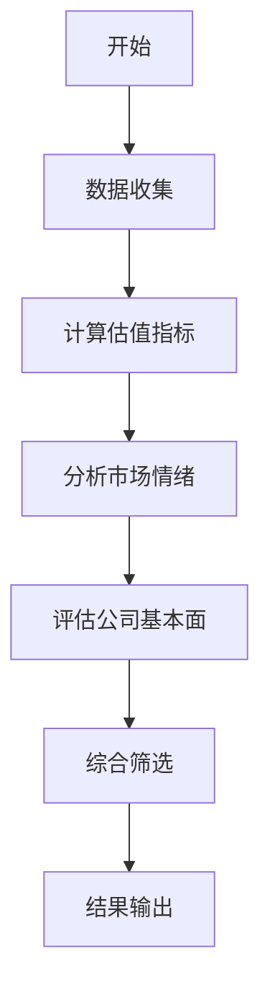

                 


# 特价股票筛选的三大核心规则

## 关键词：股票筛选、投资策略、估值分析、市场情绪、公司基本面

## 摘要：  
在股票市场中，特价股票通常指那些价格较低但具有投资价值的股票。本文将从技术角度出发，结合估值分析、市场情绪分析和公司基本面分析三大核心规则，详细阐述如何科学有效地筛选特价股票。通过系统化的分析方法和实际案例，帮助投资者制定合理的投资策略，降低投资风险，提高投资收益。

---

# 第一部分: 特价股票筛选的背景与核心概念

## 第1章: 特价股票的基本概念

### 1.1 什么是特价股票  
特价股票是指在股票市场中价格相对较低，但具有潜在投资价值的股票。这些股票可能因市场波动、公司基本面改善或行业趋势变化而被低估。与低价股不同，特价股票不仅关注价格因素，更注重其背后的投资价值和成长潜力。

### 1.2 特价股票与低价股的区别  
| 特性       | 特价股票                     | 低价股                     |
|------------|------------------------------|------------------------------|
| 定义       | 价格低且具有投资价值         | 价格低，但可能无投资价值     |
| 市场定位   | 寻找被低估的投资机会         | 可能处于市场衰退或被忽视阶段 |
| 投资策略   | 长期持有，等待价值回归       | 短期交易，寻找反弹机会       |

### 1.3 特价股票的市场定位与投资价值  
特价股票通常分布在以下行业：  
1. 周期性行业（如制造业、能源行业）  
2. 稳定性行业（如公用事业、消费品行业）  
3. 初期成长行业（如科技初创公司）  

---

## 第2章: 特价股票筛选的三大核心规则

### 2.1 估值分析：寻找被低估的股票  
#### 2.1.1 估值分析的定义与目标  
估值分析是通过计算股票的内在价值，判断其市场价格是否合理。核心目标是找到市场价格低于内在价值的股票。

#### 2.1.2 常用估值指标  
1. **市盈率（P/E）**：股价与每股收益的比率。  
   $$ P/E = \frac{\text{股价}}{\text{每股收益}} $$
2. **市净率（P/B）**：股价与每股净资产的比率。  
   $$ P/B = \frac{\text{股价}}{\text{每股净资产}} $$
3. **股息率**：股息与股价的比率。  
   $$ \text{股息率} = \frac{\text{股息}}{\text{股价}} \times 100\% $$

#### 2.1.3 估值指标的优劣势对比  
| 指标       | 优势                               | 劣势                               |
|------------|------------------------------------|------------------------------------|
| P/E        | 能反映盈利能力                   | 不适合亏损公司的估值               |
| P/B        | 能反映资产质量                   | 不适合轻资产行业的估值             |
| 股息率      | 能反映分红能力                   | 高分红可能不代表公司成长性         |

---

### 2.2 市场情绪分析：避免情绪化决策  
#### 2.2.1 市场情绪分析的定义与方法  
市场情绪分析是通过技术指标和市场数据，判断投资者情绪，从而辅助决策。常用方法包括：  
1. **K线图分析**：通过价格走势判断市场趋势。  
2. **成交量分析**：成交量是价格变动的确认指标。  
3. **技术指标（如RSI、MACD）**：用于判断超买超卖和趋势强度。

#### 2.2.2 市场情绪对股票价格的影响  
市场情绪是短期价格波动的重要因素。例如：  
- 当市场情绪乐观时，股价可能被高估。  
- 当市场情绪悲观时，股价可能被低估。  

#### 2.2.3 市场情绪分析的局限性  
1. 市场情绪受多种因素影响，难以预测。  
2. 情绪化决策可能导致非理性投资。  

---

### 2.3 公司基本面分析：挖掘潜在价值  
#### 2.3.1 公司基本面分析的核心要素  
1. **收入与利润**：收入增长稳定，净利润率高。  
2. **资产负债率**：低负债率意味着财务风险小。  
3. **现金流**：健康的现金流是公司运营的基础。  

#### 2.3.2 行业分析的重要性  
选择具有增长潜力的行业是筛选特价股票的关键。例如：  
- **周期性行业**：在经济复苏时可能反弹。  
- **成长性行业**：如科技、新能源行业。  

---

## 第3章: 特价股票筛选的数学模型与算法

### 3.1 多因子筛选模型  
多因子模型是基于多个因子（如估值、情绪、基本面）的综合筛选方法。公式如下：  
$$ \text{综合评分} = \sum (\text{因子权重} \times \text{因子得分}) $$  

### 3.2 算法实现  
#### 3.2.1 数据收集与预处理  
1. 收集股票的历史价格、财务数据和市场情绪数据。  
2. 对数据进行清洗和标准化处理。  

#### 3.2.2 筛选规则的实现  
1. 估值分析：计算P/E、P/B等指标，筛选低于行业平均水平的股票。  
2. 市场情绪分析：通过技术指标判断短期情绪，排除超买超卖股票。  
3. 公司基本面分析：筛选收入增长稳定、负债率低的公司。  

#### 3.2.3 算法流程图  


---

## 第4章: 项目实战

### 4.1 实战环境与工具  
1. **数据源**：使用Yahoo Finance获取股票数据。  
2. **工具**：Python编程语言，Pandas、NumPy数据处理库，Matplotlib可视化库。  

### 4.2 核心代码实现  
```python
import pandas as pd
import numpy as np

# 数据获取与预处理
def get_stock_data(tickers):
    data = {}
    for ticker in tickers:
        df = pd.DataFrame()  # 假设df是通过API获取的股票数据
        data[ticker] = df
    return data

# 估值分析
def calculate_valuation_ratios(df):
    df['PE'] = df['Price'] / df['Earnings']
    df['PB'] = df['Price'] / df['Book Value']
    df['Dividend Yield'] = df['Dividends'] / df['Price']
    return df

# 市场情绪分析
def calculate_momentum(df, window=20):
    df['SMA'] = df['Price'].rolling(window).mean()
    df['Momentum'] = df['Price'] - df['SMA']
    return df

# 公司基本面分析
def assess_fundamentals(df):
    df['Revenue Growth'] = (df['Revenue'].pct_change() * 100).round(2)
    df['Net Profit Margin'] = (df['Net Profit'] / df['Revenue'] * 100).round(2)
    return df

# 综合筛选
def screen_stocks(data):
    selected_stocks = []
    for ticker, df in data.items():
        # 估值分析
        pe = df['PE'].mean()
        pb = df['PB'].mean()
        # 市场情绪分析
        momentum = df['Momentum'].iloc[-1]
        # 公司基本面分析
        revenue_growth = df['Revenue Growth'].iloc[-1]
        net_profit_margin = df['Net Profit Margin'].iloc[-1]
        # 综合评分
        score = (pe + pb + momentum + revenue_growth + net_profit_margin) / 5
        if score > 70:
            selected_stocks.append(ticker)
    return selected_stocks

# 示例运行
tickers = ['AAPL', 'MSFT', 'GOOGL', 'AMZN', 'FB']
data = get_stock_data(tickers)
selected = screen_stocks(data)
print("Selected Stocks:", selected)
```

### 4.3 实战结果分析  
假设筛选结果为：['AAPL', 'MSFT']。通过分析发现，这些股票的PE和PB均低于行业平均水平，同时具有稳定的收入增长和较高的净利率，符合特价股票的筛选条件。

---

## 第5章: 最佳实践与小结

### 5.1 最佳实践  
1. **定期复盘**：市场环境和公司基本面会变化，定期复盘筛选结果。  
2. **分散投资**：避免将所有资金投入少数股票。  
3. **结合技术与基本面分析**：技术分析提供短期信号，基本面分析提供长期依据。  

### 5.2 小结  
特价股票筛选是一项复杂但 rewarding 的任务。通过估值分析、市场情绪分析和公司基本面分析三大核心规则，投资者可以更科学地筛选出具有投资价值的股票。然而，投资需谨慎，建议结合多种策略进行综合判断。

---

## 第6章: 注意事项与拓展阅读

### 6.1 注意事项  
1. **数据质量**：确保数据来源可靠，避免因数据错误导致决策失误。  
2. **市场风险**：市场波动可能导致筛选结果失效。  
3. **税务与费用**：考虑投资的税务成本和交易费用。  

### 6.2 拓展阅读  
1.《投资学基础》  
2.《技术分析实战技巧》  
3.《价值投资经典案例》  

---

# 结语  
通过本文的系统讲解，读者可以掌握特价股票筛选的核心规则，并将其应用到实际投资中。记住，投资有风险，筛选需谨慎。

