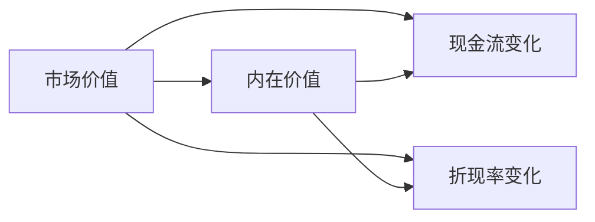
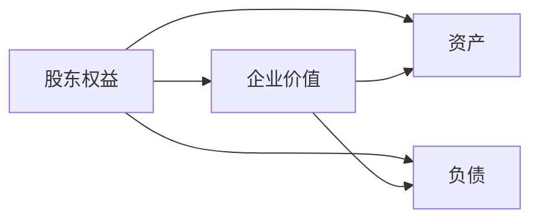
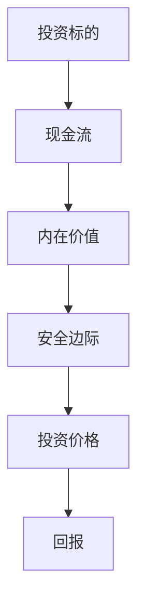
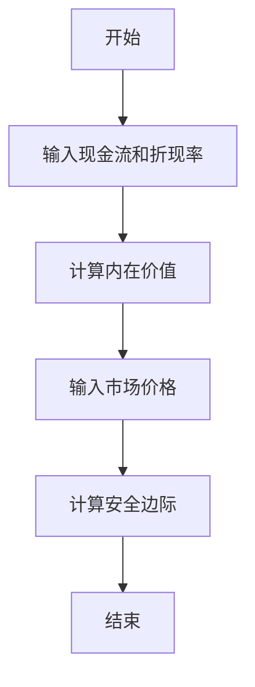
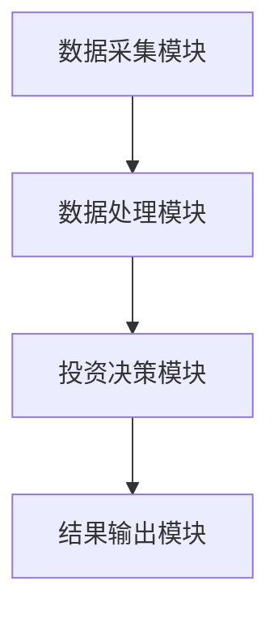
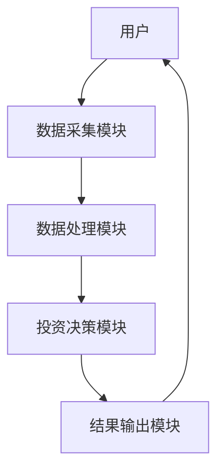

                 


# 玛丽·巴芙特的新兴市场价值投资：高风险中的高回报

## 关键词：
- 玛丽·巴芙特（巴菲特）
- 价值投资
- 新兴市场
- 高风险
- 高回报
- 投资策略
- 投资风险管理

## 摘要：
本文深入探讨玛丽·巴芙特的价值投资理念在新兴市场中的应用，分析高风险中的高回报策略。通过详细讲解投资原理、系统架构、实战案例和风险管理，为读者提供从理论到实践的全面指导。

---

## 第2章: 价值投资的核心概念与分析框架

### 2.1 内在价值与市场价值

#### 2.1.1 内在价值的定义与计算方法
内在价值是企业未来现金流的现值，计算公式为：
$$ V = \sum_{t=1}^{n} \frac{CF_t}{(1 + r)^t} $$
其中，$CF_t$ 是第 $t$ 年的现金流，$r$ 是折现率，$n$ 是预测的年数。

##### 实例：
假设一家公司未来3年的现金流分别为100万、120万和150万，折现率为10%。计算其内在价值：
$$ V = \frac{100}{1.1} + \frac{120}{1.1^2} + \frac{150}{1.1^3} \approx 337.41 \text{万} $$

#### 2.1.2 市场价值的波动性与周期性
市场价值受投资者情绪和市场周期影响，波动较大。例如，2008年金融危机期间，许多股票价格大幅下跌，但内在价值并未显著变化。

#### 2.1.3 内在价值与市场价值的动态关系
内在价值与市场价值的动态关系可以用图1表示：



### 2.2 安全边际的计算与应用

#### 2.2.1 安全边际的定义与作用
安全边际是投资价格低于内在价值的部分，公式为：
$$ \text{安全边际} = \text{内在价值} - \text{投资价格} $$

#### 2.2.2 安全边际的计算方法
以某公司为例，其内在价值为500万，投资价格为400万。安全边际为：
$$ \text{安全边际} = 500 - 400 = 100 \text{万} $$

#### 2.2.3 安全边际在投资决策中的应用
通过安全边际，投资者可以控制风险。例如，当安全边际较大时，投资风险较低。

### 2.3 股东权益与企业价值

#### 2.3.1 股东权益的定义与计算
股东权益是所有者权益，计算公式为：
$$ \text{股东权益} = \text{资产} - \text{负债} $$

#### 2.3.2 企业价值的评估方法
企业价值通常通过DCF模型计算，公式为：
$$ \text{企业价值} = \text{息税折旧摊销前利润} \times \text{折现率} $$

#### 2.3.3 股东权益与企业价值的关系
股东权益是企业价值的重要组成部分，两者的关系可以通过图2表示：



### 2.4 价值投资的核心要素对比表

| 核心要素 | 定义 | 重要性 | 应用 |
|----------|------|--------|------|
| 内在价值 | 企业未来现金流的现值 | 核心 | 评估企业价值的基础 |
| 安全边际 | 投资价格低于内在价值的部分 | 关键 | 控制投资风险的核心 |
| 股东权益 | 所有者权益 | 重要 | 评估企业财务健康的关键 |

### 2.5 价值投资的ER实体关系图



---

## 第3章: 新兴市场的特点与投资机会

### 3.1 新兴市场的定义与分类

#### 3.1.1 新兴市场的定义
新兴市场是指经济快速发展、市场规模较小但增长潜力大的国家市场，如中国、印度等。

#### 3.1.2 新兴市场的分类
新兴市场可分为亚洲、拉丁美洲和东欧市场，每个市场有其独特的特点。

### 3.2 新兴市场与成熟市场的区别

#### 3.2.1 经济结构差异
新兴市场通常以制造业和出口为导向，而成熟市场以服务业为主。

#### 3.2.2 投资机会差异
新兴市场在科技、消费等领域有更多机会，而成熟市场在金融和医疗领域机会较多。

### 3.3 新兴市场的投资机会

#### 3.3.1 高增长行业的识别
新兴市场的高增长行业包括科技、互联网、消费和金融等。

#### 3.3.2 投资新兴市场的策略
- 选择具有竞争优势的企业。
- 关注企业的管理层和治理结构。
- 评估企业的财务健康状况。

### 3.4 新兴市场的风险与应对

#### 3.4.1 政治风险
新兴市场可能面临政策变化和政治不稳定的风险。

#### 3.4.2 经济波动风险
新兴市场的经济波动较大，可能影响企业的盈利能力。

#### 3.4.3 市场流动性风险
新兴市场的流动性可能较差，影响投资退出。

---

## 第4章: 高风险中的高回报：价值投资的逻辑

### 4.1 高风险市场的投资机会

#### 4.1.1 高风险市场的定义
高风险市场是指波动大、不确定性高的市场，如新兴市场和周期性行业。

#### 4.1.2 高风险市场的投资机会
高风险市场中的企业可能具有较高的潜在回报，但需要仔细筛选。

### 4.2 高回报的实现路径

#### 4.2.1 精准选股
通过基本面分析，选择具有竞争优势和良好财务状况的企业。

#### 4.2.2 长期持有
长期持有优质股票，避免频繁交易，降低交易成本。

### 4.3 风险与回报的平衡点

#### 4.3.1 风险评估
通过分析企业的财务状况、行业地位和管理层质量，评估投资风险。

#### 4.3.2 估值与价格
确保投资价格低于企业的内在价值，建立安全边际。

---

## 第5章: 玛丽·巴芙特投资策略的算法实现

### 5.1 投资策略的数学模型

#### 5.1.1 DCF模型的实现
使用Python实现DCF模型，计算企业的内在价值。

```python
def calculate_intrinsic_value(cash_flows, discount_rate):
    return sum(flow / (1 + discount_rate) ** t for t, flow in enumerate(cash_flows))
```

#### 5.1.2 安全边际的计算
通过比较内在价值和市场价格，计算安全边际。

```python
intrinsic_value = calculate_intrinsic_value([100, 120, 150], 0.1)
market_price = 400
margin_of_safety = intrinsic_value - market_price
```

### 5.2 算法流程图



### 5.3 算法实现与优化

#### 5.3.1 算法优化
通过并行计算和动态规划优化DCF模型的计算效率。

#### 5.3.2 风险管理
引入风险管理模块，监控投资组合的风险。

---

## 第6章: 系统架构设计与实现

### 6.1 系统功能设计

#### 6.1.1 功能模块
- 数据采集模块：采集企业财务数据。
- 数据处理模块：计算内在价值和安全边际。
- 投资决策模块：根据分析结果做出投资决策。

### 6.2 系统架构设计



### 6.3 接口设计

#### 6.3.1 数据接口
- 数据接口：从数据库或API获取企业财务数据。

#### 6.3.2 用户接口
- 用户界面：展示分析结果和投资建议。

### 6.4 交互流程图



---

## 第7章: 项目实战与案例分析

### 7.1 环境安装

#### 7.1.1 安装Python
安装Python 3.9及以上版本，安装命令：
```bash
python --version
```

#### 7.1.2 安装依赖库
安装pandas、numpy和matplotlib：
```bash
pip install pandas numpy matplotlib
```

### 7.2 核心代码实现

#### 7.2.1 数据处理代码

```python
import pandas as pd

def read_data(file_path):
    return pd.read_csv(file_path)

def calculate_intrinsic_value(data, discount_rate):
    return data.sum() / (1 + discount_rate)
```

#### 7.2.2 投资决策代码

```python
def calculate_margin_of_safety(intrinsic_value, market_price):
    return intrinsic_value - market_price

# 示例
data = read_data('cash_flows.csv')
iv = calculate_intrinsic_value(data, 0.1)
market_price = 400
mos = calculate_margin_of_safety(iv, market_price)
print(mos)
```

### 7.3 案例分析

#### 7.3.1 案例背景
分析某新兴市场的科技公司，数据包括未来3年的现金流分别为100万、120万和150万，折现率为10%，市场价格为400万。

#### 7.3.2 分析过程
计算内在价值和安全边际：
$$ iv = \frac{100 + 120/1.1 + 150/1.21}{1} \approx 337.41 \text{万} $$
$$ mos = 337.41 - 400 = -62.59 \text{万} $$

#### 7.3.3 投资决策
由于安全边际为负，不建议投资。

---

## 第8章: 风险管理与投资策略优化

### 8.1 风险管理

#### 8.1.1 风险识别
通过财务指标和市场分析识别潜在风险。

#### 8.1.2 风险应对策略
- 分散投资：降低单一投资的风险。
- 定期复检：及时调整投资组合。

### 8.2 投资策略优化

#### 8.2.1 动态调整
根据市场变化和企业状况，动态调整投资组合。

#### 8.2.2 持股集中度
集中投资于少数优质企业，提高回报潜力。

---

## 第9章: 总结与展望

### 9.1 本章总结
玛丽·巴芙特的价值投资理念在新兴市场中具有重要应用。通过精确分析和风险管理，投资者可以在高风险中实现高回报。

### 9.2 投资的智慧
投资不仅是科学，更是艺术。成功的投资需要耐心、纪律和持续学习。

### 9.3 未来展望
随着新兴市场的崛起，价值投资将继续在全球范围内发挥重要作用。未来，投资者需要更加关注科技和创新，抓住新的投资机会。

---

通过以上内容，读者可以全面理解玛丽·巴芙特的价值投资理念，并在新兴市场中应用这些策略，实现高风险中的高回报。

