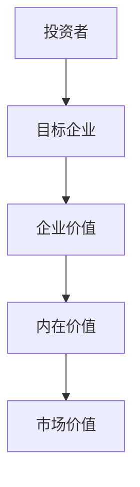
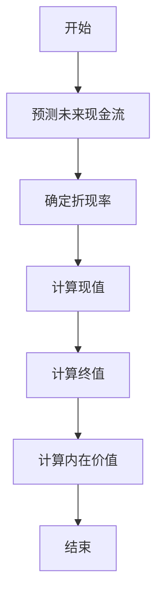

                 


# 玛丽·巴芙特的耐心资本：长期价值投资的力量

## 关键词：价值投资，耐心资本，长期投资，内在价值，DCF模型，玛丽·巴芙特，投资策略

## 摘要：  
本文深入探讨了玛丽·巴芙特的耐心资本理论，从其核心理念、数学模型、系统架构到实际应用，全面解析了长期价值投资的力量。通过详细分析价值投资的背景、理论基础、算法原理以及实际案例，本文为读者提供了从理论到实践的完整指南，帮助投资者更好地理解和应用耐心资本的理念。

---

## 第一部分：耐心资本与价值投资的背景

### 第1章：玛丽·巴芙特与耐心资本概述

#### 1.1 玛丽·巴芙特的生平与投资理念
玛丽·巴芙特是价值投资领域的传奇人物，她的投资理念强调长期持有、注重基本面分析以及安全边际。她的投资哲学以“耐心资本”为核心，主张通过深入研究企业内在价值，寻找具有长期竞争优势的企业进行投资。

- **1.1.1 玛丽·巴芙特的早期经历与职业发展**
  - 玛丽·巴芙特出生于1934年，早年在宾夕法尼亚大学学习，后转入哥伦比亚商学院，师从本杰明·格雷厄姆，成为价值投资的忠实信徒。
  - 她在职业生涯中撰写了大量经典著作，如《聪明的投资者》等，奠定了她在投资领域的地位。

- **1.1.2 耐心资本的定义与核心理念**
  - 耐心资本是指投资者通过长期持有优质资产，依靠企业的内在价值增长实现收益的投资策略。
  - 核心理念包括：寻找具有持续竞争优势的企业、注重企业的内在价值、避免短期市场波动的干扰。

- **1.1.3 价值投资与长期投资的区别**
  - 价值投资注重企业的基本面分析，寻找市场估值低于内在价值的企业。
  - 长期投资更关注投资期限，而耐心资本结合了两者的优点，强调长期持有优质资产。

- **1.1.4 耐心资本的背景与现状**
  - 价值投资在20世纪70年代逐渐兴起，玛丽·巴芙特的理论为这一领域提供了系统的框架。
  - 在现代投资环境中，耐心资本的理念依然具有重要价值，尤其是在应对市场波动和经济周期时。

- **1.1.5 耐心资本的核心要素**
  - **内在价值**：企业未来现金流的现值。
  - **安全边际**：买入价格低于内在价值，以降低风险。
  - **长期持有**：避免频繁交易，降低交易成本。

- **1.1.6 耐心资本的边界与外延**
  - 耐心资本主要适用于具有稳定现金流和持续竞争优势的企业。
  - 与其他投资策略（如成长型投资、趋势投资）相比，耐心资本更注重企业的基本面和长期价值。

---

### 第2章：价值投资的理论基础

#### 2.1 价值投资的核心原理
- **2.1.1 价值投资的哲学基础**
  - 玛丽·巴芙特认为，市场先生的情绪波动为投资者提供了低价买入优质资产的机会。
  - 投资者应关注企业的内在价值，而非市场的短期波动。

- **2.1.2 市场先生与投资者心理**
  - 市场先生代表市场的短期波动，投资者应避免被市场情绪左右。
  - 长期投资者应利用市场恐慌时买入，市场狂热时卖出。

- **2.1.3 股票的内在价值与市场价值**
  - 内在价值是企业未来现金流的现值。
  - 市场价值是投资者对股票的定价，可能高于或低于内在价值。

#### 2.2 耐心资本的数学模型与公式
- **2.2.1 内在价值计算公式**
  内在价值（V）的计算公式为：
  $$ V = \sum_{t=1}^{\infty} \frac{CF_t}{(1 + r)^t} $$
  其中，$CF_t$ 是第 $t$ 年的现金流，$r$ 是折现率。

- **2.2.2 现金流折现模型（DCF）**
  DCF模型通过将未来现金流折现，计算企业的内在价值。以下是DCF模型的步骤：
  1. 预测未来现金流。
  2. 确定合理的折现率。
  3. 计算未来现金流的现值。
  4. 加上终值，得出企业的内在价值。

- **2.2.3 股票估值的公式推导**
  股票的合理价格应等于其内在价值。以下是简化的股票估值公式：
  $$ P = \frac{D}{r - g} $$
  其中，$D$ 是股息，$r$ 是折现率，$g$ 是股息增长率。

#### 2.3 耐心资本的属性特征对比
以下是耐心资本与其他投资策略的对比表格：

| 属性                | 耐心资本               | 短期投资             | 高风险投资         |
|---------------------|-----------------------|----------------------|-------------------|
| 投资期限            | 长期（5年以上）         | 短期（1年以内）       | 中期（1-3年）       |
| 投资目标            | 内在价值增长           | 资产增值             | 高回报             |
| 风险承受能力        | 较低                  | 较高                 | 较高               |
| 投资策略            | 价值投资               | 技术分析             | 杠杆投资           |

#### 2.4 耐心资本的ER实体关系图


#### 2.5 本章小结
本章详细介绍了价值投资的理论基础，包括玛丽·巴芙特的核心理念、内在价值的计算方法以及耐心资本与其他投资策略的对比。

---

## 第3章：耐心资本的算法原理

### 3.1 耐心资本的算法概述
- **3.1.1 价值投资的算法逻辑**
  - 确定目标企业。
  - 计算企业的内在价值。
  - 比较市场价值与内在价值。
  - 决策买入、持有或卖出。

- **3.1.2 耐心资本的决策流程**
  以下是决策流程图：
  ```mermaid
  graph TD
      A[开始] --> B[选择目标企业]
      B --> C[分析企业基本面]
      C --> D[计算内在价值]
      D --> E[比较市场价值与内在价值]
      E --> F[决策买入/持有/卖出]
      F --> G[结束]
  ```

- **3.1.3 耐心资本的数学模型**
  内在价值计算公式：
  $$ V = \frac{CF}{r - g} $$

### 3.2 耐心资本的算法流程图
以下是DCF模型的流程图：


### 3.3 本章小结
本章通过算法流程图和数学公式，详细讲解了耐心资本的决策逻辑和计算方法。

---

## 第4章：系统分析与架构设计方案

### 4.1 问题场景介绍
- 投资者需要一个系统来计算企业的内在价值，辅助决策。

### 4.2 系统功能设计
- **领域模型**：
  ```mermaid
  classDiagram
      class 投资者 {
          帐户余额
          投资组合
      }
      class 目标企业 {
          财务数据
          行业分析
      }
      class 投资决策系统 {
          计算内在价值
          比较市场价值
      }
      投资者 --> 目标企业
      投资者 --> 投资决策系统
      目标企业 --> 投资决策系统
  ```

- **系统架构设计**：
  ```mermaid
  architecture
      Client --> Web层
      Web层 --> 服务层
      服务层 --> 数据库层
  ```

- **系统交互设计**：
  ```mermaid
  sequenceDiagram
      投资者 ->> Web层: 请求企业数据
      Web层 ->> 服务层: 获取企业财务数据
      服务层 ->> 数据库层: 查询市场数据
      服务层 ->> 投资决策系统: 计算内在价值
      Web层 ->> 投资者: 返回结果
  ```

### 4.3 本章小结
本章通过系统架构设计，展示了如何利用技术手段辅助耐心资本的投资决策。

---

## 第5章：项目实战

### 5.1 环境安装
- 需要安装Python、Pandas、NumPy等库。

### 5.2 核心代码实现
以下是DCF模型的Python代码：
```python
import numpy as np

def calculate_intrinsic_value(cash_flows, discount_rate, terminal_value):
    present_value = 0
    for i in range(len(cash_flows)):
        cf = cash_flows[i]
        pv = cf / (1 + discount_rate) ** i
        present_value += pv
    total_value = present_value + terminal_value / (1 + discount_rate) ** len(cash_flows)
    return total_value

# 示例数据
cash_flows = [100, 150, 200, 250]
discount_rate = 0.1
terminal_value = 500

intrinsic_value = calculate_intrinsic_value(cash_flows, discount_rate, terminal_value)
print(f"内在价值为：{intrinsic_value}")
```

### 5.3 代码应用解读
- 代码实现了DCF模型，计算企业的内在价值。
- 输入参数包括现金流、折现率和终值。

### 5.4 实际案例分析
以某公司为例，假设未来现金流为$100, $150, $200，折现率为10%，终值为$500。计算内在价值：
$$ V = \frac{100}{1.1} + \frac{150}{1.1^2} + \frac{200}{1.1^3} + \frac{500}{1.1^3} $$
结果为：
$$ V = 90.91 + 113.64 + 137.17 + 375.91 = 717.63 $$

### 5.5 本章小结
本章通过实际案例，展示了如何利用DCF模型计算内在价值，辅助投资决策。

---

## 第6章：总结与展望

### 6.1 本章总结
- 耐心资本是一种长期价值投资策略，强调内在价值和长期持有。
- 通过数学模型和系统架构，投资者可以更好地进行决策。

### 6.2 小结
- 耐心资本的核心在于寻找具有长期竞争优势的企业。
- 投资者应注重基本面分析，避免短期波动的干扰。

### 6.3 注意事项
- 耐心资本需要长期持有，不适合短期投资者。
- 计算内在价值时，折现率的选择至关重要。

### 6.4 拓展阅读
- 《聪明的投资者》——玛丽·巴芙特
- 《价值投资入门》——彼得·林奇

---

## 附录：术语解释

- **DCF模型**：现金流折现模型，用于计算企业的内在价值。
- **内在价值**：企业未来现金流的现值。
- **安全边际**：买入价格低于内在价值的部分，用于降低风险。

---

通过本文的详细分析，读者可以全面理解玛丽·巴芙特的耐心资本理论，并在实际投资中加以应用。

