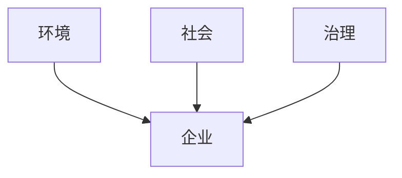
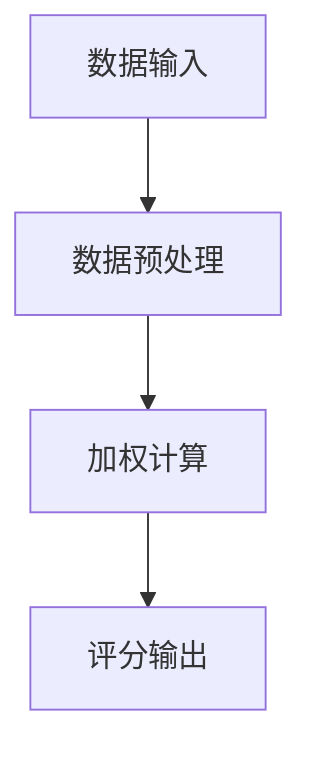
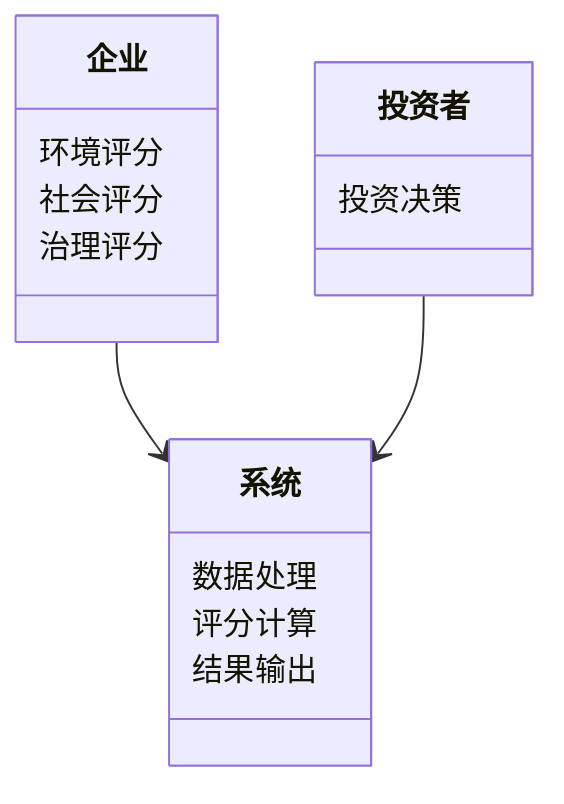
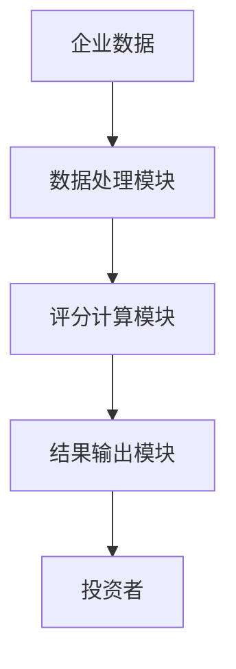
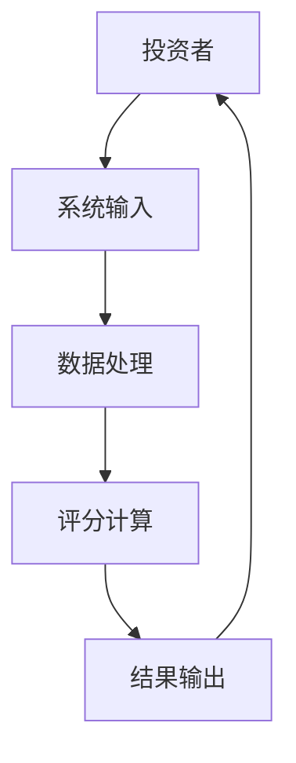

                 

# 《玛丽·巴芙的ESG投资整合策略》

## 关键词：ESG投资，环境因素，社会因素，治理因素，投资策略，可持续发展

## 摘要：本文详细探讨了玛丽·巴芙的ESG投资整合策略，涵盖ESG投资的基本概念、核心概念、评分算法、系统架构设计、项目实战和最佳实践。通过结合环境、社会和治理三个维度，本文展示了如何将ESG因素整合到投资策略中，以实现长期价值和可持续发展。

---

## 目录大纲：

### 第一部分：ESG投资整合的背景与意义

#### 第1章：ESG投资整合的背景与意义

##### 1.1 ESG投资的基本概念

###### 1.1.1 环境（Environmental）的定义与内涵

环境因素关注企业在运营过程中对环境的影响，包括碳排放、能源消耗、废物处理等方面。玛丽·巴芙的策略强调通过减少环境 footprint 来提升企业的可持续性。

###### 1.1.2 社会（Social）的定义与内涵

社会因素关注企业在社会中的责任和影响，包括员工权益、社区参与、劳动条件等方面。玛丽·巴芙的策略鼓励企业积极参与社会公益，提升社会形象。

###### 1.1.3 治理（Governance）的定义与内涵

治理因素关注企业的管理结构和治理实践，包括董事会构成、管理层激励、内部控制等方面。玛丽·巴芙的策略强调透明和高效的治理结构。

##### 1.2 ESG投资的重要性

###### 1.2.1 环境因素对企业的影响

环境因素直接影响企业的运营成本和风险。例如，高碳排放可能导致罚款和声誉损失，而减少环境 footprint 可以降低风险并提升竞争力。

###### 1.2.2 社会责任对企业形象的影响

履行社会责任可以提升企业的品牌形象和社会声誉，吸引更多关注可持续发展的投资者和客户。

###### 1.2.3 治理结构对企业发展的影响

高效的治理结构可以提升企业的决策效率和风险控制能力，从而促进企业的长期发展。

##### 1.3 ESG投资整合的意义

###### 1.3.1 提升企业长期价值

通过整合ESG因素，企业可以在长期视角下实现可持续发展，提升股东价值。

###### 1.3.2 促进可持续发展

ESG投资整合有助于推动社会和环境的可持续发展，应对全球性挑战如气候变化和不平等等。

###### 1.3.3 满足投资者需求

越来越多的投资者关注ESG因素，ESG投资整合可以满足他们的需求，吸引更多资本流入。

##### 1.4 本章小结

本章介绍了ESG投资的基本概念及其重要性，并阐述了整合ESG因素对企业和投资者的意义，为后续章节奠定了基础。

### 第二部分：ESG投资整合的核心概念与联系

#### 第2章：ESG核心概念与联系

##### 2.1 ESG核心概念的分解

###### 2.1.1 环境因素的关键指标

环境因素的关键指标包括碳排放量、能源消耗、水资源使用效率等。玛丽·巴芙的策略建议企业设定具体的环境目标，并定期公开进展。

###### 2.1.2 社会因素的关键指标

社会因素的关键指标包括员工满意度、员工培训投入、社区参与度等。玛丽·巴芙强调通过提升员工福祉和社会参与来增强企业社会责任。

###### 2.1.3 治理因素的关键指标

治理因素的关键指标包括董事会多样性、管理层激励机制、内部控制有效性等。玛丽·巴芙的策略建议企业建立透明的治理结构，确保利益相关者的权益。

##### 2.2 ESG概念的属性特征对比

###### 2.2.1 环境与社会的对比分析

环境因素侧重于企业对自然资源的使用和影响，而社会因素侧重于企业与社会的关系和影响。两者相辅相成，共同促进可持续发展。

###### 2.2.2 社会与治理的对比分析

社会因素关注外部影响，而治理因素关注内部管理。两者共同提升企业的社会形象和管理效率。

###### 2.2.3 环境与治理的对比分析

环境因素关注外部环境影响，治理因素关注内部管理结构。两者相辅相成，共同推动企业的可持续发展。

##### 2.3 ESG实体关系图

##### 2.4 本章小结

本章详细分解了ESG的三个核心概念，并通过对比分析和实体关系图展示了它们之间的联系，帮助读者更好地理解ESG的整体框架。

### 第三部分：ESG投资整合的算法原理

#### 第3章：ESG评分模型的构建

##### 3.1 数据收集与处理

###### 3.1.1 数据来源

数据来源包括企业公开报告、政府数据库、非政府组织报告等。玛丽·巴芙建议优先使用权威第三方数据源，确保数据的准确性和可靠性。

###### 3.1.2 数据清洗

数据清洗包括去除重复数据、处理缺失值、纠正错误数据等。玛丽·巴芙强调数据清洗的重要性，确保后续分析的准确性。

###### 3.1.3 数据预处理

数据预处理包括标准化、归一化、特征提取等。玛丽·巴芙的策略建议根据具体指标选择合适的预处理方法。

##### 3.2 ESG评分算法

###### 3.2.1 加权评分法

加权评分法是玛丽·巴芙常用的一种评分方法，通过给环境、社会和治理三个维度赋予不同的权重，计算综合评分。例如：

$$ \text{总评分} = 0.4 \times \text{环境评分} + 0.3 \times \text{社会评分} + 0.3 \times \text{治理评分} $$

##### 3.3 本章小结

本章详细介绍了ESG评分模型的构建过程，包括数据处理和算法选择，为后续章节的系统设计和项目实战奠定了基础。

### 第四部分：系统分析与架构设计

#### 第4章：ESG投资整合系统的架构设计

##### 4.1 问题场景介绍

玛丽·巴芙的策略应用于投资管理系统的场景，通过整合ESG因素，帮助投资者做出更明智的投资决策。

##### 4.2 系统功能设计

###### 4.2.1 领域模型设计

###### 4.2.2 系统架构设计

##### 4.3 系统接口设计

系统接口包括数据输入接口、评分计算接口和结果输出接口，确保系统与外部数据源和投资者的顺利交互。

##### 4.4 系统交互设计

##### 4.5 本章小结

本章通过系统架构设计展示了如何将玛丽·巴芙的ESG策略整合到投资管理系统中，为实际应用提供了指导。

### 第五部分：项目实战

#### 第5章：ESG投资整合的实战案例

##### 5.1 环境影响评估

通过具体案例展示如何评估企业的环境影响，例如计算碳排放量并提出减排建议。

##### 5.2 社会价值分析

分析企业的社会责任履行情况，例如评估员工满意度和社区参与度。

##### 5.3 治理评分案例

展示如何评估企业的治理结构，例如分析董事会构成和管理层激励机制。

##### 5.4 项目小结

总结实战案例的经验，强调数据收集和模型选择的重要性。

### 第六部分：最佳实践与小结

#### 第6章：最佳实践与小结

##### 6.1 最佳实践

玛丽·巴芙的策略建议投资者在选择ESG投资时，优先考虑数据质量、模型准确性和投资目标的匹配度。

##### 6.2 小结

本章总结了全书的内容，强调ESG投资整合的重要性和实际应用价值。

##### 6.3 注意事项

投资者在应用ESG策略时，需注意数据来源的可靠性、模型的适用性和投资目标的明确性。

##### 6.4 拓展阅读

推荐相关书籍和资源，供读者深入学习和研究。

### 结语

玛丽·巴芙的ESG投资整合策略为投资者提供了新的视角和工具，帮助他们在追求财务回报的同时，实现社会和环境的可持续发展。通过本文的详细讲解，读者可以全面理解并应用这一策略，为未来的投资决策提供有力支持。

