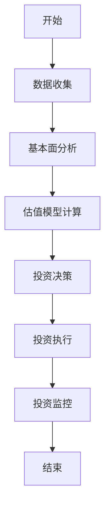

                 


# 玛丽·巴芙的全球价值投资策略

## 关键词：
- 价值投资
- 玛丽·巴芙
- 基本面分析
- 内在价值
- 投资组合优化

## 摘要：
本文深入探讨了玛丽·巴芙的价值投资策略，结合技术分析与投资实践，系统性地讲解了价值投资的核心理念、分析方法和实战技巧。通过结合经典案例和系统设计，帮助读者理解如何在全球化市场中运用价值投资策略进行高效的投资决策。

---

# 引言

价值投资是一种长期有效的投资策略，其核心理念是寻找被市场低估的企业，通过长期持有实现财富增值。玛丽·巴芙作为价值投资的代表人物，她的投资理念和技术分析方法为全球投资者提供了宝贵的参考。本文将从价值投资的核心概念、分析方法、系统设计、实战案例等多维度进行深入探讨，为读者提供一套完整的全球价值投资策略。

---

## 第1章: 价值投资的核心概念

### 1.1 价值投资的定义与背景
#### 1.1.1 价值投资的定义
价值投资是一种以企业内在价值为核心的投资策略，强调以低于内在价值的价格买入优质企业，长期持有，等待市场回归理性。玛丽·巴芙的价值投资理念强调对企业基本面的深入分析，寻找具有持续竞争优势的企业。

#### 1.1.2 玛丽·巴芙的价值投资背景
玛丽·巴芙的投资理念起源于20世纪初的美国，当时市场经历了多次剧烈波动，投资者开始意识到短期波动难以预测，而企业内在价值才是投资的核心。

#### 1.1.3 价值投资的核心原则
1. **安全边际**：买入价格低于内在价值。
2. **长期持有**：避免短期波动干扰，关注企业长期价值。
3. **竞争优势**：选择具有强大护城河的企业。

### 1.2 价值投资的哲学与方法
#### 1.2.1 投资的本质与目标
投资的本质是通过分析企业的内在价值，寻找价格与价值的偏差，实现财富的长期增值。

#### 1.2.2 价值投资与市场的矛盾统一
价值投资强调逆市场思维，即在市场恐慌时寻找低估机会，在市场狂热时保持冷静。

#### 1.2.3 巴菲特定律的现代应用
玛丽·巴芙的投资理念在现代金融市场中依然适用，尤其是在全球化和数字化时代，企业竞争优势和技术进步成为价值评估的关键因素。

---

## 第2章: 价值投资的核心分析方法

### 2.1 基本面分析
#### 2.1.1 企业财务报表分析
企业财务报表是价值投资的核心分析工具，包括资产负债表、利润表和现金流量表。

##### 资产负债表分析
- **资产质量**：关注流动资产、非流动资产的构成。
- **负债结构**：分析短期负债和长期负债的比例。
- **股东权益**：评估企业的资本结构。

##### 利润表分析
- **收入与成本**：关注主营业务收入的增长和成本控制能力。
- **净利润**：分析企业的盈利能力。

##### 现金流量表分析
- **经营活动现金流**：评估企业造血能力。
- **投资活动现金流**：分析企业资本支出情况。
- **筹资活动现金流**：评估企业的融资能力。

#### 2.1.2 企业估值模型
企业内在价值的计算是价值投资的核心，常用的估值模型包括：

##### 市盈率（P/E）模型
$$ P/E = \frac{市场价}{每股收益} $$

##### 市净率（P/B）模型
$$ P/B = \frac{市场价}{每股净资产} $$

##### 现金流折现模型（DCF）
$$ V = \sum_{t=1}^{n} \frac{CF_t}{(1+r)^t} + \frac{TV}{(1+r)^n} $$

其中，$CF_t$ 是第t年的自由现金流，$r$ 是折现率，$TV$ 是终值。

#### 2.1.3 行业分析与竞争地位
行业分析是评估企业竞争优势的重要步骤，包括行业生命周期、市场结构、竞争格局等。

### 2.2 投资组合构建
#### 2.2.1 资产配置策略
- **分散投资**：避免过度集中于单一行业或企业。
- **风险匹配**：根据风险承受能力调整资产配置比例。

#### 2.2.2 风险控制与分散投资
- **止损策略**：设定止损点以控制投资风险。
- **动态调整**：定期评估投资组合，根据市场变化进行优化。

#### 2.2.3 长期投资与复利效应
价值投资的核心是长期持有优质资产，通过复利效应实现财富增长。

---

## 第3章: 价值投资的系统化分析

### 3.1 系统分析框架
#### 3.1.1 投资流程图



#### 3.1.2 数据收集与处理
- 数据来源：包括财务报表、行业报告、市场数据等。
- 数据清洗：处理缺失值、异常值等。

#### 3.1.3 估值模型的实现
- 使用Python实现DCF模型的代码：

```python
import pandas as pd
import numpy as np

def calculate_intrinsic_value(fcf, discount_rate, tv):
    """
    计算企业内在价值的DCF模型
    """
    # 计算现值
    pv = 0
    for t in range(len(fcf)):
        pv += fcf[t] / (1 + discount_rate) ** t
    # 计算终值现值
    tv_pv = tv / (1 + discount_rate) ** len(fcf)
    total_value = pv + tv_pv
    return total_value

# 示例数据
fcf = [100, 120, 150, 200]  # 自由现金流
discount_rate = 0.1  # 折现率
tv = 1000  # 终值

iv = calculate_intrinsic_value(fcf, discount_rate, tv)
print(f"企业内在价值：{iv:.2f}")
```

### 3.2 投资决策的逻辑
#### 3.2.1 企业内在价值的计算
通过DCF模型计算企业内在价值，并与市场价格进行对比，确定是否具备投资价值。

#### 3.2.2 市场情绪与价格波动
分析市场情绪对投资决策的影响，避免过度受短期波动干扰。

#### 3.2.3 投资决策的路径
从数据收集、基本面分析、估值计算到最终的投资决策，形成完整的投资闭环。

---

## 第4章: 价值投资的实战案例

### 4.1 案例分析: 苹果公司的投资分析
#### 4.1.1 苹果公司的基本面分析
- **行业地位**：全球科技行业的领导者。
- **财务表现**：持续增长的收入和利润。
- **竞争优势**：强大的品牌和技术壁垒。

#### 4.1.2 苹果公司的估值模型
使用DCF模型计算苹果公司的内在价值：

```python
import pandas as pd
import numpy as np

def calculate_intrinsic_value(fcf, discount_rate, tv):
    pv = 0
    for t in range(len(fcf)):
        pv += fcf[t] / (1 + discount_rate) ** t
    tv_pv = tv / (1 + discount_rate) ** len(fcf)
    total_value = pv + tv_pv
    return total_value

# 苹果公司的自由现金流（假设）
fcf = [10000, 12000, 14000, 16000]
discount_rate = 0.1
tv = 100000

iv = calculate_intrinsic_value(fcf, discount_rate, tv)
print(f"苹果公司的内在价值：{iv:.2f}")
```

---

## 第5章: 风险管理与策略优化

### 5.1 风险管理策略
- **止损机制**：设定止损点以控制单次投资损失。
- **动态再平衡**：根据市场变化定期调整投资组合。

### 5.2 策略优化
- **行业分散**：避免过度集中于单一行业。
- **估值动态调整**：根据市场变化定期更新企业估值。

---

## 第6章: 总结与展望

### 6.1 总结
玛丽·巴芙的价值投资策略强调对企业内在价值的深入分析和长期持有，通过系统化的方法和风险管理策略，实现投资收益的最大化。

### 6.2 展望
随着全球市场的进一步整合和技术的进步，价值投资的理念和技术将不断优化，投资者需要结合市场变化和技术发展，灵活调整投资策略。

---

## 附录

### 附录1: 价值投资术语表
- 内在价值（Intrinsic Value）
- 自由现金流（Free Cash Flow）
- 折现率（Discount Rate）
- 安全边际（Margin of Safety）

### 附录2: 数据来源与工具推荐
- 数据来源：Yahoo Finance, Bloomberg, FactSet
- 工具推荐：Excel、Python、Matplotlib

### 附录3: 推荐阅读
- 《巴菲特致股东的信》
- 《投资最重要的事情》
- 《股票作手回忆录》

---

通过本文的系统性分析，读者可以全面理解玛丽·巴芙的价值投资策略，并能够在实际投资中灵活运用这些方法。

