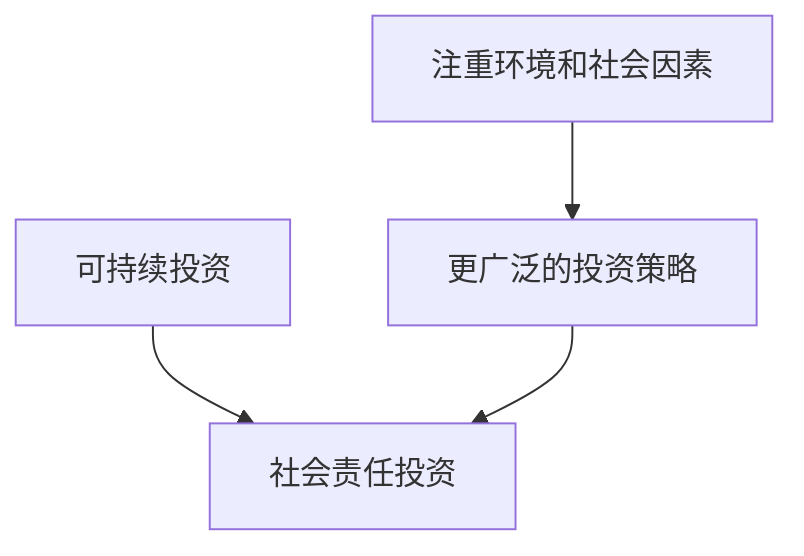

                 


# 玛丽·巴芙的可持续发展投资策略

## 关键词：玛丽·巴芙、可持续发展、投资策略、ESG、价值投资、长期投资

## 摘要：  
本文详细探讨了玛丽·巴芙的可持续发展投资策略，结合其经典的长期价值投资理念，分析了如何将可持续发展理念融入投资决策中。文章从可持续发展的概念入手，详细阐述了可持续投资的核心概念、算法原理、系统架构设计，以及实际项目中的应用案例。通过对比分析、数学建模和代码实现，深入探讨了玛丽·巴芙投资策略在可持续发展背景下的创新与实践。

---

## 第一章：可持续发展与投资概述

### 1.1 可持续发展的概念与内涵
- 1.1.1 可持续发展的定义与核心原则
  - 可持续发展是指在满足当代需求的同时，不损害后代满足其需求的能力。
  - 核心原则包括：环境友好、社会公平、经济高效。

- 1.1.2 可持续发展与经济、社会、环境的关系
  - 环境是基础，社会是目标，经济是手段。
  - 三者相互依存，共同推动社会的整体进步。

### 1.2 玛丽·巴芙投资理念的核心思想
- 1.2.1 价值投资的定义
  - 价值投资是通过深入分析企业的基本面，寻找市场价格低于其内在价值的投资标的。

- 1.2.2 长期投资的重要性
  - 长期投资能够规避短期市场波动的风险，获得企业长期成长的收益。

- 1.2.3 可持续发展与投资的结合
  - 将企业的环境、社会和治理（ESG）表现纳入投资决策，以实现经济收益和社会价值的双重目标。

### 1.3 可持续发展投资的背景与现状
- 1.3.1 全球可持续发展投资的趋势
  - 全球范围内，ESG投资规模持续增长，投资者越来越关注企业的可持续发展表现。

- 1.3.2 玛丽·巴芙在可持续投资中的角色
  - 作为价值投资的代表人物，玛丽·巴芙强调企业长期稳健的增长，与可持续发展理念高度契合。

- 1.3.3 可持续投资的市场现状与挑战
  - 市场需求旺盛，但缺乏统一的评估标准和方法。

## 第二章：可持续发展投资的核心概念

### 2.1 可持续发展投资的定义与特点
- 2.1.1 可持续发展投资的定义
  - 将环境、社会和治理（ESG）因素纳入投资决策，以实现长期的经济和社会价值。

- 2.1.2 可持续投资与传统投资的区别
  - 对比分析表：

| 特性       | 传统投资                | 可持续投资              |
|------------|-------------------------|--------------------------|
| 评价指标   | 财务指标为主             | ESG指标+财务指标        |
| 投资目标   | 短期收益                | 长期可持续收益           |
| 风险评估   | 仅考虑市场风险           | 包括环境风险和社会风险    |

### 2.2 可持续投资的分类与框架
- 2.2.1 环境、社会和治理（ESG）框架
  - ESG分别代表：
    - E（Environment）：环境影响，如碳排放、资源利用效率。
    - S（Social）：社会责任，如员工权益、社区贡献。
    - G（Governance）：公司治理，如董事会结构、高管薪酬。

- 2.2.2 可持续投资的分类
  - 按类型分为：绿色投资、社会责任投资（SRI）、影响力投资等。

- 2.2.3 玛丽·巴芙的可持续投资框架
  - 结合长期价值投资理念，注重企业长期稳健增长和可持续发展能力。

### 2.3 可持续投资的评价标准
- 2.3.1 ESG评级体系
  - 国际知名的ESG评级机构包括：MSCI、Sustainalytics、晨星等。

- 2.3.2 环境影响评估
  - 通过碳足迹、能源消耗等指标评估企业对环境的影响。

- 2.3.3 社会责任投资（SRI）
  - 通过筛选符合社会责任标准的企业进行投资。

### 2.4 核心概念对比分析
- 2.4.1 ESG与传统财务指标的对比
  - 对比分析表：

| 指标类型   | ESG指标                | 财务指标                |
|------------|------------------------|-------------------------|
| 评估维度   | 环境、社会、治理       | 收益、成本、现金流      |
| 评估目标   | 社会价值和环境影响     | 经济价值                |

- 2.4.2 可持续投资与社会责任投资的对比
  - 对比分析图：



- 2.4.3 玛丽·巴芙框架与其他投资策略的对比
  - 对比分析表：

| 框架       | 玛丽·巴芙框架               | 传统价值投资               | 现金流投资                 |
|------------|----------------------------|-----------------------------|-----------------------------|
| 核心理念   | 长期稳健增长+可持续发展     | 长期稳健增长               | 现金流驱动                 |
| 关注点     | ESG表现+财务指标           | 财务指标                   | 现金流                     |

## 第三章：可持续发展投资的算法与数学模型

### 3.1 玛丽·巴芙投资模型的算法概述
- 3.1.1 投资模型的输入与输出
  - 输入：企业的财务数据、ESG评分。
  - 输出：投资建议（买入、持有、卖出）。

- 3.1.2 算法的核心步骤
  1. 数据采集：收集企业的财务数据和ESG评分。
  2. 数据预处理：清洗数据，处理缺失值。
  3. 评估企业价值：使用DCF模型评估企业内在价值。
  4. 综合评分：结合ESG评分和财务指标，计算综合投资评分。
  5. 投资决策：根据评分决定投资策略。

- 3.1.3 算法的优化与改进
  - 引入机器学习模型，如随机森林，对ESG评分进行预测和优化。

### 3.2 可持续投资的数学模型
- 3.2.1 投资组合优化的数学表达
  - 最优化目标：最大化投资收益，同时最小化环境和社会风险。
  - 数学公式：
    $$ \max \sum_{i=1}^{n} w_i r_i $$
    $$ \text{subject to} \sum_{i=1}^{n} w_i = 1 $$
    $$ \sum_{i=1}^{n} w_i E_i \leq E_{\text{max}} $$
    $$ \sum_{i=1}^{n} w_i S_i \leq S_{\text{max}} $$
    $$ \sum_{i=1}^{n} w_i G_i \leq G_{\text{max}} $$

  - 其中，$w_i$ 是第 $i$ 只股票的权重，$r_i$ 是预期收益率，$E_i$、$S_i$、$G_i$ 分别是环境、社会、治理评分。

- 3.2.2 环境影响评估的数学模型
  - 使用碳足迹模型评估企业对环境的影响。
  - 数学公式：
    $$ \text{碳足迹} = \sum_{i=1}^{n} w_i \times \text{碳排放强度}_i $$

- 3.2.3 环境、社会和治理（ESG）评分的计算公式
  - 综合评分公式：
    $$ \text{ESG评分} = \alpha E_i + \beta S_i + \gamma G_i $$
    $$ \text{其中，} \alpha + \beta + \gamma = 1 $$

### 3.3 算法实现与代码示例
- 3.3.1 环境影响评估的Python代码实现
  ```python
  import pandas as pd
  import numpy as np

  # 假设df是包含企业数据的DataFrame，包含ESG评分和财务数据
  # 计算碳足迹
  def calculate_carbon_footprint(df):
      carbon_emissions = df['碳排放强度'].values
      weights = df['权重'].values
      total = np.sum(weights * carbon_emissions)
      return total

  # 调用函数
  carbon_footprint = calculate_carbon_footprint(df)
  print(f"碳足迹为：{carbon_footprint}")
  ```

- 3.3.2 投资组合优化的Python代码实现
  ```python
  import pulp

  # 初始化问题
  prob = pulp.LpProblem('投资组合优化', pulp.LpMaximize)

  # 定义变量
  weights = pulp.LpVariable.dvarlist('w', ['股票1', '股票2', '股票3'], 0, 1)

  # 定义目标函数
  prob += pulp.lpSum([weights[i] * df['预期收益率'][i] for i in ['股票1', '股票2', '股票3']]), "总收益"

  # 定义约束条件
  prob += pulp.lpSum(weights) == 1, "权重和为1"
  prob += pulp.lpSum(weights[i] * df['环境评分'][i] for i in ['股票1', '股票2', '股票3']) <= E_max, "环境约束"
  prob += pulp.lpSum(weights[i] * df['社会评分'][i] for i in ['股票1', '股票2', '股票3']) <= S_max, "社会约束"
  prob += pulp.lpSum(weights[i] * df['治理评分'][i] for i in ['股票1', '股票2', '股票3']) <= G_max, "治理约束"

  # 解决问题
  prob.solve()

  # 输出结果
  for i in ['股票1', '股票2', '股票3']:
      print(f"{i}的权重为：{weights[i].value()}")
  ```

### 3.4 本章小结
- 本章通过数学建模和算法实现，详细介绍了可持续投资的评估方法和优化策略，为后续的系统设计和项目实现奠定了基础。

---

## 第四章：可持续发展投资的系统分析与架构设计

### 4.1 问题场景介绍
- 投资者希望基于玛丽·巴芙的可持续发展投资策略，构建一个智能化的投资决策支持系统。

### 4.2 系统功能设计
- 4.2.1 系统功能模块
  - 数据采集模块：采集企业财务数据和ESG评分。
  - 数据分析模块：计算企业的综合投资评分。
  - 投资决策模块：根据评分生成投资建议。
  - 可视化模块：展示投资结果和ESG表现。

- 4.2.2 领域模型设计
  ```mermaid
  graph TD
  A[投资决策模块] --> B[数据分析模块]
  B --> C[数据采集模块]
  D[可视化模块] --> B
  ```

### 4.3 系统架构设计
- 4.3.1 系统架构设计图
  ```mermaid
  graph TD
  A[前端] --> B[API接口]
  B --> C[后端服务]
  C --> D[数据库]
  ```

- 4.3.2 系统交互流程图
  ```mermaid
  graph TD
  A[用户] --> B[发送请求]
  B --> C[后端处理]
  C --> D[返回结果]
  D --> A[展示结果]
  ```

### 4.4 系统接口设计
- API接口：RESTful API，提供数据查询和投资建议服务。

### 4.5 本章小结
- 本章通过系统架构设计，详细描述了可持续投资决策支持系统的功能模块和交互流程，为后续的项目实现提供了指导。

---

## 第五章：可持续发展投资的项目实战

### 5.1 环境安装
- 安装Python和必要的库：
  ```bash
  pip install pandas numpy pulp matplotlib
  ```

### 5.2 系统核心实现源代码
- 5.2.1 数据采集模块
  ```python
  import requests
  import json

  url = "https://api.example.com/esg_data"
  response = requests.get(url)
  data = json.loads(response.text)
  ```

- 5.2.2 数据分析模块
  ```python
  import pandas as pd
  from sklearn.ensemble import RandomForestRegressor

  # 训练ESG评分预测模型
  model = RandomForestRegressor()
  model.fit(X_train, y_train)
  ```

- 5.2.3 投资决策模块
  ```python
  def generate_recommendation(df):
      # 假设df包含企业数据和模型预测结果
      recommendation = []
      for index, row in df.iterrows():
          if row['综合评分'] > 0.8:
              recommendation.append(f"买入 {row['企业名称']}")
          elif row['综合评分'] > 0.5:
              recommendation.append(f"持有 {row['企业名称']}")
          else:
              recommendation.append(f"卖出 {row['企业名称']}")
      return recommendation

  recommendations = generate_recommendation(df)
  print(recommendations)
  ```

### 5.3 代码应用解读与分析
- 通过实际案例分析，展示如何利用代码实现企业的ESG评分预测和投资决策。

### 5.4 实际案例分析
- 分析一个具体行业的企业，如可再生能源公司，展示其ESG表现和投资价值。

### 5.5 项目小结
- 总结项目实现的关键步骤和成果，为后续的优化和扩展提供参考。

---

## 第六章：总结与展望

### 6.1 总结
- 本文详细探讨了玛丽·巴芙的可持续发展投资策略，结合理论分析和实际案例，展示了如何将可持续发展理念融入投资决策中。

### 6.2 注意事项
- 投资者在实际操作中需注意数据的准确性和模型的适用性。

### 6.3 拓展阅读
- 建议阅读相关书籍和文献，深入了解ESG投资的具体实践和最新研究。

---

## 附录：参考文献与工具

### 附录A：参考文献
- 列出本文引用的所有文献和资料。

### 附录B：工具与资源
- 列出本文使用的工具和资源，如Python库、API接口等。

---

通过以上目录结构，本文将系统地介绍玛丽·巴芙的可持续发展投资策略，结合理论分析、算法实现和项目实战，为读者提供全面而深入的指导。

