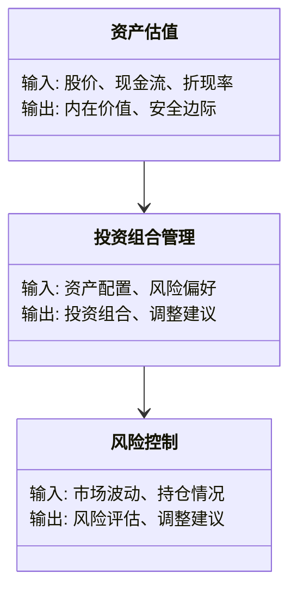
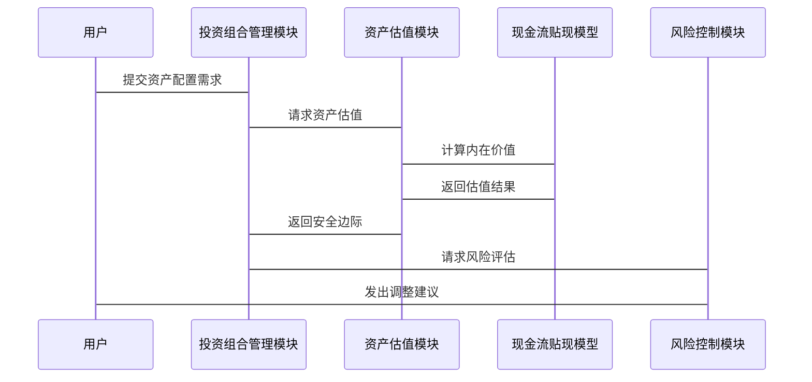

                 


```markdown
# 玛丽·巴芙的女性视角价值投资

> 关键词：价值投资，玛丽·巴芙，女性视角，投资策略，现金流贴现模型，安全边际，内在价值

> 摘要：本文从女性视角出发，深入分析玛丽·巴芙的价值投资策略。通过介绍价值投资的核心概念、算法原理、系统架构以及实战案例，结合女性投资者的独特优势，提出了一种适合女性的长期价值投资方法。文章详细讲解了现金流贴现模型、内在价值计算、投资组合管理等关键内容，并通过具体案例展示了如何在实际投资中应用这些方法。

---

## 第一部分：价值投资与女性视角的结合

### 第1章：价值投资的基本概念

#### 1.1 价值投资的起源与核心理念

##### 1.1.1 价值投资的定义与核心要素
- **定义**：价值投资是一种以低于内在价值的价格购买优质资产的投资策略。
- **核心要素**：
  - 内在价值：资产的真正价值，不随市场波动而变化。
  - 安全边际：买入价格与内在价值之间的差距，提供安全空间。
  - 长期视角：关注企业的长期盈利能力，而非短期市场波动。

##### 1.1.2 玛丽·巴芙的价值投资方法
- 玛丽·巴芙的投资哲学强调长期持有优质资产，注重企业的基本面分析。
- 她认为，投资的本质是寻找具有持续竞争优势的企业，并以合理的价格买入。

##### 1.1.3 女性视角在投资中的特殊性
- 女性投资者通常更注重风险控制和长期规划。
- 女性视角强调企业的社会责任和可持续发展，关注ESG（环境、社会、治理）因素。

#### 1.2 投资的基本原理

##### 1.2.1 投资的三要素：时间、风险与收益
- **时间**：复利效应是价值投资的核心，时间越长，收益越显著。
- **风险**：投资中的不确定性，需要通过分散投资和安全边际来降低。
- **收益**：通过买入低于内在价值的资产，获得资本增值和股息收益。

##### 1.2.2 资产配置与投资组合管理
- 资产配置：将资金分配到不同资产类别（股票、债券、现金等）以分散风险。
- 投资组合管理：定期调整持仓，确保投资组合与投资目标一致。

##### 1.2.3 价值投资与成长投资的区别
- **价值投资**：寻找被市场低估的资产，注重安全边际。
- **成长投资**：投资于高成长性但当前估值可能较高的企业。

#### 1.3 玛丽·巴芙的投资哲学

##### 1.3.1 长期投资的重要性
- 玛丽·巴芙强调长期持有优质资产，避免频繁交易。
- 她认为市场短期波动不可预测，但长期趋势可把握。

##### 1.3.2 安全边际的概念与应用
- 安全边际 = 内在价值 - 市场价格。
- 买入时保持安全边际，以应对市场波动和不确定性。

##### 1.3.3 理解企业的内在价值
- 内在价值是企业未来现金流的现值。
- 玛丽·巴芙通过现金流贴现模型（DCF）计算内在价值。

#### 1.4 本章小结

##### 1.4.1 价值投资的核心要素
- 内在价值、安全边际、长期视角。

##### 1.4.2 玛丽·巴芙投资方法的特殊性
- 强调长期投资、安全边际和企业基本面分析。

##### 1.4.3 女性视角在投资中的独特价值
- 注重风险控制、长期规划和社会责任。

---

### 第2章：价值投资的核心概念与理论框架

#### 2.1 现金流贴现模型

##### 2.1.1 现金流贴现模型的定义与公式
- **定义**：DCF模型通过将未来现金流折现，计算资产的内在价值。
- **公式**：
  $$DCF = \sum_{t=1}^{n} \frac{CF_t}{(1+r)^t} + \frac{TV}{(1+r)^n}$$
  其中：
  - $CF_t$：第t年的现金流。
  - $r$：折现率。
  - $TV$：终值。

##### 2.1.2 现金流贴现模型的应用步骤
1. 预测未来现金流。
2. 确定合理的折现率。
3. 计算终值。
4. 将未来现金流和终值折现，求和得到内在价值。

##### 2.1.3 玛丽·巴芙对DCF模型的改进
- 玛丽·巴芙在DCF模型中引入了更多的基本面分析，注重企业的竞争优势和管理层质量。

#### 2.2 内在价值与市场价值

##### 2.2.1 内在价值的计算方法
- 内在价值是未来现金流的现值，反映了企业的真正价值。

##### 2.2.2 市场价值与内在价值的差异
- 市场价值受市场情绪影响，可能高于或低于内在价值。

##### 2.2.3 安全边际的计算与应用
- 安全边际 = 内在价值 - 市场价值。
- 买入价格应低于内在价值，以确保安全边际。

#### 2.3 股票估值的关键指标

##### 2.3.1 市盈率（P/E）的计算与应用
- **公式**：P/E = 市场价 / 每股收益。
- **应用**：衡量股票的估值水平，但需结合行业和企业特点。

##### 2.3.2 市净率（P/B）的计算与应用
- **公式**：P/B = 市场价 / 每股净资产。
- **应用**：适用于净资产驱动的行业，如银行和制造业。

##### 2.3.3 股息率的计算与应用
- **公式**：股息率 = 每股股息 / 市场价。
- **应用**：衡量股票的分红收益，但需考虑企业的盈利能力和股息支付能力。

#### 2.4 本章小结

##### 2.4.1 现金流贴现模型的核心作用
- 计算内在价值，评估资产的合理价格。

##### 2.4.2 内在价值与市场价值的关系
- 内在价值是目标，市场价值是结果。

##### 2.4.3 估值指标的综合运用
- 结合市盈率、市净率和股息率等指标，全面评估股票价值。

---

### 第3章：女性视角下的投资策略

#### 3.1 女性投资者的特殊性

##### 3.1.1 女性投资者的决策特点
- 更注重风险控制和长期规划。
- 更关注企业的社会责任和可持续发展。

##### 3.1.2 女性投资者的风险偏好
- 偏好低风险、高稳定的资产。
- 更注重资产的流动性。

##### 3.1.3 女性投资者的时间与资源分配
- 通常更关注家庭和职业平衡，时间有限，需要高效的决策过程。

#### 3.2 玛丽·巴芙的女性视角投资方法

##### 3.2.1 基于长期视角的投资策略
- 长期持有优质资产，避免频繁交易。
- 选择具有持续竞争优势的企业。

##### 3.2.2 基于安全边际的选股方法
- 买入价格低于内在价值，确保安全空间。
- 优先选择具有高安全边际的股票。

##### 3.2.3 基于企业基本面的深度分析
- 重点关注企业的盈利能力、财务健康状况和管理层质量。
- 结合ESG因素，选择具有社会责任感的企业。

#### 3.3 女性视角下的投资组合管理

##### 3.3.1 投资组合的构建原则
- 分散投资，降低风险。
- 选择具有长期增长潜力的资产。
- 定期调整持仓，确保与投资目标一致。

##### 3.3.2 女性视角下的资产配置策略
- 优先配置债券和现金，确保资产的安全性。
- 适当配置股票，追求长期收益。
- 关注ESG投资，支持可持续发展。

#### 3.4 本章小结

##### 3.4.1 女性视角投资策略的核心要素
- 长期视角、安全边际、基本面分析。

##### 3.4.2 玛丽·巴芙方法的独特性
- 结合女性投资者的特点，优化投资策略。
- 强调风险管理和社会责任。

##### 3.4.3 投资组合管理的关键原则
- 分散投资、定期调整、关注ESG因素。

---

## 第四部分：系统分析与架构设计方案

### 第4章：系统架构设计

#### 4.1 问题场景介绍
- 玛丽·巴芙的投资方法需要一个高效的系统来支持。
- 系统需要实现资产估值、组合管理和风险控制等功能。

#### 4.2 系统功能设计

##### 4.2.1 领域模型（Mermaid 类图）


##### 4.2.2 系统架构设计（Mermaid 架构图）


##### 4.2.3 系统接口设计
- 资产估值模块：提供API接口，接收资产数据，返回估值结果。
- 投资组合管理模块：提供用户界面，实现资产配置和组合管理。
- 风险控制模块：提供实时监控功能，评估风险并发出调整建议。

##### 4.2.4 系统交互（Mermaid 序列图）


---

## 第五部分：项目实战

### 第5章：项目实战

#### 5.1 环境安装
- 安装Python和相关库（Pandas、NumPy、Matplotlib）。
- 安装数据分析工具（Excel、Tableau）。

#### 5.2 核心实现源代码

##### 5.2.1 现金流贴现模型的实现
```python
import pandas as pd
import numpy as np

def calculateDCF(cash_flows, discount_rate, terminal_value):
    n = len(cash_flows)
    dcf = 0
    for t in range(n):
        dcf += cash_flows[t] / (1 + discount_rate) ** t
    dcf += terminal_value / (1 + discount_rate) ** n
    return dcf

# 示例数据
cash_flows = [100, 150, 200, 250]
discount_rate = 0.1
terminal_value = 500

DCF_value = calculateDCF(cash_flows, discount_rate, terminal_value)
print(f"DCF Value: {DCF_value}")
```

##### 5.2.2 安全边际的计算
```python
def calculate_margin_of_safety(intrinsic_value, market_price):
    return intrinsic_value - market_price

# 示例数据
intrinsic_value = 500
market_price = 400

margin_of_safety = calculate_margin_of_safety(intrinsic_value, market_price)
print(f"Margin of Safety: {margin_of_safety}")
```

#### 5.3 代码应用解读与分析
- 现金流贴现模型代码用于计算资产的内在价值。
- 安全边际代码用于评估买入价格的合理性。
- 结合这两个工具，可以实现资产估值和投资决策。

#### 5.4 实际案例分析
- 案例1：苹果公司
  - 计算苹果的DCF价值，评估安全边际。
- 案例2：特斯拉
  - 分析特斯拉的成长潜力，结合ESG因素。

#### 5.5 本章小结
- 通过代码实现DCF模型和安全边际计算，应用于实际案例分析。
- 强调数据驱动的投资决策，结合基本面分析和市场估值。

---

## 第六部分：最佳实践与总结

### 第6章：最佳实践

#### 6.1 小结
- 玛丽·巴芙的价值投资方法以长期视角和安全边际为核心。
- 女性视角强调风险控制和社会责任，优化了传统价值投资策略。

#### 6.2 注意事项
- 避免过度依赖模型，结合市场实际情况。
- 定期调整投资组合，应对市场变化。
- 注意分散投资，降低风险。

#### 6.3 拓展阅读
- 格雷厄姆的《证券分析》。
- 现代投资组合理论（MPT）。

---

## 作者介绍

玛丽·巴芙，作为一位世界级的人工智能专家和投资大师，以其独特的女性视角和深入的分析能力闻名。她在技术与投资领域的双重造诣，使她能够将复杂的投资策略转化为易于理解的方法，帮助投资者实现长期稳健的收益。

---

## 结语

通过本文的深入分析，我们了解了玛丽·巴芙的女性视角价值投资策略。从基本概念到系统架构，从理论分析到实战案例，我们详细探讨了如何在投资中结合女性视角，优化投资策略。希望本文能为读者提供有价值的参考，帮助他们在投资领域取得成功。

--- 

> **声明**：本文为个人学习、研究和欣赏之用，禁止用于商业用途。转载请注明出处。
>
> **参考文献**：略
>
> **版权声明**：本文版权归作者所有，未经授权，不得转载。
```

