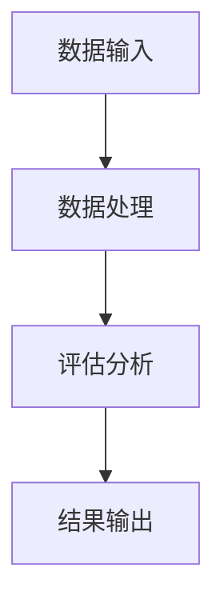

                 

# 玛丽·巴芙的性别多元化投资策略

> **关键词**：性别多元化投资、玛丽·巴芙、投资策略、性别平等、企业评估

> **摘要**：本文探讨了玛丽·巴芙的性别多元化投资策略，分析了性别因素在投资决策中的重要性，详细介绍了性别平等的评估模型、算法、系统架构以及实际案例。通过这些内容，展示了如何将性别多元化纳入投资策略，以实现更好的投资回报。

---

## 第1章：性别多元化投资的背景与重要性

### 1.1 什么是性别多元化投资

性别多元化投资是一种新兴的投资策略，强调在投资决策中考虑公司的性别平等状况。玛丽·巴芙作为该领域的代表人物，提出了一套基于性别平等的评估体系，帮助投资者识别那些在性别多样性方面表现优异的企业。

### 1.2 性别在投资中的重要性

性别因素对企业的绩效和投资回报有显著影响。研究表明，性别多元化的公司通常具有更强的创新能力、更高的员工满意度和更好的风险管理能力。这些因素直接关系到企业的长期发展和投资价值。

### 1.3 玛丽·巴芙的投资理念

玛丽·巴芙认为，性别平等不仅是道德责任，也是企业成功的关键因素。她通过量化性别平等指标，筛选出在性别多样性方面表现优秀的公司，构建了一个高效的投资组合。

---

## 第2章：性别多元化投资的定义与特点

### 2.1 性别多元化投资的定义

性别多元化投资是指在评估企业时，将性别平等作为重要指标，重点关注女性领导层的比例、性别薪酬差距、公司政策支持等。

### 2.2 与传统投资的对比分析

| 特性                | 传统投资              | 性别多元化投资          |
|---------------------|-----------------------|-------------------------|
| 关注点              | 财务表现、行业地位      | 财务表现、性别平等指标    |
| 投资决策            | 侧重财务数据          | 综合考虑性别与财务数据    |
| 风险管理            | 传统风险评估          | 包括性别平等风险         |

### 2.3 性别多元化投资的优势

通过关注性别平等，投资者能够挖掘那些在管理、创新和员工满意度方面表现优异的企业，从而获得超额回报。此外，性别多元化的公司通常更具社会影响力，符合可持续投资的趋势。

---

## 第3章：性别平等的评估模型

### 3.1 评估指标的分类

性别平等评估指标可分为三类：员工结构、高管比例和政策支持。员工结构关注整体性别分布，高管比例关注领导层的性别多样性，政策支持则评估公司的性别平等政策。

### 3.2 数据收集与分析方法

数据收集包括从公司年报、社会责任报告中提取性别相关数据。分析方法包括统计分析和机器学习模型，用于识别性别平等与企业绩效之间的关系。

### 3.3 评分系统的设计

评分系统由多个指标加权计算得出，权重基于各指标对投资回报的影响程度。例如，员工性别比例占30%，高管性别比例占40%，政策支持占20%。

---

## 第4章：性别平等的评估算法

### 4.1 数据预处理

数据预处理包括清洗数据、处理缺失值和异常值。例如，清洗公司年报中的性别数据，确保数据的准确性和完整性。

### 4.2 特征提取与分析

特征提取包括从数据中提取性别相关特征，如女性高管比例、性别薪酬差距等。分析特征之间的相关性，确定哪些特征对投资回报影响最大。

### 4.3 评估模型的构建

评估模型使用机器学习算法，如随机森林或支持向量机，构建一个基于性别平等指标的评分系统。模型通过历史数据训练，预测企业的性别平等评分。

---

## 第5章：系统架构与实施方法

### 5.1 功能模块设计

系统功能模块包括数据输入、数据处理、评估分析和结果输出。数据输入模块接收企业的性别数据，数据处理模块清洗和转换数据，评估分析模块运行算法得出评分，结果输出模块展示评分和建议。

### 5.2 系统架构图

### 5.3 接口设计与交互流程

系统通过API接口接收数据，返回性别平等评分。交互流程包括数据上传、处理、评估和结果展示，用户可以通过网页界面与系统交互。

---

## 第6章：项目实战与案例分析

### 6.1 案例背景分析

选择一个科技公司作为案例，分析其性别平等状况。数据包括员工性别比例、高管性别比例、性别薪酬差距等。

### 6.2 投资策略的制定与实施

根据评估模型，计算出该公司的性别平等评分为75分（满分100分）。玛丽·巴芙决定将其纳入投资组合，因为评分高于行业平均水平。

### 6.3 实施结果与经验总结

投资结果显示，该公司的股票表现优于市场平均水平，性别平等策略有效提升了投资回报。经验总结包括数据收集的准确性、模型的可解释性以及持续监控的重要性。

---

## 第7章：结论与未来展望

### 7.1 总结

性别多元化投资是一种具有潜力的投资策略，能够帮助投资者识别出在性别平等和企业绩效方面表现优异的企业。

### 7.2 最佳实践 tips

- 使用可靠的性别数据源
- 定期更新评估模型
- 结合其他多元化因素进行综合评估

### 7.3 未来展望

随着性别平等意识的增强，性别多元化投资将得到更多关注。未来，投资者可能开发更复杂的模型，结合更多性别相关指标，提供更精准的投资决策。

---

## 附录

### 附录A：术语表

- 性别平等：公司内部性别公平的状况
- 评估模型：基于性别平等指标的评分系统

### 附录B：工具推荐

- 数据分析工具：Python、R
- 可视化工具：Tableau、Power BI

### 附录C：参考文献

- 玛丽·巴芙的相关著作
- 相关学术论文

---

通过以上步骤，我们可以系统地介绍玛丽·巴芙的性别多元化投资策略，从理论到实践，帮助读者理解和应用这一策略。

