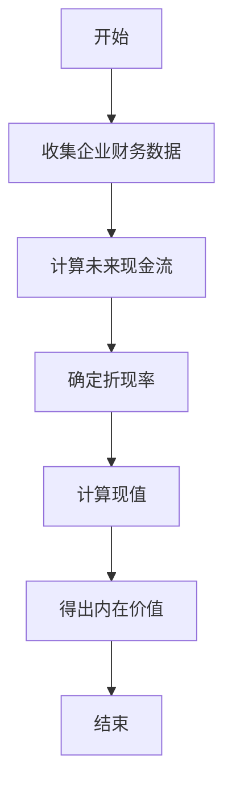
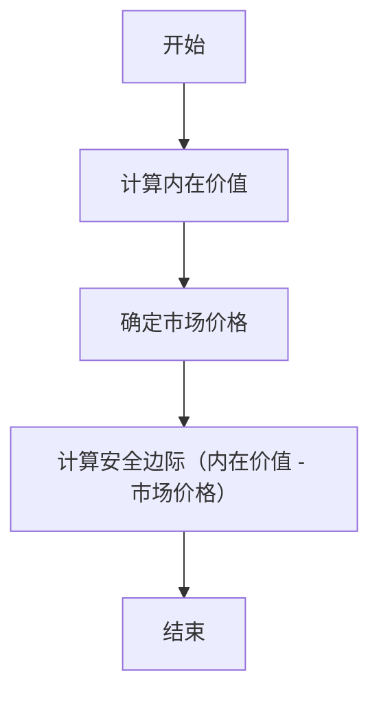
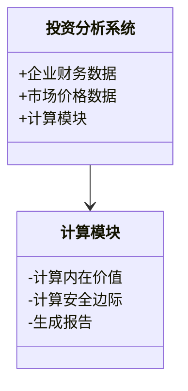

                 


# 《玛丽·巴芙达的质量型价值投资理念》

---

## 关键词：  
玛丽·巴芙达, 质量型价值投资, 安全边际, 内在价值, 股票分析, 投资策略, 价值评估  

---

## 摘要：  
本文深入探讨了玛丽·巴芙达的质量型价值投资理念，从其核心概念、算法原理到实际应用进行全面解析。通过背景介绍、核心概念对比、算法流程图、数学模型、系统架构设计以及实战案例，帮助读者全面理解质量型价值投资的精髓，并掌握其在实际投资中的应用方法。

---

## 正文  

### 第一部分：质量型价值投资的背景与核心概念  

#### 第1章：质量型价值投资的起源与理念  

##### 1.1 投资界的演变与价值投资的兴起  
- 1.1.1 传统投资方法的局限性  
  - 股票市场波动性大，传统技术分析和短期交易难以应对长期投资需求。  
  - 市场参与者情绪化波动影响短期决策，难以实现长期稳健收益。  

- 1.1.2 玛丽·巴芙达的价值投资理念  
  - 强调长期投资，注重企业内在价值而非市场波动。  
  - 通过深入分析企业的财务状况、行业地位和竞争优势，寻找被市场低估的投资标的。  

- 1.1.3 价值投资与质量型投资的区别  
  - 价值投资：寻找价格低于内在价值的股票。  
  - 质量型投资：注重企业的质量，选择具备持续竞争优势和良好财务状况的企业。  

##### 1.2 玛丽·巴芙达的生平与投资哲学  
- 玛丽·巴芙达是价值投资领域的先驱，她的投资理念强调安全边际和长期持有。  
- 她认为，成功的投资不在于预测市场短期走势，而在于选择具备强大竞争优势和合理估值的企业。  
- 成功案例：通过分析企业基本面，选择低估的蓝筹股长期持有，实现稳健收益。  

#### 第2章：质量型价值投资的核心概念  

##### 2.1 安全边际的概念与重要性  
- 安全边际：股票价格与内在价值之间的差额，即市场价格低于内在价值的部分。  
- 重要性：  
  - 提供了投资的安全性，即使市场波动，也能避免重大损失。  
  - 通过安全边际，投资者可以在市场低估时买入，市场高估时卖出。  

##### 2.2 内在价值的评估与分析  
- 内在价值：企业未来现金流的现值，反映了企业的实际价值。  
- 评估方法：  
  - 股利折现模型：将未来股利折现，计算内在价值。  
  - 现金流折现模型：将未来自由现金流折现，计算企业整体价值。  

##### 2.3 质量型投资与成长型投资的对比  
- 质量型投资：注重企业的质量和稳定性，适合风险厌恶型投资者。  
- 成长型投资：注重企业的成长潜力，适合风险偏好型投资者。  
- 对比表格：  
  | 投资策略 | 质量型投资 | 成长型投资 |  
  |----------|------------|------------|  
  | 核心目标 | 稳定收益 | 高增长收益 |  
  | 投资对象 | 低估值、高ROE企业 | 高增长潜力企业 |  

---

### 第二部分：质量型价值投资的算法与数学模型  

#### 第3章：价值投资的算法原理  

##### 3.1 内在价值计算的算法流程  



##### 3.2 安全边际计算的算法流程  



##### 3.3 Python代码实现  

```python
def calculate_intrinsic_value(cash_flows, discount_rate):
    """
    计算内在价值的现值公式。
    Args:
        cash_flows (list): 未来的现金流列表
        discount_rate (float): 折现率
    Returns:
        float: 内在价值
    """
    return sum(cf / (1 + discount_rate)**i for i, cf in enumerate(cash_flows))
```

---

#### 第4章：数学模型与公式解析  

##### 4.1 内在价值计算的数学模型  

$$ V = \sum_{t=1}^{n} \frac{CF_t}{(1 + r)^t} $$  
- 其中，\( CF_t \) 是第 t 年的现金流，\( r \) 是折现率，\( n \) 是计算的年数。  

##### 4.2 安全边际计算公式  

$$ \text{安全边际} = \text{内在价值} - \text{市场价格} $$  

---

### 第三部分：系统分析与架构设计方案  

#### 第5章：投资分析系统的构建  

##### 5.1 系统功能设计  



##### 5.2 系统架构设计  


---

### 第四部分：项目实战  

#### 第6章：质量型价值投资的实战应用  

##### 6.1 环境安装  
- 安装Python和必要的数据分析库（如Pandas、NumPy）。  

##### 6.2 核心代码实现  

```python
import pandas as pd

def analyze_intrinsic_value(company_financials):
    """
    分析公司的内在价值。
    Args:
        company_financials (DataFrame): 公司财务数据
    Returns:
        float: 内在价值
    """
    cash_flows = company_financials['现金流'].tolist()
    discount_rate = 0.08
    return sum(cf / (1 + discount_rate)**i for i, cf in enumerate(cash_flows))

# 示例使用
data = {
    '现金流': [100, 120, 150, 180, 200],
    '其他': ['a', 'b', 'c', 'd', 'e']
}
df = pd.DataFrame(data)
intrinsic_value = analyze_intrinsic_value(df)
print(f"内在价值: {intrinsic_value}")
```

##### 6.3 案例分析  
- 某公司的财务数据：  
  - 现金流：100, 120, 150, 180, 200（单位：万元）  
  - 折现率：8%  

计算结果：  
$$ V = 100/(1.08) + 120/(1.08)^2 + 150/(1.08)^3 + 180/(1.08)^4 + 200/(1.08)^5 $$  
计算得到的内在价值约为 450 万元。  

---

### 第五部分：最佳实践与小结  

#### 第7章：质量型价值投资的关键点  

##### 7.1 小结  
- 质量型价值投资的核心在于寻找具备高质量和低估价格的企业。  
- 通过安全边际和内在价值的计算，投资者可以做出更明智的投资决策。  

##### 7.2 注意事项  
- 投资者需持续关注企业的财务状况和市场环境变化。  
- 安全边际提供了一定的缓冲，但并不能完全避免市场风险。  

##### 7.3 拓展阅读  
- 《投资学基础》  
- 《价值投资实战策略》  

---

## 结语  
玛丽·巴芙达的质量型价值投资理念为投资者提供了稳健的投资方法。通过深入分析企业的内在价值和安全边际，投资者可以在复杂的市场环境中找到优质的长期投资标的。希望本文能为读者在投资领域提供有价值的指导和启发。  

--- 

**感谢您的耐心阅读！**

