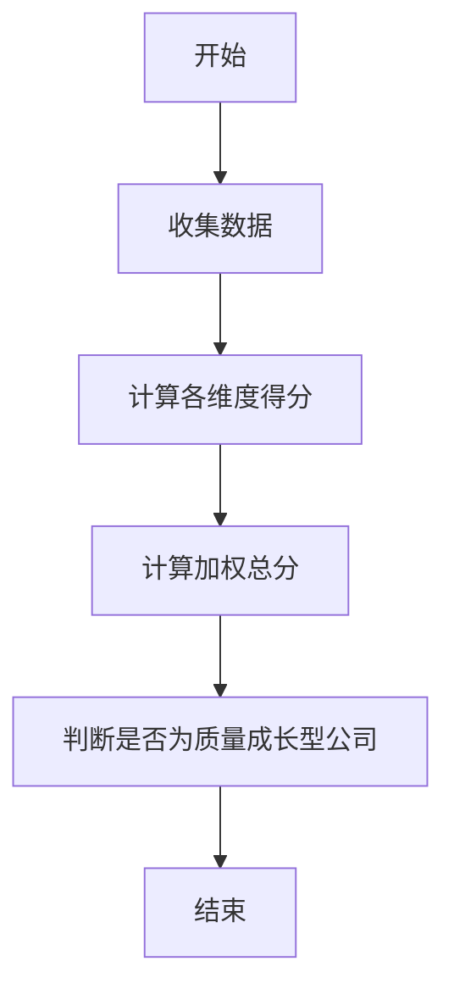
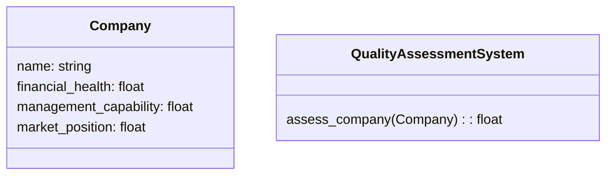
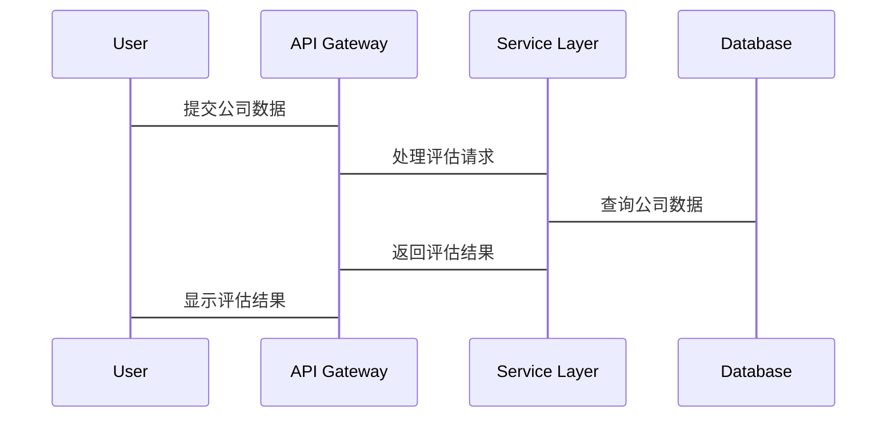

                 


# 玛丽·巴芙达的质量成长型公司识别方法

> 关键词：质量成长型公司，识别方法，玛丽·巴芙达，财务指标，管理团队，市场地位

> 摘要：本文详细介绍了玛丽·巴芙达的质量成长型公司识别方法，涵盖背景、核心概念、评估模型、系统架构及实战案例。通过多因素分析模型和数学公式，结合系统设计，提供一套识别和评估质量成长型公司的方法，帮助读者在商业环境中做出明智决策。

---

## 第一部分：质量成长型公司的背景与概念

### 第1章：质量成长型公司的定义与重要性

#### 1.1 质量成长型公司的定义
- **1.1.1 企业的成长性与质量的内涵**
  - 企业的成长性指的是其持续增长和发展的能力，而质量则指其在市场中的竞争力和可持续性。
  - 质量成长型公司不仅追求增长，更注重增长的健康性和可持续性。

- **1.1.2 质量成长型公司的核心特征**
  - 高质量的管理团队：具备战略眼光和执行力。
  - 强劲的财务表现：稳定的收入增长和健康的利润率。
  - 坚实的市场地位：在行业内具有竞争力和影响力。

- **1.1.3 识别质量成长型公司的意义**
  - 投资者能够做出更明智的投资决策。
  - 企业能够识别自身的优势和改进方向。
  - 在商业环境中，质量成长型公司更能抵御风险和适应变化。

#### 1.2 识别质量成长型公司的背景
- **1.2.1 当前商业环境的变化**
  - 全球化和数字化带来的竞争加剧。
  - 经济波动对企业的冲击增大，质量成为企业生存的关键。

- **1.2.2 投资者的需求与挑战**
  - 投资者寻求稳定和高回报的投资标的。
  - 如何在众多企业中识别出真正的质量成长型公司是投资者面临的挑战。

- **1.2.3 玛丽·巴芙达方法的背景**
  - 玛丽·巴芙达作为专家，提出了系统化的识别方法。
  - 该方法结合了财务分析、管理评估和市场分析，提供了一个全面的框架。

---

## 第二部分：质量成长型公司的核心要素

### 第2章：核心概念与联系

#### 2.1 核心概念原理
- **2.1.1 质量成长型公司的核心要素**
  - 财务健康度：包括净利润率、资产回报率等指标。
  - 管理团队能力：领导力、战略规划和执行力。
  - 市场地位：市场占有率、品牌影响力和客户忠诚度。

- **2.1.2 核心要素之间的关系**
  - 财务健康度是企业运营的直接体现，反映了管理团队的执行效果。
  - 管理团队的能力决定了企业的战略方向和市场应对能力。
  - 市场地位是企业在市场竞争中的表现，与财务和管理能力密切相关。

#### 2.2 核心要素对比分析
- **2.2.1 财务指标对比**
  - 利润率对比：高利润率表明企业盈利能力强。
  - 资产周转率对比：高周转率意味着资产使用效率高。

- **2.2.2 管理团队能力对比**
  - 领导力：团队是否具备清晰的战略 vision 和执行能力。
  - 创新能力：是否能适应市场变化，推出新产品或服务。

- **2.2.3 市场地位对比**
  - 市场份额：企业在市场中的占比。
  - 品牌影响力：品牌知名度和美誉度。

#### 2.3 实体关系图（ER图）
```mermaid
erd
  title 公司实体关系图
  公司 --> 财务指标: 拥有
  公司 --> 管理团队: 拥有
  公司 --> 市场地位: 拥有
  管理团队 --> 个体: 包含
  财务指标 --> 净利润率: 包含
  财务指标 --> 资产回报率: 包含
  市场地位 --> 市场份额: 包含
  市场地位 --> 品牌影响力: 包含
```

---

## 第三部分：质量成长型公司的评估模型

### 第3章：评估模型的算法原理

#### 3.1 多因素分析模型
- **3.1.1 模型概述**
  - 该模型通过多维度评估企业质量，包括财务、管理、市场等方面。
  - 每个维度赋予不同的权重，综合评分决定企业是否为质量成长型。

- **3.1.2 算法流程图（Mermaid）**


- **3.1.3 算法实现**
  ```python
  def calculate_quality_score(company_data):
      financial_weights = 0.4
      management_weights = 0.3
      market_weights = 0.3

      financial_score = company_data['financial_health']
      management_score = company_data['management_capability']
      market_score = company_data['market_position']

      total_score = (financial_weights * financial_score) + \
                     (management_weights * management_score) + \
                     (market_weights * market_score)
      return total_score
  ```

#### 3.2 数学模型与公式
- **3.2.1 评估模型的数学表达**
  $$ \text{评估分数} = w_f \times f + w_m \times m + w_m \times m $$
  其中，\( w_f \)、\( w_m \)、\( w_m \) 分别为财务、管理、市场的权重，\( f \)、\( m \)、\( m \) 分别为各维度的得分。

- **3.2.2 具体指标的数学公式**
  - 财务健康度计算：
    $$ \text{财务健康度} = \frac{\text{净利润率} + \text{资产回报率}}{2} $$
  - 管理能力评分：
    $$ \text{管理能力评分} = \frac{\text{领导力评分} + \text{创新能力评分}}{2} $$

---

## 第四部分：系统分析与架构设计

### 第4章：系统分析与架构

#### 4.1 问题场景介绍
- 简述如何构建一个质量成长型公司评估系统，帮助用户自动化评估公司质量。

#### 4.2 系统功能设计
- **领域模型类图（Mermaid）**


#### 4.3 系统架构设计
- **系统架构图（Mermaid）**
```mermaid
graph TD
    User --> API Gateway
    API Gateway --> Service Layer
    Service Layer --> Database
    Database --> Company
```

#### 4.4 接口设计与交互
- **交互流程图（Mermaid）**


---

## 第五部分：项目实战

### 第5章：项目实战

#### 5.1 环境安装与配置
- 安装 Python 和必要的库（如 Pandas、NumPy）。

#### 5.2 核心代码实现
- **评估模型的Python代码**
  ```python
  def assess_company(company_data):
      financial_health = company_data['financial_health']
      management_capability = company_data['management_capability']
      market_position = company_data['market_position']

      weights = {'financial': 0.4, 'management': 0.3, 'market': 0.3}
      total_score = (weights['financial'] * financial_health +
                     weights['management'] * management_capability +
                     weights['market'] * market_position)
      return total_score
  ```

#### 5.3 代码解读与分析
- 解释代码逻辑：如何计算各维度得分，如何加权求和得到总分。

#### 5.4 实际案例分析
- 使用具体公司数据，展示评估过程和结果。

---

## 第六部分：最佳实践与总结

### 第6章：最佳实践

#### 6.1 小结
- 玛丽·巴芙达的质量成长型公司识别方法提供了全面的评估框架。
- 通过多因素分析模型和系统设计，可以有效识别和评估质量成长型公司。

#### 6.2 注意事项
- 数据的准确性和完整性对评估结果至关重要。
- 权重的设定应根据具体行业和情况进行调整。

#### 6.3 拓展阅读
- 进一步阅读相关投资策略书籍，学习更多评估方法。

---

通过以上内容，读者可以系统地理解玛丽·巴芙达的质量成长型公司识别方法，并在实际应用中加以运用。

