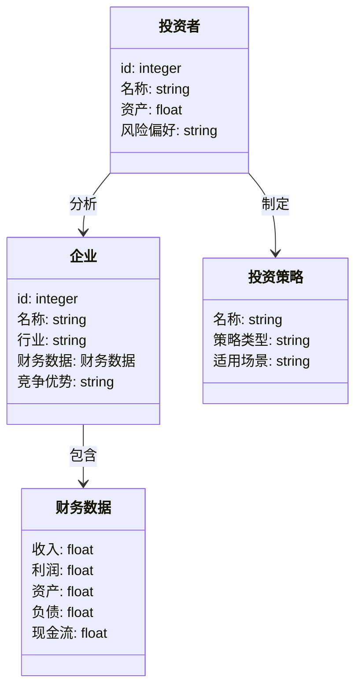
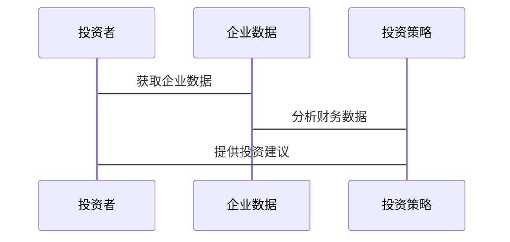

                 


# 第三部分: 价值投资的算法原理与系统设计

## 第3章: 投资决策的系统分析与架构设计

### 3.1 问题场景介绍

在价值投资的过程中，投资者需要对大量的数据进行分析，包括财务数据、市场数据、行业趋势等。为了提高投资决策的效率和准确性，我们可以构建一个基于价值投资策略的投资分析系统。该系统将帮助投资者快速识别具有投资价值的企业，进行风险评估，并制定投资策略。

### 3.2 系统功能设计

#### 3.2.1 领域模型设计
- 使用 Mermaid 类图描述系统的各个角色和实体之间的关系。
- 定义核心实体：投资者、企业、财务数据、市场数据、投资策略等。



#### 3.2.2 系统架构设计
- 使用 Mermaid 架构图描述系统的整体架构。
- 包括数据层、业务逻辑层和用户界面层。

```mermaid
client
    /-/
client <----> Web 服务
    /-/
Web 服务 <----> 数据库
```

#### 3.2.3 数据接口设计
- 描述系统中各个模块之间的数据接口。
- 使用 Mermaid 序列图展示接口调用流程。



## 第4章: 价值投资的算法实现与实战案例

### 4.1 算法原理讲解

#### 4.1.1 基于财务数据的价值评估算法

- 使用 Python 编写一个简单的财务数据分析脚本，计算市盈率、市净率等指标。

```python
def calculate_financial_ratios(enterprise_data):
    # 计算市盈率
    pe_ratio = enterprise_data['profit'] / enterprise_data['price']
    # 计算市净率
    pb_ratio = enterprise_data['price'] / enterprise_data['book_value']
    return pe_ratio, pb_ratio

# 示例数据
enterprise_data = {
    'price': 100,
    'profit': 20,
    'book_value': 50
}

pe, pb = calculate_financial_ratios(enterprise_data)
print(f"市盈率: {pe:.2f}, 市净率: {pb:.2f}")
```

#### 4.1.2 竞争优势评估算法

- 使用自然语言处理技术对企业的竞争优势进行分析。

```python
from textblob import TextBlob

def analyze_competitive_advantages(text):
    blob = TextBlob(text)
    sentiment = blob.sentiment.polarity
    return "优势明显" if sentiment > 0.5 else "优势一般" if sentiment > 0 else "无明显优势"

enterprise_advantages = "公司在行业内具有显著的成本优势，并拥有强大的研发团队。"
result = analyze_competitive_advantages(enterprise_advantages)
print(f"竞争优势评估结果: {result}")
```

### 4.2 实战案例分析

#### 4.2.1 案例选择

- 选择一个具体的行业和企业，进行投资价值分析。

#### 4.2.2 数据收集与处理

- 收集企业的财务数据、市场数据等，进行清洗和预处理。

#### 4.2.3 投资策略制定

- 基于算法分析的结果，制定相应的投资策略。

## 第5章: 价值投资的长期策略与风险管理

### 5.1 长期投资策略

- 分散投资：将资金分配到不同行业和不同风险级别的企业中。
- 定期复盘：定期审视投资组合，调整投资策略。

### 5.2 风险管理

- 设置止损点：当股票价格下跌到一定程度时，及时卖出。
- 风险分散：通过投资不同类型的资产来降低风险。

### 5.3 投资心态管理

- 长期视角：避免短期市场的波动干扰，保持长期投资的信心。
- 持续学习：不断提升自己的投资知识和分析能力。

## 第6章: 总结与展望

### 6.1 核心要点回顾

- 价值投资的核心理念：寻找具有持续竞争优势和良好财务状况的企业。
- 系统设计的重要性：构建高效的投资分析系统，提高决策效率。

### 6.2 注意事项

- 风险提示：投资有风险，需谨慎操作。
- 持续学习：市场环境不断变化，需持续更新知识和策略。

### 6.3 未来展望

- 技术进步：人工智能和大数据技术将为价值投资提供更多的可能性。
- 市场发展：全球化的市场将为投资者提供更多选择。

## 参考文献

- 玛丽·巴芙达的投资理念书籍
- 相关学术论文
- 行业研究报告

## 致谢

感谢读者的关注和支持，感谢在撰写过程中提供帮助的同行和朋友。

