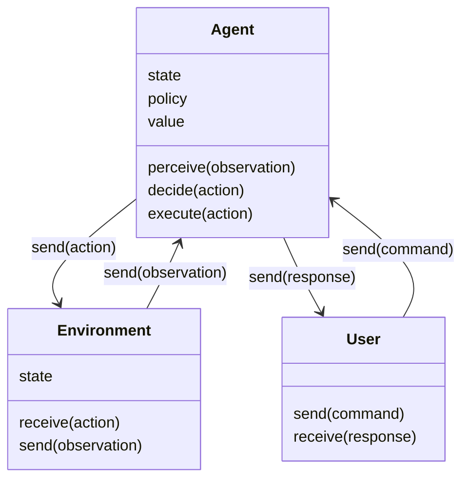
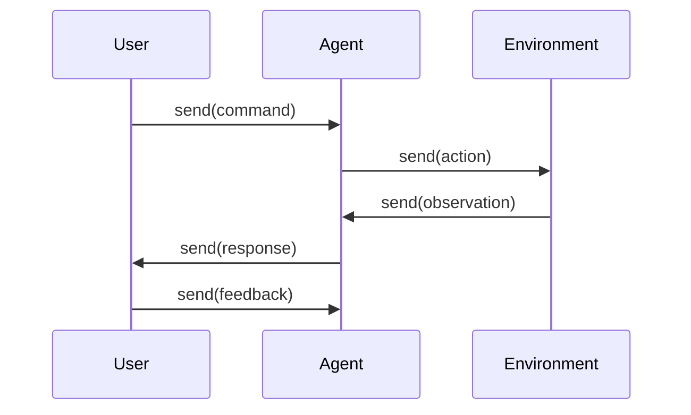

                 


# 理解AI Agent：核心概念与基本原理

## 关键词：AI Agent，人工智能代理，算法原理，系统架构，智能决策，人机交互

## 摘要：  
AI Agent（人工智能代理）是一种能够感知环境、自主决策并采取行动以实现目标的智能系统。本文将从核心概念、算法原理、系统架构设计、项目实战等多个维度，深入剖析AI Agent的基本原理和实际应用，帮助读者全面理解这一技术的本质与价值。

---

## 第1章: AI Agent 的背景与核心概念

### 1.1 AI Agent 的定义与问题背景  
AI Agent（人工智能代理）是一种智能系统，能够感知环境、理解任务目标，并通过自主决策和行动来实现预定目标。它广泛应用于自动驾驶、智能助手、机器人控制、推荐系统等领域。

#### 1.1.1 什么是AI Agent  
AI Agent 是一个能够执行智能任务的实体，具备以下核心特征：  
1. **自主性**：无需外部干预，自主完成任务。  
2. **反应性**：能够感知环境并实时响应。  
3. **目标导向性**：所有行为都以实现目标为导向。  
4. **学习能力**：通过数据和经验改进性能。  

#### 1.1.2 AI Agent 的问题背景  
在实际应用中，AI Agent 需要解决以下问题：  
1. 如何有效感知环境并提取有用信息？  
2. 如何基于感知信息做出合理决策？  
3. 如何在复杂环境中实现与人类或其他系统的高效交互？  

#### 1.1.3 AI Agent 的核心目标  
AI Agent 的核心目标是通过智能决策和行动，提高系统的效率、准确性和用户体验。例如，在自动驾驶中，AI Agent 需要实时感知道路环境并做出安全、高效的驾驶决策。

---

### 1.2 AI Agent 的问题描述  
#### 1.2.1 问题场景分析  
以智能助手为例，AI Agent 需要在以下场景中工作：  
- 用户发出指令（如“播放音乐”）。  
- AI Agent 解析指令并执行操作。  
- 在执行过程中，实时反馈进展并处理用户的中断指令。  

#### 1.2.2 问题解决路径  
1. **感知与理解**：通过语音识别、自然语言处理等技术，解析用户的指令。  
2. **决策与执行**：根据解析结果，调用相应服务（如音乐播放器）。  
3. **反馈与优化**：记录用户行为，优化未来的响应速度和准确性。  

#### 1.2.3 问题的边界与外延  
- **边界**：AI Agent 的能力受限于其感知和执行的范围。  
- **外延**：随着技术进步，AI Agent 可以在更多场景中应用，例如医疗诊断辅助、智能客服等。

---

### 1.3 AI Agent 的核心要素组成  
AI Agent 的核心要素包括：  
1. **感知模块**：通过传感器或 API 获取环境信息。  
2. **推理模块**：基于知识库或模型进行逻辑推理。  
3. **决策模块**：根据推理结果制定行动方案。  
4. **执行模块**：调用外部服务或控制物理设备。  
5. **人机交互模块**：与用户或系统进行实时互动。  

---

## 第2章: AI Agent 的核心概念与基本原理  

### 2.1 AI Agent 的核心概念  
#### 2.1.1 智能体的基本定义  
AI Agent 是一个能够自主决策和行动的智能系统，具备以下核心能力：  
- **感知能力**：通过传感器或 API 获取环境信息。  
- **推理能力**：基于知识库或模型进行逻辑推理。  
- **决策能力**：根据推理结果制定行动方案。  

#### 2.1.2 AI Agent 的核心属性  
1. **自主性**：无需外部干预，自主完成任务。  
2. **反应性**：能够实时感知环境并做出响应。  
3. **目标导向性**：所有行为都以实现目标为导向。  
4. **学习能力**：通过数据和经验改进性能。  

#### 2.1.3 AI Agent 的分类与层次  
AI Agent 可以分为以下几类：  
1. **简单反射型代理**：基于当前输入做出简单反应。  
2. **基于模型的反射型代理**：维护环境模型，用于推理和决策。  
3. **目标驱动型代理**：基于目标驱动行为。  
4. **实用驱动型代理**：基于效用函数优化决策。  

---

### 2.2 AI Agent 的基本原理  
#### 2.2.1 知识表示与推理  
知识表示是 AI Agent 的基础，常见的表示方法包括：  
- **谓词逻辑**：用于表示事实和关系。  
- **规则表示法**：通过规则描述行为逻辑。  
- **语义网络**：通过节点和边表示概念及其关系。  

#### 2.2.2 行为规划与决策  
行为规划是 AI Agent 核心能力之一，常用算法包括：  
- **贪心算法**：基于当前状态做出局部最优决策。  
- **A* 算法**：用于路径规划和全局最优决策。  
- **马尔可夫决策过程（MDP）**：用于处理不确定环境中的决策问题。  

#### 2.2.3 人机交互与反馈  
AI Agent 的人机交互模块需要实现以下功能：  
- **输入解析**：将用户的输入转化为系统可理解的指令。  
- **输出生成**：生成自然语言文本、语音或动作指令。  
- **反馈机制**：根据用户反馈优化响应策略。  

---

### 2.3 AI Agent 的核心要素对比  
#### 2.3.1 不同 AI Agent 模型的对比  
| 模型类型         | 核心特点             | 适用场景               |  
|------------------|--------------------|------------------------|  
| 简单反射型代理   | 基于当前输入做出简单反应 | 适用于简单任务，如传感器数据处理 |  
| 基于模型的代理   | 维护环境模型，推理复杂决策 | 适用于需要规划和预测的场景，如自动驾驶 |  
| 目标驱动型代理   | 基于目标驱动行为     | 适用于需要明确目标的任务，如任务执行型机器人 |  
| 实用驱动型代理   | 基于效用函数优化决策   | 适用于需要权衡多目标的场景，如资源分配优化 |  

#### 2.3.2 核心概念的属性特征对比  
| 属性           | 自主性   | 反应性   | 目标导向性 | 学习能力 |  
|----------------|----------|----------|------------|----------|  
| 简单反射型代理 | 较低     | 较高     | 较低       | 无       |  
| 基于模型的代理 | 中等     | 高       | 中等       | 有       |  
| 目标驱动型代理 | 较高     | 中等     | 高         | 有       |  
| 实用驱动型代理 | 较高     | 中等     | 中等       | 高       |  

#### 2.3.3 AI Agent 的 ER 实体关系图  
```mermaid
er
    entity(Agent) {
        id: string
        name: string
        type: string
        state: string
    }
    entity(Environment) {
        id: string
        state: string
    }
    entity(User) {
        id: string
        role: string
    }
    relationship(Agent - Environment) {
        action: string
        result: string
    }
    relationship(Agent - User) {
        interaction: string
        feedback: string
    }
```

---

## 第3章: AI Agent 的算法原理与数学模型  

### 3.1 AI Agent 的算法原理  
#### 3.1.1 从感知到决策的算法流程  
AI Agent 的算法流程可以分为以下步骤：  
1. **感知环境**：通过传感器或 API 获取环境信息。  
2. **解析信息**：将感知数据转化为可理解的结构化数据。  
3. **推理与决策**：基于知识库或模型进行推理，制定行动方案。  
4. **执行行动**：调用外部服务或控制物理设备。  
5. **反馈优化**：根据执行结果优化未来决策。  

#### 3.1.2 AI Agent 的数学模型  
AI Agent 的决策过程可以基于以下数学模型：  
- **马尔可夫决策过程（MDP）**：适用于不确定环境中的决策问题。  
- **强化学习（RL）**：通过奖励机制优化决策策略。  

#### 3.1.3 算法实现  
以下是一个基于强化学习的 AI Agent 算法示例：  

```python
class Agent:
    def __init__(self, state_space, action_space):
        self.state_space = state_space
        self.action_space = action_space
        self.policy = self.initialize_policy()
        self.value = self.initialize_value()

    def initialize_policy(self):
        # 初始化策略函数
        pass

    def initialize_value(self):
        # 初始化价值函数
        pass

    def perceive(self, observation):
        # 解析观测数据
        pass

    def decide(self, state):
        # 根据策略做出决策
        action = self.policy[state]
        return action

    def learn(self, reward):
        # 更新策略和价值函数
        pass

    def execute(self, action):
        # 执行动作并返回结果
        pass
```

---

### 3.2 AI Agent 的数学公式与模型  

#### 3.2.1 马尔可夫决策过程（MDP）  
马尔可夫决策过程可以表示为五元组 $(S, A, P, R, \gamma)$，其中：  
- $S$：状态空间  
- $A$：动作空间  
- $P$：转移概率矩阵  
- $R$：奖励函数  
- $\gamma$：折扣因子  

状态转移概率 $P(s'|s,a)$ 表示从状态 $s$ 执行动作 $a$ 后转移到状态 $s'$ 的概率。  

#### 3.2.2 强化学习（RL）中的 Q-Learning 算法  
Q-Learning 算法的目标是学习状态-动作对的最优价值函数 $Q(s,a)$。更新公式为：  
$$ Q(s,a) = Q(s,a) + \alpha [r + \gamma \max_{a'} Q(s',a') - Q(s,a)] $$  
其中：  
- $\alpha$：学习率  
- $\gamma$：折扣因子  
- $r$：即时奖励  

---

## 第4章: AI Agent 的系统架构设计  

### 4.1 系统分析与需求定义  
以智能助手为例，系统需要实现以下功能：  
1. 接收用户的语音或文本指令。  
2. 解析指令并调用相应服务（如播放音乐、查询天气）。  
3. 处理用户的反馈并优化响应策略。  

---

### 4.2 系统功能设计  

#### 4.2.1 领域模型设计  


---

#### 4.2.2 系统架构设计  


---

#### 4.2.3 接口设计与交互流程  


---

## 第5章: AI Agent 的项目实战  

### 5.1 项目环境与工具安装  
1. **编程语言**：Python  
2. **深度学习框架**：TensorFlow 或 PyTorch  
3. **语音识别库**：比如 SpeechRecognition  
4. **自然语言处理库**：比如 NLTK 或 spaCy  

### 5.2 核心代码实现  
以下是一个简单的 AI Agent 示例代码：  

```python
import speech_recognition as sr
import pyttsx3

# 初始化语音识别器
recognizer = sr.Recognizer()
microphone = sr.AudioFile("input.wav")

# 初始化语音合成器
speaker = pyttsx3.init()

# 接收用户指令
def receive_command():
    with microphone as source:
        audio = recognizer.record(source)
        command = recognizer.recognize_google(audio)
    return command

# 解析指令并执行操作
def process_command(command):
    if "播放音乐" in command:
        # 调用音乐播放器API
        pass
    elif "关闭灯" in command:
        # 调用智能家居API
        pass
    else:
        speaker.say("抱歉，我还没学会这个指令。")
        speaker.runAndWait()

# 主程序
def main():
    while True:
        command = receive_command()
        process_command(command)

if __name__ == "__main__":
    main()
```

---

### 5.3 项目案例分析与优化  
以智能助手为例，分析代码实现并优化交互流程：  
1. **优化语音识别**：提高识别准确率。  
2. **增强自然语言理解**：支持更复杂的指令解析。  
3. **优化反馈机制**：实时响应用户反馈并调整行为策略。  

---

## 第6章: 总结与展望  

### 6.1 本章总结  
AI Agent 是人工智能领域的重要技术，其核心能力包括感知、推理、决策和执行。通过算法优化和系统架构设计，可以实现高效、智能的代理系统。  

### 6.2 未来展望  
随着技术进步，AI Agent 将在更多领域得到应用，例如医疗、教育、交通等。未来的研究方向包括：  
1. **强化学习的优化**：提高决策的效率和准确性。  
2. **人机协作**：实现更自然的人机交互。  
3. **边缘计算**：在边缘设备上部署轻量级 AI Agent。  

---

## 关键词：AI Agent，人工智能代理，算法原理，系统架构，智能决策，人机交互  

## 作者简介  
作者是一位在人工智能领域拥有丰富经验的技术专家，擅长通过清晰的逻辑和通俗易懂的语言，深入剖析技术原理，帮助读者理解复杂的概念。  

---

**注**：本文内容较多，完整版可能需要更详细的展开，但以上是主要的框架和核心内容。

