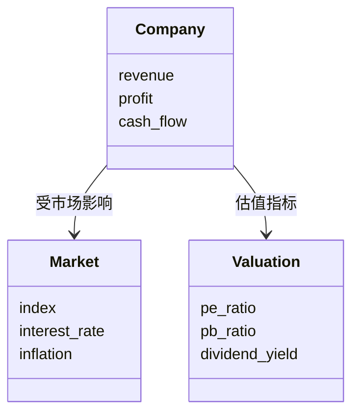
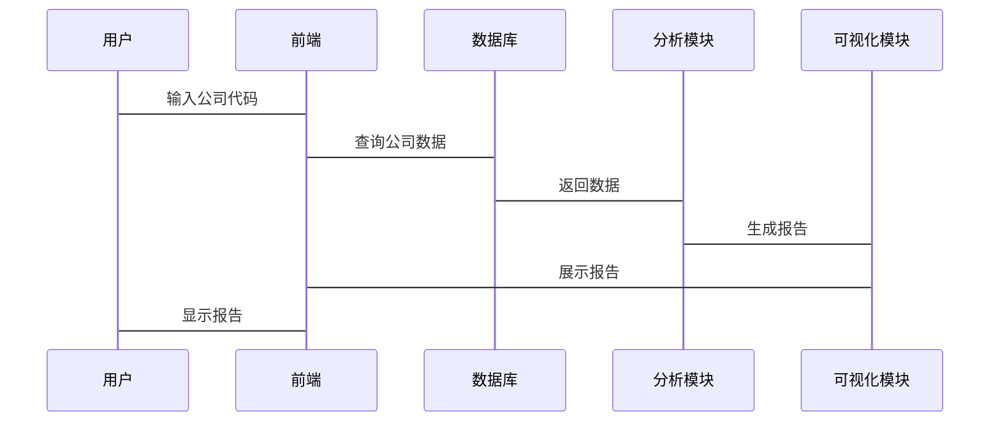

                 


# 瑞典股市估值:北欧经济强国的市场表现

## 关键词：瑞典股市、估值、北欧经济、股票分析、投资策略

## 摘要：本文深入分析了瑞典股市的估值方法、市场表现及影响因素，探讨了北欧经济强国的股市特点，结合实际案例和数学模型，为投资者提供科学的分析工具和决策支持。

---

# 第一部分: 瑞典股市估值背景与概述

## 第1章: 瑞典股市估值的背景与特点

### 1.1 瑞典经济与股市概述

#### 1.1.1 瑞典经济的基本特点
瑞典是北欧地区的重要经济强国，以其高度发达的市场经济和稳定的社会环境著称。瑞典经济的核心产业包括制造业、信息技术、金融和消费品行业。其经济政策注重可持续发展和社会公平，政府通过税收和福利政策调节经济。

#### 1.1.2 瑞典股市的基本结构与特点
瑞典股市主要由斯德哥尔摩证券交易所（Nasdaq Stockholm）运营，是北欧地区最重要的证券市场之一。市场参与者包括个人投资者、机构投资者和外国投资者。瑞典股市的特点包括：
1. 市场流动性高。
2. 以蓝筹股为主，企业盈利稳定。
3. 行业分布较为均衡，涵盖制造业、金融、信息技术等领域。

#### 1.1.3 瑞典股市在北欧经济中的地位
瑞典股市不仅是北欧地区的重要市场，还在全球范围内具有一定的影响力。北欧地区的其他市场（如丹麦、挪威和芬兰）与瑞典股市密切相关，协同效应显著。瑞典股市的稳定性和高分红率吸引了全球投资者。

### 1.2 瑞典股市的核心概念与估值方法

#### 1.2.1 估值的基本概念与定义
股票估值是通过对公司财务数据和市场环境的分析，确定股票的内在价值。常见的估值方法包括绝对估值（如现金流折现模型）和相对估值（如市盈率、市净率）。

#### 1.2.2 瑞典股市的估值指标与方法
- **市盈率（P/E）**：衡量股票价格与每股收益的比例。
- **市净率（P/B）**：衡量股票价格与每股净资产的比例。
- **股息率**：衡量股票分红与股票价格的比率。

#### 1.2.3 估值的核心要素与边界
- **财务数据**：包括收入、利润、现金流等。
- **市场环境**：包括宏观经济、行业趋势和政策影响。
- **公司基本面**：包括盈利能力、成长性和财务健康状况。

---

## 第2章: 瑞典股市的经济环境分析

### 2.1 瑞典宏观经济环境

#### 2.1.1 瑞典的GDP与经济增长
瑞典的GDP增长稳定，近年来年均增长率在2%左右。其经济结构多元化，制造业和信息技术业是主要驱动力。

#### 2.1.2 瑞典的利率与货币政策
瑞典央行（Riksbank）的货币政策以通胀目标制为核心，近年来采取低利率政策以刺激经济增长。

#### 2.1.3 瑞典的财政政策与公共财政
瑞典的公共财政健康，政府债务水平较低，财政政策稳健。

### 2.2 瑞典股市的行业分布与结构

#### 2.2.1 瑞典主要行业的分布
- 制造业：汽车、机械、化工。
- 信息技术：软件开发、通信设备。
- 金融：银行、保险。
- 消费品：食品、日用品。

#### 2.2.2 瑞典股市的行业权重分析
制造业和信息技术业占比较大，金融行业次之，消费品行业占比相对较小。

#### 2.2.3 瑞典股市的行业风险与机会
- 制造业面临全球竞争压力。
- 信息技术业具有较高的成长潜力。

---

# 第二部分: 瑞典股市估值的核心方法与模型

## 第3章: 瑞典股市估值的基本原理

### 3.1 估值的基本原理与框架

#### 3.1.1 估值的核心原理
股票的内在价值取决于公司的未来现金流，可以通过现金流折现模型（DCF）进行估算。

#### 3.1.2 估值的基本框架与流程
1. 确定公司的财务数据。
2. 选择合适的估值方法。
3. 分析市场环境和行业趋势。
4. 综合评估股票的内在价值。

### 3.2 瑞典股市估值的核心模型

#### 3.2.1 市盈率（P/E）模型
市盈率 = 股票价格 / 每股收益（EPS）

- 优点：简单易用，适用于盈利稳定的公司。
- 缺点：不适用于亏损公司。

#### 3.2.2 市净率（P/B）模型
市净率 = 股票价格 / 每股净资产（BPS）

- 优点：适用于资产密集型行业。
- 缺点：不适用于成长型企业。

#### 3.2.3 现金流折现模型（DCF）
DCF模型通过预测公司未来现金流，使用适当贴现率计算现值。

$$ \text{企业价值} = \sum_{t=1}^{n} \frac{\text{现金流}}{(1 + r)^t} $$

其中，r为贴现率，n为预测期。

---

## 第4章: 瑞典股市估值的关键指标与分析

### 4.1 估值的关键指标

#### 4.1.1 市盈率（P/E）
$$ \text{P/E} = \frac{\text{股价}}{\text{每股收益}} $$

#### 4.1.2 市净率（P/B）
$$ \text{P/B} = \frac{\text{股价}}{\text{每股净资产}} $$

#### 4.1.3 股息率
$$ \text{股息率} = \frac{\text{每股股息}}{\text{股价}} $$

#### 4.1.4 每股收益（EPS）
$$ \text{EPS} = \frac{\text{净利润}}{\text{普通股股数}} $$

### 4.2 估值指标的对比分析

#### 4.2.1 不同估值指标的优缺点对比

| 指标 | 优点 | 缺点 |
|------|------|------|
| P/E | 简单易用 | 不适用于亏损公司 |
| P/B | 适用于资产密集型行业 | 不适用于成长型企业 |
| 股息率 | 反映分红能力 | 不反映公司成长性 |

#### 4.2.2 不同行业适用的估值指标
- 制造业：P/E 和 P/B。
- 信息技术业：P/E 和 DCF。
- 金融行业：P/B 和股息率。

#### 4.2.3 估值指标的综合运用
综合运用多个指标可以更全面地评估股票价值。例如，对于制造业公司，可以结合P/E和P/B进行分析。

---

# 第三部分: 瑞典股市的表现与驱动因素

## 第5章: 瑞典股市的表现分析

### 5.1 瑞典股市的历史表现

#### 5.1.1 瑞典股市的长期趋势
长期来看，瑞典股市表现稳定，年均增长率接近通胀率加3%。

#### 5.1.2 瑞典股市的周期性波动
与全球市场相关，受宏观经济和行业趋势影响。

#### 5.1.3 瑞典股市的近期表现
近年来，信息技术和金融行业表现突出，制造业增长放缓。

### 5.2 瑞典股市的驱动因素

#### 5.2.1 经济基本面的驱动
- GDP增长。
- 利率水平。
- 汇率波动。

#### 5.2.2 政治与政策的驱动
- 政府政策。
- 税收变化。
- 行业监管。

#### 5.2.3 全球市场的联动效应
- 全球经济趋势。
- 北美和欧洲市场的联动。

---

## 第6章: 瑞典股市的行业与公司分析

### 6.1 瑞典主要行业的市场表现

#### 6.1.1 银行业
- 主要公司：瑞典银行（SEB）、北欧银行（Nordea）。
- 表现稳定，受利率影响较大。

#### 6.1.2 制造业
- 主要公司：沃尔沃（Volvo）、斯堪尼亚（Scania）。
- 全球竞争激烈，增长放缓。

#### 6.1.3 信息技术业
- 主要公司：爱立信（Ericsson）、思爱普（SAP）。
- 高速增长，技术创新驱动。

#### 6.1.4 消费品行业
- 主要公司：宜家（IKEA）、可口可乐瑞典分公司。
- 稳定增长，受消费趋势影响。

### 6.2 瑞典主要公司的估值分析

#### 6.2.1 银行行业的估值
以瑞典银行为例：
- P/E = 12。
- P/B = 1.5。
- 股息率 = 4%。

#### 6.2.2 制造业的估值
以沃尔沃为例：
- P/E = 10。
- P/B = 2.0。
- 股息率 = 3%。

#### 6.2.3 信息技术业的估值
以爱立信为例：
- P/E = 15。
- P/B = 1.8。
- 股息率 = 2%。

---

# 第四部分: 瑞典股市估值的实战与风险管理

## 第7章: 瑞典股市估值的实战分析

### 7.1 环境安装与数据准备

#### 7.1.1 数据来源
- 财务数据：公司财报。
- 市场数据：股票价格、指数数据。

#### 7.1.2 工具准备
- Python编程语言。
- 数据分析库：Pandas、NumPy。
- 可视化工具：Matplotlib、Seaborn。

### 7.2 系统分析与架构设计

#### 7.2.1 领域模型图



#### 7.2.2 系统架构图


#### 7.2.3 系统交互图



### 7.3 代码实现与案例分析

#### 7.3.1 Python代码实现

```python
import pandas as pd
import numpy as np

def calculate_valuation(finance_data, market_data):
    pe = finance_data['price'] / finance_data['eps']
    pb = finance_data['price'] / finance_data['book_value']
    dividend_yield = finance_data['dividend'] / finance_data['price']
    return pd.DataFrame({
        'P/E': pe,
        'P/B': pb,
        'Dividend Yield': dividend_yield
    })

# 示例数据
finance_data = pd.DataFrame({
    'price': [100, 80, 90],
    'eps': [20, 15, 25],
    'book_value': [50, 40, 60],
    'dividend': [2, 1, 3]
})

market_data = pd.DataFrame({
    'interest_rate': [2, 3, 2.5],
    'inflation': [1.5, 2, 1.8]
})

result = calculate_valuation(finance_data, market_data)
print(result)
```

#### 7.3.2 案例分析
以某制造企业为例，分析其P/E和P/B比率，结合行业趋势和宏观经济环境，评估其投资价值。

---

## 第8章: 投资策略与风险管理

### 8.1 投资策略

#### 8.1.1 价值投资
寻找被低估的股票，长期持有。

#### 8.1.2 股票筛选
通过估值指标筛选符合投资条件的股票。

### 8.2 风险管理

#### 8.2.1 风险分散
通过投资多样化行业和公司降低风险。

#### 8.2.2 资金管理
合理分配资金，避免过度集中。

---

# 第五部分: 总结与展望

## 第9章: 总结与展望

### 9.1 本文总结
本文系统地分析了瑞典股市的估值方法、市场表现和影响因素，提供了实用的估值工具和策略。

### 9.2 未来展望
未来可以进一步研究瑞典股市的国际比较和动态估值模型，结合人工智能技术提高估值精度。

---

## 第10章: 最佳实践与小结

### 10.1 最佳实践

#### 10.1.1 投资前进行充分研究
了解公司的基本面和行业趋势。

#### 10.1.2 理性投资，避免情绪化决策
遵循估值模型，不盲目跟风。

#### 10.1.3 定期调整投资组合
根据市场变化和个人财务状况进行调整。

### 10.2 注意事项

#### 10.2.1 避免过度依赖单一指标
结合多种指标和分析方法。

#### 10.2.2 考虑宏观经济环境
关注利率、通胀和政策变化。

#### 10.2.3 保持长期视角
股票投资需要耐心和长期持有。

### 10.3 拓展阅读

#### 10.3.1 推荐书籍
- 《投资学》（投资学基础）
- 《股票估值实战》（股票估值技巧）

#### 10.3.2 网络资源
- 瑞典央行官网
- 斯德哥尔摩证券交易所网站
- 财经分析博客

---

# 结语

通过本文的分析，读者可以全面了解瑞典股市的估值方法和市场表现，掌握科学的投资策略和风险管理技巧，为在北欧市场的投资决策提供有力支持。

