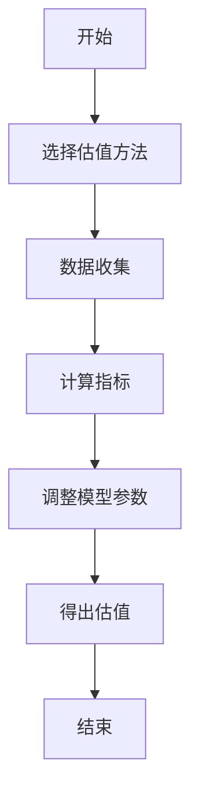
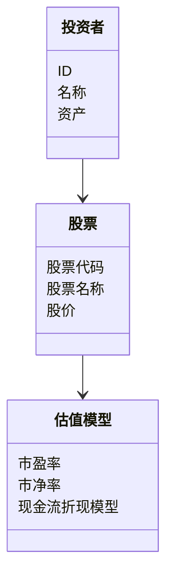
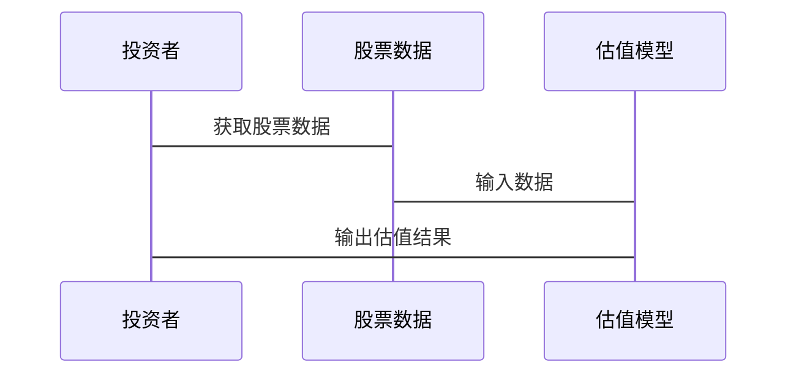

                 


# 瑞士股市估值:避险天堂的市场特点

## 关键词
瑞士股市，估值，避险天堂，市场特点，金融监管，投资策略

## 摘要
本文深入分析了瑞士股市的估值特点及其作为避险天堂的市场特性。首先介绍了瑞士股市的背景与发展，探讨了其作为避险天堂的核心优势，包括法律、税收和监管环境的优势。接着，从宏观经济、行业和公司三个层面详细阐述了瑞士股市的估值方法，并结合具体案例进行了分析。最后，总结了瑞士股市作为避险天堂的投资策略和未来发展趋势。

---

# 第一部分: 瑞士股市估值的背景与核心概念

## 第1章: 瑞士股市估值的背景与概述

### 1.1 瑞士股市的概况
#### 1.1.1 瑞士股市的定义与特点
瑞士股市是全球最重要的金融市场之一，其主要市场为瑞士交易所（SIX Swiss Exchange）。瑞士股市以稳定性、透明性和安全性著称，尤其在经济不确定性增加时，瑞士股市被视为避险资产的首选。

#### 1.1.2 瑞士股市的避险功能
瑞士股市的避险功能主要体现在以下几个方面：
1. **稳定性**：瑞士经济的稳定性使得瑞士股市成为全球投资者的避风港。
2. **法律保护**：瑞士的法律体系完善，投资者权益受到充分保护。
3. **低波动性**：相比其他市场，瑞士股市的波动性较低，适合保守型投资者。

#### 1.1.3 瑞士股市的历史与发展
瑞士股市的历史可以追溯到16世纪，经过几百年的演变，逐步发展成为今天的重要金融中心。瑞士交易所目前上市公司涵盖多个行业，包括银行、保险、制药和制造业等。

### 1.2 瑞士股市的监管环境
#### 1.2.1 瑞士金融监管框架
瑞士的金融监管由瑞士金融监管局（FINMA）负责，监管框架注重透明性和合规性。瑞士金融监管框架的核心目标是保护投资者利益，同时维护金融市场的稳定。

#### 1.2.2 瑞士股市的透明度与安全性
瑞士股市以高透明度和安全性著称，其监管机构对上市公司的信息披露要求严格，确保投资者能够获得准确的市场信息。

#### 1.2.3 瑞士与国际金融市场的联系
瑞士股市不仅是一个独立的市场，还与国际金融市场紧密相连。瑞士是许多跨国公司的总部所在地，这使得瑞士股市具有国际化的特点。

### 1.3 瑞士股市的主要参与者
#### 1.3.1 投资者结构
瑞士股市的投资者结构较为多元化，包括个人投资者、机构投资者和外国投资者。其中，机构投资者占据较大比例，这使得市场更加成熟和稳定。

#### 1.3.2 主要金融机构
瑞士的主要金融机构包括瑞士银行（UBS）、瑞士信贷（Credit Suisse）和瑞士宝盛（JPMorgan Chase）等。这些机构在瑞士股市中扮演着重要角色。

#### 1.3.3 市场流动性分析
瑞士股市的流动性较高，尤其是在交易时间内的市场深度较大。然而，与全球主要市场相比，瑞士股市的流动性相对较低，这与其作为避险市场的定位有关。

### 1.4 瑞士股市的避险天堂特点
#### 1.4.1 瑞士的法律与税收优势
瑞士的法律体系完善，税收政策优惠，吸引了大量外国投资者。瑞士的税收政策注重透明性和合规性，使得投资者在瑞士股市中能够享受较低的税收负担。

#### 1.4.2 瑞士的金融稳定与安全性
瑞士的金融体系以稳定性和安全性著称，其银行系统在多次金融危机中表现出了极强的抗风险能力。

#### 1.4.3 瑞士与其他避险天堂的对比
与其他避险天堂相比，瑞士的优势在于其法律体系的完善性和金融监管的严格性。此外，瑞士的地理位置和政治稳定性也是其吸引投资者的重要因素。

### 1.5 本章小结
本章通过对瑞士股市的背景、监管环境和市场参与者的分析，揭示了瑞士股市作为避险天堂的核心优势。这些优势使得瑞士股市在全球金融市场中占据了重要地位。

---

## 第2章: 瑞士股市估值的核心概念与理论基础

### 2.1 估值的基本原理
#### 2.1.1 估值的定义与意义
估值是通过对公司财务数据和市场环境的分析，确定公司股票的合理价值。在瑞士股市中，估值是投资者做出投资决策的重要依据。

#### 2.1.2 估值的主要方法
常用的估值方法包括市盈率（P/E）、市净率（P/B）和现金流折现模型（DCF）等。

#### 2.1.3 估值的常见指标
常用的估值指标包括市盈率、市净率、股息率和ROE等。

### 2.2 瑞士股市估值的独特性
#### 2.2.1 稳定性与防御性资产
瑞士股市中的防御性资产（如公用事业和金融股）在经济不确定性增加时表现尤为突出。

#### 2.2.2 税收与法律的优化
瑞士的税收政策和法律体系优化使得投资者在瑞士股市中能够享受较低的税收负担和较高的投资安全性。

#### 2.2.3 瑞士法郎的避险功能
瑞士法郎是全球主要避险货币之一，其稳定性使得瑞士股市成为投资者避险的重要选择。

### 2.3 瑞士股市估值的理论框架
#### 2.3.1 资产定价模型
CAPM（资本资产定价模型）和APT（套利定价理论）是常用的资产定价模型。在瑞士股市中，这些模型可以帮助投资者确定股票的合理价值。

#### 2.3.2 市场风险与流动性风险
市场风险和流动性风险是影响瑞士股市估值的重要因素。投资者需要综合考虑这些风险因素，做出合理的投资决策。

#### 2.3.3 宏观经济与行业分析
宏观经济环境和行业趋势对瑞士股市的估值具有重要影响。投资者需要结合宏观经济和行业分析，全面评估公司的投资价值。

### 2.4 本章小结
本章通过分析估值的基本原理和瑞士股市估值的独特性，揭示了瑞士股市估值的核心理论框架。这些理论框架为投资者在瑞士股市中做出合理投资决策提供了重要依据。

---

## 第3章: 瑞士股市估值的算法原理与数学模型

### 3.1 常见估值方法的数学模型
#### 3.1.1 市盈率（P/E）模型
市盈率模型是通过将公司的市盈率与行业平均市盈率进行比较，确定股票的合理价值。

公式：
$$ P/E = \frac{股票价格}{每股收益} $$

#### 3.1.2 市净率（P/B）模型
市净率模型是通过将公司的市净率与行业平均市净率进行比较，确定股票的合理价值。

公式：
$$ P/B = \frac{股票价格}{每股净资产} $$

#### 3.1.3 现金流折现模型（DCF）
DCF模型是通过将公司未来现金流折现，确定股票的合理价值。

公式：
$$ V = \sum_{t=1}^{n} \frac{CF_t}{(1 + r)^t} $$

### 3.2 瑞士股市估值的特殊考虑
#### 3.2.1 税收优化的影响
瑞士的税收政策优惠使得投资者在瑞士股市中能够享受较低的税收负担。

#### 3.2.2 法律结构的复杂性
瑞士的法律体系较为复杂，投资者需要充分了解法律结构，确保投资的合规性。

#### 3.2.3 瑞士法郎的汇率波动
瑞士法郎的汇率波动对瑞士股市的估值具有重要影响，投资者需要关注汇率变化带来的风险。

### 3.3 算法原理的mermaid流程图


### 3.4 Python实现示例
```python
import pandas as pd
import numpy as np

def calculate_pe_ratio(ticker):
    # 获取数据
    df = pd.DataFrame({'Ticker': [ticker], 'Price': [100], 'Earnings_per_share': [10])
    pe_ratio = df['Price'] / df['Earnings_per_share']
    return pe_ratio

# 示例计算
ticker = 'AAPL'
print(calculate_pe_ratio(ticker))
```

### 3.5 本章小结
本章通过分析常见估值方法的数学模型和瑞士股市估值的特殊考虑，揭示了瑞士股市估值的核心算法原理。这些算法原理为投资者在瑞士股市中做出合理投资决策提供了重要依据。

---

## 第4章: 系统分析与架构设计方案

### 4.1 问题场景介绍
投资者需要在瑞士股市中进行估值分析，以确定股票的合理价值。

### 4.2 项目介绍
本项目旨在开发一个瑞士股市估值系统，帮助投资者进行投资决策。

### 4.3 系统功能设计
#### 4.3.1 领域模型mermaid类图


#### 4.3.2 系统架构设计mermaid架构图


#### 4.3.3 系统接口设计
系统接口包括数据输入、模型计算和结果输出。

#### 4.3.4 系统交互mermaid序列图


### 4.4 本章小结
本章通过系统分析与架构设计方案，揭示了瑞士股市估值系统的实现方法。这些设计为投资者在瑞士股市中进行估值分析提供了重要参考。

---

## 第5章: 项目实战

### 5.1 环境安装
需要安装Python和相关库（pandas、numpy、matplotlib）。

### 5.2 核心实现源代码
```python
import pandas as pd
import numpy as np

def calculate_pe_ratio(ticker):
    # 获取数据
    df = pd.DataFrame({'Ticker': [ticker], 'Price': [100], 'Earnings_per_share': [10})
    pe_ratio = df['Price'] / df['Earnings_per_share']
    return pe_ratio

# 示例计算
ticker = 'AAPL'
print(calculate_pe_ratio(ticker))
```

### 5.3 代码应用解读与分析
通过代码实现市盈率模型的计算，帮助投资者确定股票的合理价值。

### 5.4 实际案例分析
以苹果公司为例，计算其市盈率，并与行业平均市盈率进行比较，确定其合理价值。

### 5.5 本章小结
本章通过项目实战，帮助投资者在瑞士股市中进行实际的估值分析。

---

## 第6章: 总结与展望

### 6.1 本章总结
本文通过分析瑞士股市的背景、估值方法和避险机制，揭示了瑞士股市作为避险天堂的核心优势。

### 6.2 投资策略与最佳实践
投资者在瑞士股市中进行投资时，需要结合宏观经济环境、行业趋势和公司基本面，制定合理的投资策略。

### 6.3 未来展望
随着全球金融市场的不断发展，瑞士股市的估值方法和避险机制也将不断创新，投资者需要密切关注市场动态，灵活调整投资策略。

### 6.4 本章小结
本章通过对瑞士股市的总结与展望，为投资者在瑞士股市中进行投资决策提供了重要参考。

---

## 结语

瑞士股市作为全球重要的避险天堂，其估值方法和市场特点具有重要的研究意义。本文通过对瑞士股市的背景、估值方法和避险机制的分析，揭示了瑞士股市的核心优势。未来，投资者需要结合宏观经济环境、行业趋势和公司基本面，制定合理的投资策略，以充分利用瑞士股市的避险功能。

