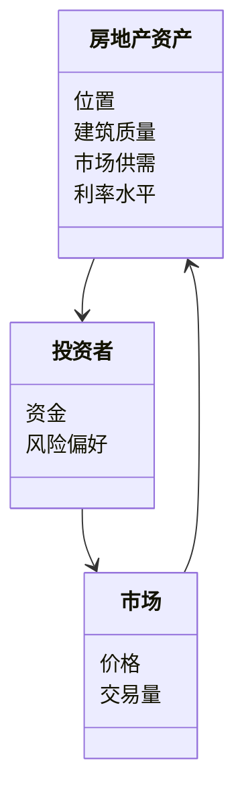
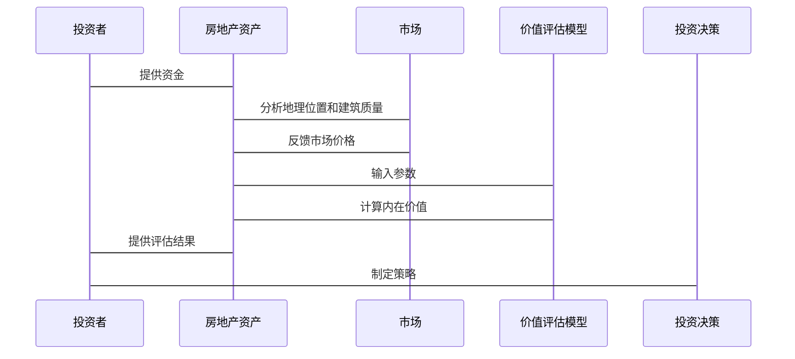

                 


# 盖伊·斯皮尔的房地产价值投资：另一种形式的价值发现

> 关键词：房地产价值投资，盖伊·斯皮尔，价值发现，现金流折现模型，资本化率，房地产市场周期，投资策略

> 摘要：本文将深入探讨盖伊·斯皮尔在房地产价值投资中的独特方法，分析其背后的数学模型和算法原理，结合实际案例，提供从理论到实践的系统性指导，帮助读者掌握房地产价值投资的核心要义。

---

# 第一部分: 房地产价值投资的背景与核心概念

## 第1章: 价值投资的基本概念

### 1.1 价值投资的定义与特点

#### 1.1.1 价值投资的定义
价值投资是一种以低于其内在价值的价格购买优质资产的投资策略。其核心在于识别市场价格与内在价值之间的差异，并在价格低估时买入，价格高估时卖出。

#### 1.1.2 价值投资的核心特点
- **长期导向**：关注长期价值，而非短期价格波动。
- **安全边际**：买入价格低于内在价值，以降低风险。
- **逆周期性**：在市场低迷时寻找投资机会，避免追高。

#### 1.1.3 价值投资与其它投资策略的区别
- **技术分析**：依赖价格图表和交易量数据，注重短期价格波动。
- **基本面分析**：关注财务报表和企业基本面，寻找被低估的价值标的。
- **价值投资**：结合基本面分析，强调安全边际和长期价值。

### 1.2 房地产市场的特点

#### 1.2.1 房地产市场的基本特征
房地产市场具有以下特点：
- **低流动性**：房地产资产难以快速变现。
- **高杠杆性**：通常需要借款购买，放大收益和风险。
- **区域性**：房地产价值受地理位置影响显著。

#### 1.2.2 房地产市场的周期性分析
房地产市场通常呈现周期性波动，包括以下几个阶段：
1. **复苏阶段**：市场从低谷开始逐步回升。
2. **繁荣阶段**：市场需求激增，价格上涨。
3. **衰退阶段**：市场供大于求，价格下跌。
4. **萧条阶段**：市场交易量低，价格持续下降。

#### 1.2.3 房地产市场的风险与机会
- **风险**：市场波动、政策变化、经济周期等。
- **机会**：通过价值发现，在市场低估时买入优质资产。

### 1.3 盖伊·斯皮尔的价值投资方法

#### 1.3.1 盖伊·斯皮尔的简介
盖伊·斯皮尔（Guy Spier）是一位成功的投资经理，以其在房地产价值投资领域的卓越表现而闻名。

#### 1.3.2 盖伊·斯皮尔的投资理念
- **安全边际**：买入价格低于内在价值。
- **逆周期投资**：在市场低迷时寻找机会。
- **长期持有**：关注资产的长期增值。

#### 1.3.3 盖伊·斯皮尔的房地产投资策略
- **精选资产**：选择地理位置优越、具备增值潜力的房地产。
- **合理估值**：通过现金流折现模型和资本化率等方法评估资产价值。
- **分散投资**：降低单一资产的风险。

## 第2章: 房地产价值投资的核心概念

### 2.1 房地产价值的核心要素

#### 2.1.1 房地产的内在价值
内在价值是基于资产未来现金流的现值。公式为：
$$ V = \frac{C}{r} $$
其中，$C$ 是未来现金流，$r$ 是折现率。

#### 2.1.2 房地产的市场价值
市场价值是资产在当前市场条件下的交易价格，受市场供需关系影响。

#### 2.1.3 房地产的价值驱动因素
| 因素       | 描述                               |
|------------|------------------------------------|
| 位置       | 地理位置对价值影响最大。           |
| 建筑质量   | 资产的物理状况影响其使用寿命。       |
| 市场供需   | 供需关系决定市场价格。             |
| 利率水平   | 利率变化影响现金流折现值。         |

### 2.2 房地产投资的数学模型

#### 2.2.1 房地产价值的评估方法
常用的评估方法包括：
1. 现金流折现模型（DCF）。
2. 资本化率法（Cap Rate）。
3. 比较法（Comparables）。

#### 2.2.2 现金流折现模型
现金流折现模型（DCF）用于估算房地产的内在价值。公式为：
$$ V = \sum_{t=1}^{n} \frac{CF_t}{(1 + r)^t} $$
其中，$CF_t$ 是第 t 年的现金流，$r$ 是折现率，$n$ 是资产的寿命。

#### 2.2.3 资本化率的计算公式
资本化率（Cap Rate）是衡量房地产投资回报的重要指标，公式为：
$$ \text{Cap Rate} = \frac{\text{ NOI }}{ \text{ Property Value} } $$
其中，NOI 是净运营收益。

### 2.3 房地产市场的周期性分析

#### 2.3.1 房地产市场的周期性特征
房地产市场通常呈现周期性波动，包括复苏、繁荣、衰退和萧条四个阶段。

#### 2.3.2 房地产市场的周期性与投资策略
在周期的不同阶段，投资策略应相应调整：
- **复苏阶段**：逐步增加投资。
- **繁荣阶段**：谨慎投资，避免追高。
- **衰退阶段**：寻找低估资产。
- **萧条阶段**：积极买入优质资产。

#### 2.3.3 盖伊·斯皮尔对周期性市场的应对策略
盖伊·斯皮尔通过逆周期投资，在市场低迷时寻找低估资产，避免在繁荣时期过度投资。

---

# 第二部分: 房地产价值投资的数学模型与算法原理

## 第3章: 房地产价值评估的数学模型

### 3.1 现金流折现模型

#### 3.1.1 现金流折现模型的定义
现金流折现模型（DCF）通过将未来现金流折现，计算资产的内在价值。

#### 3.1.2 现金流折现模型的公式
$$ V = \sum_{t=1}^{n} \frac{CF_t}{(1 + r)^t} $$
其中，$CF_t$ 是第 t 年的现金流，$r$ 是折现率，$n$ 是资产的寿命。

#### 3.1.3 现金流折现模型的计算步骤
1. **预测未来现金流**：估计资产在各年的现金流。
2. **选择折现率**：根据市场利率和风险偏好选择合适的折现率。
3. **计算现值**：将各年的现金流折现求和，得到资产的内在价值。

#### 3.1.4 现金流折现模型的优缺点
- **优点**：考虑了时间价值，提供资产的内在价值。
- **缺点**：现金流预测具有主观性，折现率的选择影响结果。

### 3.2 资本化率的计算

#### 3.2.1 资本化率的定义
资本化率（Cap Rate）是衡量房地产投资回报的重要指标。

#### 3.2.2 资本化率的计算公式
$$ \text{Cap Rate} = \frac{\text{ NOI }}{ \text{ Property Value} } $$
其中，NOI 是净运营收益，Property Value 是房地产的市场价值。

#### 3.2.3 资本化率的优缺点
- **优点**：简单易用，便于比较不同资产的回报率。
- **缺点**：受市场价值影响，波动较大。

### 3.3 现金流折现模型与资本化率的对比

| 指标         | 现金流折现模型                | 资本化率                  |
|--------------|------------------------------|---------------------------|
| 定义         | 基于未来现金流的现值计算      | 基于净运营收益与市场价值  |
| 计算公式     | $$ V = \sum_{t=1}^{n} \frac{CF_t}{(1 + r)^t} $$ | $$ \text{Cap Rate} = \frac{\text{ NOI }}{ \text{ Property Value} } $$ |
| 优点         | 考虑时间价值，精确评估内在价值 | 简单易用，便于比较不同资产 |
| 缺点         | 现金流预测和折现率选择主观    | 受市场价值影响，波动较大  |

### 3.4 现金流折现模型的实现步骤

#### 3.4.1 问题场景
假设我们有一个房地产项目，年现金流分别为 100 万元、120 万元和 150 万元，折现率为 8%。

#### 3.4.2 算法实现
```python
def npv(cash_flows, discount_rate):
    npv_value = 0
    for t, cash_flow in enumerate(cash_flows, 1):
        npv_value += cash_flow / (1 + discount_rate) ** t
    return npv_value

cash_flows = [100, 120, 150]
discount_rate = 0.08

value = npv(cash_flows, discount_rate)
print(f"房地产的内在价值为：{value:.2f} 万元")
```

#### 3.4.3 结果分析
运行上述代码，计算结果为：
$$ V = \frac{100}{1.08} + \frac{120}{1.08^2} + \frac{150}{1.08^3} \approx 273.21 \text{ 万元} $$

---

## 第4章: 房地产价值投资的系统架构设计

### 4.1 系统功能设计

#### 4.1.1 领域模型


#### 4.1.2 系统架构


### 4.2 系统架构设计

#### 4.2.1 系统组件
- **投资者**：投资者提供资金和风险偏好。
- **房地产资产**：地理位置、建筑质量和市场供需等因素影响资产价值。
- **市场**：市场价格和交易量受供需关系影响。
- **价值评估模型**：基于现金流折现模型和资本化率等方法评估资产价值。
- **投资决策**：根据评估结果制定投资策略。

#### 4.2.2 系统交互


---

## 第5章: 房地产价值投资的项目实战

### 5.1 项目背景

#### 5.1.1 项目介绍
我们选择一个地理位置优越的商业综合体作为投资标的，评估其内在价值。

### 5.2 环境安装

#### 5.2.1 安装Python
```bash
python --version
pip install numpy pandas
```

### 5.3 核心代码实现

#### 5.3.1 现金流折现模型的实现
```python
import numpy as np

def npv(cash_flows, discount_rate):
    return np.sum(cash_flows / (1 + discount_rate) ** np.arange(1, len(cash_flows)+1))

cash_flows = [100, 120, 150]
discount_rate = 0.08

value = npv(cash_flows, discount_rate)
print(f"房地产的内在价值为：{value:.2f} 万元")
```

#### 5.3.2 资本化率的实现
```python
def cap_rate(NOI, property_value):
    return NOI / property_value

NOI = 80  # 净运营收益
property_value = 1000  # 房地产市场价值

rate = cap_rate(NOI, property_value)
print(f"资本化率为：{rate:.2f}%")
```

### 5.4 实际案例分析

#### 5.4.1 案例介绍
某商业综合体的年现金流为 100 万元、120 万元和 150 万元，折现率为 8%。

#### 5.4.2 代码实现
```python
cash_flows = [100, 120, 150]
discount_rate = 0.08

value = npv(cash_flows, discount_rate)
print(f"房地产的内在价值为：{value:.2f} 万元")
```

#### 5.4.3 结果分析
房地产的内在价值为约 273.21 万元。

---

## 第6章: 房地产价值投资的最佳实践

### 6.1 小结

#### 6.1.1 核心要点总结
- 理解房地产价值投资的核心概念。
- 掌握现金流折现模型和资本化率的计算方法。
- 分析房地产市场的周期性，制定相应的投资策略。

### 6.2 投资中的注意事项

#### 6.2.1 风险控制
- 选择优质资产，降低投资风险。
- 设定止损点，避免过度损失。

#### 6.2.2 市场分析
- 关注宏观经济指标，如 GDP、利率和就业数据。
- 研究房地产市场的供需关系。

### 6.3 拓展阅读

#### 6.3.1 推荐书籍
- 《房地产投资：从入门到精通》
- 《价值投资实战手册》

#### 6.3.2 网站和工具
- [财经数据网站](https://www.realestate.com)
- [数据分析工具](https://www.python.org)

---

# 结语

通过本文的系统性分析，我们深入探讨了盖伊·斯皮尔的房地产价值投资方法，从理论到实践，提供了详细的指导。希望读者能够通过本文，掌握房地产价值投资的核心要义，实现稳健的投资回报。

