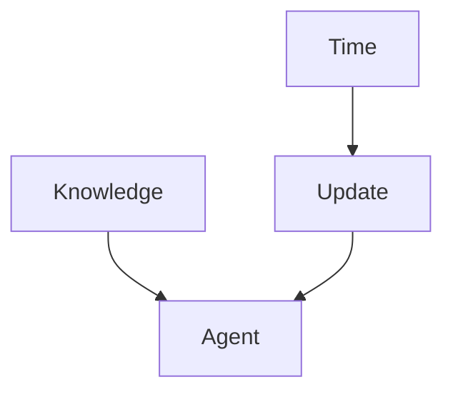
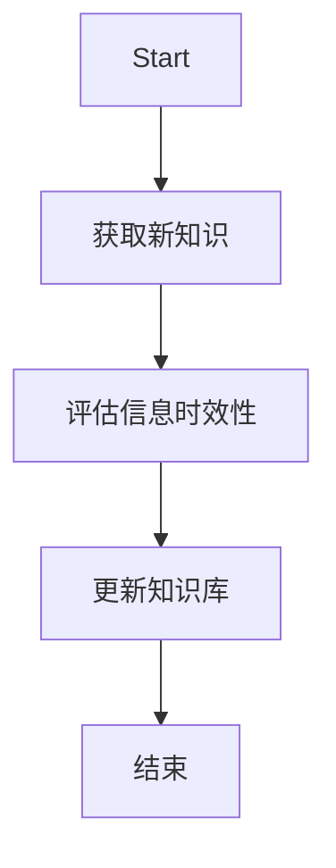
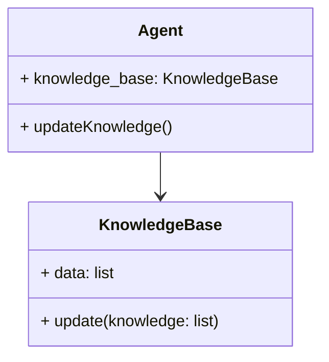
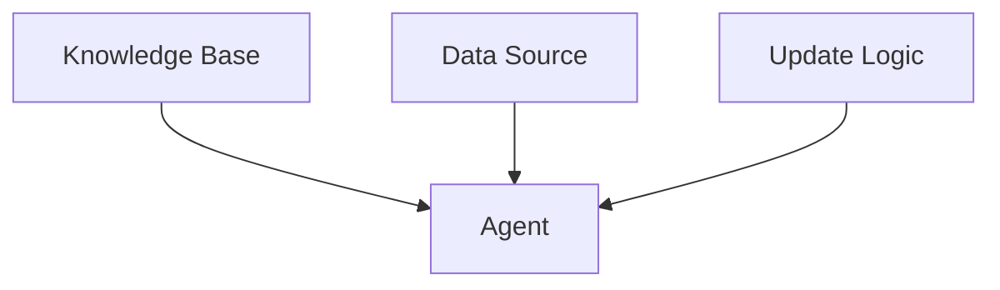

                 


# 知识更新：保持AI Agent信息的时效性

## 关键词：AI Agent, 知识更新, 信息时效性, 算法原理, 系统架构设计, 项目实战, 最佳实践

## 摘要：本文深入探讨了在AI Agent开发中保持信息时效性的关键方法和实现策略。文章从背景、核心概念、算法原理、系统架构设计、项目实战到最佳实践，全面分析了如何确保AI Agent的知识始终保持最新，以应对快速变化的信息环境。通过详细的技术分析和实际案例，本文为AI开发者提供了实用的指导和启示。

---

# 第一部分: 保持AI Agent信息时效性的背景与概念

## 第1章: 知识更新与AI Agent概述

### 1.1 问题背景

#### 1.1.1 AI Agent的核心概念
AI Agent（人工智能代理）是指能够感知环境、自主决策并执行任务的智能体。它依赖于知识库中的信息来完成任务，这些信息包括数据、规则和模型。然而，随着环境的变化，知识库中的信息可能会过时，导致AI Agent的性能下降甚至失效。

#### 1.1.2 知识更新的必要性
- **信息变化**：现实世界中的数据和规则不断变化，AI Agent需要及时更新知识以适应新环境。
- **任务需求**：不同任务可能需要不同的知识，动态更新知识可以提高任务执行的效率。
- **错误修正**：旧知识可能包含错误或不准确的信息，知识更新可以消除这些问题。

#### 1.1.3 信息时效性问题的提出
信息时效性是指信息在特定时间内的有效性和相关性。AI Agent的知识库需要定期更新，以确保其信息是最新且准确的。否则，过时的信息会导致决策错误，影响AI Agent的性能。

### 1.2 问题描述

#### 1.2.1 AI Agent的信息更新需求
- **实时性**：某些任务需要实时更新的信息，例如实时监控系统。
- **周期性**：某些知识可以按固定周期更新，例如每天、每周或每月。
- **触发性**：某些更新是基于特定事件触发的，例如检测到新数据或错误。

#### 1.2.2 信息时效性对AI性能的影响
- **准确性**：过时的信息可能导致决策错误。
- **效率**：旧知识可能影响任务执行的效率。
- **用户体验**：信息过时可能导致用户体验下降。

#### 1.2.3 知识更新的挑战与复杂性
- **数据获取**：如何高效获取新数据并更新知识库。
- **知识表示**：如何表示知识以支持动态更新。
- **更新策略**：如何选择更新的频率和粒度，以平衡性能和资源消耗。

### 1.3 问题解决

#### 1.3.1 知识更新的解决方案
- **持续学习**：通过持续学习算法，AI Agent可以逐步更新知识库。
- **在线更新**：实时或定期从数据源获取新信息并更新知识库。
- **增量更新**：只更新变化的部分，减少计算开销。

#### 1.3.2 信息时效性的实现方法
- **时间戳机制**：记录信息的有效期，过期后自动更新。
- **版本控制**：记录知识的版本，确保使用最新版本。
- **反馈机制**：根据用户反馈或任务结果调整知识库。

#### 1.3.3 AI Agent自我更新的机制设计
- **自我监控**：AI Agent监控知识库的状态，识别需要更新的部分。
- **自我学习**：通过机器学习算法自动更新知识库。
- **自我修复**：修复知识库中的错误或不一致。

### 1.4 边界与外延

#### 1.4.1 知识更新的边界条件
- **知识类型**：不同类型的知识更新需求不同，例如规则、数据、模型。
- **更新范围**：知识更新可以是局部或全局的，取决于任务需求。
- **资源限制**：更新频率和粒度受计算资源和时间的限制。

#### 1.4.2 信息时效性的适用范围
- **实时系统**：需要实时更新信息的任务。
- **离线系统**：可以定期更新知识的任务。
- **混合系统**：结合实时和离线更新的混合系统。

#### 1.4.3 AI Agent更新的限制与约束
- **计算能力**：更新过程需要足够的计算资源。
- **数据源**：依赖可靠的数据源提供新信息。
- **更新策略**：需要合理设计更新策略以平衡性能和资源。

### 1.5 概念结构与核心要素

#### 1.5.1 知识更新的核心要素
- **知识库**：存储知识的结构化数据。
- **更新机制**：实现知识更新的方法和流程。
- **触发条件**：启动知识更新的条件或事件。

#### 1.5.2 信息时效性的关键属性
- **时间戳**：记录信息的有效期。
- **版本号**：标识信息的版本。
- **更新频率**：信息更新的周期和频率。

#### 1.5.3 AI Agent更新的系统架构
- **感知层**：感知环境变化并触发更新。
- **知识层**：存储和管理知识。
- **执行层**：根据更新后的知识执行任务。

### 1.6 本章小结
本章介绍了AI Agent知识更新的背景、必要性、挑战和解决方案。通过分析信息时效性对AI性能的影响，提出了知识更新的策略和机制设计。明确了知识更新的核心要素和系统架构，为后续章节的深入分析奠定了基础。

---

## 第2章: AI Agent与知识更新的核心概念

### 2.1 核心概念原理

#### 2.1.1 AI Agent的知识表示
知识表示是AI Agent理解世界的方式，常见的表示方法包括：
- **符号表示**：使用符号逻辑表示规则和事实。
- **框架表示**：使用框架结构表示对象及其属性。
- **语义网络**：通过节点和边表示概念及其关系。

#### 2.1.2 信息时效性的衡量标准
信息时效性可以通过以下指标衡量：
- **新鲜度**：信息的生成时间和当前时间的差距。
- **相关性**：信息与当前任务的相关程度。
- **准确性**：信息的正确性和可靠性。

#### 2.1.3 知识更新的触发机制
知识更新可以通过以下方式触发：
- **时间触发**：基于时间戳，定期或到期更新。
- **事件触发**：检测到特定事件后触发更新。
- **反馈触发**：根据用户反馈或任务结果触发更新。

### 2.2 核心概念属性对比

#### 2.2.1 知识更新的频率与粒度
- **频率**：知识更新的周期，例如实时、 hourly、daily。
- **粒度**：知识更新的范围，例如局部更新、全局更新。

#### 2.2.2 信息时效性的评估指标
- **新鲜度**：信息的时间相关性。
- **一致性**：信息与现实的一致程度。
- **完整性**：信息的全面性。

#### 2.2.3 AI Agent更新的性能对比
- **更新时间**：更新操作所需的时间。
- **资源消耗**：更新过程占用的计算资源。
- **更新效果**：更新后知识库的准确性和完整性。

### 2.3 ER实体关系图



### 2.4 本章小结
本章详细分析了AI Agent知识更新的核心概念，包括知识表示、信息时效性衡量标准和知识更新的触发机制。通过ER实体关系图展示了知识、更新和时间之间的关系，为后续章节的算法设计提供了基础。

---

## 第3章: 保持AI Agent信息时效性的算法原理

### 3.1 算法原理概述

#### 3.1.1 知识更新的基本原理
知识更新的基本原理是通过算法从数据源获取新信息，然后更新知识库。常见的算法包括：
- **增量学习**：仅更新变化的部分。
- **在线学习**：实时更新知识库。
- **主动学习**：根据需要选择性更新。

#### 3.1.2 信息时效性的算法框架
信息时效性的算法框架包括以下几个步骤：
1. **数据获取**：从数据源获取新信息。
2. **信息处理**：对新信息进行清洗、转换和预处理。
3. **知识更新**：将新信息整合到知识库中。
4. **验证评估**：评估更新后的知识是否满足时效性要求。

#### 3.1.3 AI Agent自我更新的核心算法
AI Agent自我更新的核心算法包括：
- **监督学习算法**：基于标记数据进行知识更新。
- **无监督学习算法**：基于无标记数据进行知识发现。
- **强化学习算法**：通过奖励机制优化知识更新策略。

### 3.2 算法流程图



### 3.3 算法实现代码

```python
def update_knowledge_base(new_info):
    # 知识库更新逻辑
    knowledge_base = update(knowledge_base, new_info)
    return knowledge_base
```

### 3.4 算法数学模型

信息时效性的评估可以通过以下公式计算：
$$
\text{时效性} = \frac{\text{当前时间} - \text{信息生成时间}}{\text{信息有效期}}
$$

### 3.5 本章小结
本章详细讲解了保持AI Agent信息时效性的算法原理，包括知识更新的基本原理、算法框架和核心算法。通过流程图和代码示例，展示了知识更新的具体实现步骤。

---

## 第4章: 系统架构设计

### 4.1 问题场景介绍

#### 4.1.1 问题场景概述
在本章中，我们将设计一个AI Agent系统，该系统能够实时更新知识库以保持信息的时效性。系统需要支持多种更新方式，包括实时更新和按需更新。

#### 4.1.2 项目介绍
本项目旨在开发一个高效的AI Agent系统，能够根据环境变化动态更新知识库，确保信息的最新性和准确性。

### 4.2 系统功能设计

#### 4.2.1 领域模型类图



#### 4.2.2 系统架构设计



#### 4.2.3 系统接口设计
- **获取新知识接口**：从数据源获取新信息。
- **更新知识库接口**：将新信息整合到知识库中。
- **评估时效性接口**：评估信息的时效性并决定是否更新。

#### 4.2.4 系统交互序列图

```mermaid
graph TD
A[Agent] --> B[Knowledge Base]: 获取知识
B --> C[Data Source]: 请求新数据
C --> B: 返回新数据
B --> D[Update Logic]: 更新知识库
D --> A: 更新完成
```

### 4.3 本章小结
本章详细设计了AI Agent系统的架构，包括领域模型类图、系统架构图和交互序列图。通过接口设计和系统交互图，展示了系统的实现方式和工作流程。

---

## 第5章: 项目实战

### 5.1 环境安装

#### 5.1.1 系统要求
- 操作系统：Linux/Windows/MacOS
- Python版本：3.6+
- 开发工具：PyCharm/VS Code

#### 5.1.2 依赖安装
```bash
pip install mermaid
pip install matplotlib
```

### 5.2 系统核心实现源代码

#### 5.2.1 知识库更新模块

```python
class KnowledgeBase:
    def __init__(self):
        self.data = {}

    def update(self, new_info):
        # 更新知识库逻辑
        self.data.update(new_info)
        return self.data
```

#### 5.2.2 AI Agent实现模块

```python
class Agent:
    def __init__(self, knowledge_base):
        self.knowledge_base = knowledge_base

    def updateKnowledge(self):
        # 获取新信息
        new_info = self.getSourceData()
        # 更新知识库
        self.knowledge_base.update(new_info)

    def getSourceData(self):
        # 获取新信息逻辑
        return {"new_key": "new_value"}
```

### 5.3 代码应用解读与分析

#### 5.3.1 知识库更新模块解读
- `KnowledgeBase`类负责存储和更新知识库数据。
- `update`方法接收新信息并将其整合到现有数据中。

#### 5.3.2 AI Agent实现模块解读
- `Agent`类负责协调知识库的更新过程。
- `updateKnowledge`方法获取新信息并调用知识库的更新方法。

### 5.4 实际案例分析和详细讲解剖析

#### 5.4.1 案例背景
假设我们有一个AI Agent，用于实时监控股票市场。股票价格不断变化，AI Agent需要定期更新其知识库中的股票数据。

#### 5.4.2 实施步骤
1. **获取新数据**：从股票市场数据源获取最新的股票价格。
2. **更新知识库**：将新数据整合到知识库中。
3. **评估时效性**：检查更新后的数据是否满足时效性要求。

### 5.5 项目小结
本章通过实际案例分析，展示了如何在项目中实现AI Agent的知识更新功能。通过代码实现和案例分析，帮助读者理解如何在实际应用中保持信息的时效性。

---

## 第6章: 最佳实践、小结、注意事项、拓展阅读

### 6.1 最佳实践

#### 6.1.1 更新策略
- **定期更新**：根据任务需求设定合理的更新频率。
- **增量更新**：仅更新变化的部分，减少资源消耗。
- **混合更新**：结合实时和周期性更新，平衡实时性和资源消耗。

#### 6.1.2 信息管理
- **数据源选择**：选择可靠的数据源，确保新信息的准确性和相关性。
- **数据预处理**：清洗和转换数据，确保数据质量。
- **版本控制**：记录知识库的版本，便于回滚和管理。

#### 6.1.3 系统优化
- **并行处理**：利用多线程或多进程技术，提高更新效率。
- **缓存机制**：使用缓存技术减少重复计算。
- **错误处理**：设计完善的错误处理机制，确保更新过程的健壮性。

### 6.2 小结
本文详细探讨了保持AI Agent信息时效性的方法和实现策略，从背景、核心概念、算法原理到系统架构设计和项目实战，全面分析了如何确保AI Agent的知识始终保持最新。通过实际案例和最佳实践，为读者提供了实用的指导和启示。

### 6.3 注意事项

#### 6.3.1 数据源的可靠性
确保数据源的可靠性和稳定性，避免因数据源问题导致知识更新失败。

#### 6.3.2 更新频率的合理性
根据任务需求合理设定更新频率，避免过于频繁的更新导致资源消耗过大，或过于稀疏的更新导致信息过时。

#### 6.3.3 知识表示的规范性
确保知识表示的规范性和一致性，便于知识的更新和管理。

### 6.4 拓展阅读

#### 6.4.1 继续深入学习
- **持续学习算法**：研究如何实现更高效的持续学习算法。
- **分布式知识库**：探索分布式知识库的设计与实现。

#### 6.4.2 实际应用
- **实时系统优化**：研究如何在实时系统中高效实现知识更新。
- **领域特定优化**：针对特定领域设计优化的知识更新策略。

---

## 结语

保持AI Agent信息的时效性是确保其性能和准确性的重要环节。通过本文的深入分析，读者可以了解如何从理论到实践，系统地实现AI Agent的知识更新。未来，随着技术的发展，知识更新的方法和算法将更加多样化和智能化，为AI Agent的应用带来更广阔的前景。

