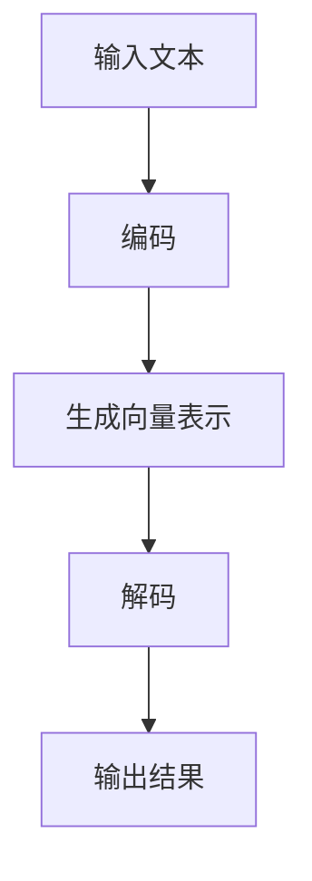
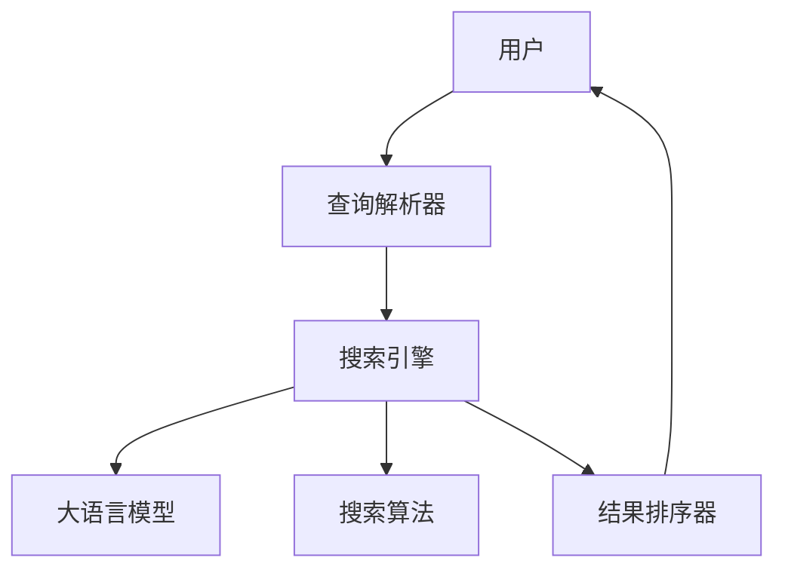
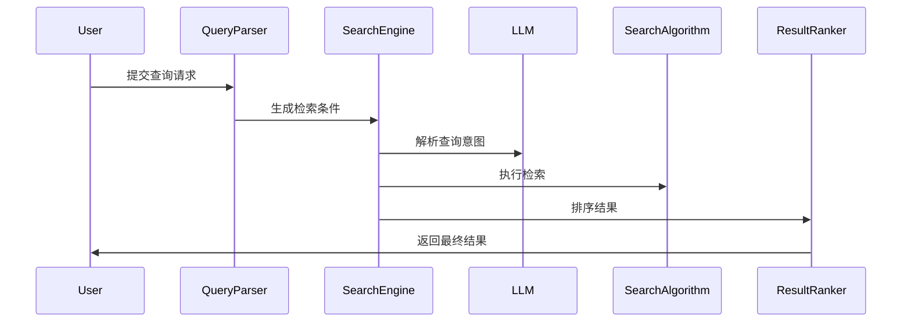

                 


# 知识检索增强型AI Agent：结合LLM与高级搜索算法

## 关键词：
知识检索，AI Agent，大语言模型，LLM，高级搜索算法，信息检索，自然语言处理

## 摘要：
本文详细探讨了知识检索增强型AI Agent的构建方法，结合大语言模型（LLM）与高级搜索算法，以提升知识检索的效率和准确性。通过分析LLM与高级搜索算法的协同工作原理，本文提出了系统化的解决方案，并通过实际案例展示了如何在不同场景中应用这些技术。文章内容包括背景介绍、核心概念、算法原理、系统架构设计、项目实战以及最佳实践，旨在为读者提供全面的技术指导。

---

# 第一部分: 知识检索增强型AI Agent概述

## 第1章: 知识检索增强型AI Agent的背景与问题背景

### 1.1 知识检索增强型AI Agent的背景
#### 1.1.1 AI Agent的基本概念
AI Agent（人工智能代理）是指能够感知环境、自主决策并执行任务的智能体。它通过与用户交互或外部系统的接口，完成信息检索、数据分析、决策支持等任务。在知识检索领域，AI Agent的主要目标是帮助用户高效地获取所需信息。

#### 1.1.2 知识检索在AI Agent中的重要性
知识检索是AI Agent的核心能力之一。它决定了AI Agent能否准确理解用户的需求，并从海量数据中提取有用的信息。传统的知识检索方法依赖于关键词匹配和简单的模式匹配，但随着数据量的爆炸式增长，这种方法已难以满足复杂场景下的检索需求。

#### 1.1.3 LLM与高级搜索算法的结合
大语言模型（LLM）如GPT-3、PaLM等，具有强大的文本理解和生成能力。然而，LLM本身并不擅长处理复杂的搜索任务，如多条件过滤、排序和推荐。因此，将LLM与高级搜索算法相结合，可以充分发挥两者的优点，弥补各自的不足。

### 1.2 问题背景与问题描述
#### 1.2.1 知识检索中的传统挑战
传统的知识检索系统存在以下问题：
- **准确性不足**：基于关键词的检索容易产生大量无关结果。
- **效率低下**：面对海量数据，传统检索算法的效率难以满足实时性要求。
- **语义理解弱**：无法有效处理用户的模糊查询或自然语言表达的需求。

#### 1.2.2 LLM在知识检索中的优势
- **强大的语义理解能力**：LLM能够准确理解用户的查询意图，生成更相关的检索结果。
- **动态推理能力**：LLM可以通过上下文推理，提供更精准的检索范围。

#### 1.2.3 高级搜索算法的必要性
高级搜索算法（如BM25、DPR、BERT-based retrieval等）在处理复杂检索任务时表现优异。它们结合了语言模型和搜索算法的优势，能够更好地应对大规模数据检索、多条件过滤、排序等问题。

---

## 第2章: 核心概念与联系

### 2.1 LLM与高级搜索算法的核心原理
#### 2.1.1 LLM的工作原理
LLM通过预训练掌握了大规模文本数据中的语义关系，能够根据输入生成相关的文本输出。在知识检索中，LLM可以用于解析用户的查询意图、生成检索关键词、评估检索结果的相关性等。

#### 2.1.2 高级搜索算法的核心原理
高级搜索算法通过优化检索策略，提升检索效率和准确性。例如，BM25算法通过计算查询词在文档中的概率，生成更相关的检索结果；DPR算法通过将文本转化为向量表示，利用向量相似度进行检索。

#### 2.1.3 两者的结合与协同
通过结合LLM的语义理解能力和高级搜索算法的优化能力，可以实现以下目标：
- **提升检索准确性**：LLM帮助筛选出更相关的检索结果。
- **提高检索效率**：高级搜索算法优化了检索过程，降低了计算成本。

### 2.2 核心概念对比与ER实体关系图
#### 2.2.1 LLM与传统搜索算法的属性特征对比

| 特性            | LLM                     | 传统搜索算法                 |
|-----------------|--------------------------|------------------------------|
| **核心能力**    | 语义理解与生成能力       | 关键词匹配与模式匹配         |
| **计算复杂度**   | 高，依赖大规模预训练模型 | 较低，基于索引结构优化       |
| **应用场景**     | 复杂语义理解、对话系统     | 简单查询、结构化数据检索     |

#### 2.2.2 ER实体关系图展示
```mermaid
er
    entity(LLM) {
        id
        parameters
        model
    }
    entity(SearchAlgorithm) {
        id
        type
        parameters
    }
    relationship(Combination) {
        LLM.id
        SearchAlgorithm.id
    }
```

---

## 第3章: 算法原理讲解与数学模型

### 3.1 LLM的算法流程


### 3.2 高级搜索算法的数学模型
#### 3.2.1 余弦相似度
$$\text{similarity} = \frac{\vec{A} \cdot \vec{B}}{|\vec{A}| \cdot |\vec{B}|}$$

#### 3.2.2 BM25算法
BM25是一种基于概率的检索算法，其公式如下：
$$\text{score}(d, q) = \sum_{i=1}^{n} \text{idf}(q_i) \cdot \frac{\text{tf}(q_i, d)}{\text{tf}(q_i, d) + k} \cdot (k + 1)$$
其中：
- $\text{tf}(q_i, d)$：在文档$d$中查询词$q_i$的出现次数。
- $\text{idf}(q_i)$：查询词$q_i$的逆文档频率。
- $k$：平滑参数。

---

## 第4章: 系统分析与架构设计方案

### 4.1 问题场景介绍
假设我们正在开发一个智能问答系统，用户可以通过自然语言提问，系统需要从知识库中快速检索出相关答案。

### 4.2 系统功能设计
- **查询解析**：将用户的自然语言查询转换为结构化的检索条件。
- **检索执行**：结合LLM和高级搜索算法，执行高效的知识检索。
- **结果排序**：根据检索结果的相关性进行排序，并返回给用户。

### 4.3 系统架构设计


### 4.4 接口与交互设计


---

## 第5章: 项目实战

### 5.1 环境安装
- **Python 3.8+**
- **LLM模型**：如Hugging Face的Bert-for-PreTraining
- **搜索算法库**：如rank-bm25

### 5.2 核心代码实现
#### 5.2.1 LLM查询解析
```python
def parse_query(query):
    # 使用LLM解析查询意图
    parsed_query = model.generate(query)
    return parsed_query
```

#### 5.2.2 高级搜索算法实现
```python
from rank_bm25 import BM25

def bm25_search(corpus, query, k=1):
    bm25 = BM25(corpus)
    scores = bm25.get_scores(query)
    results = sorted(zip(scores, corpus), key=lambda x: x[0], reverse=True)
    return results
```

#### 5.2.3 系统交互
```python
def main():
    query = input("请输入查询：")
    parsed = parse_query(query)
    results = bm25_search(parsed)
    for score, doc in results:
        print(f"得分：{score}\n文档：{doc}\n")
```

### 5.3 实际案例分析
假设我们的知识库包含以下文档：
1. "Python是一种编程语言。"
2. "Python支持面向对象编程。"
3. "Python是解释型语言。"

用户查询：“什么是Python？”
- **LLM解析**：生成查询条件“编程语言”。
- **BM25检索**：返回所有文档，其中文档1得分最高。
- **结果排序**：返回文档1。

---

## 第6章: 最佳实践 tips、小结、注意事项、拓展阅读

### 6.1 小结
本文详细介绍了知识检索增强型AI Agent的构建方法，结合了大语言模型和高级搜索算法的优势，解决了传统检索方法的不足。

### 6.2 注意事项
- 在实际应用中，需要根据具体场景选择合适的算法组合。
- 需要对数据进行充分的预处理，以提升检索效率。
- 定期更新知识库，以保持检索结果的准确性。

### 6.3 拓展阅读
- [Hugging Face的Transformers库](https://huggingface.co/transformers)
- [BM25算法实现](https://github.com/castor robotics/ranker)
- [深度求索实验室](https://github.com/deepseek)

---

通过本文的系统讲解和实际案例，读者可以全面理解知识检索增强型AI Agent的核心原理和实现方法，并能够将其应用到实际项目中。

