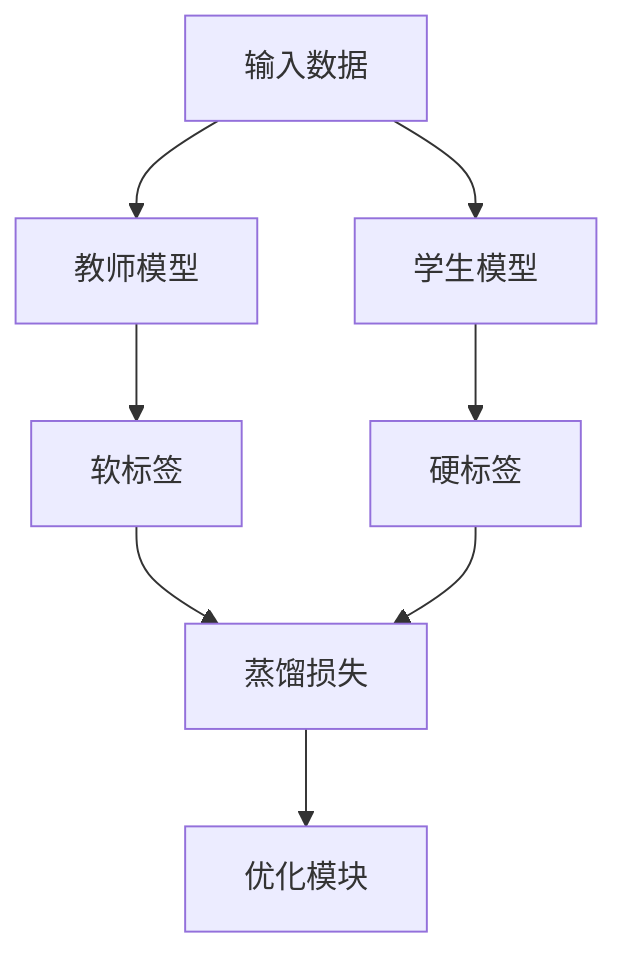
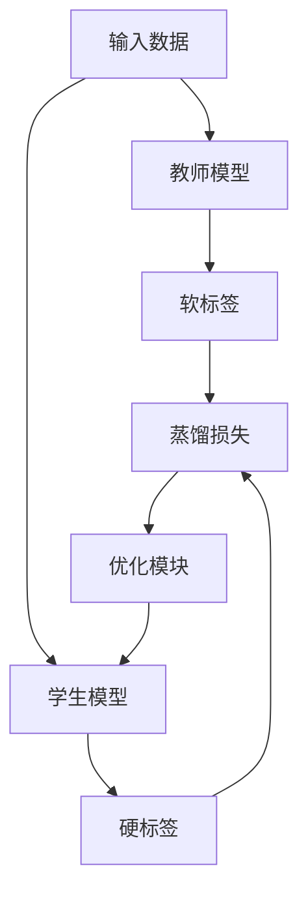
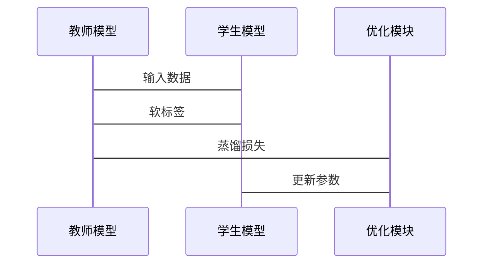

                 


# 知识蒸馏在AI Agent轻量化中的应用

> 关键词：知识蒸馏，AI Agent，轻量化，模型压缩，深度学习

> 摘要：知识蒸馏是一种有效的模型压缩技术，通过将大模型的知识迁移到小模型中，从而降低模型的复杂度，提升运行效率。本文将深入探讨知识蒸馏在AI Agent轻量化中的应用，从理论基础到实际应用，系统性地分析其优势、挑战及解决方案。

---

# 第1章 知识蒸馏的基本概念与背景

## 1.1 知识蒸馏的定义与核心概念

知识蒸馏（Knowledge Distillation）是一种模型压缩技术，旨在将大型复杂的模型（教师模型）的知识迁移到较小的、更高效的模型（学生模型）中。通过蒸馏过程，学生模型能够继承教师模型的决策能力和特征提取能力，同时显著降低模型的计算复杂度和存储需求。

**核心概念：**
- **教师模型（Teacher Model）**：通常是一个训练好的大模型，具有较高的准确性和丰富的特征表达能力。
- **学生模型（Student Model）**：是一个较小的模型，通过蒸馏过程学习教师模型的知识。
- **蒸馏损失（Distillation Loss）**：衡量学生模型输出与教师模型输出之间差异的损失函数。

### 1.1.1 知识蒸馏的定义
知识蒸馏通过优化目标函数，使得学生模型能够学习到教师模型的决策边界和特征表达。具体而言，蒸馏损失通常定义为学生模型输出与教师模型输出之间的KL散度，从而引导学生模型逼近教师模型的预测结果。

$$ \text{KL散度} = \sum_{i} p_i \log \frac{p_i}{q_i} $$

其中，\( p_i \) 和 \( q_i \) 分别表示教师模型和学生模型在第 \( i \) 个类别的概率。

### 1.1.2 知识蒸馏的核心概念
知识蒸馏的关键在于通过损失函数的设计，将教师模型的特征和决策信息传递给学生模型。以下是知识蒸馏的几个核心概念：
- **软标签（Soft Labels）**：教师模型输出的概率分布，通常通过温度调节（temperature scaling）得到。
- **温度调节（Temperature Scaling）**：通过调整温度参数，使教师模型的输出概率分布更加平滑，从而降低对尖峰概率的依赖。
- **蒸馏损失（Distillation Loss）**：学生模型预测结果与教师模型预测结果之间的差异，是蒸馏过程的核心优化目标。

### 1.1.3 知识蒸馏与模型压缩的关系
知识蒸馏属于模型压缩技术的一种，其主要目标是降低模型的计算复杂度和存储需求，同时保持或提升模型的性能。模型压缩技术通常包括剪枝（Pruning）、量化（Quantization）、知识蒸馏（Distillation）等多种方法。知识蒸馏的优势在于它能够通过知识传递的方式，将大模型的性能迁移到小模型中，而无需依赖于复杂的剪枝或量化操作。

---

## 1.2 AI Agent的定义与特点

AI Agent（人工智能代理）是指能够感知环境、自主决策并执行任务的智能体。AI Agent的核心特点包括：
- **自主性**：能够在没有外部干预的情况下独立运行。
- **反应性**：能够实时感知环境并做出响应。
- **目标导向性**：具有明确的目标，并通过行为选择来优化目标的实现。
- **学习能力**：能够通过与环境的交互学习新的知识和技能。

### 1.2.1 AI Agent的基本定义
AI Agent是一种能够执行特定任务的智能体，通常由感知模块、决策模块和执行模块组成。AI Agent的目标是通过感知环境、分析信息并做出决策，从而实现预定任务。

### 1.2.2 AI Agent的核心特点
- **自主性**：AI Agent能够独立运行，无需外部干预。
- **反应性**：能够实时感知环境变化并做出响应。
- **目标导向性**：具有明确的目标，并通过决策优化目标的实现。
- **学习能力**：能够通过与环境的交互学习新的知识和技能。

### 1.2.3 AI Agent与传统AI的区别
与传统AI相比，AI Agent具有更强的自主性和适应性。传统AI通常依赖于固定的规则和数据，而AI Agent能够动态调整行为以适应环境的变化。此外，AI Agent通常具有更强的实时决策能力，能够在复杂和动态的环境中完成任务。

---

## 1.3 知识蒸馏在AI Agent中的应用背景

### 1.3.1 AI Agent轻量化的需求
AI Agent的轻量化需求主要来源于以下几个方面：
- **计算资源的限制**：在边缘计算、物联网等场景中，AI Agent需要在资源受限的设备上运行。
- **部署的便捷性**：轻量化的AI Agent更容易部署和维护。
- **实时性要求**：轻量化能够提升AI Agent的运行效率，满足实时决策的需求。

### 1.3.2 知识蒸馏技术的优势
知识蒸馏技术在AI Agent轻量化中的优势主要体现在以下几个方面：
- **降低计算复杂度**：通过知识蒸馏，可以将大模型的知识迁移到小模型中，从而降低模型的计算复杂度。
- **提升运行效率**：轻量化的模型在推理阶段能够更快地得到结果，满足实时性要求。
- **减少存储需求**：轻量化的模型通常具有更小的参数规模，从而降低了存储需求。

### 1.3.3 知识蒸馏与AI Agent结合的潜力
知识蒸馏技术在AI Agent中的潜力主要体现在以下几个方面：
- **提升决策能力**：通过蒸馏教师模型的知识，学生模型能够继承教师模型的决策能力，从而提升AI Agent的决策性能。
- **增强泛化能力**：蒸馏过程能够将教师模型的特征和决策边界迁移到学生模型中，从而增强学生模型的泛化能力。
- **适应复杂环境**：轻量化的AI Agent能够更好地适应复杂和动态的环境，提升其在实际应用中的灵活性。

---

## 1.4 本章小结

本章主要介绍了知识蒸馏的基本概念和AI Agent的核心特点，以及知识蒸馏在AI Agent轻量化中的应用背景。通过本章的学习，读者可以了解知识蒸馏技术的基本原理和其在AI Agent中的应用潜力。

---

# 第2章 知识蒸馏的核心原理与方法

## 2.1 知识蒸馏的基本原理

知识蒸馏的核心原理是通过优化目标函数，将教师模型的知识传递给学生模型。蒸馏过程通常包括以下几个步骤：
1. **教师模型的输出**：教师模型对输入数据进行预测，生成概率分布。
2. **温度调节**：通过调整温度参数，使教师模型的输出概率分布更加平滑。
3. **蒸馏损失计算**：计算学生模型输出与教师模型输出之间的KL散度，作为蒸馏损失。
4. **学生模型优化**：通过优化算法最小化蒸馏损失，使学生模型逼近教师模型的预测结果。

### 2.1.1 知识蒸馏的定义
知识蒸馏是一种模型压缩技术，通过将教师模型的知识迁移到学生模型中，降低模型的复杂度。

### 2.1.2 知识蒸馏的核心步骤
1. 教师模型生成软标签。
2. 学生模型预测输出。
3. 计算蒸馏损失并优化学生模型。

### 2.1.3 知识蒸馏的关键技术
- **温度调节**：通过调整温度参数，使教师模型的输出概率分布更加平滑。
- **蒸馏损失计算**：计算学生模型与教师模型输出之间的KL散度。

---

## 2.2 知识蒸馏的主要方法

### 2.2.1 直接蒸馏法
直接蒸馏法是最简单的知识蒸馏方法，其核心思想是通过优化蒸馏损失，使学生模型直接逼近教师模型的预测结果。

### 2.2.2 软标签蒸馏法
软标签蒸馏法通过教师模型生成软标签（概率分布）并传递给学生模型，从而实现知识迁移。

### 2.2.3 知识蒸馏的其他变体
- **混合蒸馏法**：结合教师模型的硬标签和软标签，进行混合蒸馏。
- **自适应蒸馏法**：根据数据分布自适应地调整蒸馏过程。

---

## 2.3 知识蒸馏的优势与挑战

### 2.3.1 知识蒸馏的主要优势
- **降低计算复杂度**：通过蒸馏过程，可以将大模型的知识迁移到小模型中，从而降低计算复杂度。
- **提升模型性能**：蒸馏过程能够增强学生模型的泛化能力，提升模型性能。

### 2.3.2 知识蒸馏的主要挑战
- **温度参数的选择**：温度参数的设置对蒸馏效果有重要影响，选择合适的温度参数是一个挑战。
- **蒸馏损失的优化**：如何设计有效的蒸馏损失函数，是知识蒸馏的一个关键问题。

### 2.3.3 知识蒸馏的未来发展方向
- **多教师蒸馏**：研究如何利用多个教师模型的知识进行蒸馏。
- **自适应蒸馏**：根据数据分布自适应地调整蒸馏过程。

---

## 2.4 本章小结

本章详细介绍了知识蒸馏的核心原理与主要方法，分析了其优势与挑战，并展望了未来的发展方向。通过本章的学习，读者可以深入了解知识蒸馏技术的理论基础和实现方法。

---

# 第3章 知识蒸馏在AI Agent中的应用

## 3.1 AI Agent轻量化的需求分析

### 3.1.1 AI Agent的轻量化目标
AI Agent的轻量化目标包括降低计算复杂度、提升运行效率和减少存储需求。

### 3.1.2 轻量化对AI Agent性能的影响
轻量化可以提升AI Agent的运行效率，使其能够在资源受限的设备上运行。

### 3.1.3 轻量化对AI Agent部署的影响
轻量化能够降低部署成本，使AI Agent更容易部署和维护。

---

## 3.2 知识蒸馏在AI Agent中的具体应用

### 3.2.1 知识蒸馏在自然语言处理中的应用
通过知识蒸馏，可以将大模型的自然语言处理能力迁移到小模型中，从而实现轻量化。

### 3.2.2 知识蒸馏在计算机视觉中的应用
知识蒸馏也可以应用于计算机视觉任务，例如图像分类和目标检测。

### 3.2.3 知识蒸馏在其他AI任务中的应用
知识蒸馏技术可以应用于多种AI任务，例如语音识别和机器人控制。

---

## 3.3 知识蒸馏在AI Agent中的优势

### 3.3.1 知识蒸馏对AI Agent性能的提升
通过蒸馏过程，学生模型可以继承教师模型的决策能力和特征提取能力，从而提升性能。

### 3.3.2 知识蒸馏对AI Agent部署的优化
轻量化的AI Agent更容易部署和维护，同时能够降低运行成本。

### 3.3.3 知识蒸馏对AI Agent扩展性的增强
知识蒸馏可以增强AI Agent的扩展性，使其能够更好地适应复杂和动态的环境。

---

## 3.4 本章小结

本章主要介绍了知识蒸馏在AI Agent中的具体应用和优势，通过本章的学习，读者可以了解知识蒸馏技术在AI Agent轻量化中的实际应用价值。

---

# 第4章 知识蒸馏的算法原理与实现

## 4.1 知识蒸馏的数学模型与公式

### 4.1.1 知识蒸馏的数学模型
知识蒸馏的数学模型通常包括教师模型和学生模型的输出概率分布，以及蒸馏损失的计算。

### 4.1.2 蒸馏损失的计算公式
蒸馏损失通常定义为学生模型输出与教师模型输出之间的KL散度。

$$ \text{KL散度} = \sum_{i} p_i \log \frac{p_i}{q_i} $$

其中，\( p_i \) 和 \( q_i \) 分别表示教师模型和学生模型在第 \( i \) 个类别的概率。

### 4.1.3 温度调节的数学公式
通过调整温度参数 \( T \)，可以使教师模型的输出概率分布更加平滑。

$$ p_i = \frac{e^{f_i / T}}{\sum_j e^{f_j / T}} $$

其中，\( f_i \) 是教师模型在第 \( i \) 个类别的原始分数。

---

## 4.2 知识蒸馏的实现步骤

### 4.2.1 环境安装
需要安装以下环境：
- Python
- PyTorch或Keras
- numpy

### 4.2.2 系统核心实现源代码

```python
import torch
import torch.nn as nn
import torch.optim as optim
import numpy as np

# 定义教师模型和学生模型
class TeacherModel(nn.Module):
    def __init__(self):
        super(TeacherModel, self).__init__()
        self.linear = nn.Linear(10, 10)

    def forward(self, x):
        return torch.softmax(x, dim=1)

class StudentModel(nn.Module):
    def __init__(self):
        super(StudentModel, self).__init__()
        self.linear = nn.Linear(10, 10)

    def forward(self, x):
        return torch.softmax(x, dim=1)

# 定义蒸馏损失函数
def distillation_loss(student_output, teacher_output, alpha=0.5, temperature=2.0):
    student_output = student_output / temperature
    teacher_output = teacher_output / temperature
    loss = nn.KLDivLoss(reduction='batchmean')(student_output, teacher_output)
    return alpha * loss

# 训练过程
def train():
    teacher = TeacherModel()
    student = StudentModel()
    optimizer = optim.SGD(student.parameters(), lr=0.01)
    
    for epoch in range(100):
        optimizer.zero_grad()
        inputs = torch.randn(10, 10)
        teacher_output = teacher(inputs)
        student_output = student(inputs)
        loss = distillation_loss(student_output, teacher_output)
        loss.backward()
        optimizer.step()

    return student

# 运行训练过程
student = train()
print(student)
```

### 4.2.3 代码应用解读与分析
上述代码定义了教师模型和学生模型，并实现了蒸馏损失函数和训练过程。通过调整温度参数和蒸馏系数 \( \alpha \)，可以控制蒸馏过程中的权重。

---

## 4.3 本章小结

本章详细介绍了知识蒸馏的数学模型与实现步骤，通过代码实现和公式推导，帮助读者深入理解知识蒸馏的算法原理。

---

# 第5章 系统分析与架构设计方案

## 5.1 问题场景介绍

AI Agent的轻量化需求通常来源于以下场景：
- **边缘计算**：在边缘设备上运行AI Agent时，计算资源有限，需要轻量化的模型。
- **实时决策**：AI Agent需要在实时环境中做出快速决策，轻量化能够提升运行效率。
- **资源受限环境**：在资源受限的环境中，轻量化的AI Agent更容易部署和维护。

---

## 5.2 项目介绍

本项目旨在通过知识蒸馏技术，将大型AI模型的知识迁移到轻量化的AI Agent中，从而实现AI Agent的轻量化。

---

## 5.3 系统功能设计

### 5.3.1 系统功能模块
- **教师模型模块**：负责生成软标签。
- **学生模型模块**：负责学习教师模型的知识。
- **蒸馏损失计算模块**：计算学生模型与教师模型之间的蒸馏损失。
- **优化模块**：通过优化算法最小化蒸馏损失。

### 5.3.2 领域模型（ER实体关系图）



---

## 5.4 系统架构设计

### 5.4.1 系统架构图



---

## 5.5 系统接口设计

### 5.5.1 教师模型接口
- **输入接口**：接受输入数据。
- **输出接口**：输出软标签。

### 5.5.2 学生模型接口
- **输入接口**：接受输入数据和软标签。
- **输出接口**：输出硬标签。

---

## 5.6 系统交互流程

### 5.6.1 交互流程图



---

## 5.7 本章小结

本章从系统设计的角度，详细分析了知识蒸馏在AI Agent中的系统架构和交互流程，通过ER实体关系图和系统架构图，帮助读者更好地理解知识蒸馏的实现过程。

---

# 第6章 项目实战

## 6.1 环境安装

需要安装以下环境：
- Python
- PyTorch或Keras
- numpy

---

## 6.2 系统核心实现源代码

```python
import torch
import torch.nn as nn
import torch.optim as optim
import numpy as np

# 定义教师模型和学生模型
class TeacherModel(nn.Module):
    def __init__(self):
        super(TeacherModel, self).__init__()
        self.linear = nn.Linear(10, 10)

    def forward(self, x):
        return torch.softmax(x, dim=1)

class StudentModel(nn.Module):
    def __init__(self):
        super(StudentModel, self).__init__()
        self.linear = nn.Linear(10, 10)

    def forward(self, x):
        return torch.softmax(x, dim=1)

# 定义蒸馏损失函数
def distillation_loss(student_output, teacher_output, alpha=0.5, temperature=2.0):
    student_output = student_output / temperature
    teacher_output = teacher_output / temperature
    loss = nn.KLDivLoss(reduction='batchmean')(student_output, teacher_output)
    return alpha * loss

# 训练过程
def train():
    teacher = TeacherModel()
    student = StudentModel()
    optimizer = optim.SGD(student.parameters(), lr=0.01)
    
    for epoch in range(100):
        optimizer.zero_grad()
        inputs = torch.randn(10, 10)
        teacher_output = teacher(inputs)
        student_output = student(inputs)
        loss = distillation_loss(student_output, teacher_output)
        loss.backward()
        optimizer.step()

    return student

# 运行训练过程
student = train()
print(student)
```

---

## 6.3 代码应用解读与分析

上述代码定义了教师模型和学生模型，并实现了蒸馏损失函数和训练过程。通过调整温度参数和蒸馏系数 \( \alpha \)，可以控制蒸馏过程中的权重。

---

## 6.4 实际案例分析

### 6.4.1 案例背景
假设我们有一个自然语言处理任务，需要将大模型的知识迁移到小模型中，从而实现轻量化。

### 6.4.2 案例分析
通过知识蒸馏，学生模型能够继承教师模型的自然语言处理能力，从而实现轻量化。

---

## 6.5 本章小结

本章通过实际案例分析，详细介绍了知识蒸馏在AI Agent中的实现过程，通过代码实现和案例分析，帮助读者深入理解知识蒸馏的实战应用。

---

# 第7章 最佳实践与总结

## 7.1 最佳实践

### 7.1.1 温度参数的选择
温度参数的选择对蒸馏效果有重要影响，通常可以通过实验或经验选择合适的温度参数。

### 7.1.2 蒸馏系数的设置
蒸馏系数的设置可以通过实验或经验选择合适的权重。

### 7.1.3 知识蒸馏的优化技巧
- **数据增强**：通过数据增强技术，可以提高蒸馏过程的稳定性。
- **分阶段蒸馏**：将蒸馏过程分为多个阶段，逐步优化学生模型。

---

## 7.2 小结

知识蒸馏是一种有效的模型压缩技术，通过将教师模型的知识迁移到学生模型中，可以实现AI Agent的轻量化。通过本章的学习，读者可以掌握知识蒸馏技术的最佳实践和应用技巧。

---

## 7.3 注意事项

- **温度参数的选择**：温度参数的设置对蒸馏效果有重要影响，需要根据具体任务选择合适的温度。
- **蒸馏系数的设置**：蒸馏系数的设置需要根据具体任务和数据分布进行调整。
- **模型选择**：选择合适的教师模型和学生模型，对蒸馏效果有重要影响。

---

## 7.4 拓展阅读

- **《知识蒸馏在图像分类中的应用》**：深入探讨知识蒸馏在图像分类任务中的应用。
- **《基于知识蒸馏的自然语言处理模型压缩》**：研究知识蒸馏在自然语言处理模型压缩中的应用。

---

# 附录

## 附录A: 知识蒸馏相关术语表

- **教师模型（Teacher Model）**：用于生成软标签的模型。
- **学生模型（Student Model）**：用于学习教师模型知识的模型。
- **蒸馏损失（Distillation Loss）**：衡量学生模型与教师模型输出差异的损失函数。
- **温度调节（Temperature Scaling）**：通过调整温度参数，使教师模型的输出概率分布更加平滑。

---

## 附录B: 知识蒸馏相关工具与库

- **PyTorch**：支持知识蒸馏的深度学习框架。
- **Keras**：支持知识蒸馏的深度学习框架。

---

## 附录C: 参考文献

1. Hinton, G., Vinyals, O., & Fernandez, N. (2015). Distilling the knowledge in neural networks. arXiv preprint arXiv:1503.02531.
2. 教育部《人工智能》教材编写组. (2023). 《人工智能》教材. 北京: 高等教育出版社.

---

# 结束语

知识蒸馏是一种有效的模型压缩技术，通过将教师模型的知识迁移到学生模型中，可以实现AI Agent的轻量化。本文从理论到实践，系统性地探讨了知识蒸馏在AI Agent中的应用，为读者提供了深入的理解和实践指导。未来，随着深度学习技术的不断发展，知识蒸馏技术将在更多领域发挥重要作用。

