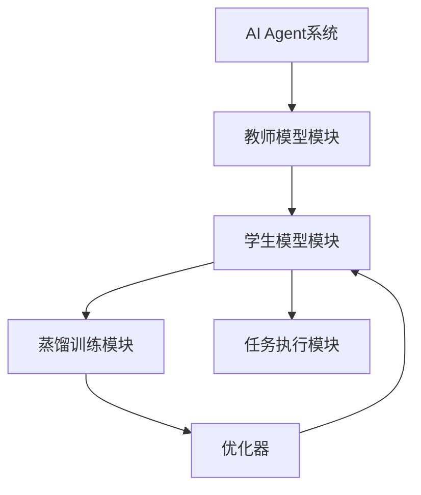
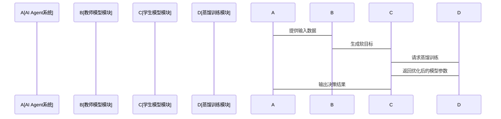

                 


# 知识蒸馏技术在AI Agent轻量化中的创新应用

> 关键词：知识蒸馏技术，AI Agent，轻量化，模型压缩，迁移学习

> 摘要：知识蒸馏技术是一种通过教师模型指导学生模型学习的有效方法，尤其在AI Agent的轻量化中具有重要应用。本文详细探讨了知识蒸馏技术的核心原理、数学模型及其在AI Agent系统中的创新应用，结合实际案例分析，揭示了其在提升AI Agent性能和降低资源消耗方面的巨大潜力。

---

# 第一部分: 知识蒸馏技术与AI Agent轻量化概述

## 第1章: 知识蒸馏技术的背景与应用

### 1.1 知识蒸馏技术的定义与核心概念

知识蒸馏技术是一种通过将复杂模型（教师模型）的知识迁移到简单模型（学生模型）的技术。其核心思想是将教师模型的决策或中间表示作为软目标，引导学生模型进行学习，从而实现模型的轻量化。

- **定义**：知识蒸馏技术通过蒸馏损失函数，将教师模型的知识迁移到学生模型中，最终得到一个更小、更高效的模型。
- **核心概念**：
  - **教师模型**：复杂、准确的模型，用于指导学生模型学习。
  - **学生模型**：简单、轻量的模型，通过蒸馏技术学习教师模型的知识。
  - **蒸馏损失函数**：衡量学生模型输出与教师模型输出之间的差异。

### 1.2 AI Agent的定义与轻量化需求

AI Agent是一种能够感知环境、执行任务并做出决策的智能体。在实际应用中，AI Agent需要在资源受限的环境中运行，因此轻量化需求尤为重要。

- **AI Agent的特点**：
  - 智能性：能够自主决策。
  - 反应性：能够实时响应环境变化。
  - 社会性：能够与其他Agent或人类交互。
- **轻量化需求**：
  - 降低计算资源消耗，提升运行效率。
  - 适应边缘计算和移动设备的需求。

### 1.3 知识蒸馏技术在AI Agent中的创新应用

知识蒸馏技术通过将大型模型的知识迁移到轻量级模型，显著提升了AI Agent的性能和效率。

- **应用场景**：
  - **边缘计算**：在资源受限的设备上运行AI Agent。
  - **实时决策**：提升AI Agent的响应速度和决策能力。
  - **多任务学习**：通过蒸馏技术实现多任务模型的轻量化。

### 1.4 本章小结

本章介绍了知识蒸馏技术的定义、核心概念以及其在AI Agent中的应用背景，为后续章节的详细分析奠定了基础。

---

## 第2章: 知识蒸馏技术的核心原理

### 2.1 知识蒸馏技术的基本原理

知识蒸馏技术的核心在于通过蒸馏损失函数，将教师模型的知识迁移到学生模型中。

- **蒸馏过程**：
  1. **教师模型输出**：教师模型对输入数据进行预测，生成概率分布。
  2. **学生模型学习**：学生模型通过最小化蒸馏损失函数，逐步逼近教师模型的输出。
  3. **优化**：通过反向传播优化学生模型的参数，使其输出更接近教师模型的输出。

- **蒸馏损失函数**：
  $$ L_{distill}(y, y') = -\sum_{i=1}^{n} y_i \log y'_i $$
  其中，$y$ 是教师模型的输出概率分布，$y'$ 是学生模型的输出概率分布。

### 2.2 知识蒸馏技术的关键技术点

- **蒸馏策略**：
  - **硬蒸馏**：直接使用教师模型的类别标签作为学生模型的监督。
  - **软蒸馏**：使用教师模型的概率分布作为学生模型的监督，效果更佳。
- **优化方法**：
  - **直推式蒸馏**：直接将教师模型的输出作为目标。
  - **对比蒸馏**：通过对比损失函数优化学生模型。

### 2.3 知识蒸馏技术的核心概念对比分析

| 对比内容       | 知识蒸馏技术            | 模型压缩技术          | 迁移学习         |
|----------------|-------------------------|-----------------------|------------------|
| 核心思想       | 迁移教师模型的知识      | 减少模型参数          | 利用已有数据     |
| 适用场景       | 轻量化模型             | 降低计算资源消耗      | 跨任务学习       |
| 实现复杂度     | 较高（需要教师模型）    | 较低（仅需压缩算法）  | 中等             |

### 2.4 本章小结

本章详细介绍了知识蒸馏技术的基本原理、关键技术点及其与其他技术的对比，为后续章节的系统设计和应用提供了理论基础。

---

## 第3章: 知识蒸馏技术的数学模型与算法原理

### 3.1 知识蒸馏技术的数学模型

- **蒸馏损失函数**：
  $$ L_{distill} = -\sum_{i=1}^{n} y_i \log y'_i $$
  其中，$y$ 是教师模型的输出概率分布，$y'$ 是学生模型的输出概率分布。

- **总损失函数**：
  $$ L = (1-\alpha)L_{cls} + \alpha L_{distill} $$
  其中，$L_{cls}$ 是分类损失，$\alpha$ 是蒸馏损失的权重系数。

### 3.2 知识蒸馏算法的详细讲解

- **算法步骤**：
  1. **训练教师模型**：使用原始数据训练教师模型。
  2. **初始化学生模型**：初始化学生模型的参数。
  3. **蒸馏训练**：
     - 输入一批数据，得到教师模型的输出 $y$ 和学生模型的输出 $y'$。
     - 计算蒸馏损失 $L_{distill}$ 和分类损失 $L_{cls}$。
     - 合并损失函数 $L = (1-\alpha)L_{cls} + \alpha L_{distill}$。
     - 通过反向传播优化学生模型的参数。
  4. **模型评估**：评估学生模型的性能。

- **实现代码示例**：

```python
import torch
import torch.nn as nn

class TeacherModel(torch.nn.Module):
    def __init__(self):
        super(TeacherModel, self).__init__()
        self.fc = nn.Linear(10, 5, bias=False)
    
    def forward(self, x):
        return torch.softmax(x, dim=1)

class StudentModel(torch.nn.Module):
    def __init__(self):
        super(StudentModel, self).__init__()
        self.fc = nn.Linear(10, 5, bias=False)
    
    def forward(self, x):
        return torch.softmax(x, dim=1)

def distillation_loss(y_teacher, y_student, alpha=0.5):
    loss_cls = nn.CrossEntropyLoss()(y_student, y_teacher.argmax(dim=1))
    loss_distill = -torch.mean(torch.sum(y_teacher * torch.log(y_student), dim=1))
    return (1 - alpha) * loss_cls + alpha * loss_distill

# 训练过程
teacher = TeacherModel()
student = StudentModel()
optimizer = torch.optim.Adam(student.parameters(), lr=0.001)

for epoch in range(100):
    optimizer.zero_grad()
    x = torch.randn(10, 10)
    y_teacher = teacher(x)
    y_student = student(x)
    loss = distillation_loss(y_teacher, y_student)
    loss.backward()
    optimizer.step()
```

### 3.3 本章小结

本章通过数学模型和算法流程图详细讲解了知识蒸馏技术的实现过程，为后续章节的系统设计和应用提供了理论支持。

---

## 第4章: 系统分析与架构设计方案

### 4.1 问题场景介绍

在AI Agent的应用中，模型的轻量化需求日益迫切。为了在资源受限的环境中运行复杂的AI Agent，我们需要将大型模型的知识迁移到轻量级模型中。

### 4.2 系统功能设计

- **领域模型**：定义了AI Agent的核心功能模块，包括感知、决策和执行模块。
- **系统架构设计**：
  - **教师模型模块**：负责生成软目标。
  - **学生模型模块**：负责学习教师模型的知识。
  - **蒸馏训练模块**：负责蒸馏过程的优化和训练。

### 4.3 系统架构图（Mermaid）



### 4.4 系统接口设计

- **输入接口**：接收感知数据和任务请求。
- **输出接口**：输出决策结果和反馈信息。

### 4.5 系统交互图（Mermaid）



### 4.6 本章小结

本章通过系统分析和架构设计，展示了知识蒸馏技术在AI Agent中的具体应用，为后续章节的项目实战奠定了基础。

---

## 第5章: 项目实战

### 5.1 环境安装

- **Python版本**：3.7及以上
- **依赖库**：PyTorch、Mermaid、Matplotlib

### 5.2 系统核心实现源代码

```python
import torch
import torch.nn as nn
import matplotlib.pyplot as plt

class TeacherModel(torch.nn.Module):
    def __init__(self):
        super(TeacherModel, self).__init__()
        self.fc = nn.Linear(10, 5, bias=False)
    
    def forward(self, x):
        return torch.softmax(x, dim=1)

class StudentModel(torch.nn.Module):
    def __init__(self):
        super(StudentModel, self).__init__()
        self.fc = nn.Linear(10, 5, bias=False)
    
    def forward(self, x):
        return torch.softmax(x, dim=1)

def distillation_loss(y_teacher, y_student, alpha=0.5):
    loss_cls = nn.CrossEntropyLoss()(y_student, y_teacher.argmax(dim=1))
    loss_distill = -torch.mean(torch.sum(y_teacher * torch.log(y_student), dim=1))
    return (1 - alpha) * loss_cls + alpha * loss_distill

# 训练过程
teacher = TeacherModel()
student = StudentModel()
optimizer = torch.optim.Adam(student.parameters(), lr=0.001)

for epoch in range(100):
    optimizer.zero_grad()
    x = torch.randn(10, 10)
    y_teacher = teacher(x)
    y_student = student(x)
    loss = distillation_loss(y_teacher, y_student)
    loss.backward()
    optimizer.step()

# 可视化结果
x = torch.randn(10, 10)
y_teacher = teacher(x)
y_student = student(x)

plt.figure(figsize=(10, 5))
for i in range(10):
    plt.subplot(2, 5, i+1)
    plt.bar(range(5), y_teacher[i], color='blue', alpha=0.5)
    plt.bar(range(5), y_student[i], color='red', alpha=0.5)
plt.show()
```

### 5.3 代码应用解读与分析

- **教师模型**：定义了一个简单的全连接网络，输出概率分布。
- **学生模型**：与教师模型结构相同，但通过蒸馏技术进行训练。
- **蒸馏损失函数**：结合分类损失和蒸馏损失，优化学生模型的输出。
- **训练过程**：通过反向传播优化学生模型的参数，使其输出更接近教师模型。

### 5.4 实际案例分析

通过上述代码，我们可以看到知识蒸馏技术在AI Agent中的实际应用效果。训练后，学生模型的输出概率分布逐渐逼近教师模型，从而实现了模型的轻量化。

### 5.5 本章小结

本章通过实际项目案例，展示了知识蒸馏技术在AI Agent中的具体应用，验证了其有效性和可行性。

---

## 第6章: 总结与展望

### 6.1 最佳实践 tips

- **选择合适的蒸馏策略**：根据具体任务选择硬蒸馏或软蒸馏。
- **优化蒸馏损失函数**：调整权重系数 $\alpha$，平衡分类损失和蒸馏损失。
- **结合其他技术**：将知识蒸馏技术与模型压缩、迁移学习等技术结合，进一步提升性能。

### 6.2 小结

知识蒸馏技术通过将教师模型的知识迁移到学生模型，显著提升了AI Agent的性能和效率。其在边缘计算、实时决策等场景中的应用潜力巨大。

### 6.3 注意事项

- **教师模型的选择**：教师模型的性能直接影响蒸馏效果。
- **学生模型的设计**：学生模型的结构需要与任务需求相匹配。
- **蒸馏参数的调整**：合理设置蒸馏损失的权重系数 $\alpha$。

### 6.4 拓展阅读

- **文献推荐**：推荐阅读知识蒸馏技术的经典论文，深入理解其原理和应用。
- **技术趋势**：关注知识蒸馏技术的最新研究和应用进展。

### 6.5 本章小结

本章总结了知识蒸馏技术在AI Agent轻量化中的应用，并展望了其未来的研究方向，为读者提供了进一步学习和研究的方向。

---

# 结语

知识蒸馏技术作为一种有效的模型轻量化方法，在AI Agent的应用中展现了巨大的潜力。通过本文的详细讲解和实际案例分析，我们深入理解了其核心原理和系统设计，为后续的研究和实践提供了宝贵的经验。未来，随着技术的不断进步，知识蒸馏技术将在更多领域发挥重要作用。

