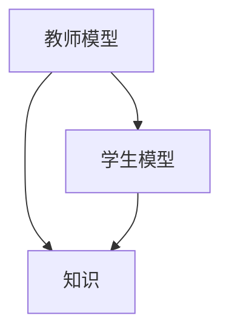
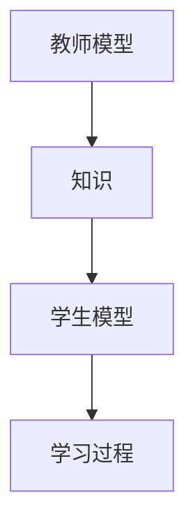
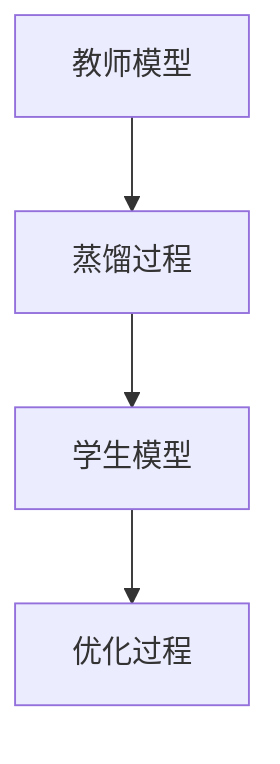
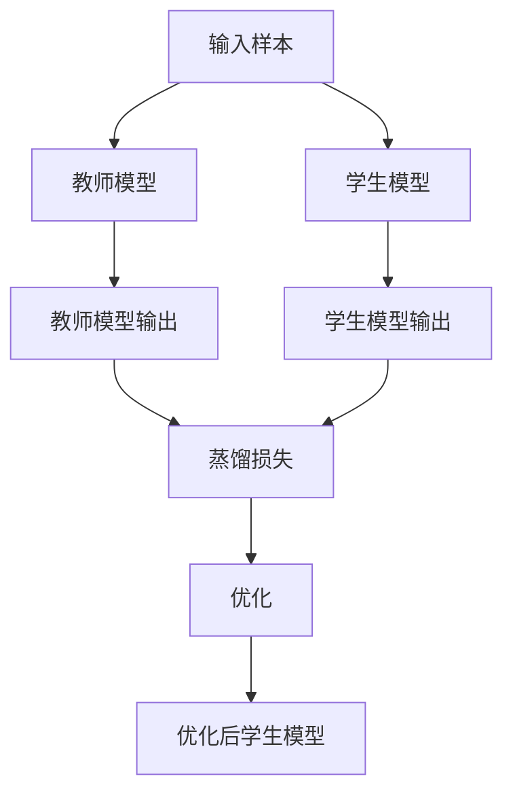
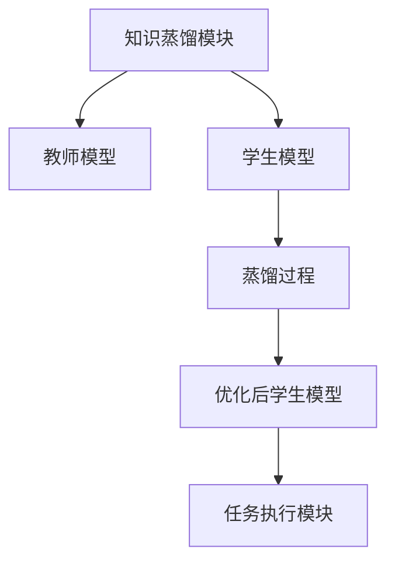
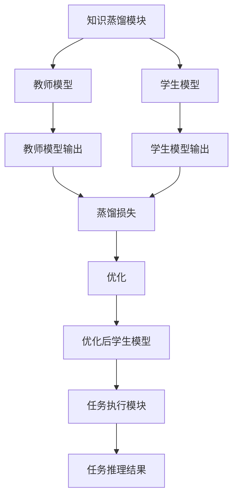

                 


# 知识蒸馏：从大模型到轻量级AI Agent

> 关键词：知识蒸馏，大模型，轻量级AI，模型压缩，迁移学习，AI Agent

> 摘要：知识蒸馏是一种将大模型的知识迁移到轻量级模型的技术，旨在在资源受限的场景下实现高效的AI推理。本文将从知识蒸馏的背景、核心概念、算法原理、系统架构到项目实战，全面解析这一技术，探讨其在AI Agent中的应用价值和实现细节。

---

# 第一部分：知识蒸馏的背景与核心概念

## 第1章：知识蒸馏的背景与问题背景

### 1.1 知识蒸馏的背景

#### 1.1.1 大模型的局限性
- **计算资源消耗**：大模型（如GPT系列）参数量庞大，训练和推理需要大量计算资源。
- **部署难度**：在移动设备或边缘计算场景中，大模型难以直接部署。
- **成本问题**：训练和维护大模型的高昂成本限制了其广泛应用。

#### 1.1.2 轻量级AI的需求
- **资源受限场景**：移动应用、物联网设备等场景需要轻量级模型。
- **快速响应**：轻量级模型能够在低资源环境下快速完成推理任务。
- **灵活性**：轻量级模型便于部署和更新。

#### 1.1.3 知识蒸馏的提出
- 知识蒸馏作为一种知识转移技术，旨在将大模型的知识迁移到更小、更高效的模型中，同时保留大模型的性能。

### 1.2 问题背景与问题描述

#### 1.2.1 大模型的资源消耗问题
- **计算资源**：大模型需要高性能计算设备支持。
- **存储资源**：模型参数量大，存储需求高。
- **时间资源**：训练和推理时间长，影响实时性。

#### 1.2.2 轻量级模型的应用场景
- **移动应用**：手机、平板等设备上的AI应用。
- **边缘计算**：物联网设备中的本地AI推理。
- **嵌入式系统**：硬件资源有限的嵌入式设备。

#### 1.2.3 知识蒸馏的目标与意义
- **目标**：将大模型的知识迁移到轻量级模型中，使其在资源受限的场景下也能高效运行。
- **意义**：通过知识蒸馏，可以在保持性能的同时，降低计算和存储成本，提升模型的灵活性和部署能力。

### 1.3 知识蒸馏的核心概念

#### 1.3.1 教师模型与学生模型
- **教师模型**：大模型，负责提供知识。
- **学生模型**：轻量级模型，负责学习教师模型的知识。

#### 1.3.2 知识蒸馏的基本原理
- 通过教师模型的输出或中间特征，指导学生模型的训练，使学生模型能够继承教师模型的知识。

#### 1.3.3 知识蒸馏的边界与外延
- **边界**：知识蒸馏专注于模型压缩和知识转移，不涉及模型训练过程中的其他因素。
- **外延**：知识蒸馏可以与其他技术（如模型剪枝、量化）结合，进一步优化模型。

### 1.4 核心概念对比

#### 1.4.1 知识蒸馏与模型压缩
- **对比**：知识蒸馏是通过知识转移来优化模型，而模型压缩是通过减少模型参数来优化模型。
- **联系**：知识蒸馏可以作为模型压缩的一种方法，通过蒸馏过程减少模型的参数量。

#### 1.4.2 知识蒸馏与模型蒸馏
- **对比**：模型蒸馏是将大模型的输出作为先验知识，用于训练小模型，而知识蒸馏是模型蒸馏的一种具体应用。
- **联系**：知识蒸馏是模型蒸馏的一种实现方式，通过教师模型的输出指导学生模型的训练。

#### 1.4.3 知识蒸馏与其他迁移学习方法的对比
- **对比**：传统的迁移学习通过共享特征层来实现知识转移，而知识蒸馏通过教师模型的输出或中间特征来实现知识转移。
- **联系**：知识蒸馏可以看作是一种特殊的迁移学习方法，适用于大模型到小模型的知识转移。

### 1.5 本章小结
本章介绍了知识蒸馏的背景、问题背景、核心概念以及与相关技术的对比，为后续章节的展开奠定了基础。

---

## 第2章：知识蒸馏的核心概念与联系

### 2.1 核心概念原理

#### 2.1.1 教师模型的知识表示
- 教师模型的知识通过其输出或中间特征表示。
- 输出：教师模型的最终预测结果，如文本生成任务中的概率分布。
- 中间特征：教师模型的中间层输出，如BERT模型中的隐藏层特征。

#### 2.1.2 学生模型的学习机制
- 学生模型通过模仿教师模型的输出或特征，逐步学习教师模型的知识。
- 学生模型的结构通常比教师模型简单，参数量更少。

#### 2.1.3 知识蒸馏的数学模型
- **蒸馏损失函数**：
$$L_{\text{distill}} = -\sum_{i=1}^{n} p_i \log q_i$$
  其中，$p_i$ 是教师模型的输出概率，$q_i$ 是学生模型的输出概率。
- **温度缩放**：
$$p_i = \text{softmax}(\frac{f_i}{T})$$
$$q_i = \text{softmax}(\frac{g_i}{T})$$
  其中，$T$ 是温度参数，用于调整概率分布的平滑程度。

### 2.2 核心概念属性特征对比

#### 2.2.1 对比表格：教师模型与学生模型的属性特征
| 属性       | 教师模型                   | 学生模型                   |
|------------|----------------------------|----------------------------|
| 参数量       | 大                         | 小                         |
| 计算复杂度   | 高                         | 低                         |
| 知识来源     | 预训练大模型               | 通过蒸馏学习教师模型知识    |

#### 2.2.2 对比表格：知识蒸馏与其他迁移学习方法的特征对比
| 方法         | 知识蒸馏               | 传统迁移学习             |
|--------------|------------------------|---------------------------|
| 知识来源       | 教师模型的输出或特征     | 特征层共享               |
| 适用场景       | 大模型到小模型的知识转移 | 小模型学习大模型的特征     |
| 优势           | 适用于资源受限场景       | 适用于特征复用             |

### 2.3 ER实体关系图

#### 2.3.1 教师模型与学生模型的实体关系


#### 2.3.2 知识蒸馏过程中的实体关系


### 2.4 本章小结
本章通过对比分析，详细阐述了知识蒸馏的核心概念及其与相关技术的联系，为后续章节的实现提供了理论基础。

---

## 第3章：知识蒸馏的算法原理

### 3.1 算法原理概述

#### 3.1.1 知识蒸馏的基本流程


#### 3.1.2 知识蒸馏的核心步骤
1. **教师模型训练**：预训练大模型，提取其知识。
2. **学生模型初始化**：构建轻量级模型，并初始化参数。
3. **蒸馏过程**：通过蒸馏损失函数，优化学生模型的参数，使其输出接近教师模型的输出。
4. **蒸馏后的模型优化**：进一步优化学生模型，使其在目标任务上表现最优。

### 3.2 算法原理的数学模型

#### 3.2.1 知识蒸馏的损失函数
$$L_{\text{distill}} = -\sum_{i=1}^{n} p_i \log q_i$$
  其中，$p_i$ 是教师模型的输出概率，$q_i$ 是学生模型的输出概率。

#### 3.2.2 温度缩放的数学公式
$$p_i = \text{softmax}(\frac{f_i}{T})$$
$$q_i = \text{softmax}(\frac{g_i}{T})$$
  其中，$T$ 是温度参数，用于调整概率分布的平滑程度。

#### 3.2.3 具体实现步骤
1. **计算教师模型输出**：通过教师模型得到输入样本的预测概率分布。
2. **计算学生模型输出**：通过学生模型得到输入样本的预测概率分布。
3. **计算蒸馏损失**：根据公式计算蒸馏损失。
4. **优化学生模型参数**：通过反向传播优化学生模型的参数，使蒸馏损失最小化。

### 3.3 算法流程图


### 3.4 本章小结
本章详细介绍了知识蒸馏的算法原理，包括基本流程、数学模型和具体实现步骤，为后续章节的系统设计和项目实战奠定了基础。

---

## 第4章：知识蒸馏的系统架构设计

### 4.1 系统架构概述

#### 4.1.1 系统功能设计
- **知识蒸馏模块**：实现教师模型和学生模型的交互，完成知识蒸馏过程。
- **模型管理模块**：管理教师模型和学生模型的加载、训练和优化。
- **任务执行模块**：将蒸馏后的学生模型应用于目标任务，完成推理。

#### 4.1.2 系统架构图


### 4.2 系统架构详细设计

#### 4.2.1 知识蒸馏模块
- **输入**：教师模型和学生模型。
- **输出**：优化后学生模型。

#### 4.2.2 模型管理模块
- **功能**：管理教师模型和学生模型的加载、训练和优化。
- **输入**：模型参数和训练数据。
- **输出**：优化后的模型参数。

#### 4.2.3 任务执行模块
- **功能**：将蒸馏后的学生模型应用于目标任务。
- **输入**：优化后学生模型和任务数据。
- **输出**：任务推理结果。

### 4.3 系统交互图


### 4.4 本章小结
本章通过系统架构设计，详细阐述了知识蒸馏的实现过程，包括模块设计和系统交互流程。

---

## 第5章：知识蒸馏的项目实战

### 5.1 项目背景与目标

#### 5.1.1 项目背景
- **目标**：将大模型的知识迁移到轻量级模型中，实现高效的AI推理。

#### 5.1.2 项目目标
- **目标1**：实现知识蒸馏过程，将大模型的知识迁移到轻量级模型中。
- **目标2**：验证蒸馏后模型的性能，确保其在目标任务上表现良好。

### 5.2 项目环境与工具

#### 5.2.1 环境安装
- **Python版本**：3.8及以上。
- **框架选择**：使用PyTorch框架。
- **依赖库安装**：安装PyTorch、transformers等库。

### 5.3 项目核心实现

#### 5.3.1 教师模型加载与预训练
- **代码示例**：
```python
from transformers import GPT2LMHeadModel, GPT2Tokenizer

# 加载教师模型
teacher_model = GPT2LMHeadModel.from_pretrained('gpt2')
teacher_tokenizer = GPT2Tokenizer.from_pretrained('gpt2')
```

#### 5.3.2 学生模型定义
- **代码示例**：
```python
import torch
import torch.nn as nn

class StudentModel(nn.Module):
    def __init__(self, vocab_size):
        super().__init__()
        self.embedding = nn.Embedding(vocab_size, 64)
        self.lstm = nn.LSTM(64, 32, batch_first=True)
        self.fc = nn.Linear(32, vocab_size)
    
    def forward(self, input_ids):
        embeds = self.embedding(input_ids)
        out, _ = self.lstm(embeds)
        out = self.fc(out)
        return out
```

#### 5.3.3 知识蒸馏实现
- **代码示例**：
```python
def distillation_loss(teacher_logits, student_logits, T=2):
    teacher_probs = F.softmax(teacher_logits / T, dim=-1)
    student_probs = F.softmax(student_logits / T, dim=-1)
    loss = -torch.sum(teacher_probs * torch.log(student_probs))
    return loss

# 训练过程
for epoch in range(num_epochs):
    for batch in dataloader:
        teacher_output = teacher_model(batch)
        student_output = student_model(batch)
        loss = distillation_loss(teacher_output logits, student_output logits)
        optimizer.zero_grad()
        loss.backward()
        optimizer.step()
```

#### 5.3.4 模型优化与调优
- **温度参数调整**：通过调整温度参数$T$，优化蒸馏过程中的概率分布平滑程度。
- **损失函数优化**：结合交叉熵损失和蒸馏损失，优化学生模型的性能。

### 5.4 项目结果与分析

#### 5.4.1 实验结果
- **实验数据**：通过实验数据对比蒸馏前后的模型性能。
- **实验结果**：蒸馏后的模型在目标任务上表现良好，且参数量显著减少。

#### 5.4.2 性能对比
- **模型大小**：蒸馏后的模型参数量减少，计算资源消耗降低。
- **推理速度**：蒸馏后的模型推理速度提升，适用于资源受限场景。

### 5.5 本章小结
本章通过具体的项目实战，详细展示了知识蒸馏的实现过程，包括环境配置、模型定义、蒸馏实现和结果分析。

---

## 第6章：知识蒸馏的应用价值与未来展望

### 6.1 知识蒸馏的应用价值

#### 6.1.1 知识蒸馏在AI Agent中的应用
- **应用场景**：将知识蒸馏技术应用于AI Agent，提升其在资源受限场景下的性能。
- **实际案例**：通过知识蒸馏优化AI Agent的对话生成能力，使其在移动设备上高效运行。

#### 6.1.2 知识蒸馏的经济效益
- **成本降低**：通过知识蒸馏，减少模型的计算和存储成本。
- **资源优化**：提升模型的部署灵活性，降低运维成本。

### 6.2 知识蒸馏的未来展望

#### 6.2.1 知识蒸馏的优化方向
- **多教师蒸馏**：研究多教师模型的知识蒸馏方法，提升模型的泛化能力。
- **自适应蒸馏**：研究自适应蒸馏策略，根据任务需求动态调整蒸馏过程。

#### 6.2.2 知识蒸馏与新兴技术的结合
- **与大语言模型结合**：研究知识蒸馏在大语言模型压缩中的应用。
- **与边缘计算结合**：探索知识蒸馏在边缘计算中的潜力，提升模型的实时性和效率。

### 6.3 本章小结
本章总结了知识蒸馏的应用价值，并展望了其未来的发展方向，为后续研究提供了思路。

---

## 附录：知识蒸馏的代码实现示例

### 附录A：环境安装
```bash
pip install torch transformers
```

### 附录B：代码实现
```python
import torch
import torch.nn as nn
from torch.utils.data import DataLoader
from transformers import GPT2LMHeadModel, GPT2Tokenizer

# 加载教师模型
teacher_model = GPT2LMHeadModel.from_pretrained('gpt2')
teacher_tokenizer = GPT2Tokenizer.from_pretrained('gpt2')

# 定义学生模型
class StudentModel(nn.Module):
    def __init__(self, vocab_size):
        super().__init__()
        self.embedding = nn.Embedding(vocab_size, 64)
        self.lstm = nn.LSTM(64, 32, batch_first=True)
        self.fc = nn.Linear(32, vocab_size)
    
    def forward(self, input_ids):
        embeds = self.embedding(input_ids)
        out, _ = self.lstm(embeds)
        out = self.fc(out)
        return out

# 定义蒸馏损失函数
def distillation_loss(teacher_logits, student_logits, T=2):
    teacher_probs = F.softmax(teacher_logits / T, dim=-1)
    student_probs = F.softmax(student_logits / T, dim=-1)
    loss = -torch.sum(teacher_probs * torch.log(student_probs))
    return loss

# 初始化学生模型和优化器
student_model = StudentModel(len(teacher_tokenizer))
optimizer = torch.optim.Adam(student_model.parameters(), lr=1e-3)

# 训练过程
num_epochs = 10
for epoch in range(num_epochs):
    for batch in dataloader:
        teacher_output = teacher_model(batch)
        student_output = student_model(batch)
        loss = distillation_loss(teacher_output logits, student_output logits)
        optimizer.zero_grad()
        loss.backward()
        optimizer.step()
```

---

## 总结

知识蒸馏作为一种高效的知识转移技术，为大模型向轻量级AI Agent的迁移提供了新的思路。通过本篇文章的详细解析，我们深入探讨了知识蒸馏的背景、核心概念、算法原理、系统架构以及项目实战，并展望了其未来的发展方向。希望本文能够为读者在知识蒸馏技术的研究和应用中提供有价值的参考和启示。

---

通过上述思考过程，我们可以清晰地看到知识蒸馏技术的全貌及其在实际应用中的潜力。接下来，我们可以根据上述大纲开始撰写完整的文章内容。

