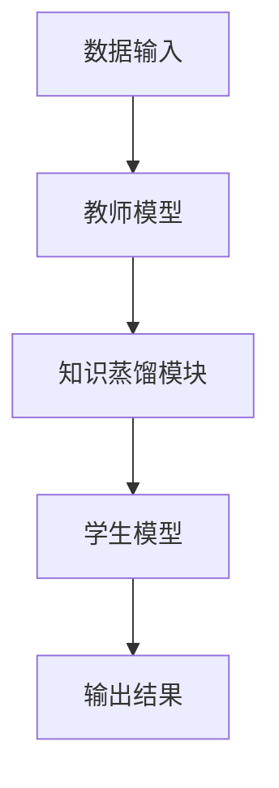

                 


# 知识蒸馏：从教师模型到高效AI Agent

## 关键词：知识蒸馏、教师模型、学生模型、模型压缩、AI Agent、机器学习

## 摘要：知识蒸馏是一种有效的技术，用于将大型教师模型的知识迁移到更小、更高效的模型中，从而实现模型压缩和优化。本文从知识蒸馏的基本原理出发，详细探讨其在AI Agent设计中的应用，结合实际案例和代码实现，帮助读者理解如何利用知识蒸馏构建高效的AI Agent。

---

# 目录

1. [知识蒸馏的背景与基础](#知识蒸馏的背景与基础)
2. [知识蒸馏的核心原理](#知识蒸馏的核心原理)
3. [知识蒸馏与模型压缩的关系](#知识蒸馏与模型压缩的关系)
4. [高效AI Agent的设计与实现](#高效AI Agent的设计与实现)
5. [系统架构与工程实践](#系统架构与工程实践)
6. [项目实战与优化](#项目实战与优化)
7. [结论](#结论)

---

## 1. 知识蒸馏的背景与基础

### 1.1 知识蒸馏概述

#### 1.1.1 机器学习模型压缩的背景

在机器学习领域，模型的复杂性和计算需求不断增加。为了在资源受限的环境中部署复杂的模型，模型压缩技术变得至关重要。知识蒸馏作为一种有效的模型压缩方法，通过将知识从教师模型迁移到学生模型，实现了模型的轻量化。

#### 1.1.2 知识蒸馏的定义与核心思想

知识蒸馏是一种通过教师模型（通常是一个大而复杂的模型）指导学生模型（一个简单的小模型）学习技术。核心思想是将教师模型的决策或中间表示迁移到学生模型中，从而保留教师模型的性能，同时减少模型的大小和计算成本。

#### 1.1.3 知识蒸馏的应用场景与优势

知识蒸馏广泛应用于图像分类、自然语言处理等领域。其优势包括：
- **模型压缩**：减少模型参数，降低计算成本。
- **推理速度提升**：在边缘设备上快速推理。
- **迁移学习**：适用于小数据集的模型训练。

### 1.2 教师模型与学生模型的关系

#### 1.2.1 教师模型的特点与作用

教师模型通常是预训练的大模型，具有强大的特征提取能力。其作用包括：
- 提供高质量的特征表示。
- 指导学生模型学习复杂的决策边界。

#### 1.2.2 学生模型的特点与优化目标

学生模型通常是轻量级的模型，如小的卷积神经网络或简单的线性模型。优化目标是：
- 在保持或接近教师模型性能的前提下，减少计算成本和模型大小。

#### 1.2.3 知识蒸馏中的师生关系模型

知识蒸馏中，教师模型和学生模型之间存在互补关系。教师模型提供丰富的特征信息，学生模型通过蒸馏过程学习这些特征，提升自身的性能。

---

## 2. 知识蒸馏的核心原理

### 2.1 知识蒸馏的基本原理

#### 2.1.1 知识蒸馏的蒸馏过程

蒸馏过程包括两个阶段：
1. **教师模型的预训练**：在大规模数据上训练教师模型。
2. **学生模型的蒸馏训练**：通过教师模型的输出，指导学生模型学习。

#### 2.1.2 蒸馏过程中的关键参数与超参数调优

关键参数包括：
- **温度（Temperature）**：控制软标签的分布宽度。
- **蒸馏率（Distillation Rate）**：决定蒸馏损失和原始损失的权重。

#### 2.1.3 蒸馏过程中的损失函数设计

蒸馏损失函数：
$$ L_{\text{distill}} = -\sum_{i=1}^{n} T_i \log P_i $$
其中，$T$是教师模型的输出，$P$是学生模型的输出。

---

## 3. 知识蒸馏与模型压缩的关系

### 3.1 模型压缩的常见方法

#### 3.1.1 参数剪枝的原理与实现

参数剪枝通过去除冗余参数，减少模型大小。常用方法包括：
- **贪心剪枝**：去除对模型影响最小的参数。
- **L2正则化**：通过权重衰减减少参数数量。

#### 3.1.2 知识蒸馏在模型剪枝中的应用

知识蒸馏可以辅助剪枝过程，通过教师模型的指导，保留关键参数，提升剪枝后模型的性能。

#### 3.1.3 量化在模型压缩中的作用

量化通过将模型参数从浮点数转换为低位整数，减少存储和计算成本。

---

## 4. 高效AI Agent的设计与实现

### 4.1 高效AI Agent的核心要素

#### 4.1.1 教师模型的选择与优化

选择合适的教师模型是知识蒸馏的关键。通常选择预训练的大模型，如BERT、ResNet等。

#### 4.1.2 学生模型的设计与实现

学生模型的设计需在轻量化和性能之间找到平衡。常用的学生模型包括MobileNet、EfficientNet等。

#### 4.1.3 知识蒸馏在AI Agent中的应用

AI Agent通过知识蒸馏，可以在资源受限的环境中实现高效的推理和决策。

---

## 5. 系统架构与工程实践

### 5.1 系统架构设计

#### 5.1.1 系统功能模块划分

- **教师模型模块**：负责生成软标签。
- **知识蒸馏模块**：负责蒸馏过程的实现。
- **学生模型模块**：负责最终的推理和决策。

#### 5.1.2 系统架构的Mermaid图



---

## 6. 项目实战与优化

### 6.1 知识蒸馏的项目实战

#### 6.1.1 项目环境搭建

- **环境配置**：使用Python 3.8以上版本，安装TensorFlow或PyTorch。
- **数据准备**：使用CIFAR-10数据集进行训练和测试。

#### 6.1.2 系统核心实现源代码

```python
import tensorflow as tf
from tensorflow.keras import layers

# 定义教师模型
def teacher_model():
    model = tf.keras.Sequential([
        layers.Conv2D(32, (3,3), activation='relu', input_shape=(32,32,3)),
        layers.Conv2D(64, (3,3), activation='relu'),
        layers.Flatten(),
        layers.Dense(10, activation='softmax')
    ])
    return model

# 定义学生模型
def student_model():
    model = tf.keras.Sequential([
        layers.Conv2D(8, (3,3), activation='relu', input_shape=(32,32,3)),
        layers.Conv2D(16, (3,3), activation='relu'),
        layers.Flatten(),
        layers.Dense(10, activation='softmax')
    ])
    return model

# 知识蒸馏训练
def train_distillation(teacher_model, student_model, data, epochs=100, temperature=3, alpha=0.5):
    optimizer = tf.keras.optimizers.Adam()
    for epoch in range(epochs):
        for x, y in data:
            teacher_logits = teacher_model.predict(x)
            student_logits = student_model.predict(x)
            
            # 软标签蒸馏
            teacher_probs = tf.nn.softmax(teacher_logits / temperature)
            student_probs = tf.nn.softmax(student_logits / temperature)
            
            # 蒸馏损失
            distill_loss = tf.keras.losses.KLDivergence()(teacher_probs, student_probs)
            # 原始分类损失
            class_loss = tf.keras.losses.SparseCategoricalCrossentropy()(y, student_probs)
            
            # 总损失：蒸馏损失和分类损失的加权和
            total_loss = alpha * distill_loss + (1-alpha) * class_loss
            grads = optimizer.compute_gradients(total_loss, student_model.trainable_weights)
            optimizer.apply_gradients(grads)
```

#### 6.1.3 代码应用解读与分析

上述代码实现了知识蒸馏的训练过程，其中教师模型和学生模型分别定义了不同的网络结构。训练过程中，通过调整温度和权重系数α，平衡蒸馏损失和分类损失。

---

## 7. 结论

知识蒸馏作为一种有效的模型压缩技术，为高效AI Agent的设计提供了重要的理论和技术支持。通过教师模型与学生模型的协同工作，可以在保持性能的前提下，显著减少模型的计算成本和存储需求。未来，随着深度学习技术的发展，知识蒸馏将在更多领域得到广泛应用，并推动AI Agent技术的进一步进步。

---

通过以上结构，文章详细阐述了知识蒸馏的核心原理、应用场景和实现方法，并结合实际代码和系统架构图，帮助读者全面理解知识蒸馏技术及其在AI Agent中的应用。

