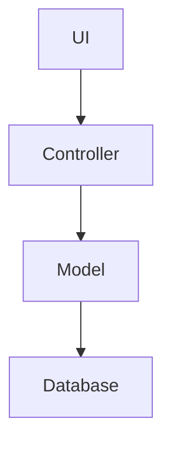

                 


# 研发助手 AI Agent：LLM 在科研过程中的辅助作用

## 关键词：
- AI Agent
- LLM
- 科研辅助
- 人工智能
- 大语言模型

## 摘要：
本文探讨了AI Agent在科研过程中的辅助作用，特别是大语言模型（LLM）的应用。文章从AI Agent的基本概念出发，详细分析了LLM的核心技术，包括模型结构和训练原理。接着，深入探讨了AI Agent在文献分析、实验设计、论文撰写等科研环节中的具体应用场景。最后，通过系统架构设计和项目实战，展示了如何构建高效的AI Agent系统。本文还讨论了当前存在的挑战和未来的发展方向，为科研人员提供了有价值的参考。

---

# 第一章：AI Agent 和 LLM 的基本概念

## 1.1 AI Agent 的定义与特点

### 1.1.1 AI Agent 的定义
AI Agent（人工智能代理）是一种能够感知环境并采取行动以实现目标的智能实体。它可以是一个软件程序或物理设备，通过接收输入、处理信息并输出决策来完成特定任务。

### 1.1.2 AI Agent 的核心特点
- **智能性**：AI Agent能够理解输入信息并生成有意义的输出。
- **自主性**：能够在没有人工干预的情况下独立运行。
- **适应性**：能够根据环境变化调整自己的行为。
- **交互性**：能够与用户或其他系统进行交互。

### 1.1.3 AI Agent 与传统 AI 的区别
AI Agent强调自主性和目标导向，而传统AI更多关注特定任务的解决。AI Agent具有更强的适应性和灵活性，能够根据环境动态调整策略。

## 1.2 大语言模型（LLM）的基本原理

### 1.2.1 LLM 的定义
大语言模型（Large Language Model，LLM）是一种基于深度学习的自然语言处理模型，能够理解和生成人类语言。

### 1.2.2 LLM 的核心算法
- **Transformer 模型**：由编码器和解码器组成，通过自注意力机制捕捉上下文信息。
- **训练过程**：基于大量文本数据进行无监督或有监督训练，优化模型参数以最小化预测误差。

### 1.2.3 LLM 的训练过程
1. 数据预处理：清洗、分词、构建训练样本。
2. 模型训练：使用优化算法（如Adam）更新参数，降低损失函数值。
3. 模型调优：通过微调（Fine-tuning）适应特定任务。

## 1.3 AI Agent 在科研中的作用

### 1.3.1 科研过程中的关键问题
- 文献检索效率低
- 实验设计复杂
- 数据分析困难
- 论文撰写耗时

### 1.3.2 AI Agent 在科研中的应用场景
- **文献分析**：自动检索、摘要和知识图谱构建。
- **实验设计**：辅助实验方案生成和参数优化。
- **论文撰写**：结构建议、内容填充和语言优化。

### 1.3.3 AI Agent 的优势与局限性
- **优势**：提高效率、降低成本、提供创新思路。
- **局限性**：依赖数据质量、可能产生错误结论、缺乏人类直觉。

## 1.4 本章小结
本章介绍了AI Agent和LLM的基本概念，分析了AI Agent在科研中的重要作用，并总结了其优势与局限性。

---

# 第二章：LLM 的模型结构与训练原理

## 2.1 模型结构

### 2.1.1 Transformer 模型的结构
```mermaid
graph TD
    Encoder -> Decoder
    Encoder --> Attention
    Decoder --> Attention
```

### 2.1.2 LLM 的层数与参数量
- 层数：通常包含数十层甚至上百层。
- 参数量：从数百万到数百亿参数。

### 2.1.3 模型的可扩展性
- 支持多语言、多任务处理。
- 通过并行计算提升处理效率。

## 2.2 LLM 的训练过程

### 2.2.1 数据预处理
- 分词：将文本分割成单词或短语。
- 去除停用词：去掉无意义的词汇（如“and”、“the”）。

### 2.2.2 模型训练的优化方法
- **学习率调度器**：逐渐降低学习率以防止过拟合。
- **批次归一化**：加速训练过程并提高模型稳定性。

### 2.2.3 模型调优与微调
- **微调（Fine-tuning）**：在特定领域数据上进一步训练，适应具体任务。
- **零样本学习**：直接使用预训练模型处理新任务。

## 2.3 LLM 的评估指标

### 2.3.1 常见的评估指标
| 评估指标 | 描述 |
|----------|------|
| Accuracy | 正确率 |
| Recall    | 召回率 |
| F1-score | 调和平均数 |

### 2.3.2 指标的计算方法
- **Accuracy**：正确预测的比例。
- **Recall**：真实正例中被正确预测的比例。
- **F1-score**：平衡Precision和Recall的指标。

## 2.4 本章小结
本章详细介绍了LLM的模型结构和训练原理，包括数据预处理、优化方法和评估指标。

---

# 第三章：AI Agent 在科研中的具体应用场景

## 3.1 文献分析与信息提取

### 3.1.1 文献检索与筛选
- 使用AI Agent快速检索相关文献，筛选出高相关性论文。

### 3.1.2 文献内容的自动摘要
- 通过LLM生成文献摘要，提取关键信息。

### 3.1.3 知识图谱构建
- 将文献中的实体关系抽取并构建知识图谱。

## 3.2 实验设计与优化

### 3.2.1 实验方案的自动生成
- AI Agent根据文献和已有数据生成实验方案。

### 3.2.2 参数优化与实验预测
- 使用强化学习优化实验参数，预测实验结果。

## 3.3 研究论文的辅助撰写

### 3.3.1 论文结构的自动建议
- AI Agent提供论文结构建议，包括引言、方法、结果等部分。

### 3.3.2 内容填充与语言优化
- 自动生成论文内容，优化语言表达。

## 3.4 研发过程中的其他辅助功能

### 3.4.1 研发流程的自动化
- 自动化实验记录、数据分析和报告生成。

### 3.4.2 知识库的智能管理
- 维护和更新知识库，方便快速检索。

## 3.5 本章小结
本章详细介绍了AI Agent在文献分析、实验设计和论文撰写中的具体应用场景。

---

# 第四章：AI Agent 的系统架构与实现

## 4.1 系统功能模块划分

### 4.1.1 用户交互模块
- 提供用户界面，接收输入并显示输出。

### 4.1.2 模型调用模块
- 调用LLM进行文本生成和分析。

### 4.1.3 数据处理模块
- 处理输入数据，提取特征并生成输出。

### 4.1.4 知识库管理模块
- 维护知识库，支持快速检索和更新。

## 4.2 系统架构设计

### 4.2.1 分层架构设计


### 4.2.2 微服务架构设计
```mermaid
graph TD
    API Gateway --> User
    API Gateway --> Service1
    API Gateway --> Service2
```

## 4.3 项目实战

### 4.3.1 环境安装
```bash
pip install transformers
pip install torch
```

### 4.3.2 核心代码实现

```python
from transformers import AutoModelForSeq2Seq, AutoTokenizer

model = AutoModelForSeq2Seq.from_pretrained('t5-base')
tokenizer = AutoTokenizer.from_pretrained('t5-base')

def generate_summary(text):
    inputs = tokenizer.encode("summarize: " + text, return_tensors='pt', max_length=512)
    outputs = model.generate(inputs, max_length=150, num_beams=4)
    summary = tokenizer.decode(outputs[0], skip_special_tokens=True)
    return summary
```

### 4.3.3 代码应用解读与分析
- 使用T5模型进行文本摘要，生成文献摘要。

## 4.4 本章小结
本章详细介绍了AI Agent的系统架构设计和实现方法，通过项目实战展示了具体实现过程。

---

# 第五章：挑战与未来方向

## 5.1 当前存在的挑战

### 5.1.1 模型的局限性
- 数据依赖性强，小样本数据表现不佳。

### 5.1.2 数据隐私问题
- 处理敏感数据时存在隐私泄露风险。

## 5.2 未来发展方向

### 5.2.1 多模态模型
- 结合视觉、听觉等多模态信息，提升模型能力。

### 5.2.2 可解释性研究
- 提高模型的可解释性，增强用户信任。

## 5.3 本章小结
本章总结了当前AI Agent在科研中的挑战，并展望了未来的发展方向。

---

# 第六章：总结与展望

## 6.1 本文总结
本文系统介绍了AI Agent和LLM的基本概念，详细探讨了AI Agent在科研中的应用场景，并通过系统架构设计和项目实战展示了具体实现方法。

## 6.2 对未来的展望
随着技术进步，AI Agent将在科研中发挥越来越重要的作用，未来的研究将更加注重模型的可解释性和多模态能力。

---

# 参考文献
[1] Vaswani, A., et al. "Attention Is All You Need." Advances in Neural Information Processing Systems, 2017.
[2] Brown, T., et al. "Language Models are Few-Shot Learners." arXiv preprint arXiv:2005.14169, 2020.

---

通过以上内容，我们详细探讨了AI Agent在科研中的辅助作用，从理论到实践，为科研人员提供了宝贵的参考和启示。

