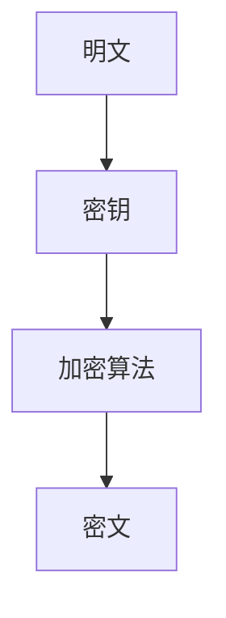
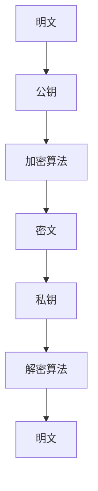
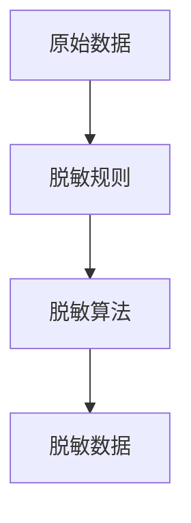
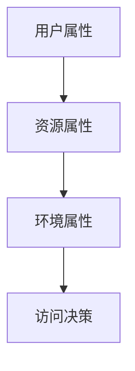
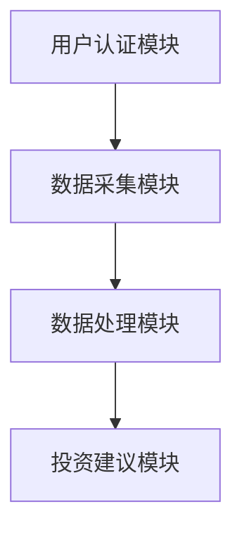
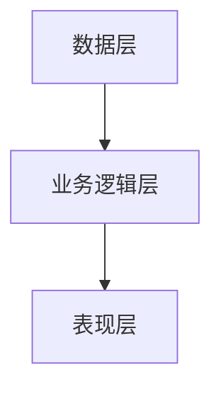
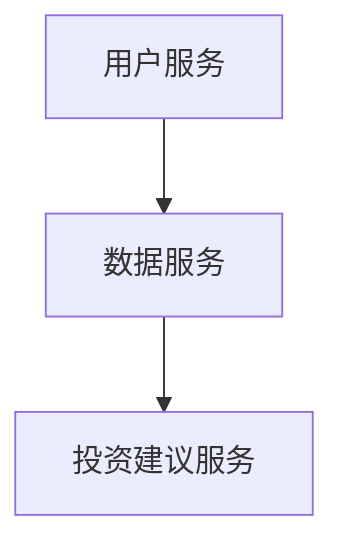
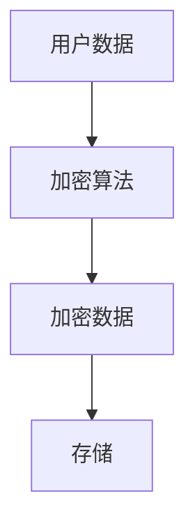
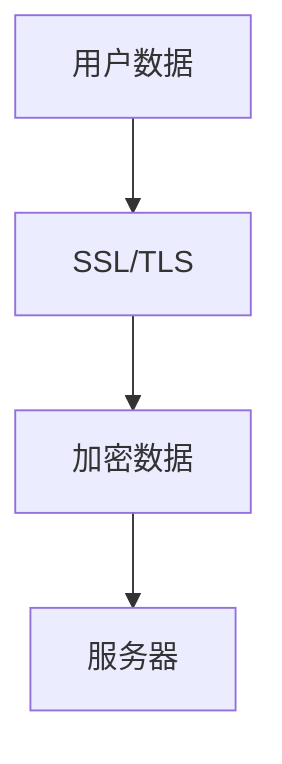

                 


# 确保投资理财智能助手的数据安全与隐私保护

## 关键词：投资理财智能助手，数据安全，隐私保护，加密技术，数据脱敏，访问控制，系统架构

## 摘要：  
投资理财智能助手通过收集和分析用户的金融数据，为用户提供个性化的投资建议和理财规划。然而，这些数据的高度敏感性使得数据安全与隐私保护成为重中之重。本文从数据安全与隐私保护的核心概念出发，详细探讨了加密技术、数据脱敏、访问控制等关键技术，并结合实际案例，分析了如何在投资理财智能助手中构建安全可靠的系统架构。通过本文的讲解，读者能够全面理解如何在技术实现中保障用户数据的安全与隐私。

---

## 第1章：投资理财智能助手的背景与数据安全挑战

### 1.1 数据安全与隐私保护的背景

#### 1.1.1 投资理财智能助手的定义与功能

投资理财智能助手是一种基于人工智能和大数据技术的应用程序，旨在帮助用户进行投资决策和财务管理。它通过收集用户的金融数据（如收入、支出、资产配置等）和市场数据（如股票价格、基金净值等），结合机器学习算法，为用户提供个性化的投资建议、风险评估和财务规划。

#### 1.1.2 数据安全与隐私保护的重要性

随着智能助手的普及，用户数据的收集和处理量急剧增加。投资理财数据通常包含用户的资产信息、交易记录、财务状况等敏感信息，一旦被泄露或滥用，可能导致严重的经济损失和隐私侵权问题。因此，数据安全与隐私保护是投资理财智能助手设计和运营的核心任务。

#### 1.1.3 当前投资理财智能助手的数据安全挑战

- **数据泄露风险**：用户数据可能因黑客攻击、内部人员窃取或系统漏洞而被泄露。
- **数据滥用问题**：用户数据可能被未经授权的第三方用于商业目的，甚至被用于诈骗活动。
- **合规性要求**：随着《数据安全法》和《个人信息保护法》等法律法规的出台，企业需要严格遵守数据安全和隐私保护的合规要求。

### 1.2 数据安全与隐私保护的核心概念

#### 1.2.1 数据安全的基本概念

数据安全是指通过技术手段和管理措施，确保数据的机密性、完整性和可用性。机密性是指只有授权的用户才能访问数据；完整性是指数据在存储和传输过程中保持未被篡改的状态；可用性是指数据在需要时能够被合法用户访问。

#### 1.2.2 隐私保护的核心要素

隐私保护是指在处理个人数据时，确保数据不会被用于侵犯个人隐私的活动。核心要素包括：
- 数据最小化：只收集实现功能所必需的最小数据。
- 用户同意：在收集数据前，必须获得用户的明确同意。
- 数据加密：对敏感数据进行加密处理，防止未经授权的访问。

#### 1.2.3 投资理财数据的敏感性分析

投资理财数据的敏感性主要体现在以下方面：
- **资产信息**：如银行账户余额、投资组合配置等。
- **交易记录**：如交易金额、交易时间、交易对手等。
- **财务状况**：如收入、支出、信用评分等。

### 1.3 本章小结

本章从投资理财智能助手的功能和背景出发，分析了数据安全与隐私保护的重要性，并提出了数据安全的核心概念和隐私保护的核心要素。通过对投资理财数据敏感性的分析，为后续的技术实现奠定了基础。

---

## 第2章：数据安全与隐私保护的核心技术

### 2.1 数据加密技术

#### 2.1.1 对称加密算法

对称加密算法是一种加密方法，加密和解密使用相同的密钥。常见的对称加密算法包括AES（高级加密标准）和DES（数据加密标准）。

**AES加密流程图：**



**AES数学模型：**

$$ \text{密文} = \text{AES加密}(明文, 密钥) $$

#### 2.1.2 非对称加密算法

非对称加密算法是一种加密方法，加密和解密使用不同的密钥。常见的非对称加密算法包括RSA和椭圆曲线加密（ECC）。

**RSA加密流程图：**



**RSA数学模型：**

$$ \text{密文} = (明文)^e \mod n $$

### 2.2 数据脱敏技术

#### 2.2.1 数据脱敏的定义与应用场景

数据脱敏是指通过技术手段对敏感数据进行处理，使其在失去原始数据的可恢复性的同时，仍然保持数据的可用性。常见的应用场景包括数据共享、数据分析和测试环境中的数据使用。

#### 2.2.2 常见数据脱敏方法

- **数据屏蔽**：将敏感数据的部分字段隐藏或替换。
- **数据泛化**：对数据进行概括处理，如将具体金额替换为“高收入”。
- **数据加密**：对敏感数据进行加密处理，仅授权方能够解密。

**数据脱敏流程图：**



### 2.3 数据访问控制技术

#### 2.3.1 基于角色的访问控制（RBAC）

RBAC是一种基于角色的访问控制模型，通过定义用户角色和权限，限制用户对数据的访问范围。

**RBAC类图：**


#### 2.3.2 基于属性的访问控制（ABAC）

ABAC是一种基于属性的访问控制模型，通过结合用户属性、资源属性和环境属性，动态决定用户的访问权限。

**ABAC流程图：**



### 2.4 本章小结

本章详细介绍了数据加密、数据脱敏和数据访问控制等核心技术，通过流程图和类图的形式，展示了这些技术的实现原理和应用场景。

---

## 第3章：投资理财智能助手的系统架构设计

### 3.1 系统功能需求分析

#### 3.1.1 用户需求分析

用户需求包括：
- 提供个性化的投资建议。
- 保护用户的隐私数据。
- 提供安全的交易环境。

#### 3.1.2 系统功能模块划分

系统功能模块包括：
- 用户认证模块。
- 数据采集模块。
- 数据处理模块。
- 投资建议模块。

**功能模块关系图：**



### 3.2 系统架构设计

#### 3.2.1 分层架构设计

系统架构采用分层设计，包括：
- 数据层。
- 业务逻辑层。
- 表现层。

**分层架构图：**



#### 3.2.2 微服务架构设计

系统采用微服务架构，包括：
- 用户服务。
- 数据服务。
- 投资建议服务。

**微服务架构图：**



### 3.3 数据安全与隐私保护的系统设计

#### 3.3.1 数据存储安全设计

数据存储采用加密存储和访问控制技术，确保数据在存储过程中的安全性。

**数据存储流程图：**



#### 3.3.2 数据传输安全设计

数据传输采用SSL/TLS协议，确保数据在传输过程中的安全性。

**数据传输流程图：**



### 3.4 本章小结

本章从系统功能需求分析出发，设计了系统的架构，并提出了数据存储和数据传输的安全设计方案。

---

## 第4章：投资理财智能助手的实战案例

### 4.1 项目背景与需求分析

项目背景：
- 开发一个投资理财智能助手，为用户提供个性化投资建议。

项目需求：
- 保护用户数据的隐私和安全。
- 提供高效的投资建议服务。

### 4.2 核心代码实现

#### 4.2.1 数据加密模块

```python
import hashlib

def encrypt_data(data, key):
    key = key.encode('utf-8')
    data = data.encode('utf-8')
    cipher = hashlib.new('aes', key=key)
    ciphertext = cipher.encrypt(data)
    return ciphertext
```

#### 4.2.2 数据脱敏模块

```python
def mask_data(data, mask_ratio=0.5):
    masked_data = []
    for item in data:
        if random.random() < mask_ratio:
            masked_data.append('*')
        else:
            masked_data.append(item)
    return masked_data
```

### 4.3 案例分析与应用解读

通过实际案例分析，展示了如何在投资理财智能助手中实现数据安全与隐私保护。

### 4.4 项目小结

总结了项目实施的关键点和成功经验。

---

## 第5章：投资理财智能助手的最佳实践

### 5.1 关键技术总结

总结了数据安全与隐私保护的关键技术，包括加密技术、数据脱敏、访问控制等。

### 5.2 实施建议

提出了在投资理财智能助手中实施数据安全与隐私保护的建议，包括：

1. **选择合适的加密算法**：根据数据类型和安全需求选择加密算法。
2. **实施数据脱敏**：对敏感数据进行脱敏处理，降低数据泄露风险。
3. **建立访问控制机制**：通过RBAC或ABAC模型，控制数据访问权限。
4. **定期进行安全测试**：通过安全测试发现和修复系统漏洞。

### 5.3 未来发展趋势

展望了投资理财智能助手数据安全与隐私保护的未来发展趋势，包括：

- **人工智能辅助安全**：利用AI技术提高数据安全防护能力。
- **区块链技术应用**：通过区块链技术实现数据的安全共享和隐私保护。

### 5.4 注意事项

提醒读者在实施数据安全与隐私保护时需要注意的事项，包括：

- **合规性要求**：严格遵守相关法律法规。
- **数据最小化原则**：只收集实现功能所必需的数据。
- **用户教育**：提高用户的隐私保护意识。

---

## 第6章：总结与展望

### 6.1 本章总结

总结了全文的主要内容，强调了数据安全与隐私保护在投资理财智能助手中的重要性。

### 6.2 未来展望

展望了投资理财智能助手数据安全与隐私保护的未来发展方向，提出了进一步的研究方向。

---

## 参考文献

- 《数据安全法》
- 《个人信息保护法》
- 《区块链技术与数据安全》
- 《人工智能与隐私保护》

---

## 附录

### 附录A：相关术语解释

- **数据加密**：通过加密算法对数据进行加密处理，确保数据在存储和传输过程中的安全性。
- **数据脱敏**：对敏感数据进行处理，使其在失去原始数据的可恢复性的同时，仍然保持数据的可用性。

### 附录B：工具与库

- **Python hashlib**：用于数据加密。
- **PyCrypto**：用于数据加密和解密。

---

通过本文的详细讲解，读者可以全面理解如何在投资理财智能助手中实现数据安全与隐私保护，为用户提供安全可靠的金融服务。

