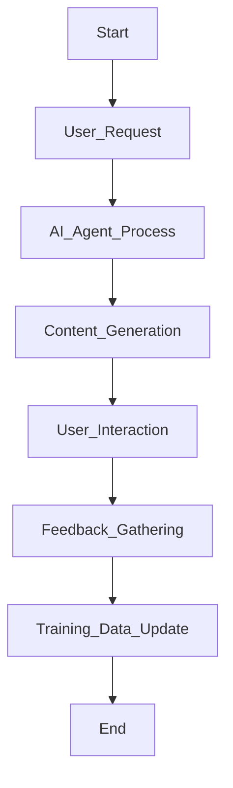
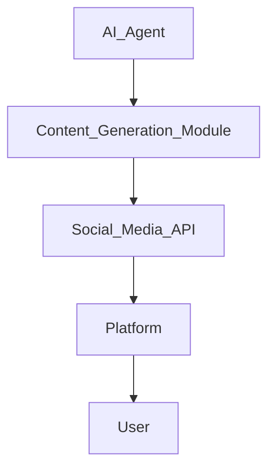
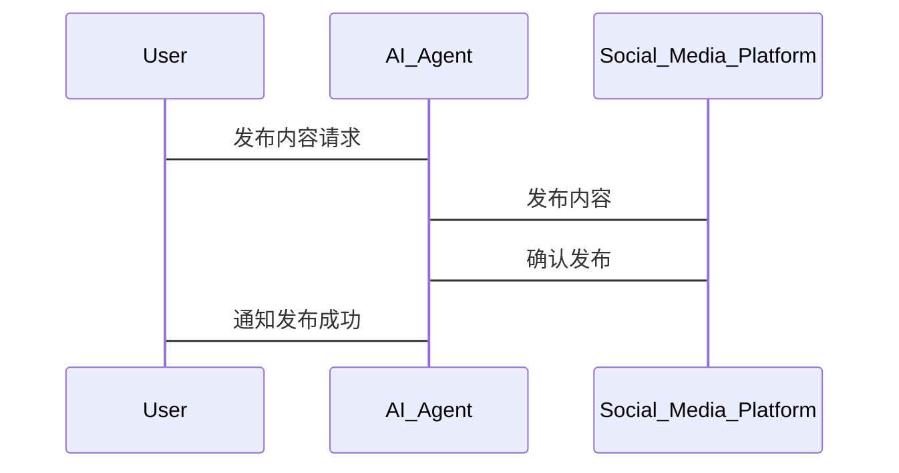

                 


# 社交媒体 AI Agent：LLM 辅助内容管理与互动

## 关键词：
- 社交媒体
- AI Agent
- LLM
- 内容管理
- 用户互动

## 摘要：
社交媒体 AI Agent 利用大语言模型（LLM）辅助内容管理与用户互动，是一种创新的解决方案。本文深入探讨了社交媒体 AI Agent 的背景、核心概念、技术原理、系统架构以及实际应用，详细分析了其在内容生成、用户交互和数据处理中的潜力和优势。

---

## 第一部分：社交媒体 AI Agent 的基础与背景

### 第1章：社交媒体 AI Agent 的背景与概念

#### 1.1 社交媒体的演变与挑战

##### 1.1.1 社交媒体的发展历程
社交媒体从早期的单纯信息分享平台，逐步演变为内容丰富、功能复杂的互动空间。随着用户数量的激增，内容管理的复杂性也随之增加，包括信息过载、虚假信息传播、用户行为预测等问题。

##### 1.1.2 社交媒体中的内容管理问题
- **信息过载**：用户每天面对海量信息，难以有效筛选。
- **虚假信息传播**：虚假新闻和误导性内容对社会造成负面影响。
- **内容审核**：平台需要实时监控并删除违规内容，这对人工审核和自动化工具提出了更高要求。

##### 1.1.3 用户互动的复杂性与需求
用户之间的互动越来越多样化，包括点赞、评论、分享、私信等。如何通过 AI 技术提升互动效率和个性化体验，成为一个重要课题。

#### 1.2 AI Agent 的定义与特点

##### 1.2.1 AI Agent 的基本概念
AI Agent 是一种能够感知环境并执行任务的智能体，能够通过学习和推理优化其行为。在社交媒体中，AI Agent 可以帮助用户或平台完成内容生成、互动优化、数据分析等任务。

##### 1.2.2 AI Agent 的核心功能与优势
- **自动化**：能够自动处理重复性任务，节省时间和资源。
- **智能化**：基于大数据和机器学习，具备理解和推理能力。
- **个性化**：能够根据用户需求提供定制化服务。

##### 1.2.3 社交媒体中的 AI Agent 应用场景
- **内容生成**：帮助用户生成高质量的社交媒体帖子。
- **互动优化**：自动回复评论，提升用户体验。
- **数据分析**：实时分析用户行为，提供数据支持。

#### 1.3 LLM 在社交媒体中的作用

##### 1.3.1 LLM 的基本原理
大语言模型（LLM）通过海量数据训练，能够理解和生成自然语言文本。其核心在于通过概率模型预测下一个词，生成连贯且有意义的文本。

##### 1.3.2 LLM 在内容生成中的应用
- **文本生成**：用于撰写社交媒体帖子、广告文案等。
- **创意写作**：帮助用户生成创意内容，如故事、诗歌等。

##### 1.3.3 LLM 在用户互动中的潜力
- **自动回复**：通过 LLM 生成个性化的回复，提升用户互动体验。
- **情感分析**：分析用户评论的情感倾向，优化内容策略。

#### 1.4 当前社交媒体 AI Agent 的现状与挑战

##### 1.4.1 现有解决方案的优缺点
- **优点**：提高效率，降低成本。
- **缺点**：内容生成的质量不稳定，用户隐私问题等。

##### 1.4.2 技术与应用中的主要挑战
- **模型泛化能力**：LLM 在特定领域的适应性问题。
- **计算资源需求**：训练和运行大模型需要大量算力。
- **用户信任**：AI 生成的内容是否被用户接受。

##### 1.4.3 未来发展的可能性
- **更高效的模型**：通过优化算法和模型结构，提升性能。
- **多模态交互**：结合图像、视频等多模态数据，提供更丰富的体验。

## 第2章：社交媒体 AI Agent 的核心概念与联系

### 2.1 核心概念的定义与属性

#### 2.1.1 核心概念的定义
- **社交媒体**：用户通过平台分享信息、互动交流的空间。
- **AI Agent**：具备智能的代理，能够执行特定任务。
- **LLM**：基于大量数据训练的大语言模型，能够生成自然语言文本。

#### 2.1.2 核心概念的属性特征对比
| 概念 | 输入 | 输出 | 功能 | 示例 |
|------|------|------|------|------|
| LLM  | 文本  | 文本  | 生成、理解 | 自动回复评论 |
| AI Agent | 用户需求 | 行动 | 自动化处理 | 发布社交媒体内容 |
| 社交媒体平台 | 用户行为 | 内容 | 展示 | 分享动态 |

#### 2.1.3 核心概念的关系
社交媒体 AI Agent 的核心是 LLM，通过 LLM 的能力生成内容和与用户互动，最终在社交媒体平台上实现目标。

### 2.2 实体关系图（ER 图）


### 2.3 核心概念的联系与流程图



---

## 第三部分：技术原理与系统架构

### 第3章：LLM 的技术原理与实现

#### 3.1 LLM 的基本原理

##### 3.1.1 概率模型与生成过程
LLM 通过概率模型预测下一个词，生成连贯的文本。生成过程通常包括以下步骤：
1. 输入处理：将输入文本转换为模型可处理的格式。
2. 解码过程：通过解码器生成输出文本。
3. 概率计算：基于训练数据计算每个词的概率。

##### 3.1.2 模型训练与优化
- **训练方法**：使用监督学习，通过调整模型参数最小化损失函数。
- **损失函数**：交叉熵损失函数。
  $$ \text{Loss} = -\sum_{i=1}^{n} \log P(y_i|x_{1..i-1}) $$
- **优化策略**：使用梯度下降优化模型参数。

##### 3.1.3 模型优化与调优
- **超参数调优**：调整学习率、批次大小等参数。
- **模型剪裁**：通过剪裁模型参数减少计算量，同时保持性能。

#### 3.2 LLM 在社交媒体中的应用

##### 3.2.1 内容生成算法
- **文本生成算法**：基于 LLM 的生成式模型，如 Transformer。
- **算法流程图**
  ```mermaid
  graph TD
      Input --> Tokenization
      Tokenization --> Embedding
      Embedding --> Decoding
      Decoding --> Output
  ```

##### 3.2.2 生成效果分析
- **生成质量**：生成文本的连贯性和相关性。
- **生成速度**：模型的处理效率。

#### 3.3 系统架构设计

##### 3.3.1 系统功能设计
- **内容生成模块**：负责生成社交媒体内容。
- **用户互动模块**：处理用户评论和私信。
- **数据管理模块**：存储和管理用户数据。

##### 3.3.2 系统架构图


##### 3.3.3 系统交互流程


---

## 第四部分：项目实战与扩展

### 第4章：项目实战

#### 4.1 环境安装

##### 4.1.1 安装 Python 和相关库
```bash
pip install numpy
pip install transformers
pip install torch
```

#### 4.2 核心代码实现

##### 4.2.1 内容生成模块
```python
from transformers import AutoModelForCausalLM, AutoTokenizer

model_name = "gpt2"
tokenizer = AutoTokenizer.from_pretrained(model_name)
model = AutoModelForCausalLM.from_pretrained(model_name)

def generate_text(prompt, max_length=50):
    inputs = tokenizer.encode(prompt, return_tensors="np")
    outputs = model.generate(inputs, max_length=max_length, do_sample=True)
    return tokenizer.decode(outputs[0], skip_special_tokens=True)
```

##### 4.2.2 用户互动模块
```python
import requests

def reply_comment(comment_text):
    response = requests.post("https://api.social.media/reply", json={
        "comment": comment_text,
        "model_response": "auto_reply"
    })
    return response.json()
```

#### 4.3 案例分析与总结

##### 4.3.1 案例分析
假设我们使用上述代码生成一条社交媒体帖子：
```python
prompt = "今天是一个美好的一天，"
generated_text = generate_text(prompt, max_length=100)
print(generated_text)
```
输出可能为： "今天是一个美好的一天，阳光明媚，心情愉悦，让我们一起享受生活吧！"

##### 4.3.2 总结与优化
- **总结**：代码实现了基本的内容生成和用户互动功能。
- **优化方向**：优化模型性能，增加多模态支持，提升用户体验。

### 第5章：扩展与展望

#### 5.1 研究热点与未来趋势

##### 5.1.1 当前研究热点
- **多模态交互**：结合图像、视频等多种数据形式。
- **实时生成**：提升生成速度和响应效率。

##### 5.1.2 未来趋势
- **更强大的模型**：如 GPT-4 及其后续版本。
- **个性化服务**：根据用户行为提供定制化内容。

#### 5.2 对读者的建议

##### 5.2.1 学习建议
- **掌握基础知识**：熟悉机器学习和自然语言处理的基本原理。
- **实践项目**：通过实际项目加深理解。

##### 5.2.2 应用建议
- **结合具体场景**：根据实际需求选择合适的模型和工具。
- **注重用户体验**：在技术实现的同时，关注用户的实际体验。

---

## 小结与注意事项

在撰写和阅读过程中，建议读者：
1. **逐步深入**：从基础概念开始，逐步理解技术原理。
2. **注重实践**：通过实际项目巩固所学知识。
3. **关注动态**：及时了解 AI 和社交媒体领域的最新进展。

---

通过以上思考和分析，我们希望本文能够为读者提供一个全面、深入的视角，理解社交媒体 AI Agent 的潜力与实现方法。

