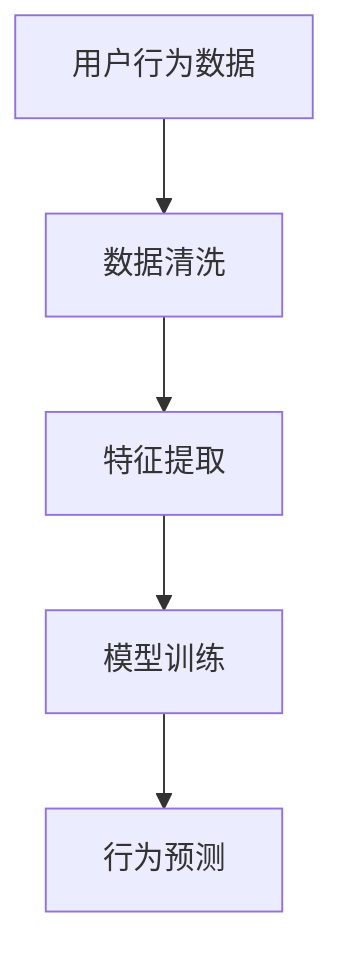

                 


# 社交媒体数据的利用

## 关键词
- 社交媒体数据
- 数据分析
- 人工智能
- 机器学习
- 数据挖掘

## 摘要
社交媒体数据的利用是当前技术领域的重要课题，随着社交媒体的快速发展，海量数据的产生为商业决策、舆情分析和社会科学研究提供了丰富的资源。本文从社交媒体数据的定义、收集、处理、分析到应用，详细探讨了其利用的全过程，并通过具体案例展示了其在实际中的应用价值。通过本文的分析，读者可以深入了解社交媒体数据的核心价值和利用方法。

---

# 引言

社交媒体数据的利用已成为现代信息技术发展的重要方向。随着微博、微信、Facebook、Twitter等社交平台的普及，每天产生的海量数据蕴含着巨大的商业价值和社会意义。本文将从技术角度出发，系统地探讨社交媒体数据的利用方法，包括数据收集、处理、分析和应用的全过程。

---

# 第一部分：社交媒体数据的背景与概念

## 第1章：社交媒体数据的定义与特点

### 1.1 社交媒体数据的定义
社交媒体数据是指在社交平台上产生的各种形式的数据，包括文本、图片、视频、用户行为数据等。这些数据可以通过API接口或网络爬虫技术获取。

### 1.2 社交媒体数据的特点
社交媒体数据具有以下特点：
1. **实时性**：数据产生和更新速度快。
2. **多样性**：数据类型多样，包括文本、图片、视频等。
3. **海量性**：每天产生的数据量巨大。
4. **动态性**：数据内容随时变化。

### 1.3 社交媒体数据的来源
社交媒体数据的主要来源包括：
1. **社交平台API**：如微博API、Twitter API等。
2. **网络爬虫技术**：通过爬虫程序获取公开数据。
3. **用户行为数据**：如用户的点赞、评论、分享行为等。

---

## 第2章：社交媒体数据的核心概念

### 2.1 社交媒体数据的核心概念
社交媒体数据的核心概念包括：
1. **用户数据**：用户的个人信息、行为数据等。
2. **内容数据**：用户发布的内容，如文本、图片、视频等。
3. **关系数据**：用户之间的关注、好友关系等。

### 2.2 社交媒体数据的属性对比

| 数据类型   | 文本数据 | 用户行为数据 | 网络结构数据 |
|------------|----------|--------------|--------------|
| 示例       | 用户评论 | 点赞、评论次数 | 关注、被关注数 |
| 用途       | 情感分析 | 用户活跃度分析 | 社交网络分析 |

### 2.3 社交媒体数据的实体关系图

```mermaid
er
    %% 社交媒体数据的实体关系图
    class User {
        id: int
        username: string
        email: string
    }
    class Post {
        id: int
        content: string
        author_id: int
    }
    class Comment {
        id: int
        content: string
        post_id: int
        user_id: int
    }
    class Like {
        id: int
        post_id: int
        user_id: int
    }
    User -[1..n]-> Post
    Post -[1..n]-> Comment
    Post -[1..n]-> Like
```

---

# 第二部分：社交媒体数据的处理与分析

## 第3章：社交媒体数据的收集方法

### 3.1 数据收集的常见方法
1. **API接口获取**：通过调用社交平台的API接口获取数据。
2. **网络爬虫技术**：使用爬虫程序抓取公开数据。

### 3.2 数据收集的实现步骤
1. 确定数据收集目标：明确需要收集的数据类型和范围。
2. 设计数据收集策略：选择合适的数据收集方法和技术工具。
3. 实现数据收集脚本：编写代码实现数据的自动采集。

---

## 第4章：社交媒体数据的处理与清洗

### 4.1 数据预处理的基本步骤
1. **数据清洗**：去除重复数据、缺失值和异常值。
2. **数据标准化**：统一数据格式，便于后续分析。

### 4.2 数据清洗的注意事项
1. 遵守平台规则：避免触发反爬机制。
2. 数据隐私保护：确保不泄露用户隐私信息。

---

## 第5章：社交媒体数据分析的核心算法

### 5.1 文本挖掘与情感分析
**文本挖掘**：从文本数据中提取有用信息的过程。**情感分析**：判断文本的情感倾向（正面、负面、中性）。

#### 情感分析算法实现
```python
from textblob import TextBlob

def sentiment_analysis(text):
    blob = TextBlob(text)
    sentiment = blob.sentiment.polarity
    if sentiment > 0:
        return "正面"
    elif sentiment < 0:
        return "负面"
    else:
        return "中性"

text = "This is a great product!"
print(sentiment_analysis(text))  # 输出：正面
```

### 5.2 用户行为分析
**用户行为分析**：通过分析用户的操作记录，挖掘用户的兴趣和行为模式。

#### 用户行为分析流程图



---

## 第6章：社交媒体数据的系统架构设计

### 6.1 系统功能设计
- **数据采集模块**：负责数据的收集和存储。
- **数据处理模块**：负责数据的清洗和预处理。
- **数据分析模块**：负责数据的挖掘和分析。
- **结果展示模块**：将分析结果以可视化形式展示。

### 6.2 系统架构图


---

## 第7章：社交媒体数据利用的项目实战

### 7.1 项目背景
某社交媒体公司希望利用用户评论数据进行情感分析，以优化产品体验。

### 7.2 项目实现
```python
# 数据清洗代码
import pandas as pd

df = pd.read_csv('comments.csv')
df.dropna(inplace=True)
df['sentiment'] = df['comment'].apply(lambda x: sentiment_analysis(x))

# 可视化代码
import matplotlib.pyplot as plt

plt.hist(df['sentiment'], bins=3)
plt.title('Sentiment Distribution')
plt.xlabel('Sentiment')
plt.ylabel('Count')
plt.show()
```

### 7.3 项目总结
通过情感分析，企业可以更好地理解用户需求，优化产品和服务。

---

# 第三部分：总结与展望

## 第8章：总结与最佳实践

### 8.1 总结
社交媒体数据的利用涉及数据收集、处理、分析和应用的全过程。通过合理利用这些数据，企业可以提升决策效率，优化用户体验。

### 8.2 最佳实践
1. 遵守数据收集规则，保护用户隐私。
2. 结合业务需求，选择合适的数据分析方法。
3. 不断优化数据分析模型，提升分析精度。

---

# 结语

社交媒体数据的利用是大数据时代的重要课题，随着技术的不断发展，其应用前景将更加广阔。通过本文的探讨，读者可以深入了解社交媒体数据的核心价值和利用方法，为实际应用提供参考。

