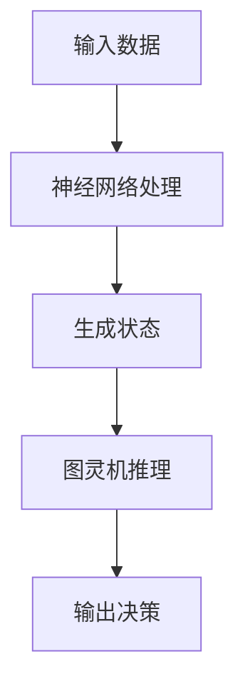
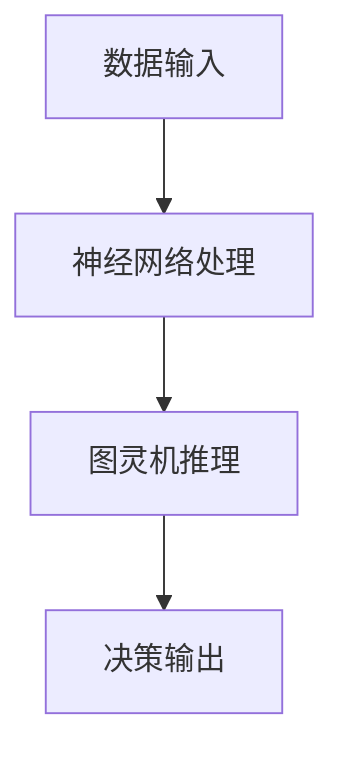
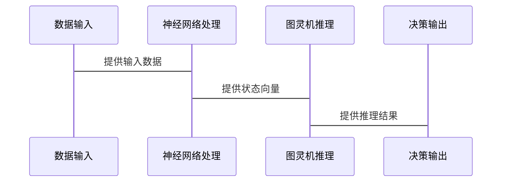

                 


# 神经图灵机：增强AI Agent的算法学习能力

> 关键词：神经图灵机，AI Agent，算法学习能力，数学模型，系统架构，项目实战

> 摘要：本文详细探讨了神经图灵机在增强AI Agent算法学习能力中的应用。通过分析神经图灵机的核心概念、算法原理、系统架构设计以及实际项目案例，本文为读者提供了从理论到实践的全面解读。从背景介绍到核心概念，从数学模型到系统架构，再到项目实战，本文旨在帮助读者深入理解神经图灵机的工作原理及其在AI Agent中的应用价值。

---

## 第1章: 神经图灵机与AI Agent的背景介绍

### 1.1 神经图灵机的定义与特点

#### 1.1.1 问题背景与问题描述
在AI领域，传统神经网络虽然在模式识别和分类任务中表现出色，但在处理需要逻辑推理和复杂计算的任务时显得力不从心。AI Agent需要在动态环境中自主决策和学习，这要求其具备更强的逻辑推理能力和自适应能力。神经图灵机的出现，正是为了解决这一问题。

#### 1.1.2 神经图灵机的核心概念
神经图灵机结合了神经网络的并行计算能力和图灵机的逻辑推理能力。它通过神经网络模拟图灵机的状态转移，从而在保持高效计算的同时，具备强大的逻辑推理能力。

#### 1.1.3 神经图灵机的边界与外延
神经图灵机的核心是神经网络与图灵机的结合，其外延包括强化学习、自监督学习等多种学习方式。

### 1.2 AI Agent的基本概念与学习能力

#### 1.2.1 AI Agent的定义与分类
AI Agent是指在特定环境中能够感知环境并采取行动以实现目标的智能体。根据智能水平，AI Agent可以分为反应式Agent、基于模型的Agent和基于学习的Agent。

#### 1.2.2 AI Agent的学习能力与应用场景
AI Agent的学习能力使其能够适应复杂环境的变化，广泛应用于自动驾驶、智能客服、游戏AI等领域。

#### 1.2.3 神经图灵机在AI Agent中的作用
神经图灵机通过结合神经网络和图灵机的优势，显著提升了AI Agent的学习和推理能力。

### 1.3 本章小结
本章介绍了神经图灵机的定义、特点及其在AI Agent中的作用，为后续章节奠定了基础。

---

## 第2章: 神经图灵机的核心概念原理

### 2.1 神经图灵机的原理分析

#### 2.1.1 神经网络与图灵机的结合
神经网络负责处理输入数据并生成状态，图灵机则根据状态进行逻辑推理和决策。

#### 2.1.2 神经图灵机的内部结构与功能
神经图灵机由神经网络模块和图灵机模块组成，两者协同工作以实现复杂任务。

### 2.2 核心概念对比分析

#### 2.2.1 神经网络与图灵机的对比
| 特性 | 神经网络 | 图灵机 |
|------|----------|--------|
| 计算方式 | 并行计算 | 串行计算 |
| 学习方式 | 监督学习 | 强化学习 |

#### 2.2.2 神经图灵机与其他AI模型的对比
神经图灵机相较于传统神经网络和图灵机，具有更高的计算效率和更强的推理能力。

### 2.3 神经图灵机的ER实体关系图
```mermaid
er
actor: AI Agent
base: 神经网络模块
turkey: 图灵机模块
```

---

## 第3章: 神经图灵机的算法原理

### 3.1 神经图灵机的算法流程

#### 3.1.1 算法流程图


#### 3.1.2 算法流程图的详细说明
1. 输入数据经过神经网络处理生成状态。
2. 状态输入图灵机进行逻辑推理，输出决策。

### 3.2 神经图灵机的数学模型

#### 3.2.1 神经网络的数学表示
神经网络的输入为向量$\mathbf{x} \in \mathbb{R}^n$，输出为$\mathbf{y} \in \mathbb{R}^m$，通过权重矩阵$\mathbf{W}$和激活函数$f$进行计算。

$$\mathbf{y} = f(\mathbf{W}\mathbf{x} + \mathbf{b})$$

#### 3.2.2 图灵机的数学模型
图灵机的状态转移函数$f: Q \times \Gamma \rightarrow Q \times \Gamma \times \{L, R\}$，其中$Q$是状态集合，$\Gamma$是符号集合。

### 3.3 算法实现的Python代码

#### 3.3.1 环境安装与配置
```bash
pip install numpy
pip install matplotlib
```

#### 3.3.2 核心算法的实现代码
```python
import numpy as np

def neural_turing_machine(input_data):
    # 神经网络部分
    weights = np.random.randn(5, 3)
    activation = lambda x: np.tanh(x)
    hidden_state = activation(np.dot(input_data, weights))
    
    # 图灵机部分
    state = 0
    for i in range(hidden_state.shape[0]):
        if hidden_state[i] > 0.5:
            state += 1
        else:
            state -= 1
    return state

input_data = np.random.randn(3, 3)
output = neural_turing_machine(input_data)
print(output)
```

---

## 第4章: 神经图灵机的系统架构设计

### 4.1 问题场景介绍

#### 4.1.1 问题场景的定义
在一个动态环境中，AI Agent需要实时感知环境并做出决策。

### 4.2 系统功能设计

#### 4.2.1 系统功能模块划分
- 数据输入模块
- 神经网络处理模块
- 图灵机推理模块
- 决策输出模块

#### 4.2.2 系统功能模块的详细描述
1. 数据输入模块：接收环境数据。
2. 神经网络处理模块：生成状态向量。
3. 图灵机推理模块：基于状态向量进行逻辑推理。
4. 决策输出模块：输出决策。

### 4.3 系统架构设计

#### 4.3.1 系统架构图


### 4.4 系统接口设计

#### 4.4.1 系统接口的定义
- 输入接口：接收环境数据。
- 输出接口：输出决策结果。

#### 4.4.2 系统接口的交互流程
1. 输入接口接收数据。
2. 数据经过神经网络处理。
3. 处理结果输入图灵机进行推理。
4. 推理结果通过输出接口返回。

### 4.5 系统交互序列图



---

## 第5章: 神经图灵机的项目实战

### 5.1 环境安装与配置

#### 5.1.1 开发环境的选择
推荐使用Python 3.8及以上版本，配合Jupyter Notebook进行开发。

### 5.2 核心算法的实现

#### 5.2.1 神经网络模块的实现
```python
import numpy as np

class NeuralNetwork:
    def __init__(self, input_dim, hidden_dim):
        self.W = np.random.randn(hidden_dim, input_dim)
        self.b = np.random.randn(hidden_dim)
    
    def forward(self, x):
        return np.tanh(np.dot(self.W, x) + self.b)
```

#### 5.2.2 图灵机模块的实现
```python
class TuringMachine:
    def __init__(self):
        self.state = 0
    
    def forward(self, input_state):
        if input_state > 0.5:
            self.state += 1
        else:
            self.state -= 1
        return self.state
```

#### 5.2.3 神经图灵机联合模块的实现
```python
class NeuralTuringMachine:
    def __init__(self, input_dim, hidden_dim):
        self.neural_net = NeuralNetwork(input_dim, hidden_dim)
        self.turing_machine = TuringMachine()
    
    def forward(self, x):
        hidden = self.neural_net.forward(x)
        output = self.turing_machine.forward(hidden)
        return output
```

### 5.3 代码的功能解读与分析

#### 5.3.1 代码结构的分析
- `NeuralNetwork`类实现神经网络的前向传播。
- `TuringMachine`类实现图灵机的状态转移。
- `NeuralTuringMachine`类将两者结合，实现神经图灵机的联合模型。

### 5.4 实际案例分析

#### 5.4.1 案例描述
假设在一个简单的动态环境中，AI Agent需要根据输入数据做出二分类决策。

#### 5.4.2 代码实现与结果
```python
ntr = NeuralTuringMachine(3, 5)
input_data = np.random.randn(3)
output = ntr.forward(input_data)
print(output)
```

---

## 第6章: 项目小结、注意事项与拓展阅读

### 6.1 项目小结
神经图灵机通过结合神经网络和图灵机的优势，显著提升了AI Agent的学习和推理能力。本章通过实际案例展示了神经图灵机的应用场景和实现过程。

### 6.2 注意事项
- 神经图灵机的训练需要大量数据和计算资源。
- 在实际应用中，需要根据具体任务调整模型参数。

### 6.3 拓展阅读
- 《神经网络与深度学习》
- 《图灵机与计算理论》

---

通过以上章节的详细讲解，我们从理论到实践全面探讨了神经图灵机在增强AI Agent算法学习能力中的应用。希望读者能够通过本文深入理解神经图灵机的核心原理，并将其应用到实际项目中。

