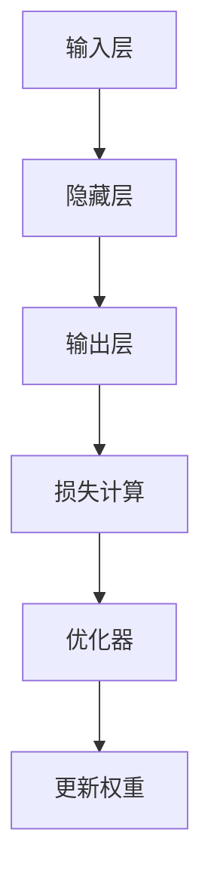
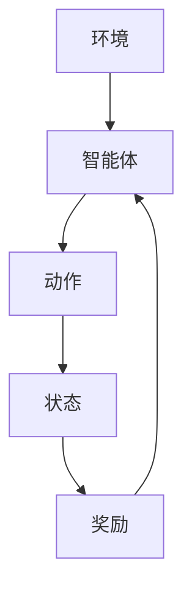
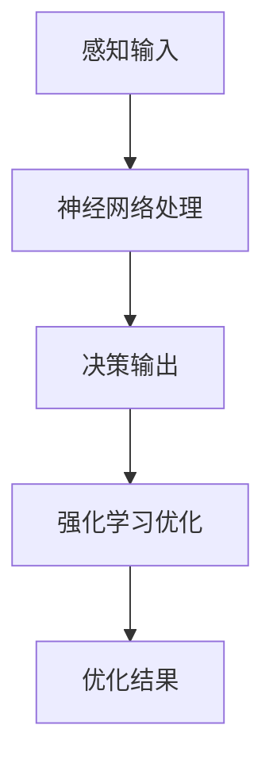
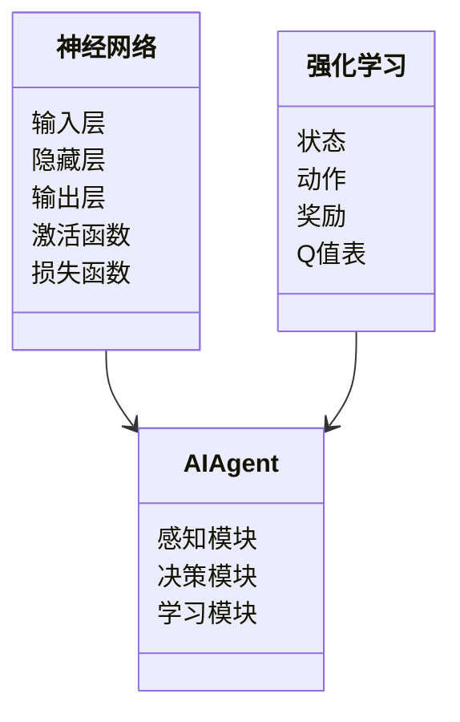
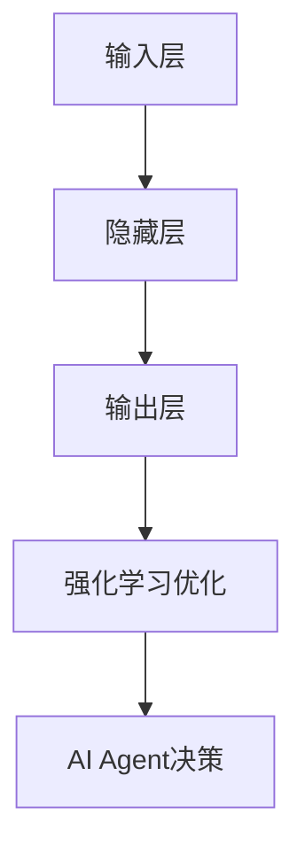
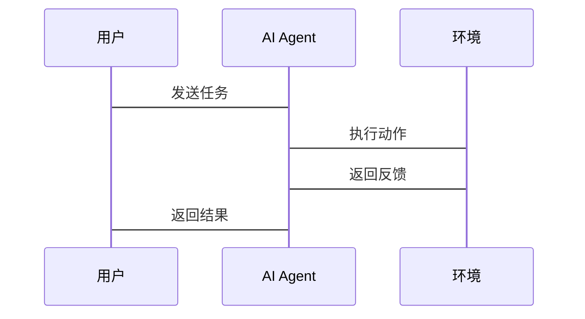

                 


# 《神经科学启发的AI Agent认知模型设计》

---

## 关键词：神经科学、AI Agent、认知模型、强化学习、神经网络、系统架构

---

## 摘要：  
本文深入探讨了神经科学与AI Agent的结合，从理论到实践，详细阐述了基于神经科学启发的AI Agent认知模型的设计方法。文章首先介绍了神经科学与AI Agent的基本概念及其结合背景，然后从核心概念、算法原理、系统架构等多个维度展开分析，结合数学模型与实际案例，详细讲解了神经科学启发的AI Agent认知模型的设计过程，并提供了具体的实现代码与系统架构图。通过本文的阐述，读者可以全面理解神经科学启发的AI Agent认知模型的理论基础与实际应用。

---

## 第一部分：神经科学与AI Agent的背景与基础

### 第1章：神经科学与AI Agent的概述

#### 1.1 神经科学的基本概念  
神经科学是研究神经系统结构与功能的科学，主要关注大脑如何处理信息、记忆与学习。神经科学的核心概念包括：  
- **神经元**：神经系统的基本单位，负责传递信息。  
- **突触**：神经元之间信息传递的连接点，负责信息的整合与处理。  
- **神经网络**：由大量神经元组成的复杂网络，能够实现信息的并行处理与学习。  

#### 1.2 AI Agent的基本原理  
AI Agent（智能体）是能够感知环境并采取行动以实现目标的实体。AI Agent的核心特点包括：  
- **自主性**：能够在没有外部干预的情况下自主决策。  
- **反应性**：能够实时感知环境并做出反应。  
- **学习能力**：能够通过经验改进自身的决策能力。  

#### 1.3 神经科学启发的AI Agent的背景与意义  
神经科学启发的AI Agent通过模拟人脑的神经网络结构与功能，构建更加智能的AI系统。这种结合的意义在于：  
1. 提高AI Agent的学习与适应能力。  
2. 为复杂场景下的决策提供更高效的解决方案。  
3. 推动神经科学与AI技术的交叉研究与应用。  

---

### 第2章：神经科学与AI Agent的核心概念与联系

#### 2.1 神经科学中的认知模型  
神经科学中的认知模型主要研究人脑如何处理信息，包括：  
- **信息处理机制**：人脑通过神经元与突触实现信息的传递与处理。  
- **记忆机制**：通过突触的强化实现长期记忆的存储。  
- **学习机制**：通过神经网络的可塑性实现知识的更新与增强。  

#### 2.2 AI Agent的认知模型  
AI Agent的认知模型是其核心功能的体现，包括：  
- **感知模块**：负责接收环境信息。  
- **决策模块**：基于感知信息做出决策。  
- **学习模块**：通过经验优化决策策略。  

#### 2.3 神经科学启发的AI Agent认知模型的构建  
通过对比神经科学与AI Agent的认知模型，我们可以发现以下联系：  
1. **神经元与AI Agent的对应关系**：神经元可以类比为AI Agent的基本处理单元。  
2. **突触与AI Agent的交互机制**：突触可以类比为AI Agent之间的信息传递通道。  
3. **神经网络与AI Agent的协同工作**：神经网络可以类比为AI Agent的协作网络。  

**对比表格：神经科学与AI Agent的认知模型对比**  

| **神经科学**       | **AI Agent**            |  
|---------------------|--------------------------|  
| 神经元             | Agent的基本单元         |  
| 突触               | Agent之间的交互机制     |  
| 神经网络           | Agent的协作网络         |  
| 记忆与学习         | Agent的学习模块         |  

**ER实体关系图：神经科学启发的AI Agent认知模型的实体关系**  

```mermaid
er
actor(用户) -|> Agent(智能体)
Agent --> 神经网络(处理单元)
神经网络 --> 神经元(基本单元)
神经元 --> 突触(信息传递)
```

---

### 第3章：神经科学启发的AI Agent认知模型的算法原理

#### 3.1 神经网络算法  
神经网络是神经科学启发的AI Agent认知模型的核心算法之一。  

**神经网络的基本结构**：  
- **输入层**：接收外界输入信息。  
- **隐藏层**：对输入信息进行处理与特征提取。  
- **输出层**：生成最终的输出结果。  

**激活函数**：  
- **sigmoid函数**：$f(x) = \frac{1}{1 + e^{-x}}$  
- **ReLU函数**：$f(x) = \max(0, x)$  
- **tanh函数**：$f(x) = \tanh(x)$  

**损失函数**：  
- **均方误差**：$L = \frac{1}{2n} \sum_{i=1}^{n} (y_i - \hat{y_i})^2$  
- **交叉熵损失**：$L = -\frac{1}{n} \sum_{i=1}^{n} y_i \log(\hat{y_i}) + (1 - y_i) \log(1 - \hat{y_i})$  

**优化算法**：  
- **随机梯度下降（SGD）**：$\theta = \theta - \eta \cdot \nabla L$  
- **Adam优化器**：结合了动量与自适应学习率的优化算法。  

**神经网络算法的Mermaid流程图**  



#### 3.2 强化学习算法  
强化学习是另一种重要的神经科学启发的AI Agent认知模型算法。  

**Q-Learning算法**：  
- **状态-动作-奖励模型**：通过试错学习，智能体在环境中通过选择动作，获得奖励，优化Q值。  
- **Q值更新公式**：$Q(s, a) = Q(s, a) + \alpha (r + \gamma \max Q(s', a') - Q(s, a))$  

**策略梯度算法**：  
- **策略表示**：通过参数化策略函数，直接优化策略的参数。  
- **梯度计算**：$\nabla \theta = \frac{1}{n} \sum_{i=1}^{n} \nabla \log \pi_\theta(a|s) Q_\theta(s, a)$  

**强化学习算法的Mermaid流程图**  



#### 3.3 神经科学启发的AI Agent认知模型的算法流程图  



---

### 第4章：神经科学启发的AI Agent认知模型的数学模型与公式

#### 4.1 神经网络的数学模型  

**神经网络的输入输出关系**：  
$$ y = f(xW + b) $$  

**激活函数的数学表达式**：  
$$ f(x) = \max(0, x) \quad \text{（ReLU函数）} $$  

**损失函数的数学公式**：  
$$ L = \frac{1}{2n} \sum_{i=1}^{n} (y_i - \hat{y_i})^2 \quad \text{（均方误差）} $$  

#### 4.2 强化学习的数学模型  

**Q-Learning的数学公式**：  
$$ Q(s, a) = Q(s, a) + \alpha (r + \gamma \max Q(s', a') - Q(s, a)) $$  

**策略梯度的数学公式**：  
$$ \nabla \theta = \frac{1}{n} \sum_{i=1}^{n} \nabla \log \pi_\theta(a|s) Q_\theta(s, a) $$  

---

## 第二部分：系统分析与架构设计方案

### 第5章：系统分析与架构设计

#### 5.1 问题场景介绍  
本文设计的AI Agent认知模型主要用于解决复杂环境下的智能决策问题，例如机器人导航、游戏AI等场景。  

#### 5.2 系统功能设计  

**领域模型：AI Agent认知模型的类图**  



#### 5.3 系统架构设计  

**系统架构图：AI Agent认知模型的架构**  



#### 5.4 系统接口设计  
- **输入接口**：接收环境感知信息。  
- **输出接口**：输出决策动作。  
- **学习接口**：更新神经网络参数。  

#### 5.5 系统交互流程  

**交互流程图：AI Agent认知模型的交互流程**  



---

### 第6章：项目实战

#### 6.1 环境安装  
- 安装Python环境：`python --version`  
- 安装深度学习框架：`pip install tensorflow`  
- 安装可视化工具：`pip install matplotlib`  

#### 6.2 系统核心实现源代码  

**神经网络实现代码**：  

```python
import tensorflow as tf

# 定义神经网络模型
class NeuralNetwork:
    def __init__(self, input_size, output_size):
        self.weights = tf.Variable(tf.random.truncated_normal([input_size, output_size]))
        self.bias = tf.Variable(tf.zeros([output_size]))
    
    def call(self, x):
        return tf.nn.relu(tf.matmul(x, self.weights) + self.bias)
    
    def model(self, x):
        return self.call(x)
```

**强化学习实现代码**：  

```python
import numpy as np

# 定义Q-Learning算法
class QLearning:
    def __init__(self, state_space, action_space, learning_rate=0.1, gamma=0.9):
        self.state_space = state_space
        self.action_space = action_space
        self.lr = learning_rate
        self.gamma = gamma
        self.Q = np.zeros((state_space, action_space))
    
    def choose_action(self, state, epsilon=0.1):
        if np.random.random() < epsilon:
            return np.random.randint(self.action_space)
        else:
            return np.argmax(self.Q[state])
    
    def update_Q(self, state, action, reward, next_state):
        self.Q[state][action] = self.Q[state][action] + self.lr * (reward + self.gamma * np.max(self.Q[next_state]) - self.Q[state][action])
```

#### 6.3 代码应用解读与分析  
通过上述代码，我们可以实现一个简单的神经科学启发的AI Agent认知模型，用于解决特定的智能决策问题。  

#### 6.4 实际案例分析与详细讲解剖析  
以机器人导航为例，通过神经网络实现路径规划，强化学习实现路径优化，最终实现智能机器人在复杂环境中的自主导航。  

---

### 第7章：最佳实践、小结与注意事项

#### 7.1 最佳实践 tips  
- 在实际应用中，建议结合具体场景选择合适的算法。  
- 神经网络与强化学习的结合能够显著提升AI Agent的智能水平。  
- 定期更新模型参数，以适应环境的变化。  

#### 7.2 小结  
本文从理论到实践，全面阐述了神经科学启发的AI Agent认知模型的设计方法，通过具体的代码实现与案例分析，为读者提供了丰富的参考与启示。  

#### 7.3 注意事项  
- 神经科学启发的AI Agent认知模型的实现需要一定的数学基础与编程能力。  
- 在实际应用中，需注意模型的训练效率与计算资源的消耗。  
- 模型的泛化能力需要通过大量的数据进行验证与优化。  

---

## 第三部分：拓展阅读

### 第8章：拓展阅读与参考资料

#### 8.1 相关书籍  
- 《深度学习》—— Ian Goodfellow  
- 《强化学习》—— Richard S. Sutton  

#### 8.2 相关论文  
- "Deep Learning and the Brain"  
- "Neuroscience-Inspired AI: A Review"  

#### 8.3 在线资源  
- TensorFlow官方文档  
- PyTorch官方文档  
- OpenAI的GPT系列论文  

---

通过本文的系统阐述，读者可以全面掌握神经科学启发的AI Agent认知模型的设计方法，并能够将其应用于实际场景中，为AI技术的发展提供新的思路与方向。

