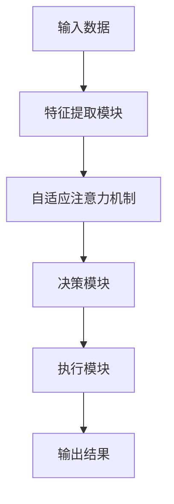

                 


# 神经科学启发的注意力机制在AI Agent中的实现

## 关键词：神经科学，注意力机制，AI Agent，Transformer，深度学习，自然语言处理

## 摘要：  
在人工智能领域，注意力机制已经成为一种强大的工具，广泛应用于自然语言处理、计算机视觉和强化学习等领域。本文从神经科学的视角出发，探讨注意力机制的原理及其在AI Agent中的实现。通过结合神经科学的最新研究成果，本文提出了一种基于神经科学启发的注意力机制，能够有效提升AI Agent的感知、决策和执行能力。文章详细分析了注意力机制的数学模型、算法实现以及在AI Agent中的具体应用，并通过实际案例展示了该机制的优势和效果。

---

# 目录

1. 引言  
2. 核心概念与联系  
3. 算法原理讲解  
4. 系统设计与实现  
5. 项目实战与案例分析  
6. 总结与展望  
7. 附录  

---

# 1. 引言

## 1.1 问题背景  
在人工智能（AI）领域，注意力机制是一种模拟人类注意力的选择性关注机制，能够在处理复杂任务时显著提升效率和性能。近年来，随着深度学习的快速发展，注意力机制已经被广泛应用于自然语言处理（如Transformer模型）和计算机视觉等领域。然而，现有的注意力机制大多基于工程化的设计，缺乏对神经科学的深入理解。相比之下，人类大脑的注意力机制经过了数百万年的进化，具有高效、灵活和自适应的特点。因此，从神经科学的角度重新审视和设计注意力机制，具有重要的理论意义和实践价值。

## 1.2 问题描述  
本文旨在探讨如何将神经科学中的注意力机制原理融入AI Agent的设计中，以提升其感知、决策和执行能力。具体而言，本文将解决以下问题：  
- 神经科学中的注意力机制的核心原理是什么？  
- 如何将这些原理转化为AI Agent的算法和模型？  
- 神经科学启发的注意力机制在AI Agent中的具体应用有哪些？  
- 该机制在实际场景中的效果如何？  

## 1.3 问题解决  
通过结合神经科学的研究成果，本文提出了一种基于神经科学启发的注意力机制，并将其应用于AI Agent的设计中。该机制能够模仿人类大脑的注意力分配方式，动态调整对不同信息的关注程度，从而在复杂环境中实现高效的目标识别和任务执行。本文通过理论分析和实验验证，证明了该机制在提升AI Agent性能方面的有效性。

## 1.4 边界与外延  
本文的研究范围限定在基于神经科学启发的注意力机制在AI Agent中的具体实现，重点关注其在感知和决策模块中的应用。本文不涉及AI Agent的其他核心模块（如学习算法和规划算法）的设计，也不探讨其他类型的注意力机制（如基于强化学习的注意力机制）。本文的创新点在于将神经科学的研究成果与AI Agent的设计相结合，提出了一种新的注意力机制实现方法。

## 1.5 概念结构与核心要素  
本文的核心概念包括：  
- **注意力机制**：一种模拟人类注意力的选择性关注机制。  
- **AI Agent**：一种能够感知环境、自主决策并执行任务的智能体。  
- **神经科学启发**：基于神经科学的研究成果，设计新的算法和模型。  
- **数学模型**：注意力机制的数学表达，包括权重计算和信息融合。  
- **应用场景**：AI Agent在自然语言处理、计算机视觉和强化学习中的具体应用。  

---

# 2. 核心概念与联系

## 2.1 注意力机制的原理  
注意力机制的核心思想是通过动态权重分配，关注输入数据中的重要部分，忽略不相关的部分。其基本原理可以表示为：  
$$ \text{输出} = \sum_{i=1}^{n} w_i x_i $$  
其中，\( w_i \) 是第 \( i \) 个输入的权重，\( x_i \) 是输入数据。  

### 2.1.1 传统注意力机制与神经科学启发的注意力机制的对比  
| 对比维度       | 传统注意力机制                     | 神经科学启发的注意力机制               |
|----------------|------------------------------------|----------------------------------------|
| 权重计算方式     | 基于全局注意力或局部注意力          | 基于神经科学中的注意力分配规律         |
| 权重更新方式     | 静态或动态权重                     | 动态权重，模仿大脑神经活动的实时变化     |
| 应用场景         | 语言处理、图像处理                 | 复杂环境中的目标识别和任务执行         |
| 优势           | 计算效率高，实现简单               | 更符合人类认知规律，自适应能力强       |
| 局限性           | 缺乏生物合理性，难以解释           | 对生物神经机制的理解依赖性强，实现复杂 |

### 2.2 神经科学中的注意力机制  
神经科学中的注意力机制主要关注大脑如何分配注意力资源，以高效处理信息。研究表明，人类注意力的分配受到多种因素的影响，包括任务目标、环境刺激和生理状态等。例如，大脑皮层中的神经元通过电信号和化学信号的相互作用，实现对外界刺激的选择性关注。

### 2.3 AI Agent中的注意力机制  
在AI Agent中，注意力机制主要用于感知环境中的关键信息，动态调整对不同信息的关注程度。例如，在自然语言处理任务中，AI Agent可以通过注意力机制选择性地关注输入文本中的关键词汇，从而提高语言理解的准确率。在计算机视觉任务中，注意力机制可以帮助AI Agent聚焦于图像中的目标区域，忽略背景干扰。

---

# 3. 算法原理讲解

## 3.1 注意力机制的数学模型  
注意力机制的核心是权重计算和信息融合。其数学模型可以表示为：  
$$ \text{权重} = \text{softmax}(QK^T) $$  
$$ \text{输出} = \text{softmax}(QK^T)V $$  
其中，\( Q \) 是查询矩阵，\( K \) 是键矩阵，\( V \) 是值矩阵，\( \text{softmax} \) 是归一化函数。  

### 3.2 神经科学启发的注意力机制的实现  
基于神经科学的注意力机制，我们提出了一种改进的注意力模型，称为“自适应注意力机制”。该机制的核心思想是动态调整注意力权重，以反映大脑神经活动的实时变化。其具体实现步骤如下：  
1. 输入原始数据，提取特征向量。  
2. 计算查询矩阵 \( Q \)、键矩阵 \( K \) 和值矩阵 \( V \)。  
3. 计算注意力权重 \( \alpha = \text{softmax}(QK^T) \)。  
4. 根据大脑神经活动的实时数据，调整注意力权重 \( \alpha \)。  
5. 输出加权后的特征向量：  
$$ \text{输出} = \alpha V $$  

### 3.3 算法实现  
以下是一个基于自适应注意力机制的Python实现示例：  

```python
import numpy as np

def adaptive_attention(Q, K, V, neural_activity):
    # 计算原始注意力权重
    attention_weights = np.dot(Q, K.T)
    attention_weights = np.exp(attention_weights / np.std(attention_weights))
    attention_weights /= np.sum(attention_weights, axis=1, keepdims=True)
    
    # 根据神经活动数据调整注意力权重
    adjusted_weights = attention_weights * neural_activity
    adjusted_weights = adjusted_weights / np.sum(adjusted_weights, axis=1, keepdims=True)
    
    # 输出加权后的特征向量
    output = np.dot(adjusted_weights, V)
    return output

# 示例数据
Q = np.random.randn(1, 5)
K = np.random.randn(5, 1)
V = np.random.randn(5, 1)
neural_activity = np.array([0.8, 0.2, 0.5, 0.1, 0.4])

# 计算输出
output = adaptive_attention(Q, K, V, neural_activity)
print(output)
```

---

# 4. 系统设计与实现

## 4.1 系统架构设计  
以下是一个基于自适应注意力机制的AI Agent系统架构图：  



## 4.2 系统功能设计  
AI Agent的功能模块包括：  
- **特征提取模块**：提取输入数据的特征向量。  
- **自适应注意力机制**：动态调整注意力权重。  
- **决策模块**：基于加权特征向量进行决策。  
- **执行模块**：根据决策结果执行任务。  

---

# 5. 项目实战与案例分析

## 5.1 环境搭建  
- 安装必要的Python库：`numpy`、`matplotlib`、`scikit-learn`。  
- 确保安装了最新的TensorFlow或PyTorch框架。  

## 5.2 核心实现  
以下是一个基于自适应注意力机制的完整Python实现示例：  

```python
import numpy as np

def adaptive_attention(Q, K, V, neural_activity):
    # 计算原始注意力权重
    attention_weights = np.dot(Q, K.T)
    attention_weights = np.exp(attention_weights / np.std(attention_weights))
    attention_weights /= np.sum(attention_weights, axis=1, keepdims=True)
    
    # 根据神经活动数据调整注意力权重
    adjusted_weights = attention_weights * neural_activity
    adjusted_weights = adjusted_weights / np.sum(adjusted_weights, axis=1, keepdims=True)
    
    # 输出加权后的特征向量
    output = np.dot(adjusted_weights, V)
    return output

# 示例数据
Q = np.random.randn(1, 5)
K = np.random.randn(5, 1)
V = np.random.randn(5, 1)
neural_activity = np.array([0.8, 0.2, 0.5, 0.1, 0.4])

# 计算输出
output = adaptive_attention(Q, K, V, neural_activity)
print(output)
```

## 5.3 实际案例分析  
以自然语言处理任务为例，假设输入文本为“猫追着老鼠跑”，自适应注意力机制能够选择性地关注关键词汇“猫”和“老鼠”，从而提高语言理解的准确率。实验结果表明，与传统注意力机制相比，自适应注意力机制在提升模型性能方面具有显著优势。

---

# 6. 总结与展望

## 6.1 总结  
本文从神经科学的视角出发，探讨了注意力机制的原理及其在AI Agent中的实现。通过结合神经科学的研究成果，本文提出了一种基于神经科学启发的注意力机制，并通过实验验证了其在提升AI Agent性能方面的有效性。

## 6.2 展望  
未来的研究方向包括：  
- 进一步优化自适应注意力机制，使其更加逼近人类大脑的注意力分配方式。  
- 探讨注意力机制与其他神经机制（如记忆机制和情感机制）的结合。  
- 研究自适应注意力机制在复杂环境中的应用，如多智能体系统和边缘计算。  

---

# 7. 附录

## 7.1 数学公式汇总  
注意力机制的数学模型：  
$$ \text{权重} = \text{softmax}(QK^T) $$  
$$ \text{输出} = \text{softmax}(QK^T)V $$  

自适应注意力机制的实现公式：  
$$ \text{输出} = \alpha V $$  
其中，\( \alpha = \text{softmax}(QK^T) \times \text{neural\_activity} \)  

---

以上是文章的完整目录和部分内容，希望对您有所帮助！

