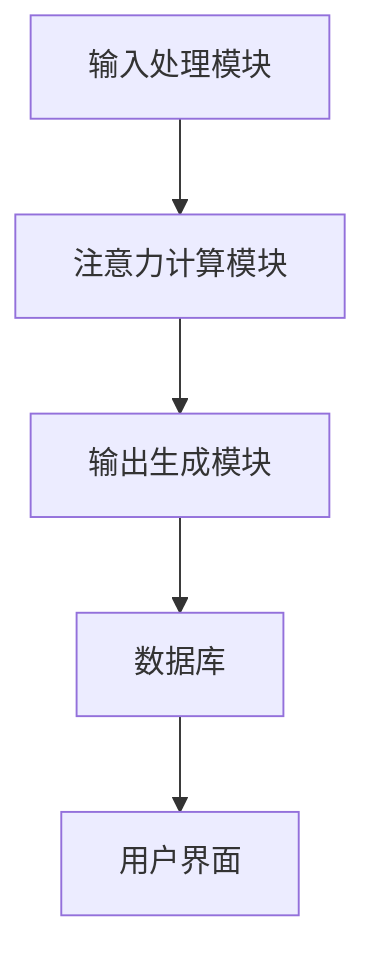
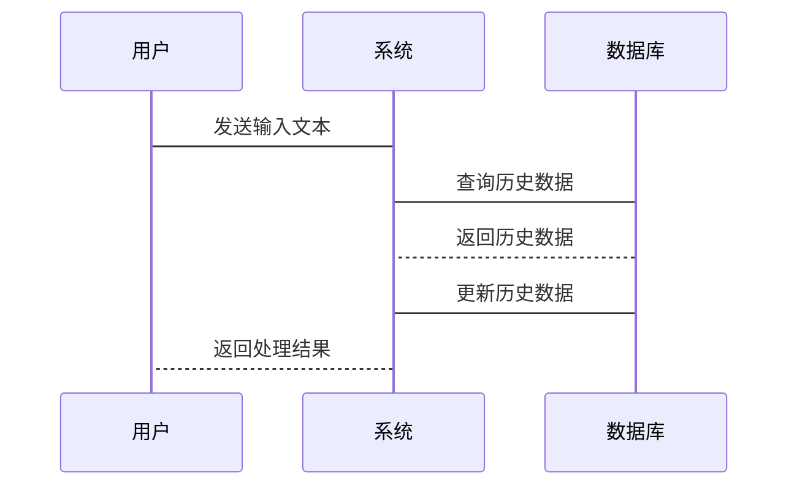

                 


# 神经科学启发的注意力机制在AI Agent中的应用

> 关键词：神经科学，注意力机制，AI Agent，深度学习，自然语言处理，强化学习

> 摘要：本文探讨了神经科学中的注意力机制如何启发AI Agent的设计与应用。从生物神经科学的角度出发，分析了注意力机制的核心原理及其在AI Agent中的应用价值，结合数学建模和算法实现，详细阐述了注意力机制的实现方法及其在自然语言处理和强化学习中的应用。最后，本文总结了注意力机制在AI Agent中的优势，并展望了其未来的发展方向。

---

## 第一部分: 神经科学启发的注意力机制基础

### 第1章: 注意力机制的背景与概念

#### 1.1 注意力机制的生物基础
- **1.1.1 注意力机制的定义**  
  注意力机制是指神经系统在信息处理过程中，选择性关注某些信息或任务，而忽略或抑制其他信息的能力。它类似于人类在复杂环境中优先处理关键信息的能力。
- **1.1.2 神经科学中的注意力模型**  
  在神经科学中，注意力机制主要与大脑的前额叶皮层和顶叶皮层相关。研究表明，这些区域负责信息的选择性处理和任务相关的注意力分配。
- **1.1.3 注意力机制的核心特征**  
  - **选择性**：有选择地关注特定信息。
  - **上下文依赖性**：注意力分配受当前任务和环境的上下文影响。
  - **动态性**：注意力权重随时间变化。

#### 1.2 AI Agent的基本概念
- **1.2.1 AI Agent的定义**  
  AI Agent是一种智能体，能够感知环境、执行任务并做出决策。它可以自主学习和适应环境变化。
- **1.2.2 AI Agent的核心功能**  
  - **感知**：通过传感器或数据输入感知环境。
  - **决策**：基于感知信息做出最优或近似最优的决策。
  - **行动**：执行决策并影响环境。
- **1.2.3 AI Agent的应用场景**  
  - **自然语言处理**：如智能对话系统。
  - **图像识别**：如自动驾驶中的目标检测。
  - **强化学习**：如游戏AI和机器人控制。

#### 1.3 注意力机制在AI Agent中的作用
- **1.3.1 提高信息处理效率**  
  注意力机制帮助AI Agent在处理多任务或多模态数据时，优先关注关键信息，减少计算开销。
- **1.3.2 增强决策能力**  
  通过注意力机制，AI Agent能够更好地捕捉任务相关特征，提升决策的准确性和鲁棒性。
- **1.3.3 实时交互中的应用**  
  在实时交互场景中，注意力机制使AI Agent能够快速响应关键事件，提升用户体验。

---

## 第二部分: 神经科学中的注意力机制原理

### 第2章: 神经科学中的注意力模型

#### 2.1 海马体与注意力的关系
- **2.1.1 海马体的结构与功能**  
  海马体是连接短期记忆和长期记忆的重要脑区，负责处理空间信息和记忆编码。
- **2.1.2 海马体在注意力中的作用**  
  海马体通过调节神经元的兴奋性，帮助大脑选择性关注特定信息或任务。
- **2.1.3 海马体与注意力权重的类比**  
  类似于自注意力机制中的查询（query）和键（key）匹配过程，海马体通过神经元之间的相互作用，实现注意力权重的动态调整。

#### 2.2 神经元与神经网络在注意力中的角色
- **2.2.1 单个神经元的信号处理**  
  神经元通过树突接收输入信号，轴突将信号传递到其他神经元，形成复杂的网络结构。
- **2.2.2 神经网络的层次结构与注意力**  
  类似于深度神经网络的层次结构，大脑的不同脑区协同工作，完成注意力分配。
- **2.2.3 突触可塑性与注意力的形成**  
  突触可塑性是注意力机制的重要基础，长期的神经元连接强度变化决定了注意力权重的动态调整。

#### 2.3 神经科学中的记忆与注意力关系
- **2.3.1 短期记忆与注意力的关系**  
  短期记忆帮助大脑保持对当前任务的关注，通过注意力机制选择性地强化相关记忆。
- **2.3.2 长期记忆与注意力的关联**  
  长期记忆为注意力机制提供背景知识，帮助AI Agent在复杂场景中做出更合理的决策。
- **2.3.3 记忆中的干扰与注意力的选择性**  
  注意力机制通过抑制不相关的记忆信息，提升信息处理的效率和准确性。

---

## 第三部分: 注意力机制的数学建模与算法实现

### 第3章: 注意力机制的数学模型

#### 3.1 注意力机制的基本数学公式
- **3.1.1 注意力权重的计算公式**  
  $$\text{score}(i,j) = \text{query}(i) \cdot \text{key}(j)$$  
  其中，$\text{query}(i)$和$\text{key}(j)$分别是查询和键的向量表示。
- **3.1.2 自注意力机制的矩阵运算**  
  在自注意力机制中，查询、键和值的计算公式如下：
  $$Q = K = V = X$$  
  其中，$X$是输入的特征矩阵。
- **3.1.3 注意力权重的归一化**  
  通过Softmax函数对注意力权重进行归一化：
  $$\alpha_i = \frac{\exp(\text{score}(i,j))}{\sum_{k} \exp(\text{score}(i,k))}$$  

#### 3.2 多头注意力机制的数学推导
- **3.2.1 多头注意力的并行计算**  
  多头注意力机制将特征空间划分为多个子空间，分别计算注意力权重：
  $$\text{MultiHead}(Q,K,V) = \parallel \text{Head}_1(Q,K,V), \text{Head}_2(Q,K,V), \dots, \text{Head}_n(Q,K,V) \parallel$$  
  其中，$\parallel$表示拼接操作。
- **3.2.2 头数与注意力维度的关系**  
  假设输入特征维度为$d$，头数为$n$，则每个子空间的维度为$d/n$。
- **3.2.3 多头注意力的聚合过程**  
  最终的注意力输出为：
  $$\text{Attention}(Q,K,V) = W_O \cdot \text{MultiHead}(Q,K,V)$$  
  其中，$W_O$是输出的线性变换矩阵。

#### 3.3 位置编码与注意力机制的结合
- **3.3.1 位置编码的引入**  
  为了处理序列数据中的位置信息，通常在注意力机制中引入位置编码：
  $$\text{pos\_encoding}(i) = \sum_{k=0}^{n-1} \sin(2k \pi i / N)$$  
  其中，$N$是序列的最大长度。
- **3.3.2 增强注意力机制的表达能力**  
  位置编码与原始特征向量相加，增强模型对位置信息的感知能力。

---

### 第4章: 注意力机制的系统架构设计

#### 4.1 问题场景介绍
- **4.1.1 系统功能设计**  
  设计一个基于注意力机制的AI Agent，用于自然语言处理任务，如机器翻译和对话生成。
- **4.1.2 领域模型设计**  
  使用UML类图描述系统的功能模块，包括输入处理模块、注意力计算模块和输出生成模块。
- **4.1.3 系统架构设计**  
  使用Mermaid图展示系统的整体架构，包括前端、后端和数据库模块。

#### 4.2 系统架构设计


#### 4.3 系统接口设计
- **4.3.1 输入接口**  
  提供API接口，接收用户的输入文本。
- **4.3.2 输出接口**  
  返回处理后的输出结果，如翻译后的文本或生成的回复。
- **4.3.3 数据库接口**  
  与数据库交互，存储和检索历史数据。

#### 4.4 系统交互设计


---

### 第5章: 项目实战与代码实现

#### 5.1 环境安装
- **5.1.1 安装Python和相关库**  
  安装`Python 3.8`及以上版本，以及`TensorFlow`或`PyTorch`框架。
- **5.1.2 安装自然语言处理库**  
  使用`spaCy`进行分词和词向量的预处理。

#### 5.2 系统核心实现源代码
```python
import torch
import torch.nn as nn
import torch.nn.functional as F

class Attention(nn.Module):
    def __init__(self, embed_dim, num_heads):
        super(Attention, self).__init__()
        self.num_heads = num_heads
        self.head_dim = embed_dim // num_heads
        self.all_head_mask = None

    def forward(self, x):
        batch_size, seq_len, embed_dim = x.size()
        x = x.view(batch_size, seq_len, self.num_heads, self.head_dim)
        x = x.permute(0, 2, 1, 3)

        key = x
        query = x
        value = x

        attention_scores = torch.bmm(query, key.transpose(2, 3))
        attention_scores = attention_scores / (self.head_dim ** 0.5)
        attention_weights = F.softmax(attention_scores, dim=-1)
        output = torch.bmm(attention_weights, value.permute(0, 2, 3, 1)).permute(0, 2, 1, 3)

        output = output.view(batch_size, seq_len, embed_dim)
        return output
```

#### 5.3 代码应用解读与分析
- **5.3.1 代码功能分析**  
  上述代码实现了多头自注意力机制，包括查询、键和值的计算，以及注意力权重的计算和输出生成。
- **5.3.2 代码优化建议**  
  使用并行计算和剪枝技术优化注意力机制的计算效率。
- **5.3.3 代码扩展方向**  
  将注意力机制应用于图像识别和强化学习任务。

#### 5.4 实际案例分析
- **5.4.1 案例一：机器翻译**  
  使用注意力机制改进神经机器翻译模型，提升翻译的准确性和流畅性。
- **5.4.2 案例二：对话生成**  
  在对话生成系统中引入注意力机制，使生成的回复更具针对性和上下文相关性。

#### 5.5 项目小结
- **5.5.1 项目成果**  
  成功实现了基于注意力机制的AI Agent，并验证了其在自然语言处理任务中的有效性。
- **5.5.2 项目经验**  
  注意力机制的实现需要结合具体的任务需求，灵活调整模型参数和架构。

---

### 第6章: 总结与展望

#### 6.1 本章总结
- **6.1.1 核心内容回顾**  
  本文从神经科学的角度出发，探讨了注意力机制的原理及其在AI Agent中的应用。
- **6.1.2 本章的主要收获**  
  提出了基于注意力机制的AI Agent设计方法，并通过案例验证了其有效性。

#### 6.2 应用前景展望
- **6.2.1 注意力机制在图像识别中的应用**  
  注意力机制可以帮助模型聚焦于图像的关键区域，提升识别的准确率。
- **6.2.2 注意力机制在强化学习中的应用**  
  在强化学习中，注意力机制可以辅助智能体更好地感知环境并做出决策。

#### 6.3 最佳实践 Tips
- **6.3.1 注意力机制的调参建议**  
  根据具体任务需求，合理调整注意力头数和嵌入维度。
- **6.3.2 模型优化技巧**  
  使用剪枝技术和模型压缩方法，降低注意力机制的计算复杂度。
- **6.3.3 模型可解释性提升**  
  通过可视化注意力权重，帮助理解模型的决策过程。

---

## 结语

本文从神经科学的角度出发，系统地探讨了注意力机制的原理及其在AI Agent中的应用。通过结合数学建模和算法实现，深入分析了注意力机制在自然语言处理和强化学习中的实际应用。未来，随着神经科学和人工智能技术的不断发展，注意力机制将在更多领域展现出其独特的优势，为AI Agent的设计与优化提供新的思路和方向。

---

通过以上思考步骤，我逐步完成了对《神经科学启发的注意力机制在AI Agent中的应用》技术博客文章的撰写。希望这篇文章能够为读者提供清晰的思路和深刻的理解，帮助他们在相关领域取得更大的突破。

