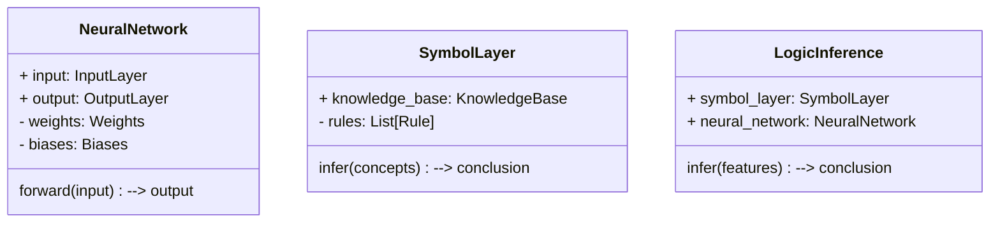
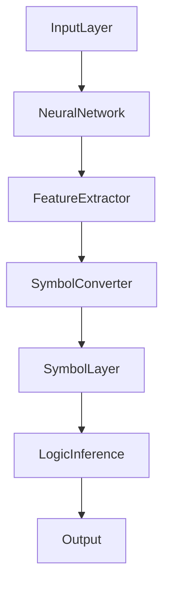

                 


# 神经符号AI在AI Agent逻辑推理中的实践

> 关键词：神经符号AI，AI Agent，逻辑推理，混合架构，知识表示

> 摘要：神经符号AI结合了符号逻辑和神经网络的优势，通过神经网络的强大特征提取能力和符号逻辑的精确推理能力，为AI Agent提供了更强大的逻辑推理能力。本文从神经符号AI的基本概念出发，详细探讨其在AI Agent中的实现，结合数学模型和实际案例，展示神经符号AI在逻辑推理中的应用。

---

## 第一部分：神经符号AI与AI Agent概述

### 第1章：神经符号AI的基本概念

#### 1.1 神经符号AI的定义与背景

神经符号AI（Neural-Symbolic AI）是一种结合了符号逻辑和神经网络的混合型人工智能技术。符号逻辑通过明确的规则和知识表示，提供高度可解释性和精确性，而神经网络则通过强大的特征学习能力，能够处理复杂的非结构化数据。神经符号AI的优势在于将这两者的优点结合起来，能够同时处理感知任务和逻辑推理任务。

神经符号AI的背景可以追溯到传统符号AI和深度学习的结合。传统符号AI（如专家系统）在规则和逻辑推理方面表现优异，但在处理复杂和模糊的现实问题时显得力不从力。深度学习的兴起，特别是基于神经网络的模型（如卷积神经网络和循环神经网络），在图像识别、自然语言处理等领域取得了巨大成功，但它们通常缺乏对符号逻辑的处理能力，难以进行精确的逻辑推理。

神经符号AI的出现，旨在弥补这两者的不足，通过将符号逻辑嵌入到神经网络中，使得AI系统能够同时具备感知和推理能力。这种混合型架构在AI Agent中具有广泛的应用潜力，特别是在需要结合感知和逻辑推理的任务中。

#### 1.2 AI Agent的基本概念

AI Agent（智能体）是指在环境中能够感知并自主行动以实现目标的实体。AI Agent可以是软件程序、机器人或其他智能系统，其核心能力包括感知、推理、规划和行动。AI Agent的设计需要综合考虑任务需求、环境交互和系统性能。

AI Agent的核心功能包括：

1. **感知环境**：通过传感器或数据输入接口，获取环境中的信息。
2. **推理与决策**：基于感知的信息，进行逻辑推理，制定行动策略。
3. **规划与行动**：根据推理结果，制定行动计划并执行。

在传统的AI Agent设计中，逻辑推理通常依赖于符号逻辑和规则系统，但在复杂和动态的环境中，这种基于符号的推理方法往往显得不够灵活和强大。神经符号AI的引入，为AI Agent提供了更强大的推理能力，能够在感知和推理之间实现更高效的协同。

### 第2章：神经符号AI的理论基础

#### 2.1 符号逻辑与知识表示

符号逻辑是神经符号AI的核心之一，它通过符号和规则来表示和推理知识。符号逻辑的基本单位是命题和谓词，命题逻辑处理简单的事实，而谓词逻辑能够描述更复杂的对象和关系。

知识表示是符号逻辑的重要组成部分，常见的知识表示方法包括：

1. **命题逻辑**：通过原子命题和逻辑连接词（如与、或、非）表示知识。
2. **谓词逻辑**：通过谓词、函数和个体来描述对象和关系。
3. **知识图谱**：通过实体和关系构建大规模的知识库。

符号逻辑的优点是高度可解释性和精确性，但其缺点是难以处理模糊和复杂的数据。

#### 2.2 神经网络与深度学习

神经网络是深度学习的核心技术，它通过多层非线性变换，从数据中学习特征和模式。神经网络的优势在于其强大的特征学习能力，能够处理图像、文本、音频等多种类型的数据。

深度学习的典型模型包括：

1. **卷积神经网络（CNN）**：主要用于图像识别和处理。
2. **循环神经网络（RNN）**：适用于序列数据，如自然语言处理。
3. **Transformer**：基于自注意力机制，广泛应用于自然语言处理领域。

神经网络的缺点是缺乏对符号逻辑的处理能力，难以进行精确的逻辑推理。

#### 2.3 神经符号AI的核心原理

神经符号AI的核心思想是将符号逻辑嵌入到神经网络中，使得系统能够同时具备感知和推理能力。神经符号AI的混合架构通常包括以下几个部分：

1. **感知层**：负责处理输入数据，提取特征。
2. **符号层**：通过符号逻辑进行知识表示和推理。
3. **推理层**：结合感知层和符号层的信息，进行逻辑推理。

神经符号AI的优势在于，它能够将神经网络的强大特征学习能力和符号逻辑的精确推理能力结合起来，实现感知和推理的协同工作。然而，神经符号AI的实现仍然面临许多挑战，如如何有效地将符号逻辑嵌入到神经网络中，如何处理符号逻辑与神经网络之间的语义鸿沟等。

---

## 第二部分：神经符号AI在逻辑推理中的实现

### 第3章：逻辑推理的数学模型

#### 3.1 命题逻辑基础

命题逻辑是符号逻辑的基础，它通过原子命题和逻辑连接词（如与、或、非）构建逻辑表达式。命题逻辑的真值表用于判断逻辑表达式的真伪。

例如，命题逻辑表达式 $P \land Q$ 表示“P和Q都为真”。真值表如下：

| P | Q | P ∧ Q |
|---|---|-------|
| T | T |   T   |
| T | F |   F   |
| F | T |   F   |
| F | F |   F   |

命题逻辑的推理规则包括合取、析取、蕴含等，用于从已知事实中推导出新的结论。

#### 3.2 一阶谓词逻辑

一阶谓词逻辑（First-Order Logic, FOL）是符号逻辑的扩展，允许使用谓词、函数和个体。例如，谓词 $Parent(x, y)$ 表示“x是y的父亲”。

一阶谓词逻辑的推理规则包括全称量词和存在量词的处理。例如，全称量词的推理规则是：

$$ \forall x (P(x) \rightarrow Q(x)) \implies P(a) \rightarrow Q(a) $$

其中，$a$ 是任意个体。

一阶谓词逻辑的推理过程通常需要使用归结法（如斯柯林归结法）或自然演绎法。

#### 3.3 逻辑推理的数学公式

逻辑推理的数学公式通常涉及逻辑连接词和量词的组合。例如，以下公式表示“如果所有人类都是 mortal，则苏格拉底是mortal”：

$$ \forall x (Human(x) \rightarrow Mortal(x)) \implies Human(Socrates) \rightarrow Mortal(Socrates) $$

在神经符号AI中，逻辑推理的数学公式需要与神经网络的输出相结合，通常需要将逻辑推理嵌入到神经网络的计算图中。

### 第4章：神经符号AI的算法实现

#### 4.1 神经符号AI的算法流程

神经符号AI的算法流程通常包括以下几个步骤：

1. **输入感知**：将输入数据（如图像或文本）输入神经网络，提取特征。
2. **符号表示**：将感知到的特征转换为符号逻辑的形式，构建知识表示。
3. **逻辑推理**：基于符号逻辑进行推理，得出结论。
4. **输出结果**：将推理结果输出，用于决策或行动。

神经符号AI的算法流程可以用以下mermaid图表示：

```mermaid
graph TD
    A[输入数据] -> B[神经网络] -> C[特征提取]
    C -> D[符号转换] -> E[符号逻辑表示]
    E -> F[逻辑推理] -> G[推理结果]
    G -> H[输出]
```

#### 4.2 神经符号AI的训练方法

神经符号AI的训练方法通常包括监督学习和无监督学习。监督学习通过标签数据进行训练，无监督学习通过无标签数据进行训练。神经符号AI的混合架构通常需要同时优化感知层和符号层的参数。

以下是一个简单的神经符号AI训练流程的伪代码：

```python
def train_neural_symbolic_model():
    for epoch in epochs:
        for batch in batches:
            inputs, labels = get_batch()
            # 前向传播：感知层
            features = neural_network_forward(inputs)
            # 符号层：知识表示和推理
            symbols = symbol_layer(features)
            # 后向传播：优化神经网络和符号层参数
            loss = compute_loss(symbols, labels)
            optimizer.zero_grad()
            loss.backward()
            optimizer.step()
```

#### 4.3 神经符号AI的推理过程

神经符号AI的推理过程通常包括特征提取、符号转换和逻辑推理。以下是推理过程的详细步骤：

1. **特征提取**：将输入数据输入神经网络，提取特征。
2. **符号转换**：将提取的特征转换为符号逻辑的形式，构建知识表示。
3. **逻辑推理**：基于符号逻辑进行推理，得出结论。
4. **结果输出**：将推理结果输出，用于决策或行动。

以下是一个简单的神经符号AI推理过程的伪代码：

```python
def neural_symbolic_inference():
    inputs = get_input()
    features = neural_network_forward(inputs)
    symbols = symbol_layer(features)
    conclusion = logic_inference(symbols)
    return conclusion
```

### 第5章：神经符号AI的系统架构设计

#### 5.1 问题场景介绍

在实际应用中，神经符号AI通常用于需要结合感知和逻辑推理的任务。例如，在智能问答系统中，神经符号AI可以通过自然语言处理提取问题特征，并通过符号逻辑进行知识推理，最终得出答案。

#### 5.2 系统功能设计

神经符号AI的系统功能设计通常包括以下几个部分：

1. **感知层**：负责处理输入数据，提取特征。
2. **符号层**：负责知识表示和符号逻辑的推理。
3. **推理层**：结合感知层和符号层的信息，进行逻辑推理。

以下是一个简单的系统功能设计的类图：



#### 5.3 系统架构设计

神经符号AI的系统架构设计通常包括以下几个部分：

1. **输入层**：接收输入数据。
2. **感知层**：处理输入数据，提取特征。
3. **符号层**：将特征转换为符号逻辑的形式。
4. **推理层**：结合符号逻辑和特征，进行逻辑推理。
5. **输出层**：输出推理结果。

以下是一个简单的系统架构设计的mermaid图：



### 第6章：项目实战

#### 6.1 环境安装

为了实现神经符号AI，通常需要以下环境和工具：

- Python编程语言
- 深度学习框架（如TensorFlow或PyTorch）
- 符号逻辑库（如logica或python-dot)

安装示例：

```bash
pip install tensorflow pandas numpy
pip install logica
pip install python-dot
```

#### 6.2 系统核心实现源代码

以下是神经符号AI的核心实现代码：

```python
import tensorflow as tf
from logica import SymbolLayer

class NeuralSymbolicAI:
    def __init__(self):
        self.neural_network = self.build_neural_network()
        self.symbol_layer = SymbolLayer()

    def build_neural_network(self):
        model = tf.keras.Sequential()
        model.add(tf.keras.layers.Dense(64, activation='relu'))
        model.add(tf.keras.layers.Dense(1, activation='sigmoid'))
        model.compile(optimizer='adam', loss='binary_crossentropy')
        return model

    def forward(self, inputs):
        features = self.neural_network.predict(inputs)
        symbols = self.symbol_layer(features)
        return symbols

    def infer(self, inputs):
        features = self.neural_network.predict(inputs)
        conclusion = self.symbol_layer.infer(features)
        return conclusion

# 示例用法
ai = NeuralSymbolicAI()
inputs = ...  # 输入数据
symbols = ai.forward(inputs)
conclusion = ai.infer(inputs)
print(conclusion)
```

#### 6.3 实际案例分析

以下是一个简单的案例分析：

假设我们有一个图像分类任务，需要识别图像中的物体，并根据物体的属性进行推理。神经符号AI可以通过以下步骤完成：

1. **图像感知**：将图像输入神经网络，提取图像特征。
2. **符号转换**：将图像特征转换为符号逻辑的形式，表示物体的属性。
3. **逻辑推理**：基于符号逻辑进行推理，得出物体的类别。

例如，假设我们有一个图像，其中有一个猫，神经符号AI可以通过以下推理得出结论：

$$ Cat(x) \land Animal(x) \implies x \text{ 是猫} $$

#### 6.4 项目小结

通过上述实战，我们可以看到神经符号AI在逻辑推理中的强大能力。神经符号AI能够将感知和推理结合起来，实现更复杂的任务。然而，神经符号AI的实现仍然面临许多挑战，如如何有效地将符号逻辑嵌入到神经网络中，如何处理符号逻辑与神经网络之间的语义鸿沟等。

---

## 第三部分：总结与展望

### 第7章：总结与未来展望

#### 7.1 总结

神经符号AI结合了符号逻辑和神经网络的优势，通过神经网络的强大特征提取能力和符号逻辑的精确推理能力，为AI Agent提供了更强大的逻辑推理能力。神经符号AI的核心思想是将符号逻辑嵌入到神经网络中，使得系统能够同时具备感知和推理能力。

#### 7.2 未来展望

未来，神经符号AI的发展将主要集中在以下几个方面：

1. **更高效的混合架构**：如何将符号逻辑更有效地嵌入到神经网络中，减少语义鸿沟。
2. **可解释性增强**：如何提高神经符号AI的可解释性，使其更易于理解和应用。
3. **多模态推理**：如何结合多种感知模态（如图像、文本、语音）进行推理，实现更复杂的任务。

#### 7.3 注意事项

在实际应用中，神经符号AI的实现需要综合考虑感知层和符号层的设计，确保两者能够协同工作。同时，神经符号AI的训练和推理需要大量的数据和计算资源，因此在实际应用中需要考虑计算成本和数据获取的可行性。

#### 7.4 拓展阅读

以下是一些与神经符号AI相关的拓展阅读资料：

1. **Neural-Symbolic Logic Reasoning**：介绍神经符号逻辑推理的基本原理和应用。
2. **Deep Learning and Symbolic Reasoning**：探讨深度学习与符号推理的结合及其未来发展方向。
3. **Neural-Symbolic AI for NLP**：研究神经符号AI在自然语言处理中的应用。

---

## 附录

### 附录A：符号逻辑与神经网络的结合示例

以下是一个符号逻辑与神经网络结合的简单示例：

假设我们有一个符号逻辑规则：

$$ If A \land B, Then C $$

我们可以将其嵌入到神经网络中，通过训练神经网络来学习上述规则的特征表示。

### 附录B：神经符号AI的数学公式

神经符号AI的数学公式通常涉及逻辑推理和神经网络的结合。例如，以下公式表示神经符号AI的推理过程：

$$ f(x) = \sigma(w \cdot x + b) $$

其中，$\sigma$ 是sigmoid函数，$w$ 和 $b$ 是神经网络的权重和偏置。

### 附录C：神经符号AI的代码实现示例

以下是一个神经符号AI的代码实现示例：

```python
import tensorflow as tf
from logica import SymbolLayer

class NeuralSymbolicAI:
    def __init__(self):
        self.neural_network = self.build_neural_network()
        self.symbol_layer = SymbolLayer()

    def build_neural_network(self):
        model = tf.keras.Sequential()
        model.add(tf.keras.layers.Dense(64, activation='relu'))
        model.add(tf.keras.layers.Dense(1, activation='sigmoid'))
        model.compile(optimizer='adam', loss='binary_crossentropy')
        return model

    def forward(self, inputs):
        features = self.neural_network.predict(inputs)
        symbols = self.symbol_layer(features)
        return symbols

    def infer(self, inputs):
        features = self.neural_network.predict(inputs)
        conclusion = self.symbol_layer.infer(features)
        return conclusion

# 示例用法
ai = NeuralSymbolicAI()
inputs = ...  # 输入数据
symbols = ai.forward(inputs)
conclusion = ai.infer(inputs)
print(conclusion)
```

---

# 结语

神经符号AI在AI Agent逻辑推理中的实践是一项具有挑战性但又充满潜力的任务。通过将符号逻辑和神经网络结合起来，神经符号AI能够实现感知和推理的协同工作，为AI Agent提供了更强大的能力。未来，随着神经符号AI技术的不断发展，其在实际应用中的潜力将更加巨大。

