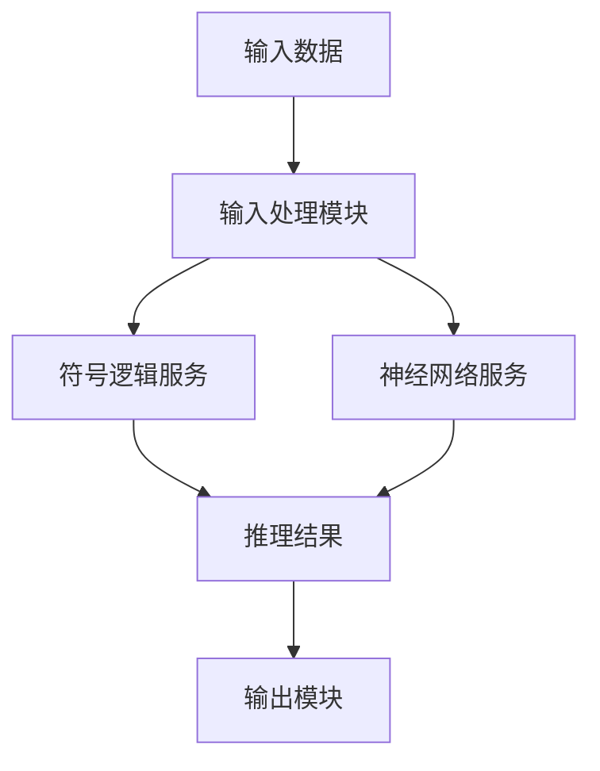
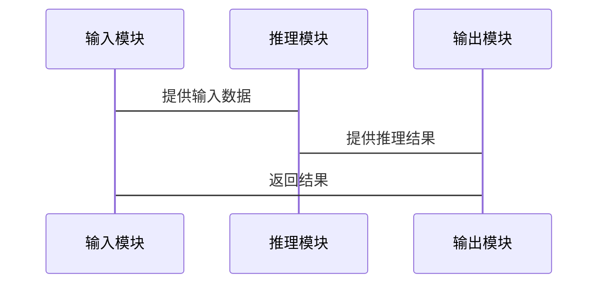

                 


# 神经符号推理在AI Agent常识推理中的应用

> 关键词：神经符号推理、AI Agent、常识推理、符号逻辑、神经网络

> 摘要：本文系统介绍了神经符号推理在AI Agent常识推理中的应用，从背景、核心概念、算法原理、系统架构到项目实战，详细分析了神经符号推理的优势、挑战及未来发展方向。

---

# 第一部分: 神经符号推理与AI Agent概述

## 第1章: 神经符号推理的背景与概念

### 1.1 神经符号推理的背景

#### 1.1.1 符号推理的传统方法
符号推理是一种基于符号逻辑的推理方法，通过规则和逻辑运算解决问题。例如，专家系统通过预定义的规则进行推理，但其灵活性和泛化能力有限。

#### 1.1.2 神经网络的局限性
神经网络在处理图像和语音等领域表现出色，但在需要逻辑推理的任务（如常识推理）中表现不佳，且缺乏可解释性。

#### 1.1.3 神经符号推理的提出
神经符号推理结合了符号逻辑和神经网络的优势，旨在解决神经网络推理能力不足的问题。

### 1.2 AI Agent常识推理的需求

#### 1.2.1 AI Agent的基本概念
AI Agent是一种能够感知环境并执行任务的智能实体，需要具备推理能力以应对复杂场景。

#### 1.2.2 常识推理在AI Agent中的重要性
常识推理是AI Agent理解上下文、解决开放性问题的核心能力。

#### 1.2.3 当前AI Agent推理的挑战
传统符号推理缺乏灵活性，而神经网络在常识推理中表现不足，神经符号推理成为新的研究方向。

### 1.3 神经符号推理的核心优势

#### 1.3.1 结合符号与神经网络的优势
神经符号推理结合了符号逻辑的可解释性和神经网络的特征提取能力。

#### 1.3.2 神经符号推理的可解释性
符号逻辑的存在使推理过程更透明，便于解释和调试。

#### 1.3.3 神经符号推理的泛化能力
通过符号逻辑指导神经网络，提高了对新数据的泛化能力。

---

## 第2章: 神经符号推理的核心概念

### 2.1 符号表示与逻辑推理

#### 2.1.1 符号表示的基本形式
符号表示通常使用命题逻辑或一阶逻辑，例如，命题逻辑中的原子命题和合取式。

#### 2.1.2 逻辑推理的基本规则
包括命题逻辑推理规则和一阶逻辑推理规则，如命题的合取、析取规则。

#### 2.1.3 符号表示与逻辑推理的结合
符号表示为逻辑推理提供了基础，逻辑推理指导符号表示的结构。

### 2.2 神经网络与符号推理的结合

#### 2.2.1 神经网络的基本原理
神经网络通过非线性变换学习输入与输出的映射关系。

#### 2.2.2 神经符号推理的实现方式
通过在神经网络中嵌入符号逻辑单元，实现符号推理与神经网络的结合。

#### 2.2.3 神经符号推理的数学模型
神经符号推理的数学模型将符号逻辑嵌入到神经网络中，形成混合推理机制。

### 2.3 神经符号推理的特征对比

#### 2.3.1 符号推理与神经符号推理的对比
| 特征          | 符号推理               | 神经符号推理           |
|---------------|------------------------|------------------------|
| 可解释性       | 高                    | 较高（结合符号逻辑）    |
| 泛化能力       | 低                    | 较高（结合神经网络）    |
| 处理复杂性     | 高                    | 适中（结合神经网络）    |

#### 2.3.2 神经符号推理的优缺点
优点：结合符号逻辑的可解释性和神经网络的特征提取能力；缺点：实现复杂，计算成本较高。

#### 2.3.3 神经符号推理的适用场景
适用于需要结合逻辑推理和感知能力的任务，如常识推理、知识图谱构建等。

---

## 第3章: 神经符号推理的算法原理

### 3.1 神经符号推理的基本算法

#### 3.1.1 基于符号逻辑的神经网络构建
通过符号逻辑定义网络的结构和权重，例如使用逻辑规则约束神经网络的输出。

#### 3.1.2 神经符号推理的训练方法
结合符号逻辑的损失函数进行端到端训练，例如通过符号逻辑约束神经网络的输出。

#### 3.1.3 神经符号推理的推理过程
推理过程结合符号逻辑和神经网络的输出，例如通过符号逻辑过滤神经网络的预测结果。

### 3.2 神经符号推理的数学模型

#### 3.2.1 符号逻辑嵌入神经网络的数学表达
符号逻辑嵌入神经网络可以通过以下方式实现：
$$ y = f(x) \land g(x) $$
其中，$f(x)$和$g(x)$是神经网络的输出，$\land$表示逻辑与运算。

#### 3.2.2 神经符号推理的损失函数
损失函数结合符号逻辑的约束：
$$ L = \lambda L_{\text{neural}} + (1-\lambda) L_{\text{symbolic}} $$
其中，$\lambda$是平衡系数，$L_{\text{neural}}$是神经网络的损失，$L_{\text{symbolic}}$是符号逻辑的约束损失。

---

## 第4章: 神经符号推理的系统架构设计

### 4.1 系统功能设计

#### 4.1.1 系统功能模块
- 输入处理模块：接收输入数据并进行预处理。
- 推理模块：结合符号逻辑和神经网络进行推理。
- 输出模块：生成推理结果并输出。

#### 4.1.2 系统功能流程
输入数据 → 输入处理 → 推理模块（符号逻辑+神经网络） → 输出结果。

### 4.2 系统架构设计

#### 4.2.1 微服务架构
- 符号逻辑服务：负责符号逻辑的处理。
- 神经网络服务：负责神经网络的推理。
- 接口服务：负责数据交互和结果返回。

#### 4.2.2 系统架构图（Mermaid）



### 4.3 系统接口设计

#### 4.3.1 API接口
- 输入接口：接收输入数据。
- 输出接口：返回推理结果。

#### 4.3.2 接口流程图（Mermaid）



---

## 第5章: 神经符号推理的项目实战

### 5.1 环境安装

#### 5.1.1 安装Python
```bash
python --version
pip install --upgrade pip
```

#### 5.1.2 安装TensorFlow
```bash
pip install tensorflow
```

### 5.2 核心代码实现

#### 5.2.1 神经符号推理实现
```python
import tensorflow as tf
from tensorflow.keras import layers

def neural_symbolic_model():
    input_layer = layers.Input(shape=(input_dim,))
    dense_layer = layers.Dense(64, activation='relu')(input_layer)
    symbolic_layer = layers.Dense(1, activation='sigmoid')(dense_layer)
    model = tf.keras.Model(inputs=input_layer, outputs=symbolic_layer)
    return model
```

#### 5.2.2 训练过程
```python
model = neural_symbolic_model()
model.compile(optimizer='adam', loss='binary_crossentropy', metrics=['accuracy'])
model.fit(x_train, y_train, epochs=10, batch_size=32)
```

### 5.3 实际案例分析

#### 5.3.1 医疗诊断案例
输入症状数据，通过神经符号推理模型推理出可能的疾病。

#### 5.3.2 交通场景案例
输入交通数据，推理出交通信号灯的状态。

### 5.4 项目总结

#### 5.4.1 成果展示
展示了神经符号推理在实际案例中的应用效果。

#### 5.4.2 经验总结
神经符号推理的优势在于结合了符号逻辑和神经网络，但在实际应用中需要考虑计算效率和数据稀疏性。

---

## 第6章: 总结与展望

### 6.1 总结

神经符号推理结合了符号逻辑和神经网络的优势，为AI Agent的常识推理提供了新的解决方案。其可解释性和泛化能力使其在多个领域具有广泛的应用潜力。

### 6.2 未来展望

未来的研究方向包括：
- 提高神经符号推理的计算效率。
- 解决数据稀疏性问题。
- 探索与强化学习的结合。

---

# 附录

### 附录A: 神经符号推理的相关论文

### 附录B: 神经符号推理的工具与库

---

通过以上详细的内容，我们系统地介绍了神经符号推理在AI Agent常识推理中的应用，从理论到实践，全面分析了其优势、挑战及未来发展方向。

