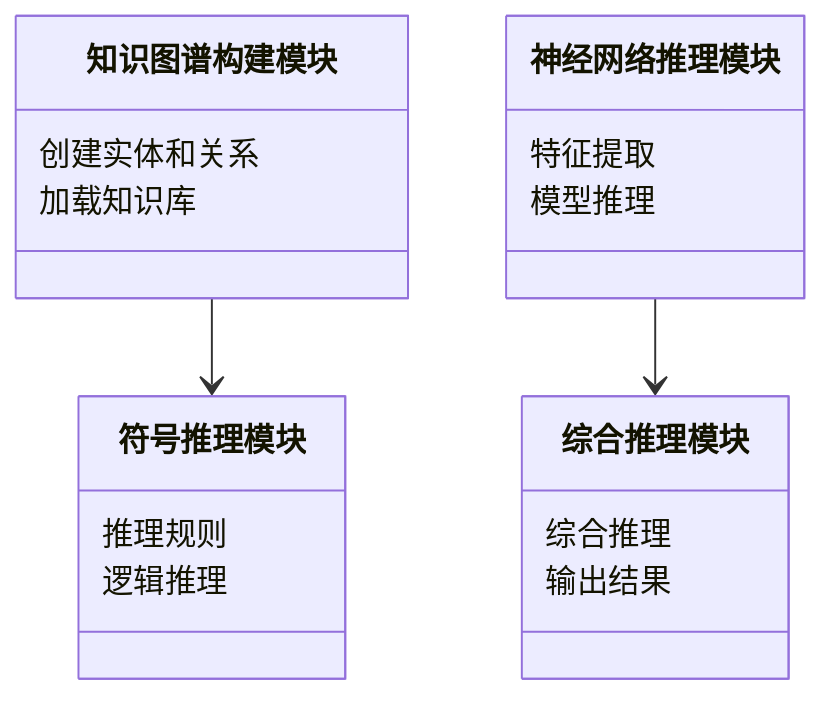
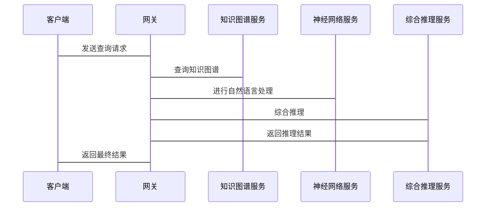
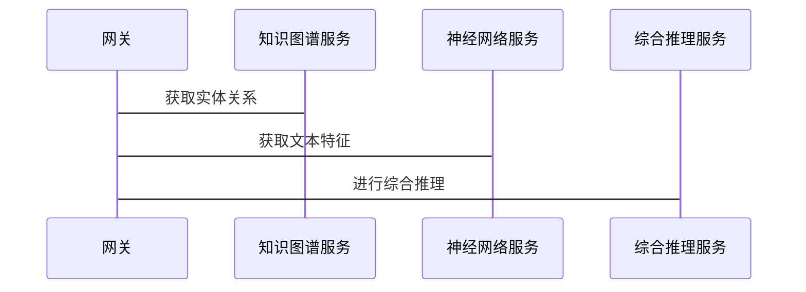

                 


# 神经符号融合：增强AI Agent的推理能力

## 关键词
神经符号融合, AI Agent, 逻辑推理, 知识图谱, 强化学习

## 摘要
神经符号融合是一种结合神经网络和符号推理的创新技术，旨在提升AI代理的推理能力。通过将符号逻辑与深度学习结合，神经符号融合能够处理复杂场景中的推理任务，实现更强大的智能决策能力。本文将系统介绍神经符号融合的核心概念、算法原理、系统架构，并通过项目实战展示其应用，最后总结其对AI代理的重要意义。

---

## 第1章 神经符号融合的背景与基础

### 1.1 神经符号融合的定义与背景
#### 1.1.1 神经符号融合的定义
神经符号融合（Neural-Symbolic Integration）是一种结合神经网络和符号推理的技术，旨在利用符号逻辑的可解释性和神经网络的表学习能力，实现更强大的推理和决策能力。

#### 1.1.2 神经符号融合的背景与问题背景
传统的符号推理（如逻辑推理和规则引擎）在处理复杂、动态的现实世界问题时存在局限性，而神经网络在处理非结构化数据方面表现出色，但缺乏可解释性和推理能力。神经符号融合技术试图将两者的优点结合起来，解决复杂场景中的推理问题。

#### 1.1.3 神经符号融合的目标与意义
神经符号融合的目标是通过结合符号推理和神经网络的优势，增强AI代理的推理能力，使其能够更好地理解和处理复杂的现实问题。这在智能客服、自动驾驶、医疗诊断等领域具有重要应用价值。

### 1.2 神经符号融合的核心概念
#### 1.2.1 符号推理与神经网络的结合
符号推理通过逻辑规则进行推理，而神经网络通过数据学习模式。神经符号融合的核心思想是将符号推理嵌入神经网络中，或利用神经网络辅助符号推理。

#### 1.2.2 神经符号融合的关键技术
- 符号规则的编码与嵌入
- 神经网络驱动的符号推理
- 符号逻辑与神经网络的协同优化

#### 1.2.3 神经符号融合的应用场景与边界
神经符号融合适用于需要结合数据驱动和逻辑推理的场景，如知识图谱推理、对话系统、强化学习等。

### 1.3 神经符号融合的技术优势
#### 1.3.1 神经符号融合的优势
- 结合了符号推理的可解释性和神经网络的表学习能力
- 能够处理动态变化和复杂场景
- 提高AI代理的推理和决策能力

#### 1.3.2 与传统符号推理的区别
| 特性 | 符号推理 | 神经符号融合 |
|------|----------|--------------|
| 数据需求 | 需要明确的规则 | 可以利用结构化和非结构化数据 |
| 可解释性 | 高 | 较低，但可结合符号规则提高可解释性 |
| 处理能力 | 适合规则性问题 | 适合复杂动态场景 |

#### 1.3.3 与传统神经网络的区别
神经符号融合通过引入符号规则，弥补了神经网络在逻辑推理方面的不足，同时保持了神经网络强大的模式识别能力。

### 1.4 神经符号融合的研究现状
#### 1.4.1 国内外研究现状
神经符号融合近年来成为研究热点，主要集中在知识图谱推理、神经符号学习、强化学习等领域。

#### 1.4.2 神经符号融合的典型应用
- 智能客服系统的知识图谱推理
- 对话系统中的上下文理解
- 强化学习中的符号状态表示

#### 1.4.3 当前研究的挑战与未来方向
- 如何更好地结合符号规则与神经网络
- 神经符号融合的可解释性问题
- 多模态神经符号融合的研究

### 1.5 本章小结
本章介绍了神经符号融合的定义、背景、核心概念、技术优势及研究现状，为后续章节奠定了基础。

---

## 第2章 神经符号融合的核心算法

### 2.1 符号推理与神经网络的结合
#### 2.1.1 符号推理的基本原理
符号推理通过逻辑规则进行推理，如命题逻辑和谓词逻辑。神经符号融合通过将符号规则嵌入神经网络中，或利用神经网络辅助符号推理，实现更强大的推理能力。

#### 2.1.2 神经网络的基本原理
神经网络通过层次化的非线性变换学习数据特征，常用的模型包括卷积神经网络（CNN）和循环神经网络（RNN）。

#### 2.1.3 神经符号融合的核心思想
神经符号融合的核心思想是将符号规则嵌入神经网络中，或利用神经网络辅助符号推理，从而结合两者的优点。

### 2.2 符号驱动的神经网络
#### 2.2.1 符号规则的编码与嵌入
符号规则可以通过符号嵌入（symbol embedding）的方式编码到神经网络中，例如将逻辑规则表示为向量。

#### 2.2.2 神经符号融合算法的核心流程
1. 输入数据经过特征提取层，提取数据特征。
2. 特征向量与符号规则的嵌入向量进行交互，生成中间表示。
3. 中间表示经过逻辑推理层，得到推理结果。
4. 推理结果经过输出层，生成最终结果。

#### 2.2.3 典型算法实现
- 知识图谱嵌入（Knowledge Graph Embedding）
- 符号驱动的神经机器翻译

### 2.3 神经驱动的符号推理
#### 2.3.1 神经网络驱动的符号推理流程
1. 输入数据经过神经网络提取特征。
2. 特征向量经过符号转换层，生成符号表示。
3. 符号表示经过逻辑推理层，得到推理结果。
4. 推理结果经过输出层，生成最终结果。

#### 2.3.2 典型算法实现
- 基于神经网络的逻辑推理
- 神经符号强化学习

### 2.4 神经符号融合的数学模型
#### 2.4.1 符号驱动的神经网络模型
$$ f(x) = g(h(x), r) $$
其中，$h(x)$ 是神经网络的隐藏层输出，$r$ 是符号规则。

#### 2.4.2 神经驱动的符号推理模型
$$ p(y|x) = \sum_{r} p(r|x) \cdot p(y|r) $$

### 2.5 本章小结
本章详细介绍了神经符号融合的核心算法，包括符号驱动的神经网络和神经驱动的符号推理，并给出了相应的数学模型。

---

## 第3章 神经符号融合的系统架构设计

### 3.1 系统分析
#### 3.1.1 问题场景介绍
以智能客服系统为例，系统需要处理用户的自然语言查询，并结合知识图谱进行推理。

### 3.2 系统功能设计
#### 3.2.1 系统功能模块
- 知识图谱构建模块
- 符号推理模块
- 神经网络推理模块
- 综合推理模块

#### 3.2.2 系统功能设计的领域模型


### 3.3 系统架构设计
#### 3.3.1 系统架构设计


#### 3.3.2 系统交互流程


### 3.4 系统接口设计
#### 3.4.1 系统接口设计
- 知识图谱服务接口
- 神经网络服务接口
- 综合推理服务接口

#### 3.4.2 接口交互流程


### 3.5 本章小结
本章设计了一个基于神经符号融合的系统架构，并展示了其在智能客服系统中的应用。

---

## 第4章 项目实战：神经符号融合的应用实现

### 4.1 环境安装与配置
#### 4.1.1 安装Python环境
```bash
python --version
pip install -r requirements.txt
```

#### 4.1.2 环境配置
```bash
export PATH=/path/to/python:$PATH
```

### 4.2 系统核心实现
#### 4.2.1 知识图谱构建模块实现
```python
class KnowledgeGraph:
    def __init__(self):
        self.entities = {}
        self.relationships = {}
```

#### 4.2.2 符号推理模块实现
```python
class SymbolicReasoning:
    def __init__(self, knowledge_graph):
        self.graph = knowledge_graph
```

#### 4.2.3 神经网络推理模块实现
```python
class NeuralReasoning:
    def __init__(self, model_path):
        self.model = load_model(model_path)
```

#### 4.2.4 综合推理模块实现
```python
class HybridReasoning:
    def __init__(self, symbolic_module, neural_module):
        self.symbolic = symbolic_module
        self.neural = neural_module
```

### 4.3 代码实现与解读
#### 4.3.1 知识图谱构建代码
```python
def build_knowledge_graph(data):
    graph = KnowledgeGraph()
    for entity in data['entities']:
        graph.entities[entity['id']] = entity['name']
    for relation in data['relations']:
        graph.relationships[relation['id']] = (relation['subject'], relation['object'])
    return graph
```

#### 4.3.2 神经符号融合模型训练代码
```python
def train_neural_symbolic_model(train_data, val_data):
    model = NeuralSymbolicModel()
    optimizer = Adam(lr=0.001)
    loss_fn = tf.keras.losses.BinaryCrossentropy()
    model.fit(train_data, val_data, optimizer, loss_fn, epochs=100)
    return model
```

### 4.4 项目实战：智能客服系统实现
#### 4.4.1 项目背景
构建一个智能客服系统，利用神经符号融合技术处理用户的咨询请求。

#### 4.4.2 系统实现
```python
def process_query(query):
    knowledge_graph = build_knowledge_graph(kg_data)
    neural_model = train_neural_symbolic_model(train_data, val_data)
    hybrid_reasoner = HybridReasoning(SymbolicReasoning(knowledge_graph), neural_model)
    result = hybrid_reasoner.reason(query)
    return result
```

### 4.5 项目小结
本章通过一个智能客服系统的实战项目，展示了神经符号融合技术的应用，验证了其在实际场景中的有效性。

---

## 第5章 总结与展望

### 5.1 总结
神经符号融合技术通过结合符号推理和神经网络的优势，显著提升了AI代理的推理能力。本文详细介绍了其核心概念、算法原理、系统架构，并通过项目实战展示了其应用。

### 5.2 未来展望
未来的研究方向包括：
- 多模态神经符号融合
- 神经符号融合的可解释性
- 神经符号融合在强化学习中的应用

### 5.3 最佳实践 Tips
- 在实际应用中，需结合具体场景选择合适的神经符号融合方法
- 注意数据质量和规则设计的合理性
- 系统架构设计需考虑模块化和可扩展性

### 5.4 本章小结
神经符号融合技术具有广阔的应用前景，未来的研究和应用将更加深入和多样化。

---

## 参考文献
（此处列出相关文献和资源）

---

## 致谢
感谢读者的支持与关注，感谢合作伙伴的帮助。

---

## 作者简介
（此处介绍作者的背景和专业领域）

---

以上是文章的完整内容，您可以根据需要进行调整和补充。

