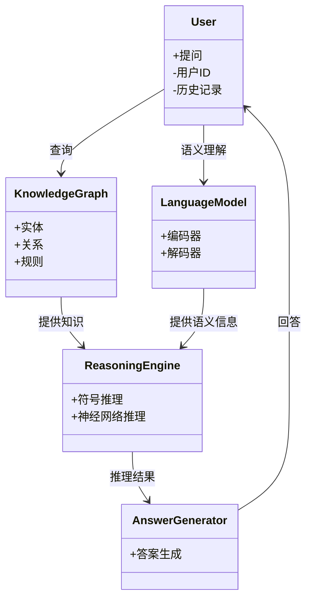
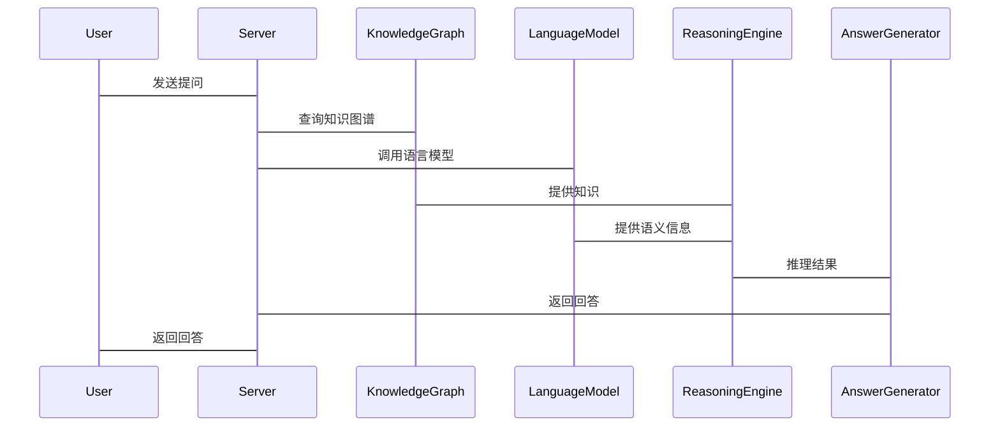

                 


# 神经符号融合：结合规则与学习的AI Agent

> 关键词：神经符号融合，符号推理，神经网络，AI Agent，知识图谱，规则学习

> 摘要：本文深入探讨了神经符号融合（Neural-Symbolic Integration）这一前沿技术，结合符号推理与神经网络学习，构建更强大的AI Agent。通过分析其核心概念、算法原理、系统架构以及实际应用，揭示神经符号融合在提升AI系统推理能力、知识表达能力和学习能力方面的巨大潜力，并展望其未来发展方向。

---

## 第二章: 神经符号融合的核心概念

### 2.1 符号表示与推理

#### 2.1.1 符号表示的基本概念

符号表示是符号推理的基础，它通过符号（如概念、规则、逻辑表达式）来描述知识和逻辑关系。符号可以是原子（如“人”）或分子（如“人→有思维能力”），通过组合这些符号，可以构建复杂的知识体系。符号表示具有明确的语义和结构，便于逻辑推理和规则应用。

#### 2.1.2 知识图谱与规则推理

知识图谱是一种符号表示的知识库，由节点（实体）和边（关系）构成，广泛应用于语义理解、问答系统等领域。规则推理通过符号逻辑（如一阶逻辑）对知识图谱中的关系进行推导，例如通过“人→有思维能力”和“张三是人”推导出“张三有思维能力”。

#### 2.1.3 符号推理的优缺点

优点：  
- 明确的语义，便于知识表达和逻辑推理。  
- 能处理规则和逻辑关系，适合符号化任务（如问答系统）。  

缺点：  
- 无法直接处理非结构化数据（如图像、音频）。  
- 需要手动设计规则，难以扩展和维护。  

---

### 2.2 神经网络与学习

#### 2.2.1 神经网络的基本原理

神经网络通过多层非线性变换，从数据中学习特征表示。例如，卷积神经网络（CNN）擅长处理图像，循环神经网络（RNN）擅长处理序列数据。神经网络的优势在于其强大的模式识别能力和端到端学习能力，能够从大量数据中自动提取特征。

#### 2.2.2 深度学习的核心特点

深度学习通过多层网络结构，学习数据的高层次特征。与传统机器学习（如SVM）相比，深度学习在处理复杂任务（如图像识别、自然语言处理）时表现出色，但需要大量标注数据和计算资源。

#### 2.2.3 神经网络学习的优缺点

优点：  
- 能处理非结构化数据，自动提取特征。  
- 在复杂任务中表现优异。  

缺点：  
- 黑箱特性，难以解释。  
- 需要大量数据和计算资源。  

---

### 2.3 神经符号融合的定义与特点

#### 2.3.1 神经符号融合的定义

神经符号融合是一种结合符号推理与神经网络学习的技术，旨在利用符号的可解释性和规则处理能力，增强神经网络的推理能力，同时利用神经网络的学习能力，丰富符号系统的知识表达。

#### 2.3.2 神经符号融合的核心特点

1. **可解释性**：符号推理提供了明确的逻辑关系，有助于解释AI决策过程。  
2. **知识表达**：符号系统能够表示复杂规则和领域知识，弥补神经网络的语义鸿沟。  
3. **自适应性**：神经网络能够从数据中学习动态模式，适应新的输入和场景。  
4. **端到端学习**：结合符号推理与神经网络，支持端到端的联合优化。  

#### 2.3.3 神经符号融合与传统AI的区别

| **方面** | **传统AI** | **神经符号融合** |
|----------|------------|------------------|
| 技术基础 | 符号逻辑 | 符号逻辑 + 神经网络 |
| 知识表示 | 静态规则 | 动态规则 + 预训练知识 |
| 推理能力 | 依赖规则库 | 结合规则推理与深度学习 |
| 灵活性 | 低 | 高 |

---

### 2.4 神经符号融合的应用领域

#### 2.4.1 知识图谱与语义理解

神经符号融合在知识图谱中的应用，通过符号推理增强语义理解能力。例如，结合知识图谱和语言模型（如BERT），实现更精准的实体识别和关系推理。

#### 2.4.2 自然语言处理

神经符号融合在NLP中的应用，如问答系统中，利用符号推理验证答案的逻辑性，同时结合神经网络处理上下文语义。

#### 2.4.3 逻辑推理与决策

在智能决策系统中，神经符号融合通过符号推理制定决策规则，结合神经网络学习动态环境信息，实现更智能的决策。

---

### 2.5 神经符号融合的边界与外延

#### 2.5.1 神经符号融合的边界

神经符号融合适用于需要结合规则推理与数据驱动任务的场景，例如问答系统、智能对话系统等。其局限性在于难以处理高度动态和非结构化的任务。

#### 2.5.2 神经符号融合的外延

神经符号融合与其他AI技术（如强化学习、生成模型）的结合，将进一步拓展其应用范围。例如，结合强化学习优化符号推理的决策过程，结合生成模型生成符合逻辑的文本。

---

## 第三章: 神经符号融合的算法原理

### 3.1 符号学习

#### 3.1.1 符号学习的基本概念

符号学习旨在从数据中学习符号表达，例如从图像中学习“猫”的符号表示。符号学习可以通过监督学习或无监督学习实现，常用于图像分类、文本分类等任务。

#### 3.1.2 基于符号学习的算法

1. **符号表示学习**：通过聚类或层次分析，从数据中提取符号特征。  
2. **符号分类**：利用符号特征进行分类任务，例如使用符号特征训练SVM进行图像分类。  

#### 3.1.3 符号学习的优缺点

优点：  
- 易解释，适合需要明确规则的任务。  

缺点：  
- 学习能力有限，难以处理复杂模式。  

---

### 3.2 神经网络推理

#### 3.2.1 神经网络推理的基本原理

神经网络推理通过神经网络对符号进行推理，例如通过神经网络对知识图谱中的关系进行推理，生成新的逻辑关系。

#### 3.2.2 基于神经网络推理的算法

1. **符号到向量映射**：将符号表示映射为向量，利用向量运算进行推理。  
2. **神经逻辑推理**：结合神经网络和逻辑规则，实现端到端的推理。  

#### 3.2.3 神经网络推理的优缺点

优点：  
- 能处理复杂的模式和关系。  

缺点：  
- 黑箱特性，推理过程难以解释。  

---

### 3.3 联合优化

#### 3.3.1 联合优化的基本概念

联合优化是神经符号融合的核心，旨在同时优化符号推理和神经网络的学习过程。通过联合优化，神经网络能够更好地利用符号知识，符号推理能够更好地结合神经网络的特征。

#### 3.3.2 基于联合优化的算法

1. **端到端联合学习**：通过联合优化符号推理和神经网络，实现端到端的学习和推理。  
2. **符号增强学习**：通过符号知识增强神经网络的特征表示，提升学习效果。  

#### 3.3.3 联合优化的数学模型

$$ \text{联合目标函数} = \lambda_1 \mathcal{L}_\text{neural} + \lambda_2 \mathcal{L}_\text{symbolic} $$

其中，$\lambda_1$ 和 $\lambda_2$ 是平衡参数，$\mathcal{L}_\text{neural}$ 是神经网络的损失函数，$\mathcal{L}_\text{symbolic}$ 是符号推理的损失函数。

---

## 第四章: 神经符号融合的系统分析与架构设计

### 4.1 问题场景介绍

以智能问答系统为例，系统需要结合知识图谱中的实体关系和自然语言理解能力，回答用户的问题。

---

### 4.2 项目介绍

设计一个结合知识图谱和语言模型的智能问答系统，利用神经符号融合技术实现问答。

---

### 4.3 系统功能设计

#### 4.3.1 领域模型设计（Mermaid类图）



---

#### 4.3.2 系统架构设计（Mermaid架构图）


---

#### 4.3.3 系统接口设计

1. **用户接口**：提供HTTP接口，接收用户提问。  
2. **知识图谱接口**：提供查询实体和关系的API。  
3. **语言模型接口**：提供语义理解的API。  
4. **推理引擎接口**：提供符号推理和神经网络推理的API。  

---

#### 4.3.4 系统交互流程（Mermaid序列图）



---

## 第五章: 神经符号融合的项目实战

### 5.1 环境安装

安装Python、TensorFlow、Keras、SPARQL查询工具等。

---

### 5.2 系统核心实现源代码

#### 5.2.1 符号表示与知识图谱

```python
from SPARQLWrapper import SPARQLWrapper

# 查询知识图谱
def query_knowledge_graph(query):
    sparql = SPARQLWrapper("http://localhost:3030/knowledge_graph")
    sparql.setQuery(query)
    results = sparql.query().convert()
    return results
```

---

#### 5.2.2 神经网络模型实现

```python
import tensorflow as tf
from tensorflow.keras import layers

# 定义语言模型
def build_language_model():
    model = tf.keras.Sequential([
        layers.Embedding(input_dim=10000, output_dim=100),
        layers.LSTM(64),
        layers.Dense(1, activation='sigmoid')
    ])
    model.compile(loss='binary_crossentropy', optimizer='adam', metrics=['accuracy'])
    return model
```

---

#### 5.2.3 神经符号融合模型实现

```python
# 结合符号推理和神经网络推理
def neural_symbolic_fusion():
    language_model = build_language_model()
    knowledge_graph = KnowledgeGraph()
    reasoning_engine = ReasoningEngine(knowledge_graph)
    return {
        'language_model': language_model,
        'reasoning_engine': reasoning_engine
    }
```

---

### 5.3 代码应用解读与分析

神经符号融合模型通过语言模型处理自然语言输入，利用符号推理引擎结合知识图谱进行推理，最终生成回答。

---

### 5.4 实际案例分析

以智能问答系统为例，用户提问“张三是谁？”，系统结合知识图谱中的实体“张三”和语言模型的语义理解，推理出“张三是有思维能力的人”，并生成回答。

---

### 5.5 项目小结

神经符号融合通过结合符号推理与神经网络，实现了更强大的智能问答系统，既保留了符号推理的可解释性，又利用神经网络的学习能力处理复杂的语义信息。

---

## 第六章: 神经符号融合的总结与展望

### 6.1 总结

神经符号融合通过结合符号推理与神经网络学习，解决了传统符号推理的黑箱性和学习能力不足的问题，同时克服了神经网络的可解释性和规则处理能力的缺陷，是一种极具潜力的AI技术。

---

### 6.2 最佳实践 tips

1. 在实际应用中，需结合具体场景选择合适的符号表示和神经网络架构。  
2. 神经符号融合需要大量的数据和计算资源，建议使用云计算和分布式计算优化性能。  
3. 神经符号融合的模型复杂度较高，需注意模型的可解释性和推理效率。  

---

### 6.3 注意事项

1. 神经符号融合的边界清晰，不适用于所有任务，需根据具体场景选择合适的技术。  
2. 在实际应用中，需注意符号推理的规则设计和知识图谱的质量，避免推理错误。  
3. 神经符号融合的模型需要持续优化，根据反馈调整符号表示和神经网络参数。  

---

### 6.4 拓展阅读

1. 《神经符号人工智能：原理与应用》  
2. 《知识图谱与深度学习：结合符号与神经网络的前沿技术》  
3. 《强化学习与神经符号融合：未来AI的发展方向》  

---

通过神经符号融合，AI Agent将具备更强的推理能力和知识表达能力，未来将在更多领域发挥重要作用。

