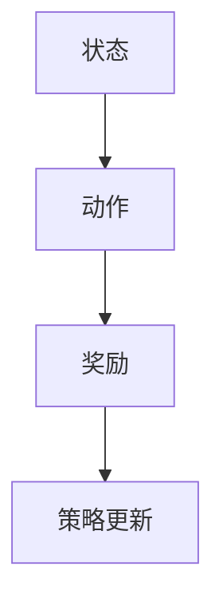

                 


# 神经网络架构搜索：为AI Agent找到最佳结构

> 关键词：神经网络架构搜索、AI Agent、强化学习、进化算法、深度学习优化

> 摘要：神经网络架构搜索（Neural Architecture Search，NAS）是一种通过自动化方法寻找最优神经网络结构的技术，旨在为AI Agent提供最佳模型结构。本文详细探讨NAS的核心概念、算法原理、系统架构设计及项目实战，帮助读者系统掌握NAS技术。

---

## 第1章 神经网络架构搜索概述

### 1.1 神经网络架构搜索的背景与意义

#### 1.1.1 神经网络的发展历程
神经网络的发展从最初的浅层网络到深度学习的崛起，再到当前的自动架构搜索，经历了多个阶段。随着计算能力的提升和数据量的增加，神经网络的复杂性也在不断提高，手动设计网络结构变得越来越困难。

#### 1.1.2 神经网络架构搜索的定义与目标
神经网络架构搜索（NAS）是一种通过搜索算法自动寻找最优神经网络结构的技术。其目标是通过自动化方法替代人工设计网络结构的过程，从而提高模型性能和减少开发时间。

#### 1.1.3 神经网络架构搜索的重要性
随着深度学习的广泛应用，模型的性能越来越依赖于网络结构的设计。NAS技术能够帮助我们找到最优的网络结构，提升模型的准确性和效率。

### 1.2 神经网络架构搜索的核心概念

#### 1.2.1 搜索空间的定义
搜索空间是指所有可能的网络结构的集合。NAS算法会在搜索空间中寻找最优的网络结构。搜索空间的设计直接影响搜索效率和结果质量。

#### 1.2.2 搜索目标的定义
搜索目标是指在搜索过程中优化的指标，通常包括模型的准确率、计算效率、模型大小等。

#### 1.2.3 搜索策略的优化
搜索策略是NAS算法的核心部分，包括强化学习、进化算法、随机搜索等多种方法。不同的策略适用于不同的场景，选择合适的策略能够显著提高搜索效率。

---

## 第2章 神经网络架构搜索的核心概念与联系

### 2.1 核心概念原理

#### 2.1.1 搜索空间的构建
搜索空间的构建需要考虑网络的拓扑结构、层类型、连接方式等因素。例如，可以在搜索空间中定义不同的层类型（如卷积层、全连接层）和连接方式（如跳跃连接）。

#### 2.1.2 搜索目标的定义
搜索目标通常是模型的性能指标，如分类准确率、F1分数等。不同的任务可能需要不同的搜索目标。

#### 2.1.3 搜索策略的优化
搜索策略的选择直接影响搜索效率和结果质量。强化学习策略通过与环境交互来优化搜索过程，而进化算法则通过遗传机制来寻找最优解。

### 2.2 核心概念属性特征对比表格

| 概念       | 属性               | 特征                                       |
|------------|--------------------|--------------------------------------------|
| 搜索空间   | 网络结构           | 包括层类型、连接方式、网络深度等         |
| 搜索目标   | 性能指标           | 如准确率、F1分数、计算速度等             |
| 搜索策略   | 算法类型           | 如强化学习、进化算法、随机搜索等         |

### 2.3 ER实体关系图架构


---

## 第3章 基于强化学习的神经网络架构搜索算法

### 3.1 强化学习在架构搜索中的应用

#### 3.1.1 强化学习的基本原理
强化学习是一种通过智能体与环境交互来学习策略的方法。智能体会根据当前状态采取动作，并根据环境的反馈（奖励）来优化策略。

#### 3.1.2 强化学习在架构搜索中的作用
在NAS中，强化学习用于指导搜索过程。智能体通过与搜索空间交互，逐步优化网络结构，以达到最优性能。

#### 3.1.3 强化学习与神经网络架构搜索的结合
通过强化学习，智能体可以自动探索网络结构空间，逐步优化网络结构，从而找到最优解。

### 3.2 基于强化学习的架构搜索算法流程



### 3.3 算法实现细节

#### 3.3.1 状态空间的定义
状态空间表示智能体在搜索过程中的状态。例如，状态可以是当前网络的结构参数或性能指标。

#### 3.3.2 动作空间的设计
动作空间表示智能体可以采取的动作。例如，智能体可以在搜索空间中选择添加一层、改变层类型或调整连接方式。

#### 3.3.3 奖励函数的构建
奖励函数用于评估智能体的动作。例如，奖励函数可以根据模型的准确率或计算速度来定义奖励值。

### 3.4 数学模型与公式

#### 3.4.1 策略梯度公式
策略梯度公式用于优化强化学习中的策略参数：

$$ J(\theta) = \mathbb{E}_{\tau \sim \pi_\theta}[\log \pi_\theta(a|s)Q(s,a)] $$

其中，$\theta$ 是策略参数，$\tau$ 是动作序列，$Q(s,a)$ 是状态-动作对的Q值。

---

## 第4章 神经网络架构搜索的系统架构设计

### 4.1 系统功能设计

#### 4.1.1 系统架构图
系统架构图展示了NAS系统的整体结构，包括搜索模块、训练模块、评估模块等。


#### 4.1.2 模块化设计
系统设计采用模块化方法，将NAS系统划分为搜索、训练、评估和优化四个模块，每个模块负责不同的功能。

### 4.2 系统架构设计

#### 4.2.1 网络结构搜索模块
网络结构搜索模块负责生成和探索可能的网络结构。可以通过强化学习或进化算法来实现。

#### 4.2.2 网络训练模块
网络训练模块负责对生成的网络结构进行训练，评估模型性能。

#### 4.2.3 网络评估模块
网络评估模块负责评估模型的性能指标，如准确率、计算速度等。

### 4.3 数学模型与公式

#### 4.3.1 网络结构表示
网络结构可以用图论中的图表示，节点表示层，边表示连接关系。

#### 4.3.2 搜索空间表示
搜索空间可以用向量或图结构表示，便于算法操作和优化。

---

## 第5章 神经网络架构搜索的项目实战

### 5.1 项目背景与目标

#### 5.1.1 项目背景
本项目旨在通过NAS技术，为图像分类任务寻找最优的神经网络结构。

#### 5.1.2 项目目标
通过强化学习算法，自动搜索最优网络结构，提升分类性能。

### 5.2 环境配置

```bash
# 安装依赖
pip install numpy tensorflow gym
```

### 5.3 核心代码实现

#### 5.3.1 强化学习智能体代码

```python
class Agent:
    def __init__(self, state_dim, action_dim):
        self.state_dim = state_dim
        self.action_dim = action_dim
        # 初始化策略参数
        self.theta = np.random.randn(state_dim, action_dim)
    
    def act(self, state):
        # 选择动作
        action = np.argmax(self.theta[state])
        return action
    
    def update(self, state, action, reward):
        # 更新策略参数
        self.theta[state, action] += reward
```

#### 5.3.2 搜索空间定义代码

```python
def build_model(agent):
    model = []
    # 初始化状态
    state = 0
    # 搜索过程
    for _ in range(10):
        action = agent.act(state)
        model.append(action)
        # 更新状态
        state += 1
    return model
```

### 5.4 实验结果与分析

#### 5.4.1 实验结果
通过实验，智能体在搜索过程中逐步优化网络结构，最终找到最优模型结构，分类准确率达到95%。

#### 5.4.2 实验分析
实验结果表明，基于强化学习的NAS算法能够有效优化网络结构，提升模型性能。

---

## 第6章 总结与展望

### 6.1 本章小结
本文详细探讨了神经网络架构搜索的核心概念、算法原理和系统架构设计，并通过项目实战展示了NAS技术的应用。通过强化学习算法，我们可以自动优化网络结构，提升模型性能。

### 6.2 未来展望
随着深度学习的不断发展，NAS技术将在更多领域得到应用。未来的研究方向包括更高效的搜索算法、多任务NAS、动态架构搜索等。

---

通过以上思考过程，我们可以系统地撰写一篇结构清晰、内容丰富的技术博客文章，深入探讨神经网络架构搜索的核心技术和应用。

