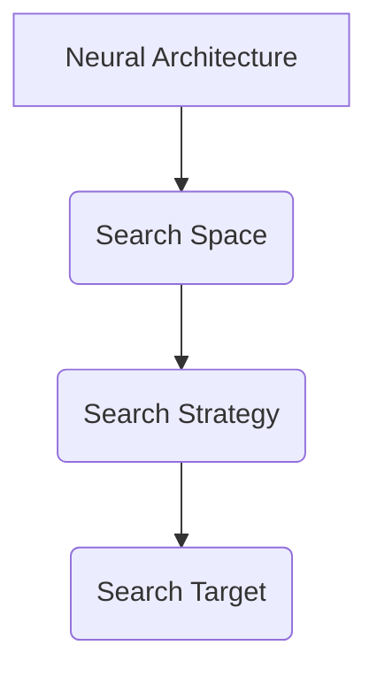
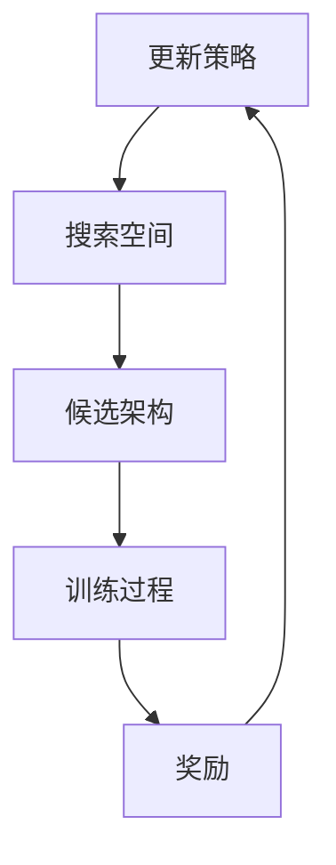
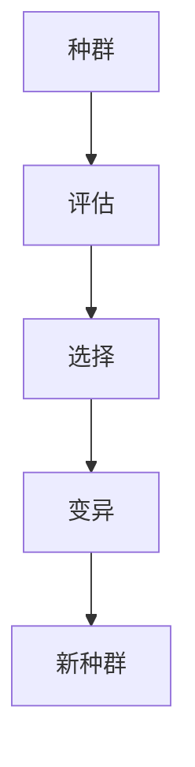
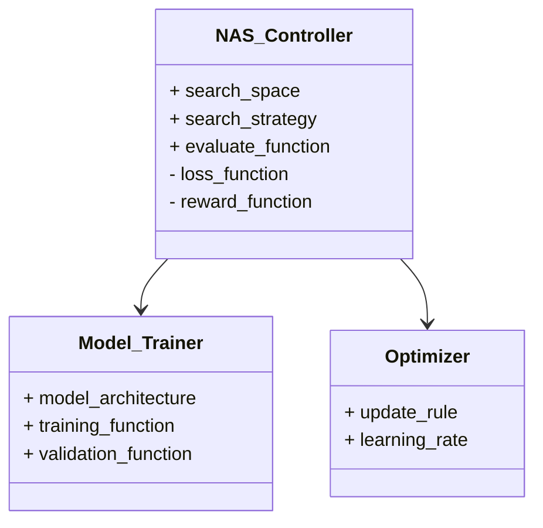
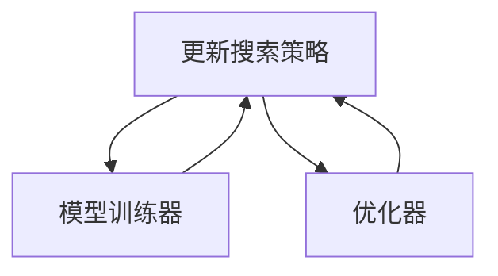
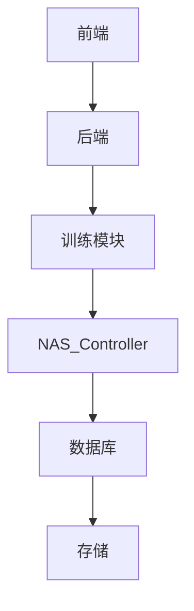
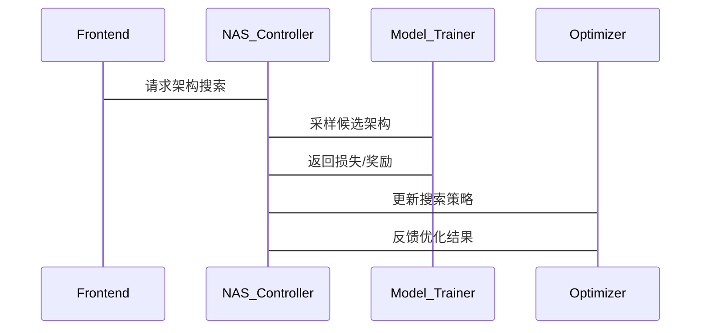

                 


# 神经网络架构搜索：自动化AI Agent模型结构优化

> 关键词：神经网络架构搜索、AI Agent、模型结构优化、自动化机器学习、强化学习、梯度下降

> 摘要：本文深入探讨了神经网络架构搜索（Neural Architecture Search, NAS）在AI Agent模型结构优化中的应用。通过系统地分析NAS的核心概念、算法原理、数学模型以及实际应用场景，本文旨在为读者提供一个全面的视角，理解如何通过自动化方法优化AI Agent的模型结构。从强化学习到基于梯度的搜索策略，本文结合理论与实践，详细阐述了NAS在不同场景下的实现细节，并通过实际案例分析展示了其在提升模型性能和效率方面的巨大潜力。

---

# 第一部分: 神经网络架构搜索（NAS）基础

## 第1章: 神经网络架构搜索（NAS）概述

### 1.1 神经网络架构搜索的背景与意义

#### 1.1.1 神经网络模型的复杂性挑战
神经网络模型的性能高度依赖于其架构设计，而架构的复杂性使得人工设计的过程既耗时又容易出错。传统的神经网络架构依赖于经验丰富的研究人员手动调整，这种方式不仅效率低下，还可能因为主观因素限制模型的最优性。

#### 1.1.2 人工设计神经网络的局限性
- **计算成本高**：尝试每一种可能的架构需要大量的计算资源和时间。
- **主观性**：依赖研究人员的经验和直觉，难以保证全局最优。
- **效率低下**：面对复杂的任务，人工设计难以快速迭代和优化。

#### 1.1.3 自动化架构搜索的必要性
- **提高效率**：自动化搜索可以在短时间内遍历大量可能的架构，找到最优解。
- **降低门槛**：非专家也能通过自动化工具快速构建高效模型。
- **适应性**：能够根据具体任务的需求动态调整模型架构。

### 1.2 AI Agent模型结构优化的目标

#### 1.2.1 模型性能优化的核心目标
AI Agent需要在特定任务中实现高性能，例如分类精度、响应速度等。通过优化模型架构，可以显著提升这些性能指标。

#### 1.2.2 模型压缩与轻量化的需求
在资源受限的环境中（如移动设备、边缘计算），模型的轻量化和压缩是刚需。自动化架构搜索可以通过设计更简洁的架构来实现这一目标。

#### 1.2.3 模型适应性与泛化的平衡
模型需要在不同数据分布和任务中保持良好的适应性，这要求架构设计能够平衡过拟合和欠拟合的问题。

### 1.3 神经网络架构搜索的基本概念

#### 1.3.1 神经网络架构的定义
神经网络架构是指网络的拓扑结构，包括层的类型、连接方式、参数数量等。例如，一个典型的CNN架构可能包括卷积层、池化层、全连接层等。

#### 1.3.2 神经网络架构搜索的定义
NAS是一种通过自动化方法搜索最优神经网络架构的过程，通常利用强化学习、遗传算法或梯度下降等技术实现。

#### 1.3.3 神经网络架构搜索的分类
| 分类标准 | 类型 |
|----------|------|
| 是否基于梯度 | 基于梯度的NAS、非基于梯度的NAS |
| 搜索空间 | 离散搜索、连续搜索 |
| 应用场景 | 图像分类、自然语言处理、推荐系统等 |

---

## 第2章: 神经网络架构搜索的核心概念与联系

### 2.1 神经网络架构搜索的核心原理

#### 2.1.1 搜索空间的定义
搜索空间是NAS过程中所有可能的架构的集合。合理的搜索空间设计能够显著影响搜索效率和结果的质量。

#### 2.1.2 搜索策略的选择
搜索策略决定了如何在搜索空间中选择下一步的动作，包括随机搜索、强化学习策略、遗传算法等。

#### 2.1.3 搜索目标的优化函数
优化函数是评估候选架构性能的关键指标，通常包括模型的准确率、训练时间、模型大小等。

### 2.2 神经网络架构搜索的关键属性对比

#### 2.2.1 强化学习与基于梯度的搜索对比
| 特性             | 强化学习（Reinforcement Learning）         | 基于梯度（Gradient-based） |
|------------------|------------------------------------------|--------------------------|
| 动作空间           | 离散或连续动作                              | 连续动作                |
| 搜索效率         | 较低，依赖策略网络的学习                    | 较高，直接优化参数        |
| 应用场景         | 适合复杂决策任务                            | 适合参数优化任务          |

#### 2.2.2 离散搜索与连续搜索的差异
| 特性             | 离散搜索                                     | 连续搜索               |
|------------------|--------------------------------------------|-------------------------|
| 搜索空间         | 离散的架构参数（如层数、连接方式）           | 连续的架构参数（如通道数） |
| 实现复杂度       | 较高，需要定义明确的搜索空间                 | 较低，参数空间连续        |
| 应用场景         | 图像分类、NLP等传统任务                     | 复杂优化任务             |

#### 2.2.3 单目标优化与多目标优化的权衡
单目标优化专注于单一性能指标（如准确率），而多目标优化则需要在多个目标之间寻找平衡（如准确率与模型大小）。

### 2.3 神经网络架构搜索的ER实体关系图


---

## 第3章: 神经网络架构搜索的算法原理

### 3.1 基于强化学习的神经网络架构搜索

#### 3.1.1 强化学习的基本原理
强化学习通过智能体与环境的交互，逐步学习最优策略。在NAS中，智能体（通常是RNN或Transformer）生成候选架构，然后通过评估（如验证集准确率）获得奖励。

#### 3.1.2 在NAS中的应用


#### 3.1.3 标准化动作空间与奖励机制
- **动作空间**：定义智能体可选择的动作，例如“添加一层卷积层”。
- **奖励机制**：根据模型性能（如准确率）给予奖励，引导智能体向更优架构搜索。

### 3.2 基于梯度的神经网络架构搜索

#### 3.2.1 梯度下降的基本原理
梯度下降通过计算损失函数对模型参数的梯度，逐步调整参数以最小化损失。

#### 3.2.2 在梯度引导搜索中的实现
```python
def gradient_descent(n_epochs):
    for epoch in range(n_epochs):
        # 采样候选架构
        sample_architecture()
        # 计算损失
        loss = compute_loss(architecture)
        # 计算梯度
        gradients = compute_gradients(architecture, loss)
        # 更新架构参数
        update_architecture(architecture, gradients)
```

#### 3.2.3 梯度估计与搜索效率的平衡
- **梯度估计**：通过反向传播计算模型参数的梯度。
- **搜索效率**：梯度引导搜索通常比强化学习更高效，但可能需要更复杂的优化策略。

### 3.3 神经网络架构搜索的优化算法

#### 3.3.1 进化策略的实现


#### 3.3.2 贪婪搜索的策略
- **贪心选择**：每次选择当前最优的架构继续搜索。

#### 3.3.3 混合搜索策略的创新
结合强化学习和梯度下降的优势，设计混合策略以提高搜索效率。

### 3.4 算法实现的伪代码示例
```python
def nas_algorithm():
    while not converged:
        sample_architecture()
        evaluate_architecture()
        update_search_strategy()
```

---

## 第4章: 神经网络架构搜索的数学模型与公式

### 4.1 神经网络架构搜索的优化目标
#### 4.1.1 模型性能的数学表达
$$ \text{Loss}(x, y) = \text{CrossEntropy}(x, y) $$

#### 4.1.2 模型复杂度的数学表达
$$ \text{Complexity}(x) = \sum_{i=1}^{n} \text{Parameters}(x_i) $$

### 4.2 神经网络架构搜索的数学公式

#### 4.2.1 强化学习的损失函数
$$ \mathcal{L} = -\sum_{t} r_t \log \pi(a_t|s_t) $$

#### 4.2.2 梯度引导搜索的优化目标
$$ \theta_{t+1} = \theta_t - \eta \nabla_\theta \mathcal{L}(\theta_t) $$

---

## 第5章: 神经网络架构搜索的系统架构设计

### 5.1 问题场景介绍
AI Agent需要在动态变化的环境中快速适应任务需求，这要求其模型架构能够灵活调整。

### 5.2 项目介绍
本项目旨在通过NAS技术优化AI Agent的模型架构，提升其在图像识别、自然语言处理等任务中的性能。

### 5.3 系统功能设计
#### 5.3.1 系统功能模块


#### 5.3.2 系统功能流程


### 5.4 系统架构设计


### 5.5 系统接口设计
#### 5.5.1 接口定义
- `sample_architecture()`: 采样候选架构。
- `evaluate_architecture()`: 评估架构性能。
- `update_search_strategy()`: 更新搜索策略。

#### 5.5.2 接口交互流程


---

## 第6章: 项目实战

### 6.1 环境安装
安装必要的依赖：
```bash
pip install numpy tensorflow keras
```

### 6.2 系统核心实现源代码
```python
class NASAgent:
    def __init__(self, search_space, optimizer):
        self.search_space = search_space
        self.optimizer = optimizer

    def search_architecture(self, epochs=100):
        best_architecture = None
        best_loss = float('inf')
        for _ in range(epochs):
            candidate = self.search_space.sample()
            loss = self.evaluate_architecture(candidate)
            if loss < best_loss:
                best_loss = loss
                best_architecture = candidate
        return best_architecture

    def evaluate_architecture(self, architecture):
        # 训练模型并返回损失
        model = build_model(architecture)
        history = model.fit(...)
        return history.loss
```

### 6.3 代码应用解读与分析
- **NASAgent类**：负责管理搜索空间和优化器，实现架构搜索过程。
- **search_architecture方法**：执行多个epoch的搜索，寻找最优架构。
- **evaluate_architecture方法**：评估候选架构的性能。

### 6.4 实际案例分析
以图像分类任务为例，通过NAS优化模型架构，提升分类准确率。

### 6.5 项目小结
通过本项目，读者可以掌握NAS的基本实现方法，并将其应用于实际任务中。

---

## 第7章: 总结与展望

### 7.1 本章总结
本文全面介绍了神经网络架构搜索在AI Agent模型优化中的应用，从理论到实践，详细阐述了其核心概念、算法原理和系统设计。

### 7.2 未来展望
未来的研究方向包括：
- 更高效的搜索策略设计。
- 多目标优化的进一步探索。
- NAS在边缘计算和物联网中的应用。

---

## 第8章: 最佳实践与注意事项

### 8.1 最佳实践 tips
- **明确搜索目标**：确保优化目标与任务需求一致。
- **合理设计搜索空间**：避免过于复杂的搜索空间。
- **选择合适的优化算法**：根据任务特点选择强化学习或梯度下降。

### 8.2 注意事项
- **计算资源**：NAS需要大量的计算资源，需确保硬件支持。
- **模型评估**：避免过拟合，需使用验证集评估。

---

## 第9章: 拓展阅读

### 9.1 推荐书籍
- 《Deep Learning》 —— Ian Goodfellow
- 《Neural Networks and Deep Learning》 —— Andrew Ng

### 9.2 推荐论文
- "Neural Architecture Search: A Survey" —— 复旦大学研究团队
- "Progressive Neural Architecture Search" —— Google Research

