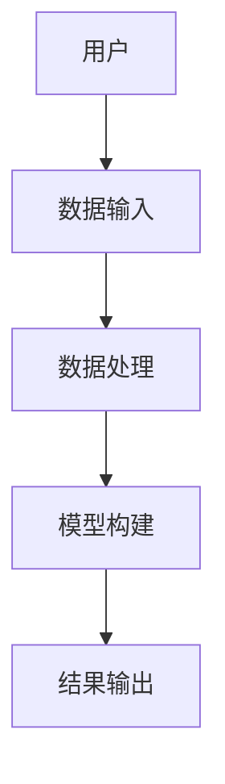

                 


# 科技创新对全球股市估值的影响分析

## 关键词：科技创新，股市估值，投资策略，金融模型，市场影响

## 摘要：科技创新对全球经济和金融市场产生了深远的影响，特别是在股市估值方面。本文通过分析科技创新对企业价值、市场预期和行业结构的影响，探讨其对全球股市估值的多维度影响。结合数据驱动的方法和数学模型，本文旨在揭示科技创新如何通过改变企业盈利能力和市场情绪，进而影响股市估值，并提出相应的投资策略和风险管理建议。

---

## 第一章：引言

### 1.1 背景介绍
科技创新是推动现代社会经济增长的核心动力。随着技术的进步，科技创新的速度和范围不断扩大，尤其是在信息技术、人工智能和生物技术等领域。这些创新不仅改变了企业的运营方式，还对金融市场产生了深远影响。股市作为经济活动的重要组成部分，其估值受到科技创新的直接影响。

### 1.2 核心概念与问题描述
- **科技创新**：指通过新技术的开发和应用，提高生产效率、产品性能或服务模式的过程。
- **股市估值**：通过对企业的财务状况、市场地位和未来盈利能力的评估，确定其股票的合理价格。
- **问题**：科技创新如何影响全球股市估值？具体而言，科技创新如何通过改变企业价值、市场预期和行业结构，影响股市的定价机制？

### 1.3 研究意义
科技创新对股市估值的影响不仅关系到投资者的收益，还影响资本市场的资源配置效率。通过分析这一关系，投资者可以更好地制定投资策略，企业可以优化技术创新路径，政策制定者可以制定更有效的监管措施。

---

## 第二章：科技创新与股市估值的核心概念

### 2.1 科技创新的核心概念
- **定义**：科技创新是指新技术的开发和应用，包括技术突破、产品创新和商业模式创新。
- **特点**：具有高投入、高风险、高回报的特点，通常伴随着技术生命周期的波动。
- **驱动因素**：包括市场需求、技术进步、政策支持和资本投入。

### 2.2 股市估值的核心概念
- **定义**：股市估值是通过对企业财务状况、市场地位和未来盈利能力的评估，确定其股票的合理价格。
- **主要方法**：包括市盈率（P/E）、市净率（P/B）、现金流折现法（DCF）等。
- **影响因素**：包括企业的盈利能力、成长潜力、行业地位、市场风险等。

### 2.3 科技创新与股市估值的关系
- 科技创新直接影响企业的盈利能力和成长潜力，从而影响其估值。
- 科技创新还通过改变市场预期和行业结构，间接影响股市的整体估值水平。

---

## 第三章：科技创新对企业价值的影响

### 3.1 科技创新对企业盈利能力和增长潜力的影响
- **盈利提升**：科技创新通过提高生产效率、降低生产成本，增强企业的盈利能力。
- **竞争优势**：技术创新可以为企业带来竞争优势，从而在市场中占据领先地位。
- **长期增长**：科技创新为企业提供了新的增长点，增强了企业的长期发展潜力。

### 3.2 科技创新对企业估值模型的影响
- **市盈率模型**：科技创新可能提高企业的盈利能力，从而降低市盈率。
- **现金流折现法**：科技创新可能增加未来的现金流，从而提高企业的估值。

### 3.3 案例分析：科技企业的估值变化
- **案例1**：某人工智能企业在技术创新后的估值变化。
- **案例2**：某生物技术企业在新产品推出后的估值变化。

---

## 第四章：科技创新对市场预期的影响

### 4.1 市场预期的形成机制
- **投资者情绪**：科技创新可能激发投资者的热情，提高市场预期。
- **市场信息**：科技创新相关的新闻和报道会影响市场的预期。
- **市场参与者的预期调整**：企业、投资者和政策制定者对科技创新的预期共同影响市场估值。

### 4.2 科技创新对投资者情绪的影响
- **乐观情绪**：科技创新可能带来新的投资机会，激发投资者的乐观情绪。
- **风险偏好**：科技创新可能增加市场的不确定性，影响投资者的风险偏好。

### 4.3 科技创新对市场波动性的影响
- **波动性增加**：科技创新可能导致市场的剧烈波动。
- **波动性降低**：科技创新带来的效率提升可能减少市场的波动性。

---

## 第五章：科技创新对行业和市场结构的影响

### 5.1 高科技行业的估值特征
- **高成长性**：高科技行业通常具有较高的成长潜力。
- **高风险性**：高科技行业具有较高的技术风险和市场风险。
- **高估值**：由于高成长性和高风险性，高科技行业的估值通常较高。

### 5.2 科技创新对产业链的重构
- **纵向整合**：科技创新可能导致产业链的纵向整合。
- **横向扩展**：科技创新可能导致企业进入新的市场领域。
- **协同效应**：科技创新可能带来产业链的协同效应，从而提高整体估值。

### 5.3 市场结构的长期影响
- **市场集中度**：科技创新可能导致市场集中度的提高。
- **市场创新活力**：科技创新增强了市场的创新活力。
- **市场生态系统**：科技创新优化了市场的生态系统，促进了资源的优化配置。

---

## 第六章：科技创新对全球股市估值的数学模型

### 6.1 市盈率模型
- **定义**：市盈率（P/E）= 股票价格 / 每股净利润。
- **科技创新的影响**：科技创新可能提高企业的净利润，从而降低市盈率。
- **公式**：$$ P/E = \frac{P}{\text{EPS}} $$
- **分析**：科技创新通过提高EPS，降低市盈率，从而提高企业的估值。

### 6.2 现金流折现模型
- **定义**：DCF模型通过折现未来现金流，确定股票的合理价格。
- **科技创新的影响**：科技创新可能增加未来的现金流，从而提高企业的估值。
- **公式**：$$ V = \sum_{t=1}^{n} \frac{CF_t}{(1+r)^t} $$
- **分析**：科技创新通过增加未来现金流，提高企业的估值。

### 6.3 修正市盈率模型
- **定义**：修正市盈率模型考虑了企业成长性和风险因素。
- **公式**：$$ \text{修正市盈率} = \frac{P/E}{\text{增长率}} $$
- **分析**：科技创新可能提高企业的增长率，从而降低修正市盈率，提高估值。

---

## 第七章：系统分析与架构设计

### 7.1 问题场景介绍
- **问题场景**：分析科技创新对全球股市估值的影响，需要考虑多个因素，包括企业的财务状况、市场预期、行业结构等。

### 7.2 系统功能设计
- **领域模型**：使用Mermaid图展示系统的组成部分和交互流程。
- **系统架构设计**：使用Mermaid图展示系统的整体架构。

### 7.3 系统架构设计


### 7.4 系统接口设计
- **输入接口**：接受企业的财务数据和市场数据。
- **输出接口**：输出企业的估值和市场影响。

### 7.5 系统交互设计
- **交互流程**：用户输入数据，系统进行数据处理和模型构建，输出结果。

---

## 第八章：项目实战

### 8.1 环境安装
- **工具安装**：安装Python、数据分析库（如Pandas、NumPy）和可视化工具（如Matplotlib）。

### 8.2 核心代码实现
```python
import pandas as pd
import numpy as np

# 示例数据
data = {
    '公司': ['公司A', '公司B', '公司C'],
    '净利润': [100, 150, 200],
    '股价': [50, 60, 70]
}

df = pd.DataFrame(data)

# 计算市盈率
df['市盈率'] = df['股价'] / df['净利润']

print(df)
```

### 8.3 案例分析
- **案例1**：分析某科技公司在创新后的市盈率变化。
- **案例2**：分析某行业的整体估值变化。

### 8.4 结果解读
- **结果解读**：通过数据分析和模型构建，揭示科技创新对股市估值的具体影响。

---

## 第九章：最佳实践与总结

### 9.1 小结
- 科技创新对股市估值的影响是多维度的，包括对企业价值、市场预期和行业结构的影响。

### 9.2 注意事项
- 投资者在制定投资策略时，需要综合考虑科技创新的短期和长期影响。
- 企业需要通过科技创新提高核心竞争力，同时注意风险管理。

### 9.3 未来研究方向
- 进一步研究科技创新对不同类型企业的估值影响。
- 探索更多数学模型，提高估值的准确性。

---

## 结语

科技创新对全球股市估值的影响是一个复杂而重要的问题。通过本文的分析，我们可以看到科技创新不仅改变了企业的经营方式，还通过影响市场预期和行业结构，深刻影响股市的估值水平。投资者、企业和政策制定者都需要充分考虑科技创新的影响，制定合理的策略，以应对不断变化的市场环境。

