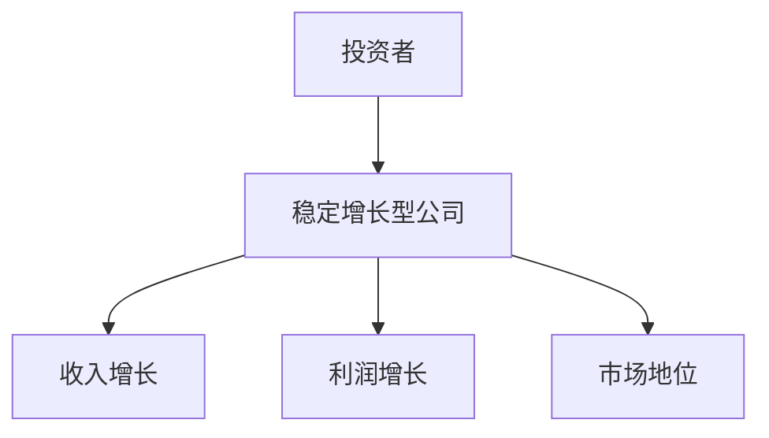
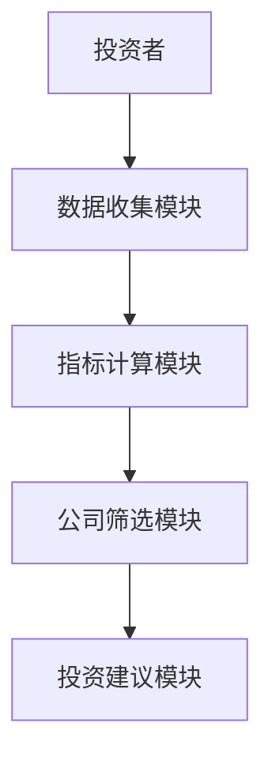
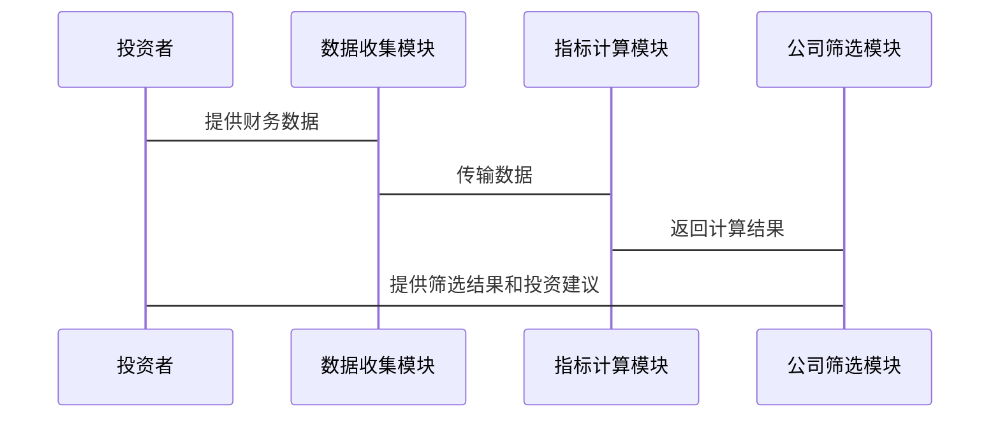

                 


# 稳定增长型公司：彼得林奇的最爱

## 关键词：稳定增长型公司、彼得·林奇、价值投资、投资策略、财务分析、公司估值

## 摘要

稳定增长型公司是彼得·林奇在投资生涯中偏爱的投资对象。这类公司通常具有稳定的收入和利润增长，具备强大的市场地位和竞争优势。本文将从价值投资的角度，详细介绍稳定增长型公司的定义、核心特征、识别方法、投资策略及成功案例，帮助读者掌握如何识别和投资这类公司。

---

## 第一部分：背景介绍

### 第1章：价值投资与稳定增长型公司概述

#### 1.1 价值投资的基本概念

- **1.1.1 价值投资的定义与核心理念**
  - 价值投资是一种长期投资策略，强调以低于内在价值的价格购买优质资产。
  - 核心理念：市场先生是情绪化的，投资的本质是寻找企业的内在价值。

- **1.1.2 价值投资与其它投资策略的区别**
  - 与短线交易不同，价值投资注重长期持有，关注企业的基本面。
  - 与趋势投资不同，价值投资强调内在价值，而非市场趋势。

- **1.1.3 稳定增长型公司的定义与特点**
  - 稳定增长型公司：指那些收入和利润持续稳定增长，且具有较高分红能力的企业。
  - 特点：
    - 收入增长平稳，波动性低。
    - 利润稳步增长，盈利能力强。
    - 市场地位稳固，竞争优势明显。

#### 1.2 彼得·林奇的投资哲学

- **1.2.1 彼得·林奇的生平与投资成就**
  - 彼得·林奇是美国著名投资经理，曾管理麦哲伦基金，创造了卓越的投资业绩。
  - 林奇的投资风格以选股严谨、注重基本面分析著称。

- **1.2.2 林奇对稳定增长型公司的关注点**
  - 林奇认为，稳定增长型公司是长期投资的理想选择，因其收入和利润的可持续增长。
  - 他强调，选择公司时应关注其财务健康状况、管理团队和竞争优势。

- **1.2.3 林奇投资风格的核心要素**
  - 选股：注重企业的财务状况和竞争优势。
  - 长期持有：避免频繁交易，分享企业长期增长的成果。

#### 1.3 稳定增长型公司的市场定位

- **1.3.1 稳定增长型公司的行业分布**
  - 常见于公用事业、消费品、医疗保健等行业的优质企业。
  - 这些行业需求稳定，受经济波动影响较小。

- **1.3.2 稳定增长型公司的财务特征**
  - 收入与利润稳步增长，波动性低。
  - 负债率低，财务健康，现金流充裕。

- **1.3.3 稳定增长型公司的竞争优势**
  - 市场占有率高，品牌优势明显。
  - 持续创新能力强，能够适应市场变化。

---

## 第二部分：核心概念与联系

### 第2章：稳定增长型公司的核心特征

#### 2.1 稳定增长型公司的关键指标

- **2.1.1 收入增长率的计算与分析**
  - 收入增长率 = (本期收入 - 上期收入) / 上期收入 × 100%
  - 示例：某公司去年收入为1000万元，今年收入为1200万元，收入增长率为20%。

- **2.1.2 净利润增长率的计算与分析**
  - 净利润增长率 = (本期净利润 - 上期净利润) / 上期净利润 × 100%
  - 示例：某公司去年净利润为500万元，今年净利润为600万元，净利润增长率为20%。

- **2.1.3 股东权益增长率的计算与分析**
  - 股东权益增长率 = (本期股东权益 - 上期股东权益) / 上期股东权益 × 100%
  - 示例：某公司去年股东权益为800万元，今年股东权益为1000万元，股东权益增长率为25%。

#### 2.2 稳定增长型公司与其它类型公司的对比

- **2.2.1 与周期性公司的对比分析**
  - 周期性公司：收入和利润随经济周期波动较大。
  - 稳定增长型公司：收入和利润波动小，受经济周期影响较小。

- **2.2.2 与成长型公司的对比分析**
  - 成长型公司：收入和利润增长快，但波动性较大。
  - 稳定增长型公司：收入和利润增长平稳，风险较低。

- **2.2.3 与成熟型公司的对比分析**
  - 成熟型公司：收入和利润增长缓慢，甚至可能出现停滞。
  - 稳定增长型公司：收入和利润持续稳定增长，具备较强的成长性。

#### 2.3 稳定增长型公司的ER实体关系图



---

## 第三部分：算法原理讲解

### 第3章：稳定增长型公司的识别算法

#### 3.1 稳定增长型公司的筛选标准

- **3.1.1 收入增长率的计算公式**
  $$收入增长率 = \frac{本期收入 - 上期收入}{上期收入} \times 100\%$$

- **3.1.2 净利润增长率的计算公式**
  $$净利润增长率 = \frac{本期净利润 - 上期净利润}{上期净利润} \times 100\%$$

#### 3.2 稳定增长型公司的估值方法

- **3.2.1 市盈率法**
  $$市盈率 = \frac{股价}{每股收益}$$
  - 示例：某公司股价为30元，每股收益为3元，市盈率为10倍。

- **3.2.2 市净率法**
  $$市净率 = \frac{股价}{每股净资产}$$
  - 示例：某公司股价为30元，每股净资产为15元，市净率为2倍。

#### 3.3 稳定增长型公司的投资策略

- **3.3.1 长期持有策略**
  - 投资者应长期持有稳定增长型公司，分享其持续增长的成果。

- **3.3.2 分批建仓策略**
  - 分阶段买入股票，降低市场波动对投资组合的影响。

- **3.3.3 定期再平衡策略**
  - 定期调整投资组合，确保资产配置符合投资目标。

---

## 第四部分：系统分析与架构设计

### 第4章：稳定增长型公司分析系统

#### 4.1 问题场景介绍

- **目标**：开发一个能够识别稳定增长型公司的系统。
- **用户**：投资者、金融分析师。

#### 4.2 系统功能设计

- **4.2.1 数据收集模块**
  - 从财务报表中提取收入、利润等数据。
  - 数据来源：公司财报、行业报告。

- **4.2.2 指标计算模块**
  - 计算收入增长率、净利润增长率等关键指标。

- **4.2.3 公司筛选模块**
  - 根据筛选标准，识别出符合稳定增长型公司的企业。

#### 4.3 系统架构设计



#### 4.4 系统接口设计

- **输入接口**：公司财务数据。
- **输出接口**：筛选结果、投资建议。

#### 4.5 系统交互设计



---

## 第五部分：项目实战

### 第5章：稳定增长型公司分析系统的实现

#### 5.1 环境安装

- **工具**：Python、Pandas、Matplotlib。
- **数据源**：公司财报数据。

#### 5.2 核心实现代码

```python
import pandas as pd
import matplotlib.pyplot as plt

# 示例数据：公司A的收入和利润
data = {
    'Year': [2018, 2019, 2020, 2021, 2022],
    'Revenue': [1000, 1200, 1300, 1400, 1500],
    'NetProfit': [500, 600, 650, 700, 750]
}
df = pd.DataFrame(data)

# 计算收入增长率
df['Revenue增长率'] = df['Revenue'].pct_change() * 100
df['NetProfit增长率'] = df['NetProfit'].pct_change() * 100

# 绘制收入和利润增长率的折线图
plt.figure(figsize=(10, 6))
plt.plot(df['Year'], df['Revenue增长率'], label='收入增长率')
plt.plot(df['Year'], df['NetProfit增长率'], label='净利润增长率')
plt.xlabel('年份')
plt.ylabel('增长率(%)')
plt.legend()
plt.show()
```

#### 5.3 代码应用解读与分析

- **数据收集**：从公司财报中提取收入和利润数据。
- **指标计算**：计算收入增长率和净利润增长率。
- **可视化分析**：绘制增长率折线图，直观展示增长趋势。

#### 5.4 实际案例分析

- **案例公司**：假设某公司过去五年的收入和利润增长稳定。
- **分析结果**：该公司符合稳定增长型公司的特征，值得长期投资。

#### 5.5 项目小结

- **代码功能**：实现稳定增长型公司的识别。
- **系统优势**：自动化分析，提高投资效率。

---

## 第六部分：最佳实践

### 第6章：稳定增长型公司投资的注意事项

#### 6.1 投资者注意事项

- **关注财务数据**：定期检查公司的收入和利润增长率。
- **分散投资**：避免过度集中，降低投资风险。

#### 6.2 林奇的智慧

- **长期持有**：耐心持有优质股票，避免短期波动影响判断。
- **深入研究**：全面了解公司的基本面，做出明智的投资决策。

#### 6.3 拓展阅读

- 推荐书籍：《彼得·林奇的投资成功之路》。
- 推荐博客：深入探讨价值投资策略。

---

## 结语

稳定增长型公司是彼得·林奇偏爱的投资对象，其稳定的收入和利润增长为投资者提供了长期的回报保障。通过本文的分析，读者可以掌握识别稳定增长型公司的方法，并应用这些策略进行投资决策。希望本文能为投资者提供有价值的参考，帮助他们在投资道路上走得更稳更远。

