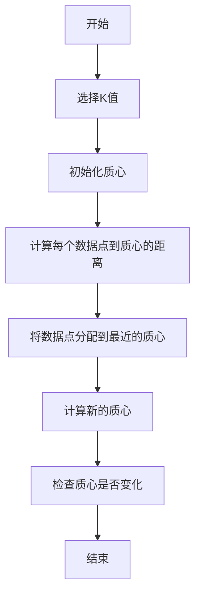
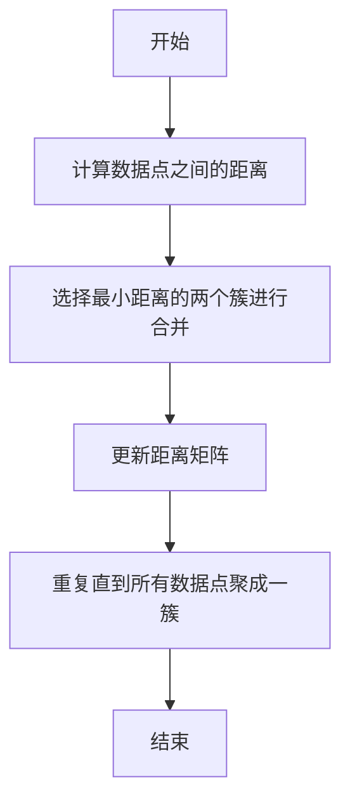
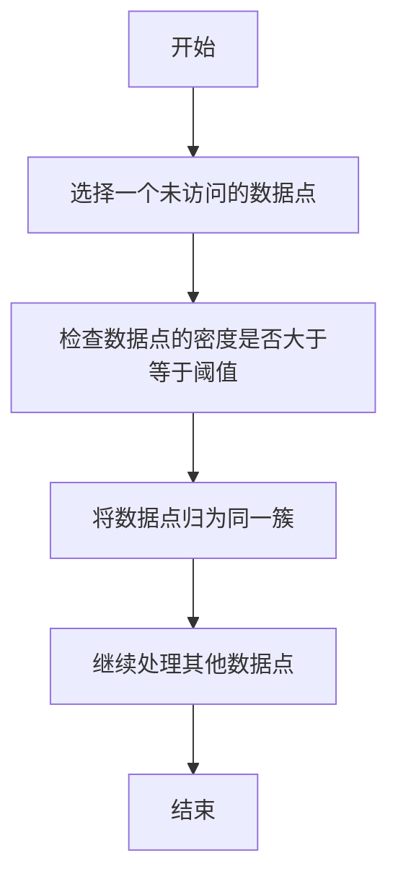
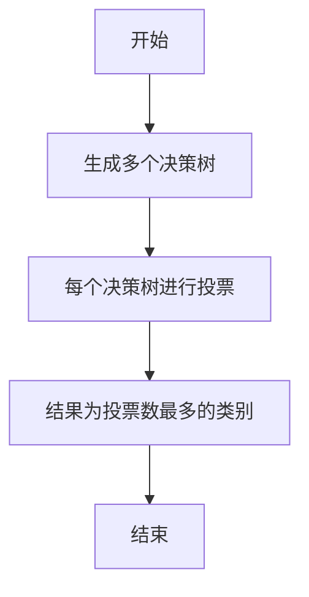
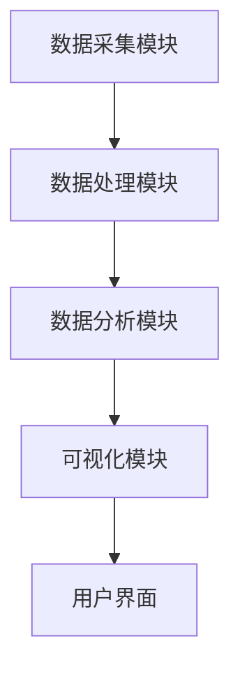
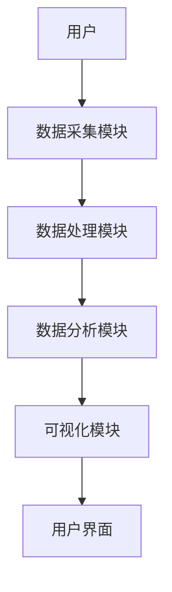

                 


# 《竞争对手分析》

> 关键词：竞争对手分析，市场分析，数据挖掘，机器学习，商业策略，市场份额，数据可视化

> 摘要：本文将详细探讨竞争对手分析的背景、核心概念、算法原理、系统架构设计以及实际项目案例。通过结合数据挖掘和机器学习技术，我们将展示如何科学地分析竞争对手的市场行为、产品策略和竞争优势，从而为企业制定有效的竞争策略提供支持。

---

# 第一部分: 竞争对手分析背景与核心概念

## 第1章: 竞争对手分析概述

### 1.1 竞争对手分析的定义与背景

竞争对手分析是通过对市场中竞争对手的市场行为、产品特点、竞争优势等进行系统性研究，以帮助企业更好地理解市场环境、制定有效的竞争策略。在现代商业环境中，竞争对手分析不仅是企业制定战略的重要工具，也是企业在复杂市场中生存和发展的必要技能。

**问题背景**  
在市场竞争日益激烈的今天，企业需要实时了解竞争对手的动态，包括他们的产品发布、市场份额、价格策略、营销活动等。然而，如何从海量数据中提取有价值的信息，并转化为可操作的策略，成为企业面临的主要挑战。

**问题解决**  
通过竞争对手分析，企业可以识别市场趋势，发现潜在机会和威胁，优化产品设计和定价策略，从而在竞争中占据优势地位。

**边界与外延**  
竞争对手分析不仅包括对直接竞争对手的研究，还包括对潜在竞争对手和替代品市场的分析。其外延涉及市场趋势分析、消费者行为研究等领域。

### 1.2 竞争对手分析的核心要素

#### 1.2.1 竞争对手的基本属性
- **市场地位**：竞争对手在市场中的份额、品牌影响力。
- **产品特点**：竞争对手的核心产品和服务。
- **价格策略**：竞争对手的价格定位和促销活动。

#### 1.2.2 竞争对手的核心竞争力分析
- **产品创新**：竞争对手的技术研发能力和新产品发布频率。
- **成本优势**：竞争对手的成本控制能力。
- **渠道优势**：竞争对手的销售渠道和覆盖范围。

#### 1.2.3 竞争对手的市场行为分析
- **市场进入策略**：竞争对手的新市场拓展行为。
- **营销策略**：竞争对手的广告投放、品牌推广活动。
- **客户反馈**：竞争对手的客户满意度和口碑。

### 1.3 竞争对手分析的方法与工具

#### 1.3.1 常用竞争对手分析工具
- **数据采集工具**：Google Analytics、SimilarWeb、SEMrush。
- **数据分析工具**：Excel、Tableau、Power BI。
- **竞争对手监控工具**：Ahrefs、Moz、SpyFu。

#### 1.3.2 数据收集与处理方法
- **数据爬取**：通过网络爬虫技术获取竞争对手的产品信息、价格数据。
- **API接口**：利用第三方API获取实时数据。
- **问卷调查**：通过市场调研获取消费者对竞争对手的认知和反馈。

#### 1.3.3 数据分析与可视化工具
- **数据可视化工具**：Tableau、Power BI。
- **机器学习工具**：Python、Scikit-learn。
- **NLP工具**：NLTK、Gensim。

### 1.4 竞争对手分析的流程与步骤

#### 1.4.1 数据收集阶段
- **数据源选择**：确定竞争对手的主要数据来源。
- **数据清洗**：去除无效数据，处理缺失值。
- **数据预处理**：标准化和归一化处理。

#### 1.4.2 数据分析阶段
- **数据挖掘**：使用聚类分析、分类算法等技术提取数据中的模式。
- **模式识别**：识别竞争对手的市场行为模式。
- **趋势预测**：基于历史数据预测未来趋势。

#### 1.4.3 结果解读与策略制定阶段
- **结果解读**：将数据分析结果转化为可操作的策略。
- **策略制定**：制定针对性的竞争策略，如产品差异化、价格调整等。

### 1.5 本章小结
本章详细介绍了竞争对手分析的定义、核心要素和常用方法，为后续的算法和系统设计奠定了基础。

---

## 第2章: 竞争对手分析的核心模型与方法

### 2.1 竞争对手分析的常用模型

#### 2.1.1 SWOT分析模型
SWOT分析模型帮助企业识别竞争对手的优势（Strengths）、劣势（Weaknesses）、机会（Opportunities）和威胁（Threats）。

**示例分析**：  
- **优势**：竞争对手拥有强大的研发能力。
- **劣势**：竞争对手的产品线较为单一。
- **机会**：新兴市场需求增长。
- **威胁**：新的竞争者进入市场。

#### 2.1.2 PEST分析模型
PEST分析模型从政治（Political）、经济（Economic）、社会（Social）、技术（Technological）四个维度分析竞争对手的外部环境。

**示例分析**：  
- **政治因素**：政府出台新的行业法规。
- **经济因素**：经济衰退导致消费者支出减少。
- **社会因素**：消费者环保意识增强。
- **技术因素**：新技术的出现可能导致产品过时。

#### 2.1.3 波特五力分析模型
波特五力模型帮助企业分析行业竞争结构，包括新进入者的威胁、替代品的威胁、供应商的议价能力、买方的议价能力和现有竞争者之间的竞争程度。

**示例分析**：  
- **新进入者威胁**：行业进入壁垒低，容易吸引新竞争者。
- **替代品威胁**：替代品的价格优势明显。
- **供应商议价能力**：主要供应商集中，议价能力强。

### 2.2 竞争对手分析的步骤与方法

#### 2.2.1 数据收集与整理
- **数据源选择**：竞争对手的产品页面、新闻发布、社交媒体等。
- **数据清洗**：去除无效数据，填补缺失值。
- **数据预处理**：标准化和归一化处理。

#### 2.2.2 数据分析与建模
- **数据挖掘**：使用聚类分析、关联规则挖掘等技术提取数据中的模式。
- **模式识别**：识别竞争对手的市场行为模式。
- **趋势预测**：基于历史数据预测未来趋势。

#### 2.2.3 结果验证与优化
- **结果验证**：通过交叉验证和ROC曲线评估模型的准确性。
- **模型优化**：调整参数，选择最优算法。

### 2.3 竞争对手分析的数学模型与公式

#### 2.3.1 竞争对手市场份额预测模型
市场份额预测可以使用线性回归模型：

$$ \hat{y} = \beta_0 + \beta_1 x_1 + \beta_2 x_2 + \dots + \beta_n x_n $$

其中，$y$ 是市场份额，$x_i$ 是影响市场份额的变量，如价格、广告投入等。

#### 2.3.2 竞争对手产品定位分析模型
产品定位可以通过因子分析模型进行评估：

$$ F = w_1 x_1 + w_2 x_2 + \dots + w_k x_k $$

其中，$F$ 是产品定位得分，$w_i$ 是因子权重，$x_i$ 是产品属性。

### 2.4 本章小结
本章介绍了竞争对手分析的核心模型和方法，包括SWOT、PEST、波特五力分析模型，并详细讲解了数据分析的步骤和数学模型。

---

## 第3章: 竞争对手分析的算法原理

### 3.1 数据挖掘与机器学习在竞争对手分析中的应用

#### 3.1.1 数据挖掘的基本概念
数据挖掘是从大量数据中提取有用信息的过程，常用于模式识别和预测分析。

#### 3.1.2 机器学习在竞争对手分析中的作用
机器学习可以用于分类、聚类、回归等任务，帮助识别竞争对手的市场行为模式。

#### 3.1.3 常用算法及其适用场景
- **聚类算法**：K-means、DBSCAN，用于市场细分。
- **分类算法**：SVM、随机森林，用于预测竞争对手的市场行为。
- **回归算法**：线性回归、Lasso回归，用于预测市场份额。

### 3.2 竞争对手分析的聚类算法

#### 3.2.1 K-means聚类算法
K-means是一种无监督学习算法，用于将数据分成K个簇。

**流程图**：


#### 3.2.2 层次聚类算法
层次聚类是一种基于树状结构的聚类方法。

**流程图**：


#### 3.2.3 DBSCAN密度聚类算法
DBSCAN基于密度的概念，将数据点聚类。

**流程图**：


### 3.3 竞争对手分析的分类算法

#### 3.3.1 支持向量机（SVM）
SVM用于分类任务，通过找到最优超平面将数据分为两类。

**数学公式**：
$$ \text{目标函数} = \max(\text{间隔最大化}) $$
$$ \text{约束条件} = y_i (w \cdot x_i + b) \geq 1 $$

#### 3.3.2 随机森林（Random Forest）
随机森林是一种基于决策树的集成学习算法。

**流程图**：


#### 3.3.3 K近邻算法（KNN）
KNN用于分类和回归任务，基于“近邻”的概念。

**数学公式**：
$$ y = \text{mode}(y_1, y_2, \dots, y_k) $$

### 3.4 竞争对手分析的数学模型与公式

#### 3.4.1 聚类算法的距离计算公式
欧氏距离公式：
$$ d(x_i, x_j) = \sqrt{(x_i - x_j)^2 + (y_i - y_j)^2} $$

#### 3.4.2 分类算法的决策边界公式
线性分类器的决策边界：
$$ w \cdot x + b = 0 $$

### 3.5 本章小结
本章详细讲解了数据挖掘和机器学习在竞争对手分析中的应用，包括聚类和分类算法的原理和流程图。

---

## 第4章: 竞争对手分析的系统架构设计

### 4.1 竞争对手分析系统的功能设计

#### 4.1.1 数据采集模块
功能：从多个数据源（如网站、API）采集竞争对手的数据。

#### 4.1.2 数据处理模块
功能：清洗和预处理数据，确保数据质量。

#### 4.1.3 数据分析模块
功能：使用机器学习算法进行数据分析和建模。

#### 4.1.4 可视化模块
功能：将分析结果可视化，生成报告。

### 4.2 竞争对手分析系统的架构设计

#### 4.2.1 系统架构图


#### 4.2.2 系统交互流程图


### 4.3 本章小结
本章详细设计了竞争对手分析系统的功能模块和架构图，为后续的系统实现奠定了基础。

---

## 第5章: 竞争对手分析的项目实战

### 5.1 项目背景与目标

#### 5.1.1 项目背景
假设我们是一家互联网公司，需要分析竞争对手的市场份额和产品策略。

#### 5.1.2 项目目标
- 采集竞争对手的数据。
- 分析竞争对手的市场行为。
- 制定针对性的竞争策略。

### 5.2 项目核心实现

#### 5.2.1 环境安装
- 安装Python、Jupyter Notebook、Scikit-learn、Pandas、Matplotlib。

#### 5.2.2 核心代码实现

##### 代码1：数据采集
```python
import requests
from bs4 import BeautifulSoup

url = 'https://www.example.com/competitor/products'
response = requests.get(url)
soup = BeautifulSoup(response.text, 'html.parser')
products = soup.find_all('div', class_='product')
for product in products:
    print(product.text)
```

##### 代码2：数据分析
```python
import pandas as pd
from sklearn.cluster import KMeans

data = pd.read_csv('competitor_data.csv')
X = data[['price', 'rating']]
kmeans = KMeans(n_clusters=3, random_state=0)
kmeans.fit(X)
labels = kmeans.labels_
print(labels)
```

##### 代码3：数据可视化
```python
import matplotlib.pyplot as plt

plt.scatter(X['price'], X['rating'], c=labels)
plt.xlabel('Price')
plt.ylabel('Rating')
plt.title('Competitor Analysis')
plt.show()
```

### 5.3 项目实战案例分析

#### 5.3.1 数据收集与处理
- 从竞争对手的网站爬取产品数据。
- 清洗数据，去除无效信息。

#### 5.3.2 数据分析与建模
- 使用K-means算法对竞争对手的产品进行聚类分析。
- 可视化结果，识别竞争对手的核心产品线。

#### 5.3.3 结果解读与策略制定
- 根据分析结果，制定产品差异化策略。
- 调整定价策略，抢占市场份额。

### 5.4 本章小结
本章通过实际案例展示了竞争对手分析的全过程，包括数据采集、分析和可视化。

---

## 第6章: 竞争对手分析的总结与展望

### 6.1 本章总结
本文详细探讨了竞争对手分析的背景、核心概念、算法原理、系统架构设计以及项目实战案例。通过结合数据挖掘和机器学习技术，我们展示了如何科学地分析竞争对手的市场行为和产品策略，从而为企业制定有效的竞争策略提供支持。

### 6.2 未来展望
未来，竞争对手分析将更加智能化和自动化。随着AI技术的发展，实时监控和预测分析将成为可能。此外，多模态数据分析（如文本、图像、视频）也将为竞争对手分析提供新的视角。

### 6.3 最佳实践 tips
- 定期更新竞争对手数据，保持分析的准确性。
- 结合行业专家意见，验证分析结果。
- 使用可视化工具，将分析结果清晰地呈现给决策者。

### 6.4 本章小结
本文总结了竞争对手分析的核心内容，并展望了未来的发展方向，为读者提供了全面的视角。

---

通过以上内容，您可以看到《竞争对手分析》这本书的详细目录和正文内容。如果需要进一步扩展或调整，请随时告知！

