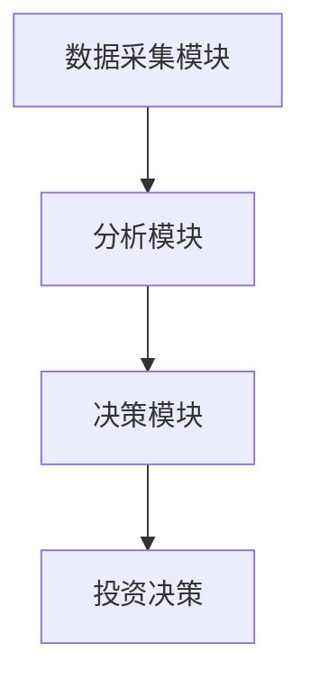
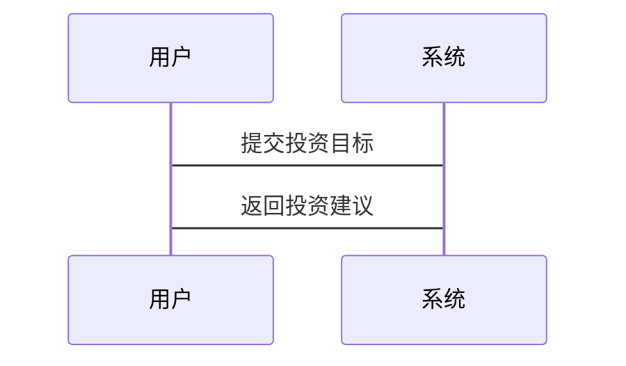

                 


# 约瑟夫·拉科尼克的价值创造投资：关注长期价值增长

> 关键词：价值投资、长期价值增长、财务分析、企业竞争优势、投资组合管理、安全边际、价值评估模型

> 摘要：本文深入探讨了约瑟夫·拉科尼克的价值投资理念，重点关注长期价值增长的核心要素。通过系统化的财务分析、企业竞争优势评估以及投资组合管理，本文详细阐述了如何在复杂市场环境中实现稳健的投资回报。文章结合理论与实践，为投资者提供了实用的工具和方法，帮助他们在长期投资中实现价值最大化。

---

# 第1章: 价值投资的背景与核心概念

## 1.1 价值投资的基本概念

### 1.1.1 投资的定义与分类

- 投资是指将资金投入到能够产生未来收益的资产中，以实现财富增值。
- 投资可以分为短期投资和长期投资，价值投资属于长期投资策略。

### 1.1.2 价值投资的核心理念

- 价值投资的核心理念是寻找市场价格低于内在价值的资产进行投资。
- 强调企业的内在价值，而非市场的短期波动。

### 1.1.3 价值投资与其他投资方式的区别

| 投资方式 | 核心理念 | 时间框架 | 风险承受 |
|----------|----------|----------|----------|
| 价值投资 | 寻找被低估的资产 | 长期 | 较低 |
| 股票交易 | 利用价格波动 | 短期 | 较高 |

---

## 1.2 价值投资的历史与发展

### 1.2.1 价值投资的起源

- 价值投资的理论基础可以追溯到20世纪初，本杰明·格雷厄姆和大卫·多德的贡献奠定了基础。

### 1.2.2 价值投资的演变过程

- 从格雷厄姆的"烟屁股"投资法到巴菲特的"护城河"理念，价值投资不断发展。

### 1.2.3 当代价值投资的主要流派

- 巴菲特学派：注重企业的竞争优势和长期盈利能力。
- 格雷厄姆学派：注重安全边际和低估值。

---

## 1.3 约瑟夫·拉科尼克的投资理念

### 1.3.1 拉科尼克的生平简介

- 约瑟夫·拉科尼克：世界级投资大师，专注于长期价值增长的投资策略。

### 1.3.2 拉科尼克投资理念的核心思想

- **核心思想**：寻找具有持续竞争优势的企业，关注企业的内在价值，而非市场价格的短期波动。

### 1.3.3 拉科尼克投资理念的实践案例

- 通过分析具体案例（如苹果公司），展示如何应用拉科尼克的理念进行投资决策。

---

## 1.4 价值投资的适用场景与边界

### 1.4.1 价值投资的适用市场环境

- 稳定且成熟的市场环境更有利于价值投资的实施。

### 1.4.2 价值投资的局限性

- 短期市场波动可能导致价值投资策略的执行难度增加。

### 1.4.3 价值投资与其他投资策略的结合

- 通过与其他策略（如趋势投资）的结合，优化投资组合的表现。

---

## 1.5 本章小结

- 价值投资是一种以内在价值为核心，注重长期持有的投资策略。
- 约瑟夫·拉科尼克的投资理念强调企业竞争优势和长期价值增长。
- 价值投资在稳定市场中表现优异，但在极端市场环境下可能面临挑战。

---

# 第2章: 价值创造的核心要素

## 2.1 企业的核心竞争力分析

### 2.1.1 核心竞争力的定义

- 核心竞争力是指企业在市场上独特的竞争优势，能够持续为股东创造价值。

### 2.1.2 核心竞争力的构成要素

| 要素 | 定义 | 示例 |
|------|------|------|
| 技术优势 | 独特的技术能力 | 苹果公司的创新技术 |
| 市场优势 | 强大的市场地位 | 谷歌的搜索引擎市场占有率 |
| 资源优势 | 稀缺的资源储备 | 原材料企业的矿产资源 |

### 2.1.3 核心竞争力的评估方法

- 使用 SWOT 分析法评估企业的竞争优势。

---

## 2.2 财务指标与企业价值的关系

### 2.2.1 主要财务指标的定义

| 指标 | 定义 |
|------|------|
| 净利润 | 企业一定时期内实现的利润 |
| 营业收入 | 企业一定时期内实现的收入 |

### 2.2.2 财务指标与企业价值的关联

- 净利润是企业价值的核心驱动因素。

### 2.2.3 财务指标的局限性

- 财务指标无法完全反映企业的市场竞争力。

---

## 2.3 行业分析与竞争格局

### 2.3.1 行业分析的基本方法

- 使用 PEST 分析法评估行业宏观环境。

### 2.3.2 行业竞争格局的评估

- 通过市场份额和竞争态势分析行业格局。

### 2.3.3 行业周期性对投资的影响

- 行业周期分为增长期、成熟期和衰退期。

---

## 2.4 管理层的质量与企业价值

### 2.4.1 管理层的定义与作用

- 管理层是企业战略决策的核心。

### 2.4.2 管理层质量的评估标准

| 标准 | 定义 |
|------|------|
| 战略能力 | 制定和执行战略的能力 |
| 诚信与道德 | 管理层的诚信和道德水平 |

### 2.4.3 管理层对企业价值的影响

- 高质量的管理层能够提升企业价值。

---

## 2.5 本章小结

- 企业的核心竞争力、财务状况、行业环境和管理层质量是价值投资的关键要素。
- 这些要素共同决定了企业的内在价值和长期增长潜力。

---

# 第3章: 价值投资的策略与方法

## 3.1 价值投资的基本策略

### 3.1.1 股票估值的基本方法

- 使用相对估值法和绝对估值法评估股票价值。

### 3.1.2 安全边际的概念与应用

- 安全边际是指市场价格低于内在价值的部分。

### 3.1.3 股票筛选的标准与流程

1. 选择具有持续竞争优势的企业。
2. 评估企业的财务状况。
3. 确定市场价格是否低于内在价值。

---

## 3.2 财务分析的深度解读

### 3.2.1 资产负债表分析

- 通过分析资产负债表评估企业的财务健康状况。

### 3.2.2 利润表分析

- 通过分析利润表评估企业的盈利能力。

### 3.2.3 现金流量表分析

- 通过分析现金流量表评估企业的现金流健康状况。

---

## 3.3 企业竞争优势的评估

### 3.3.1 技术优势的评估

- 评估企业的技术创新能力和专利储备。

### 3.3.2 市场优势的评估

- 评估企业的市场份额和品牌影响力。

### 3.3.3 资源优势的评估

- 评估企业是否拥有稀缺资源。

---

## 3.4 投资组合的构建与管理

### 3.4.1 投资组合的基本原理

- 分散投资以降低风险。

### 3.4.2 投资组合的构建策略

1. 确定投资目标和风险承受能力。
2. 选择具有竞争优势的企业。
3. 确定各资产的配置比例。

### 3.4.3 投资组合的动态管理

- 定期评估投资组合的表现，并进行调整。

---

## 3.5 本章小结

- 价值投资的策略包括股票估值、安全边际、竞争优势评估和投资组合管理。
- 这些策略共同确保了投资的长期价值增长。

---

# 第4章: 价值投资的数学模型与算法原理

## 4.1 股票估值的数学模型

### 4.1.1 市盈率模型

- 公式：市盈率 = 股价 / 每股净利润

### 4.1.2 市净率模型

- 公式：市净率 = 股价 / 每股净资产

### 4.1.3 现金流量折现模型

- 公式：内在价值 = 未来现金流的现值

---

## 4.2 财务指标的量化分析

### 4.2.1 净资产收益率（ROE）的计算

- 公式：ROE = 净利润 / 净资产

### 4.2.2 资产回报率（ROA）的计算

- 公式：ROA = 净利润 / 总资产

---

## 4.3 算法原理的详细讲解

### 4.3.1 价值投资算法的步骤

1. 数据收集：收集企业的财务数据和市场数据。
2. 估值计算：使用数学模型计算企业的内在价值。
3. 安全边际分析：确定市场价格是否低于内在价值。
4. 投资决策：根据分析结果做出投资决策。

---

## 4.4 本章小结

- 数学模型和算法是价值投资的重要工具。
- 通过量化分析，投资者可以更准确地评估企业的内在价值。

---

# 第5章: 价值投资的系统架构设计

## 5.1 问题场景介绍

- 投资者需要在复杂市场环境中做出科学的投资决策。

## 5.2 系统功能设计

- 数据采集模块：收集企业的财务数据和市场数据。
- 分析模块：使用数学模型进行估值和风险评估。
- 决策模块：根据分析结果制定投资策略。

---

## 5.3 系统架构设计



---

## 5.4 系统接口设计

- 数据接口：与数据源（如金融数据库）对接。
- 用户界面：提供数据可视化和投资决策支持。

---

## 5.5 系统交互设计



---

## 5.6 本章小结

- 系统架构设计为价值投资提供了科学的框架。
- 通过模块化设计，投资者可以更高效地做出投资决策。

---

# 第6章: 价值投资的项目实战

## 6.1 环境安装与配置

- 安装 Python 和相关金融分析库（如 pandas、numpy）。

## 6.2 核心实现源代码

```python
import pandas as pd
import numpy as np

def calculate_intrinsic_value(fcf, discount_rate):
    # 简单的DCF模型
    return fcf / (1 + discount_rate)

# 示例数据
fcf = 100
discount_rate = 0.1
intrinsic_value = calculate_intrinsic_value(fcf, discount_rate)
print(f"内在价值: {intrinsic_value}")
```

## 6.3 代码应用解读与分析

- 通过代码实现DCF模型，计算企业的内在价值。

## 6.4 实际案例分析

- 以苹果公司为例，分析其财务数据和市场地位。

## 6.5 项目小结

- 实战案例展示了如何将理论应用于实际投资决策。

---

# 第7章: 价值投资的最佳实践与小结

## 7.1 最佳实践 tips

### 7.1.1 长期持有优质资产

- 避免频繁交易，降低交易成本。

### 7.1.2 定期复盘与调整

- 定期评估投资组合的表现，并进行必要的调整。

### 7.1.3 保持学习与进化

- 不断学习市场知识，提升自己的投资能力。

---

## 7.2 本章小结

- 价值投资是一种需要长期坚持的投资策略。
- 通过不断学习和实践，投资者可以提升自己的投资能力。

---

# 第8章: 价值投资的注意事项与拓展阅读

## 8.1 投资中的注意事项

### 8.1.1 风险管理

- 设定止损点，控制投资风险。

### 8.1.2 市场波动

- 长期持有优质资产，避免被短期波动影响。

## 8.2 拓展阅读

- 推荐阅读巴菲特和格雷厄姆的经典著作。

---

# 结语

价值投资是一种需要耐心和智慧的投资策略。通过深入分析企业的内在价值和长期竞争优势，投资者可以在复杂市场环境中实现稳健的投资回报。约瑟夫·拉科尼克的投资理念为我们提供了宝贵的指导，帮助我们在长期投资中实现价值最大化。

--- 

以上是《约瑟夫·拉科尼克的价值创造投资：关注长期价值增长》的完整目录和内容概要。

