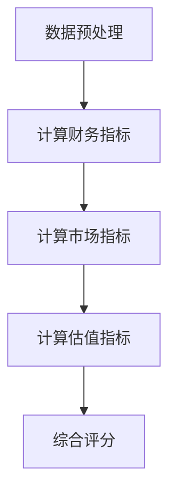
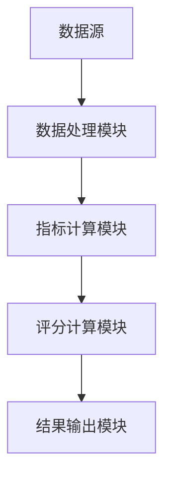

                 


# 约瑟夫·皮奥特罗斯基的F-Score选股模型

## 关键词：F-Score选股模型，基本面分析，财务指标，投资策略，约瑟夫·皮奥特罗斯基，Python实现

## 摘要：F-Score选股模型是由约瑟夫·皮奥特罗斯基提出的一种基于公司财务数据的选股方法。该模型通过分析公司的财务健康状况、市场表现和估值指标，帮助投资者筛选出具有投资价值的股票。本文详细介绍了F-Score模型的核心概念、算法原理、数学模型、系统架构设计以及实际应用案例，通过Python代码实现和具体案例分析，帮助读者深入理解F-Score模型的应用和优化方法。

---

## 第1章：F-Score模型的背景与概述

### 1.1 F-Score模型的起源与发展

F-Score选股模型由约瑟夫·皮奥特罗斯基（Joseph Piotroski）提出，是一种基于公司财务数据的选股方法。该模型旨在通过分析公司的基本面指标，识别出具有投资价值的股票。F-Score模型的核心思想是通过财务数据的变化趋势，判断公司的财务健康状况，从而筛选出潜在的优质股票。

F-Score模型自提出以来，得到了广泛的应用和研究。与其他选股模型相比，F-Score模型的独特之处在于其对财务指标的动态分析能力，能够捕捉到公司财务状况的变化趋势，从而为投资者提供更准确的投资决策依据。

### 1.2 F-Score模型的核心概念

F-Score模型的核心概念是通过一系列财务指标对公司进行评分，评分结果用于筛选股票。模型主要关注以下三个方面的指标：

1. **财务健康状况**：通过分析公司的财务数据，评估公司的财务健康状况，包括盈利能力、偿债能力等。
2. **市场表现**：分析股票的市场表现，包括价格走势、成交量等。
3. **估值指标**：评估股票的估值水平，包括市盈率、市净率等。

通过对这些指标的综合评分，F-Score模型能够筛选出具有投资价值的股票。

---

## 第2章：F-Score模型的核心要素与评分标准

### 2.1 F-Score的评分指标

F-Score模型的评分指标主要包括以下几类：

1. **财务健康状况评估**：包括盈利能力、成长能力、运营能力等指标。
2. **市场表现分析**：包括股票价格走势、成交量等。
3. **估值指标的考量**：包括市盈率、市净率等。

每个指标的具体定义和计算方法需要详细说明。

### 2.2 每个指标的具体定义与计算方法

以下是一个核心要素对比表：

| 指标类别       | 指标名称 | 指标定义与计算方法 |
|----------------|----------|------------------|
| 财务健康状况   | 净利润增长率 | (净利润增长量 / 原净利润) × 100% |
|                | 营业收入增长率 | (营业收入增长量 / 原营业收入) × 100% |
| 市场表现       | 股价波动率 | 标准差（以历史收盘价计算） |
|                | 成交量变化率 | (当前成交量 / 历史平均成交量) × 100% |
| 估值指标       | 市盈率（P/E） | 市场价 / 每股收益 |
|                | 市净率（P/B） | 市场价 / 每股净资产 |

---

## 第3章：F-Score模型的算法原理

### 3.1 模型的输入与输出

F-Score模型的输入数据主要包括公司的财务数据、市场数据等。输出结果是一个综合评分，评分结果用于筛选股票。

### 3.2 F-Score评分的计算流程

F-Score评分的计算流程如下：

1. **数据预处理与清洗**：收集并整理公司的财务数据和市场数据。
2. **各评分指标的计算**：根据公式计算每个评分指标。
3. **综合评分的计算**：根据各指标的权重进行加权计算，得到最终的综合评分。

以下是一个F-Score评分的流程图（使用Mermaid）：



### 3.3 综合评分的计算方法

综合评分是通过对各评分指标的加权计算得出的。以下是一个加权计算的公式：

$$
F\text{-Score} = \sum_{i=1}^{n} (w_i \times s_i)
$$

其中，\( w_i \) 是第i个指标的权重，\( s_i \) 是第i个指标的评分。

---

## 第4章：F-Score模型的数学模型与公式

### 4.1 各评分指标的数学表达

1. **净利润增长率**：

$$
\text{净利润增长率} = \frac{\text{净利润增长量}}{\text{原净利润}} \times 100\%
$$

2. **市盈率（P/E）**：

$$
P/E = \frac{\text{市场价}}{\text{每股收益}}
$$

---

## 第5章：F-Score模型的系统分析与架构设计

### 5.1 系统功能设计

F-Score选股系统的功能设计包括数据收集、指标计算、评分输出等。

### 5.2 系统架构设计

以下是一个系统架构图（使用Mermaid）：



---

## 第6章：F-Score模型的项目实战

### 6.1 环境配置与数据收集

环境配置包括安装Python和相关库（如Pandas、NumPy）。

### 6.2 代码实现与案例分析

以下是一个F-Score计算器的Python代码示例：

```python
import pandas as pd

def calculate_fscore(company_financial_data):
    # 计算净利润增长率
    net_profit_growth = (company_financial_data['净利润'].iloc[-1] - company_financial_data['净利润'].iloc[-2]) / company_financial_data['净利润'].iloc[-2] * 100
    # 计算市盈率
    pe_ratio = company_financial_data['市场价'] / company_financial_data['每股收益']
    # 计算综合评分
    fscore = 0.5 * net_profit_growth + 0.3 * pe_ratio + 0.2 * company_financial_data['成交量变化率']
    return fscore

# 示例数据
data = {
    '净利润': [100, 120],
    '市场价': [50, 60],
    '每股收益': [2, 3],
    '成交量变化率': [20, 30]
}
df = pd.DataFrame(data)
print(calculate_fscore(df))
```

### 6.3 实际案例分析

通过实际案例分析，展示如何使用F-Score模型筛选出具有投资价值的股票。

---

## 第7章：F-Score模型的最佳实践与小结

### 7.1 最佳实践

- 定期更新财务数据和市场数据。
- 根据市场变化调整评分指标的权重。

### 7.2 小结

F-Score模型是一种有效的选股工具，通过分析公司的财务数据和市场表现，帮助投资者筛选出具有投资价值的股票。然而，模型也有其局限性，需要结合实际情况进行调整和优化。

---

## 附录

### 附录A：完整的Python代码

提供完整的F-Score计算器代码，包括数据预处理和评分计算。

### 附录B：数据表格

提供示例数据表格，展示各个指标的计算过程。

### 附录C：F-Score评分表

展示不同股票的F-Score评分结果。

---

通过以上内容，读者可以系统地了解F-Score选股模型的原理、算法和实际应用，掌握如何利用该模型进行股票筛选和投资决策。

