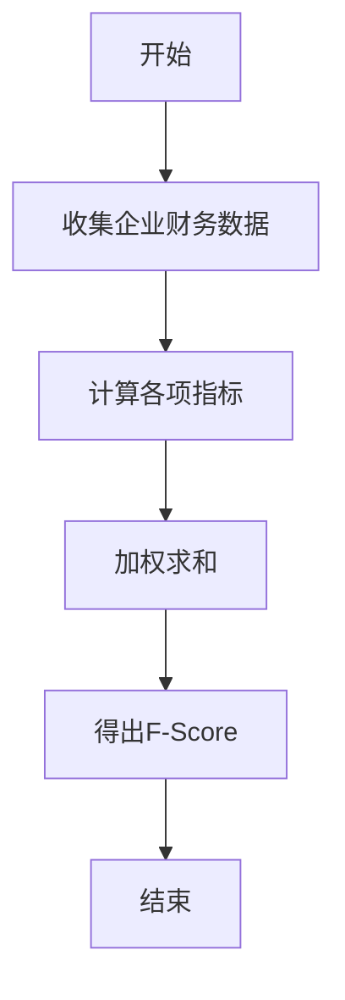
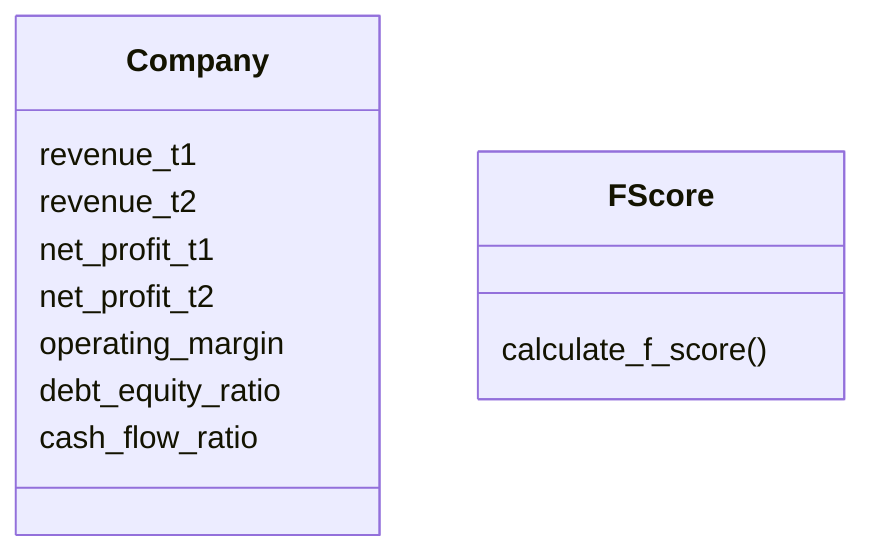
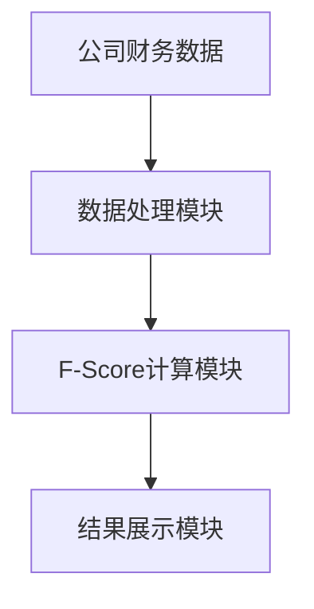
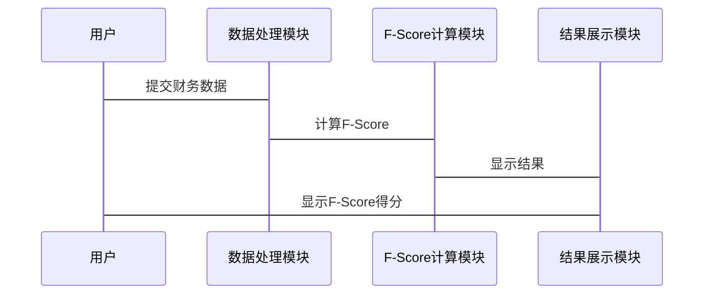

                 


# 约瑟夫·皮奥特罗斯基的F-Score：量化价值投资的尝试

> 关键词：F-Score，价值投资，约瑟夫·皮奥特罗斯基，基本面分析，破产预测

> 摘要：本文系统地介绍约瑟夫·皮奥特罗斯基提出的F-Score指标，探讨其在量化价值投资中的应用。通过详细分析F-Score的核心概念、算法原理、系统架构设计以及项目实战，本文为投资者提供了一个基于公司基本面分析的新视角，帮助他们在投资决策中更准确地评估公司价值和风险。

---

# 第一部分：F-Score的背景与核心概念

## 第1章：F-Score的背景与核心概念

### 1.1 F-Score的起源与背景

#### 1.1.1 价值投资的起源与发展

价值投资是一种以公司基本面分析为基础的投资策略，起源于20世纪初。本杰明·格雷厄姆和戴维·多德是这一领域的先驱，他们强调以低于内在价值的价格买入优质股票。然而，随着市场的复杂化，传统价值投资方法逐渐暴露出一些局限性，尤其是在量化分析和风险预测方面。

#### 1.1.2 约瑟夫·皮奥特罗斯基与F-Score的提出

约瑟夫·皮奥特罗斯基是加拿大著名投资专家，他在1972年提出了F-Score指标，作为一种改进的公司基本面分析工具。F-Score的初衷是通过量化方法更准确地评估公司的财务健康状况，尤其是预测破产风险。

#### 1.1.3 F-Score的核心目标与意义

F-Score的核心目标是通过分析公司的财务数据，量化其内在价值和风险，从而为投资者提供更精准的投资决策依据。它弥补了传统估值方法的不足，尤其是在识别高风险公司方面表现突出。

### 1.2 F-Score的定义与特点

#### 1.2.1 F-Score的定义

F-Score是一种基于公司财务数据的多因素评价指标，综合考虑了收入增长、利润增长、利润率、负债与权益比率以及现金流等因素，最终得出一个分数，用以评估公司的财务健康状况。

#### 1.2.2 F-Score的核心特点

- **多因素分析**：F-Score综合考虑多个财务指标，避免了单一指标分析的片面性。
- **量化评估**：通过数学模型将公司基本面转化为一个具体的分数，便于比较和分析。
- **风险预测**：特别适用于预测公司破产风险，帮助投资者识别潜在的高风险投资标的。

#### 1.2.3 F-Score与传统估值方法的对比

传统的估值方法（如市盈率、市净率等）主要关注公司价格与某种估值指标的比率，而F-Score则更注重公司的财务健康状况和成长能力，提供了一个更全面的分析框架。

### 1.3 F-Score在投资中的作用

#### 1.3.1 企业基本面分析的新视角

F-Score通过量化公司财务数据，提供了对企业基本面的多维度分析，帮助投资者更全面地评估公司的财务状况。

#### 1.3.2 F-Score在预测破产中的应用

F-Score的一个重要应用是预测公司破产风险。通过对公司财务指标的综合分析，F-Score可以帮助投资者识别出可能面临破产风险的企业。

#### 1.3.3 F-Score在价值投资中的策略意义

F-Score为价值投资者提供了一个量化工具，帮助他们在选择投资标的时，不仅考虑价格因素，还考虑公司的财务健康状况和成长能力。

### 1.4 本章小结

本章介绍了F-Score的背景、定义和特点，并探讨了其在投资中的作用。通过F-Score，投资者可以更全面地评估公司的财务状况，做出更明智的投资决策。

---

## 第2章：F-Score的核心概念与联系

### 2.1 F-Score的核心指标

#### 2.1.1 营业收入增长率

营业收入增长率是衡量公司收入增长能力的重要指标。F-Score中，营业收入增长率的权重较大，因为它反映了公司的市场拓展能力和盈利能力。

#### 2.1.2 净利润增长率

净利润增长率是衡量公司盈利能力增长的重要指标。高净利润增长率通常意味着公司盈利能力强，未来发展潜力大。

#### 2.1.3 营业利润率

营业利润率是衡量公司每单位收入的盈利能力。高营业利润率通常意味着公司成本控制能力较强，盈利能力较高。

#### 2.1.4 负债与权益比率

负债与权益比率是衡量公司财务杠杆的重要指标。较低的负债与权益比率通常意味着公司财务风险较低，偿债能力较强。

#### 2.1.5 现金流量比率

现金流量比率是衡量公司现金流健康状况的重要指标。健康的现金流通常意味着公司具有较强的运营能力和偿债能力。

### 2.2 F-Score指标的属性特征对比

#### 2.2.1 指标对比表

| 指标名称               | 定义与计算方法                                                                 | 权重 |
|------------------------|------------------------------------------------------------------------------|------|
| 营业收入增长率         | (当前营业收入 - 上期营业收入) / 上期营业收入 × 100%                              | 20%  |
| 净利润增长率           | (当前净利润 - 上期净利润) / 上期净利润 × 100%                                  | 20%  |
| 营业利润率             | 净利润 / 营业收入                                                           | 20%  |
| 负债与权益比率         | 总负债 / 所有者权益                                                       | 20%  |
| 现金流量比率           | 经营活动产生的现金流 / 年平均流动负债                                       | 20%  |

#### 2.2.2 指标之间的关系

各指标之间相互独立，共同构成F-Score的综合评价体系。例如，营业收入增长率和净利润增长率反映了公司的收入和利润增长能力，而营业利润率则反映了公司的成本控制能力。

### 2.3 F-Score的ER实体关系图


### 2.4 本章小结

本章详细介绍了F-Score的核心指标及其属性特征，并通过对比表和ER实体关系图展示了各指标之间的关系。这些指标共同构成了F-Score的评价体系。

---

## 第3章：F-Score的算法原理

### 3.1 F-Score的计算流程

#### 3.1.1 计算步骤

1. 收集公司最近几年的财务数据，包括营业收入、净利润、营业利润、总负债和所有者权益等。
2. 计算各项指标：
   - 营业收入增长率
   - 净利润增长率
   - 营业利润率
   - 负债与权益比率
   - 现金流量比率
3. 对各项指标进行加权求和，计算F-Score得分。
4. 根据F-Score得分对公司的财务状况进行分类和评估。

#### 3.1.2 计算流程图



### 3.2 F-Score的数学模型

F-Score的计算公式如下：

$$ F\text{-Score} = 0.2 \times \text{营业收入增长率} + 0.2 \times \text{净利润增长率} + 0.2 \times \text{营业利润率} + 0.2 \times \text{负债与权益比率} + 0.2 \times \text{现金流量比率} $$

其中，各项指标的具体计算公式如下：

- 营业收入增长率：
$$ \text{营业收入增长率} = \frac{\text{当前营业收入} - \text{上期营业收入}}{\text{上期营业收入}} \times 100\% $$

- 净利润增长率：
$$ \text{净利润增长率} = \frac{\text{当前净利润} - \text{上期净利润}}{\text{上期净利润}} \times 100\% $$

- 营业利润率：
$$ \text{营业利润率} = \frac{\text{净利润}}{\text{营业收入}} $$

- 负债与权益比率：
$$ \text{负债与权益比率} = \frac{\text{总负债}}{\text{所有者权益}} $$

- 现金流量比率：
$$ \text{现金流量比率} = \frac{\text{经营活动产生的现金流}}{\text{年平均流动负债}} $$

### 3.3 F-Score的Python实现

以下是一个简单的Python代码示例，用于计算F-Score：

```python
def calculate_f_score(finance_data):
    # 计算各项指标
    revenue_growth = ((finance_data['revenue_t1'] - finance_data['revenue_t2']) / finance_data['revenue_t2']) * 100
    net_profit_growth = ((finance_data['net_profit_t1'] - finance_data['net_profit_t2']) / finance_data['net_profit_t2']) * 100
    operating_margin = finance_data['net_profit_t1'] / finance_data['revenue_t1']
    debt_equity_ratio = finance_data['total_liabilities_t1'] / finance_data['equity_t1']
    cash_flow_ratio = finance_data['operating_cash_flow_t1'] / ((finance_data['current_liabilities_t1'] + finance_data['current_liabilities_t2']) / 2)
    
    # 计算F-Score
    f_score = 0.2 * revenue_growth + 0.2 * net_profit_growth + 0.2 * operating_margin + 0.2 * debt_equity_ratio + 0.2 * cash_flow_ratio
    
    return f_score
```

### 3.4 本章小结

本章详细介绍了F-Score的计算流程、数学模型和Python实现，帮助读者理解其算法原理。

---

## 第4章：F-Score的系统分析与架构设计

### 4.1 系统分析

#### 4.1.1 问题场景介绍

在实际投资中，投资者需要快速、准确地评估大量公司的财务状况。F-Score作为一种量化工具，可以帮助投资者高效地进行公司筛选和风险评估。

#### 4.1.2 项目介绍

本项目旨在开发一个基于F-Score的公司财务分析系统，帮助投资者快速评估公司的财务健康状况。

### 4.2 系统功能设计

#### 4.2.1 领域模型



#### 4.2.2 系统架构设计



### 4.3 系统接口设计

#### 4.3.1 输入接口

- 输入财务数据：包括营业收入、净利润、营业利润、总负债和所有者权益等。

#### 4.3.2 输出接口

- 输出F-Score得分：用以评估公司的财务健康状况。

### 4.4 系统交互流程

#### 4.4.1 序列图



### 4.5 本章小结

本章从系统分析的角度，介绍了F-Score在实际投资中的应用，包括系统架构设计和接口设计。

---

## 第5章：F-Score的项目实战

### 5.1 环境安装

#### 5.1.1 安装Python和必要的库

安装Python和以下库：

- pandas
- numpy
- matplotlib

#### 5.1.2 安装步骤

1. 下载并安装Python。
2. 安装所需的库：`pip install pandas numpy matplotlib`.

### 5.2 核心代码实现

#### 5.2.1 数据处理模块

```python
import pandas as pd

def load_data(file_path):
    data = pd.read_csv(file_path)
    return data
```

#### 5.2.2 F-Score计算模块

```python
def calculate_f_score(row):
    # 计算各项指标
    revenue_growth = ((row['revenue_t1'] - row['revenue_t2']) / row['revenue_t2']) * 100
    net_profit_growth = ((row['net_profit_t1'] - row['net_profit_t2']) / row['net_profit_t2']) * 100
    operating_margin = row['net_profit_t1'] / row['revenue_t1']
    debt_equity_ratio = row['total_liabilities_t1'] / row['equity_t1']
    cash_flow_ratio = row['operating_cash_flow_t1'] / ((row['current_liabilities_t1'] + row['current_liabilities_t2']) / 2)
    
    # 计算F-Score
    f_score = 0.2 * revenue_growth + 0.2 * net_profit_growth + 0.2 * operating_margin + 0.2 * debt_equity_ratio + 0.2 * cash_flow_ratio
    
    return f_score
```

#### 5.2.3 结果展示模块

```python
import matplotlib.pyplot as plt

def display_results(scores):
    plt.bar(range(len(scores)), scores, align='center')
    plt.xticks(range(len(scores)), ['公司A', '公司B', '公司C'])
    plt.ylabel('F-Score')
    plt.title('公司F-Score得分')
    plt.show()
```

### 5.3 案例分析

#### 5.3.1 数据准备

假设我们有三家公司的财务数据，如下：

| 公司名称 | 营业收入（t1） | 营业收入（t2） | 净利润（t1） | 净利润（t2） | 营业利润（t1） | 总负债（t1） | 所有者权益（t1） | 经营现金流（t1） | 当前负债（t1） | 当前负债（t2） |
|----------|----------------|----------------|--------------|--------------|----------------|---------------|-------------------|-----------------|----------------|----------------|
| 公司A    | 1000           | 800            | 100          | 80           | 10             | 300           | 200               | 150             | 200            | 250            |
| 公司B    | 1500           | 1200           | 150          | 120          | 12             | 400           | 300               | 200             | 300            | 350            |
| 公司C    | 2000           | 1600           | 200          | 160          | 15             | 500           | 400               | 250             | 400            | 450            |

#### 5.3.2 计算F-Score

```python
# 加载数据
data = load_data('financial_data.csv')

# 计算F-Score
data['F-Score'] = data.apply(calculate_f_score, axis=1)

# 显示结果
display_results(data['F-Score'])
```

### 5.4 项目总结

通过本项目，我们实现了基于F-Score的公司财务分析系统，展示了如何将F-Score应用于实际投资中。

---

## 第6章：F-Score的最佳实践与注意事项

### 6.1 最佳实践

#### 6.1.1 数据来源的选择

建议使用可靠的财务数据源，如公司财报或权威金融网站。

#### 6.1.2 指标权重的调整

根据不同的行业和投资策略，可以适当调整各项指标的权重。

### 6.2 小结

F-Score作为一种量化工具，虽然提供了简便的分析方法，但也需要投资者根据实际情况进行调整和优化。

---

## 第7章：F-Score的扩展阅读

### 7.1 相关书籍

- 《投资学》
- 《财务报表分析》
- 《价值投资实战》

### 7.2 相关资源

- 公司财报分析
- 金融数据分析工具
- 投资策略研究

### 7.3 本章小结

通过阅读相关书籍和资源，投资者可以更深入地理解F-Score的应用和优化方法。

---

## 附录：F-Score的Python代码实现

### 附录A：完整代码

```python
import pandas as pd
import numpy as np
import matplotlib.pyplot as plt

def load_data(file_path):
    data = pd.read_csv(file_path)
    return data

def calculate_f_score(row):
    # 计算各项指标
    revenue_growth = ((row['revenue_t1'] - row['revenue_t2']) / row['revenue_t2']) * 100
    net_profit_growth = ((row['net_profit_t1'] - row['net_profit_t2']) / row['net_profit_t2']) * 100
    operating_margin = row['net_profit_t1'] / row['revenue_t1']
    debt_equity_ratio = row['total_liabilities_t1'] / row['equity_t1']
    cash_flow_ratio = row['operating_cash_flow_t1'] / ((row['current_liabilities_t1'] + row['current_liabilities_t2']) / 2)
    
    # 计算F-Score
    f_score = 0.2 * revenue_growth + 0.2 * net_profit_growth + 0.2 * operating_margin + 0.2 * debt_equity_ratio + 0.2 * cash_flow_ratio
    
    return f_score

def display_results(scores):
    plt.bar(range(len(scores)), scores, align='center')
    plt.xticks(range(len(scores)), ['公司A', '公司B', '公司C'])
    plt.ylabel('F-Score')
    plt.title('公司F-Score得分')
    plt.show()

# 主程序
if __name__ == '__main__':
    data = load_data('financial_data.csv')
    data['F-Score'] = data.apply(calculate_f_score, axis=1)
    display_results(data['F-Score'])
```

### 附录B：数据表格示例

| 公司名称 | 营业收入（t1） | 营业收入（t2） | 净利润（t1） | 净利润（t2） | 营业利润（t1） | 总负债（t1） | 所有者权益（t1） | 经营现金流（t1） | 当前负债（t1） | 当前负债（t2） |
|----------|----------------|----------------|--------------|--------------|----------------|---------------|-------------------|-----------------|----------------|----------------|
| 公司A    | 1000           | 800            | 100          | 80           | 10             | 300           | 200               | 150             | 200            | 250            |
| 公司B    | 1500           | 1200           | 150          | 120          | 12             | 400           | 300               | 200             | 300            | 350            |
| 公司C    | 2000           | 1600           | 200          | 160          | 15             | 500           | 400               | 250             | 400            | 450            |

---

# 结语

通过本文的详细介绍，读者可以全面了解F-Score的背景、核心概念、算法原理和实际应用。F-Score作为一种量化工具，为投资者提供了一个新的视角，帮助他们在价值投资中更准确地评估公司价值和风险。

