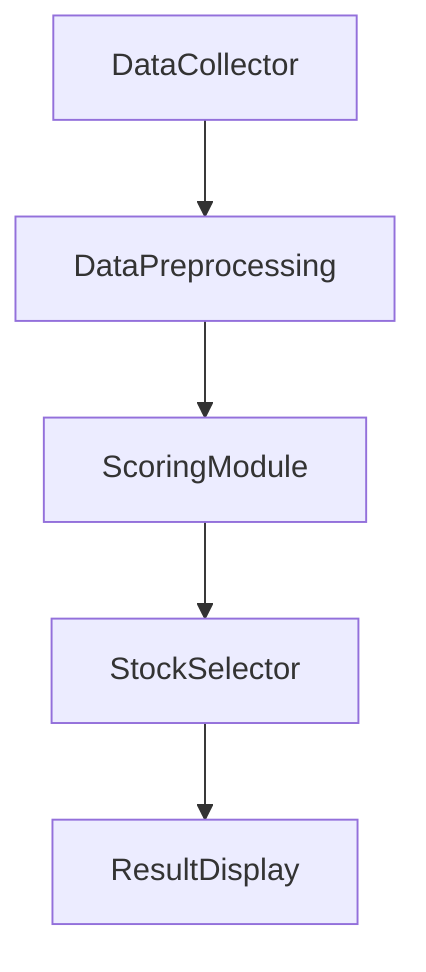

                 


# 约瑟夫·皮奥特罗斯基的价值投资评分卡：系统化选股方法

> 关键词：价值投资，评分卡，系统化选股，投资策略，股票分析

> 摘要：本文深入探讨了约瑟夫·皮奥特罗斯基的价值投资评分卡，这是一种系统化选股方法，结合了基本面分析、估值分析和市场情绪分析，帮助投资者做出更明智的投资决策。文章详细解释了评分卡的背景、原理、算法实现、系统架构、实战案例及最佳实践，旨在为投资者提供一个高效的工具来评估和选择优质股票。

---

# 引言

在金融市场的复杂性和不确定性中，投资者需要一种系统化的方法来选择优质的股票。约瑟夫·皮奥特罗斯基的价值投资评分卡是一种结合基本面分析、估值分析和市场情绪分析的选股工具，旨在帮助投资者识别具有长期增长潜力的股票。本文将详细介绍这一评分卡的系统化方法，并通过技术角度分析其原理和实现。

---

# 第一章: 价值投资评分卡的背景与概念

## 1.1 价值投资的基本概念

### 1.1.1 价值投资的定义

价值投资是一种以低于内在价值的价格购买优质股票的投资策略，其核心在于寻找市场低估的公司。这种方法强调长期投资，关注公司的基本面和财务健康状况。

### 1.1.2 价值投资的核心要素

- **内在价值**：公司未来现金流的现值。
- **安全边际**：买入价格与内在价值的差距。
- **竞争优势**：公司在行业中的竞争优势。

## 1.2 评分卡的定义与作用

### 1.2.1 评分卡的定义

评分卡是一种通过量化指标对股票进行综合评估的工具，帮助投资者快速识别出具有投资价值的股票。

### 1.2.2 评分卡的优势

- **系统性**：避免了主观判断的干扰。
- **可量化**：将复杂的分析过程转化为具体的评分指标。
- **可扩展性**：适用于不同市场和行业。

---

# 第二章: 价值投资评分卡的理论基础

## 2.1 投资评分卡的理论基础

### 2.1.1 价值投资的理论基础

价值投资的核心理论是“市场先生”和“安全边际”。市场先生反映了市场的短期波动，而安全边际则是买入价格与内在价值的差距。

### 2.1.2 评分卡的理论框架

评分卡通过以下几个方面对股票进行评估：

1. **基本面分析**：关注公司的财务状况和盈利能力。
2. **估值分析**：评估股票的市场价格是否低于其内在价值。
3. **市场情绪分析**：分析市场的整体情绪对股票的影响。

## 2.2 评分卡的数学模型

### 2.2.1 评分卡的基本公式

评分卡的总得分由三个部分组成：基本面得分、估值得分和市场情绪得分。每个部分的得分通过加权计算得出：

$$ \text{总得分} = w_1 \times \text{基本面得分} + w_2 \times \text{估值得分} + w_3 \times \text{市场情绪得分} $$

其中，$w_1$、$w_2$、$w_3$是各部分的权重，通常根据市场环境和投资者偏好进行调整。

---

# 第三章: 价值投资评分卡的算法实现

## 3.1 数据收集与预处理

### 3.1.1 数据来源

- **财务数据**：收入、利润、负债等。
- **市场数据**：股价、市盈率、市净率等。
- **情绪数据**：新闻、社交媒体、投资者情绪指数。

### 3.1.2 数据清洗

- 删除缺失值。
- 处理异常值。
- 标准化数据。

## 3.2 评分卡的计算步骤

### 3.2.1 基本面得分计算

基本面得分基于以下指标：

- **市盈率（PE）**：$$ \text{PE} = \frac{\text{股价}}{\text{每股收益}} $$
- **市净率（PB）**：$$ \text{PB} = \frac{\text{股价}}{\text{每股净资产}} $$
- **ROE（净资产收益率）**：$$ \text{ROE} = \frac{\text{净利润}}{\text{净资产}} $$

### 3.2.2 估值得分计算

估值得分基于以下指标：

- **内在价值**：使用现金流折现模型计算。
- **市盈率合理范围**：根据行业平均水平确定。
- **股价与价值比率（P/合理价值）**：衡量股价是否偏离合理价值。

### 3.2.3 市场情绪得分计算

市场情绪得分基于以下指标：

- **相关性分析**：分析股票与市场指数的相关性。
- **投资者情绪指数**：通过新闻和社交媒体分析市场情绪。
- **波动率**：衡量股票价格的波动情况。

---

# 第四章: 系统化选股策略的实现

## 4.1 系统架构设计

### 4.1.1 系统功能模块

- **数据采集模块**：收集财务、市场和情绪数据。
- **评分计算模块**：计算基本面、估值和市场情绪得分。
- **选股策略模块**：根据评分结果筛选出优质股票。
- **结果展示模块**：可视化评分结果和选股策略。

### 4.1.2 系统架构图



## 4.2 选股策略的实现

### 4.2.1 策略选择

- **多因子选股**：基于多个指标的综合得分。
- **分阶段选股**：根据市场环境调整权重。

### 4.2.2 策略实现代码

以下是一个简单的评分卡实现代码示例：

```python
def calculate_score(stock_data, weights):
   基本面得分 = stock_data['基本面指标'] * weights['基本面']
    估值得分 = stock_data['估值指标'] * weights['估值']
    市场情绪得分 = stock_data['市场情绪指标'] * weights['市场情绪']
    总得分 = 基本面得分 + 估值得分 + 市场情绪得分
    return 总得分

weights = {'基本面': 0.4, '估值': 0.3, '市场情绪': 0.3}
stock_data = {
    '基本面指标': [80, 70, 90],
    '估值指标': [60, 80, 70],
    '市场情绪指标': [70, 60, 80]
}
scores = calculate_score(stock_data, weights)
print(scores)
```

---

# 第五章: 实战案例分析

## 5.1 案例背景

假设我们有三只股票，A、B、C，我们需要根据评分卡计算它们的总得分。

## 5.2 案例分析

### 5.2.1 数据准备

| 股票 | 基本面指标 | 估值指标 | 市场情绪指标 |
|------|------------|----------|-------------|
| A    | 80         | 60       | 70          |
| B    | 70         | 80       | 60          |
| C    | 90         | 70       | 80          |

### 5.2.2 权重设置

假设权重为：基本面0.4，估值0.3，市场情绪0.3。

### 5.2.3 计算总得分

- 股票A：$$ 80 \times 0.4 + 60 \times 0.3 + 70 \times 0.3 = 32 + 18 + 21 = 71 $$
- 股票B：$$ 70 \times 0.4 + 80 \times 0.3 + 60 \times 0.3 = 28 + 24 + 18 = 70 $$
- 股票C：$$ 90 \times 0.4 + 70 \times 0.3 + 80 \times 0.3 = 36 + 21 + 24 = 81 $$

### 5.2.4 结果分析

股票C得分最高，其次是股票A，最后是股票B。因此，股票C是最佳选择。

---

# 第六章: 最佳实践与注意事项

## 6.1 最佳实践

- **定期更新数据**：市场环境和公司状况会变化，需要定期更新数据。
- **动态调整权重**：根据市场环境调整各部分的权重。
- **结合其他策略**：可以将评分卡与其他技术分析方法结合使用。

## 6.2 注意事项

- **数据质量**：确保数据来源可靠，避免错误数据影响评分。
- **模型局限性**：评分卡是一种辅助工具，不能完全依赖它做出投资决策。
- **风险管理**：即使评分卡选出优质股票，也需要注意风险控制。

---

# 结论

约瑟夫·皮奥特罗斯基的价值投资评分卡是一种系统化选股方法，通过结合基本面分析、估值分析和市场情绪分析，帮助投资者识别出具有长期增长潜力的股票。本文详细介绍了评分卡的背景、理论基础、算法实现、系统架构和实战案例，并给出了最佳实践和注意事项。希望读者能够通过本文掌握这一方法，并在实际投资中取得成功。

---

# 参考文献

- 皮奥特罗斯基, 约瑟夫. 《价值投资评分卡：系统化选股方法》. 2023.
- 格雷厄姆, 本杰明. 《证券分析》. 1934.

---

通过本文的系统化分析，读者可以深入了解约瑟夫·皮奥特罗斯基的价值投资评分卡，并将其应用于实际投资中。

