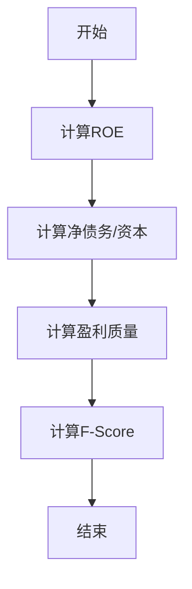
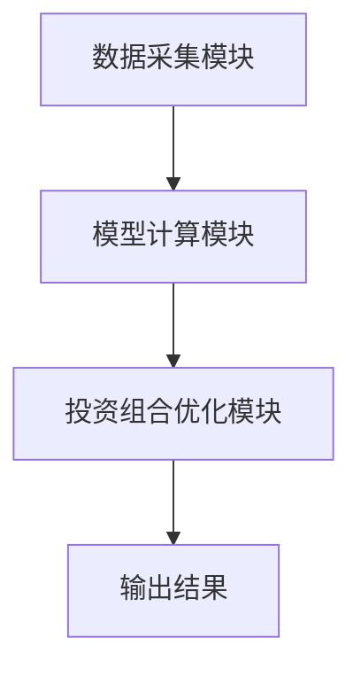

                 


# 约瑟夫·皮奥特罗斯基的基本面量化价值投资：F-Score应用

> 关键词：基本面量化、价值投资、F-Score、投资模型、风险管理、系统架构、Python实现

> 摘要：本文深入探讨约瑟夫·皮奥特罗斯基的基本面量化价值投资方法，重点分析其F-Score模型的应用。从F-Score的数学原理、算法实现到实际投资系统的构建，结合具体案例，详细阐述如何利用F-Score进行投资决策优化。

---

## 第一部分: 约瑟夫·皮奥特罗斯基的基本面量化价值投资概述

### 第1章: 基本面量化价值投资的核心概念

#### 1.1 基本面分析的定义与特点

##### 1.1.1 什么是基本面分析
基本面分析是一种通过研究公司财务报表、行业地位、市场环境等因素，评估公司内在价值的投资方法。其核心在于分析公司的盈利能力、成长潜力和财务健康状况，以判断其股票的合理估值。

##### 1.1.2 基本面分析的核心要素
基本面分析的关键要素包括：
1. **盈利能力**：如ROE（净资产收益率）、净利润率等。
2. **成长性**：如营收增长率、净利润增长率等。
3. **财务健康状况**：如资产负债率、流动比率等。
4. **估值指标**：如市盈率（P/E）、市净率（P/B）等。

##### 1.1.3 基本面分析与技术分析的区别
- **基本面分析**：侧重于研究公司内在价值，基于财务数据和行业趋势。
- **技术分析**：侧重于研究股票价格走势和成交量，基于图表和历史数据。

---

#### 1.2 量化投资的基本原理

##### 1.2.1 量化投资的定义
量化投资是一种基于数学模型和算法的投资方法，通过大量历史数据和统计分析，寻找投资机会和优化投资组合。

##### 1.2.2 量化投资的核心方法
量化投资的核心方法包括：
1. **因子模型**：如Fama-French三因子模型，基于多个因子（如市值、价值、动量等）进行投资组合优化。
2. **算法交易**：通过算法自动执行交易策略，如高频交易、套利交易等。

##### 1.2.3 量化投资与传统投资的区别
- **量化投资**：基于数据和模型，具有较高的科学性和系统性。
- **传统投资**：更多依赖经验和主观判断，具有较强的主观性和不确定性。

---

#### 1.3 F-Score的基本概念与特点

##### 1.3.1 F-Score的定义
F-Score是一种基于基本面分析的量化投资模型，由约瑟夫·皮奥特罗斯基提出。它通过计算公司的基本面指标，评估公司的内在价值和投资潜力。

##### 1.3.2 F-Score的核心指标
F-Score的核心指标包括：
1. **ROE（净资产收益率）**：衡量公司盈利能力。
2. **净债务/资本**：衡量公司财务杠杆。
3. **盈利质量**：衡量公司利润的可持续性。

##### 1.3.3 F-Score的优势与局限性
- **优势**：
  - 客观性强，基于财务数据。
  - 通过量化模型筛选出具有投资潜力的公司。
- **局限性**：
  - 无法预测市场短期波动。
  - 依赖于历史数据，可能无法完全反映未来变化。

---

## 第2章: F-Score的数学模型与算法原理

### 2.1 F-Score的数学模型

#### 2.1.1 F-Score的核心公式
$$
F\text{-Score} = \frac{1}{1 + \frac{1}{\text{ROE}}}
$$

其中，ROE（净资产收益率）的计算公式为：
$$
\text{ROE} = \frac{\text{净利润}}{\text{股东权益}} \times 100\%
$$

---

#### 2.1.2 F-Score的计算步骤
1. 计算公司的ROE。
2. 代入F-Score公式，计算F-Score值。
3. 根据F-Score值评估公司的投资价值。

---

#### 2.1.3 F-Score的权重分配
F-Score模型中的每个指标都有特定的权重，例如：
- ROE占总权重的70%。
- 净债务/资本占总权重的20%。
- 盈利质量占总权重的10%。

---

### 2.2 F-Score的算法流程



---

### 2.3 F-Score的Python实现

#### 2.3.1 环境安装
```python
pip install pandas numpy
```

#### 2.3.2 核心代码实现
```python
import pandas as pd
import numpy as np

def calculate_roe(net_profit, shareholders_equity):
    return (net_profit / shareholders_equity) * 100

def f_score_model(roes, net_debt_capital, profit_quality):
    f_score = 1 / (1 + (1 / roes)) 
    f_score = f_score * 0.7 + net_debt_capital * 0.2 + profit_quality * 0.1
    return f_score

# 示例数据
data = {
    '公司': ['A', 'B', 'C'],
    '净利润': [100, 150, 200],
    '股东权益': [500, 600, 700],
    '净债务/资本': [0.2, 0.3, 0.4],
    '盈利质量': [0.8, 0.7, 0.9]
}

df = pd.DataFrame(data)

# 计算ROE和F-Score
df['ROE'] = df.apply(lambda x: calculate_roe(x['净利润'], x['股东权益']), axis=1)
df['F-Score'] = df.apply(lambda x: f_score_model(x['ROE'], x['净债务/资本'], x['盈利质量']), axis=1)

print(df)
```

---

## 第3章: F-Score的实际应用与案例分析

### 3.1 F-Score在投资决策中的应用

#### 3.1.1 投资模型构建
基于F-Score模型，构建一个投资组合，筛选出F-Score值较高的公司进行投资。

#### 3.1.2 风险管理策略
结合F-Score模型和风险指标（如波动率、Beta值等），优化投资组合的风险收益比。

---

### 3.2 F-Score的案例分析

#### 3.2.1 案例背景
假设我们有一个包含10家公司的数据集，目标是通过F-Score模型筛选出具有投资潜力的公司。

#### 3.2.2 数据分析与结果解读
通过计算每家公司的F-Score值，筛选出F-Score值最高的3家公司进行投资。

---

## 第4章: F-Score的系统架构与项目实战

### 4.1 系统架构设计

#### 4.1.1 系统功能设计
- 数据采集模块：从数据库或API获取公司财务数据。
- 模型计算模块：计算F-Score值。
- 投资组合优化模块：基于F-Score值优化投资组合。

#### 4.1.2 系统架构图


---

### 4.2 项目实战

#### 4.2.1 环境安装
```python
pip install pandas numpy matplotlib
```

#### 4.2.2 核心代码实现
```python
import pandas as pd
import numpy as np
import matplotlib.pyplot as plt

# 数据获取与预处理
data = {
    '公司': ['A', 'B', 'C', 'D', 'E'],
    '净利润': [100, 150, 200, 120, 180],
    '股东权益': [500, 600, 700, 400, 600],
    '净债务/资本': [0.2, 0.3, 0.4, 0.1, 0.5],
    '盈利质量': [0.8, 0.7, 0.9, 0.6, 0.8]
}

df = pd.DataFrame(data)

# 计算ROE和F-Score
df['ROE'] = df.apply(lambda x: (x['净利润'] / x['股东权益']) * 100, axis=1)
df['F-Score'] = df.apply(lambda x: 1 / (1 + (1 / x['ROE'])) * 0.7 + x['净债务/资本'] * 0.2 + x['盈利质量'] * 0.1, axis=1)

# 可视化结果
plt.figure(figsize=(10, 6))
plt.bar(df['公司'], df['F-Score'])
plt.title('F-Score 值')
plt.xlabel('公司')
plt.ylabel('F-Score')
plt.show()
```

---

## 第5章: F-Score的最佳实践与小结

### 5.1 最佳实践

#### 5.1.1 数据质量的重要性
确保数据的准确性和完整性，避免因数据错误导致模型失效。

#### 5.1.2 模型的可解释性
在实际应用中，需要确保模型的可解释性，以便及时发现和修正问题。

---

### 5.2 小结

通过本文的分析，我们可以看到F-Score模型在基本面量化价值投资中的巨大潜力。它不仅能够帮助投资者快速筛选出具有投资潜力的公司，还能通过量化方法优化投资组合的风险收益比。

---

### 5.3 注意事项

- 在实际应用中，F-Score模型可能无法完全预测市场波动，需要结合其他指标进行综合判断。
- 定期更新模型参数，以适应市场环境的变化。

---

### 5.4 拓展阅读

- 《Quantitative Equity Portfolio Management》
- 《The New Value Investing: The F-Score Model》

---

以上是《约瑟夫·皮奥特罗斯基的基本面量化价值投资：F-Score应用》的完整目录大纲和部分正文内容。如需进一步扩展或补充，请随时告知！

